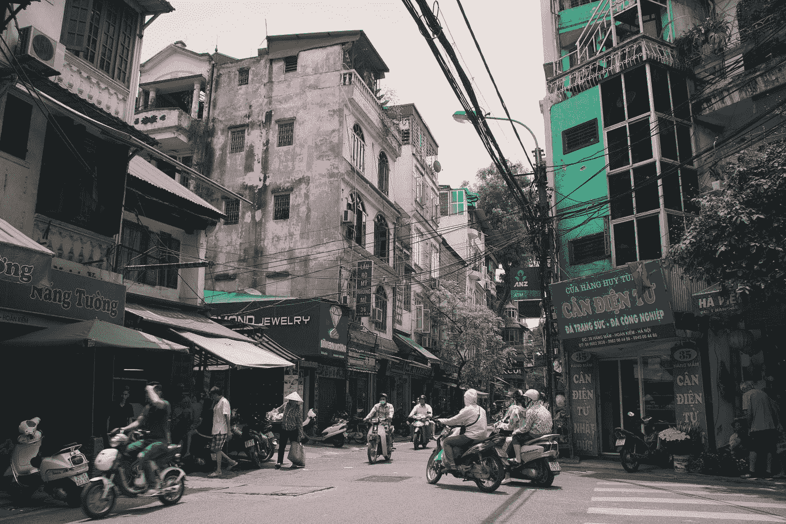

# 虚拟化—文本区域

> 原文：<https://blog.devgenius.io/vuetify-text-areas-f407a7ec141e?source=collection_archive---------2----------------------->



照片由 [K8](https://unsplash.com/@k8_iv?utm_source=medium&utm_medium=referral) 在 [Unsplash](https://unsplash.com?utm_source=medium&utm_medium=referral) 上拍摄

Vuetify 是一个流行的 Vue 应用程序 UI 框架。

在本文中，我们将了解如何使用 Vuetify 框架。

# 文本区域

我们可以添加文本区域来收集大量的文本数据。

要添加它，我们可以使用`v-textarea`组件。

例如，我们可以写:

```
<template>
  <v-container>
    <v-row>
      <v-col col="12">
        <v-textarea class="mx-2" label="prepend-icon" rows="1" prepend-icon="mdi-comment"></v-textarea>
      </v-col>
    </v-row>
  </v-container>
</template>
<script>
export default {
  name: "HelloWorld",
  data: () => ({}),
};
</script>
```

我们添加了`prepend-icon`道具，在文本区域的左边添加了一个图标。

`rows`是要显示的行数。

为了在右边添加一个图标，我们使用了`append-icon`道具。

还有一个`prepend-inner-icon`用于在文本区域的行内添加图标。

例如，我们可以写:

```
<template>
  <v-container>
    <v-row>
      <v-col col="12">
        <v-textarea
          class="mx-2"
          label="prepend-inner-icon"
          rows="1"
          prepend-inner-icon="mdi-comment"
        ></v-textarea>
      </v-col>
    </v-row>
  </v-container>
</template>
<script>
export default {
  name: "HelloWorld",
  data: () => ({}),
};
</script>
```

# 自动增长

我们可以使用`auto-grow`道具来创建一个文本区域，其大小随着文本的增加而增加。

例如，我们可以写:

```
<template>
  <v-container>
    <v-row>
      <v-col col="12">
        <v-textarea
          name="input-7-1"
          filled
          label="Label"
          auto-grow
          value="Lorem ipsum dolor sit amet, consectetur adipiscing elit. Vivamus massa sapien, rutrum vitae luctus sit amet."
        ></v-textarea>
      </v-col>
    </v-row>
  </v-container>
</template>
<script>
export default {
  name: "HelloWorld",
  data: () => ({}),
};
</script>
```

我们添加了`auto-grow`道具，使得文本区域总是显示所有的文本而不滚动。

# 背景颜色

`background-color`和`color`道具可以分别用来改变背景颜色和文字颜色。

例如，我们可以写:

```
<template>
  <v-container>
    <v-row>
      <v-col col="12">
        <v-textarea background-color="light-blue" color="black" label="Label"></v-textarea>
      </v-col>
    </v-row>
  </v-container>
</template>
<script>
export default {
  name: "HelloWorld",
  data: () => ({}),
};
</script>
```

来设置颜色。

# 浏览器自动完成

我们可以设置`autocomplete`属性使浏览器能够预测用户输入:

```
<template>
  <v-container>
    <v-row>
      <v-col col="12">
        <v-textarea autocomplete="email" label="Email"></v-textarea>
      </v-col>
    </v-row>
  </v-container>
</template>
<script>
export default {
  name: "HelloWorld",
  data: () => ({}),
};
</script>
```

# 清晰文本区域

`clearable`道具使文本区域清晰可辨。

清除文本的图标可以用`clearable-icon`按钮改变。

所以我们可以写:

```
<template>
  <v-container>
    <v-row>
      <v-col col="12">
        <v-textarea clearable clear-icon="mdi-cancel" label="Text" value="Clearable text."></v-textarea>
      </v-col>
    </v-row>
  </v-container>
</template>
<script>
export default {
  name: "HelloWorld",
  data: () => ({}),
};
</script>
```

我们通过点击`clear-icon`来清除文本区域。

# 计数器

`counter`道具向用户显示`v-textarea`的字符限制:

```
<template>
  <v-container>
    <v-row>
      <v-col col="12">
        <v-textarea counter label="Text" :rules="rules" :value="value"></v-textarea>
      </v-col>
    </v-row>
  </v-container>
</template>
<script>
export default {
  name: "HelloWorld",
  data: () => ({
    rules: [(v) => v.length <= 25 || "Max 25 characters"],
    value: "foo bar",
  }),
};
</script>
```

`counter`道具让我们显示人物数量。

# 结论

我们可以添加包含各种内容的文本区域，用 Vuetify 显示。