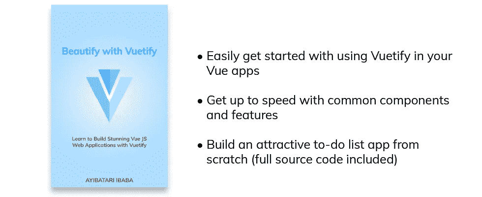
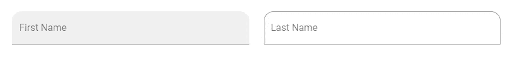
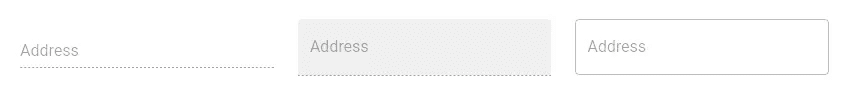

# 验证文本字段:如何创建文本字段

> 原文：<https://blog.devgenius.io/vuetify-text-fields-6969d6201fe9?source=collection_archive---------3----------------------->


文本字段是 UI 中接受文本输入的最常见方式。他们可以收集用户信息，如电子邮件、地址、电话号码等。让我们看看如何在 Vuetify 中使用它们。

# 虚拟文本字段组件

我们用`v-text-field`组件在 Vuetify 中创建文本字段:

```
<template>
  <v-app>
    <v-row justify="center" class="ma-2">
      <v-col cols="4"><v-text-field label="Regular"></v-text-field></v-col>
    </v-row>
  </v-app>
</template><script>
export default {
  name: 'App',
};
</script>
```


没有焦点的常规文本字段。


聚焦于常规文本字段。

# 验证文本字段占位符

我们可以用`placeholder`属性为文本字段指定一个期望值:

```
<template>
  <v-app>
    <v-row justify="center" class="ma-2">
      <v-col cols="4"
        ><v-text-field label="Regular" placeholder="Placeholder"></v-text-field
      ></v-col>
    </v-row>
  </v-app>
</template><script>
export default {
  name: 'App',
};
</script>
```


带有占位符的常规文本字段。

# 在 Vuetify 中自定义文本字段颜色

我们可以通过将`color`道具设置为材质设计调色板中的[颜色](https://codingbeautydev.com/blog/vuetify-colors/)来定制文本字段的[颜色](https://codingbeautydev.com/blog/vuetify-colors/):

```
<template>
  <v-app>
    <v-row justify="center" class="ma-2">
      <v-col cols="4"
        ><v-text-field
          label="Username"
          color="green"
        ></v-text-field
      ></v-col>
    </v-row>
  </v-app>
</template><script>
export default {
  name: 'App',
};
</script>
```


# 用美化来美化

使用 Vuetify 材料设计框架创建优雅 web 应用程序的完整指南。



在这里获得一份免费的[](https://mailchi.mp/583226ee0d7b/beautify-with-vuetify)

# **填充变体的验证文本字段**

**我们可以使用带有`filled`属性的文本字段的填充变量:**

```
<template>
  <v-app>
    <v-row justify="center" class="ma-2">
      <v-col cols="4"
        ><v-text-field label="Filled" filled></v-text-field
      ></v-col>
    </v-row>
  </v-app>
</template><script>
export default {
  name: 'App',
};
</script>
```

****

# **显示文本字段轮廓变体**

**将文本字段组件上的`outlined`属性设置为`true`将使用其概述的变体:**

```
<template>
  <v-app>
    <v-row justify="center" class="ma-2">
      <v-col cols="4"
        ><v-text-field label="Outlined" outlined></v-text-field
      ></v-col>
    </v-row>
  </v-app>
</template><script>
export default {
  name: 'App',
};
</script>
```

****

# **美化形状文本字段**

**带有`shaped`属性的文本字段的顶部两个角的边框半径增加了:**

```
<template>
  <v-app>
    <v-row class="ma-2">
      <v-col cols="6"
        ><v-text-field label="First Name" filled shaped></v-text-field
      ></v-col>
      <v-col cols="6"
        ><v-text-field label="Last Name" outlined shaped></v-text-field
      ></v-col>
    </v-row>
  </v-app>
</template><script>
export default {
  name: 'App',
};
</script>
```

****

# **禁用 Vuetify 中的文本字段**

**我们可以通过将`disabled`属性设置为`true`来阻止文本字段接受任何输入。**

```
<template>
  <v-app>
    <v-row class="ma-2">
      <v-col cols="4"
        ><v-text-field label="Address" disabled></v-text-field
      ></v-col>
      <v-col cols="4"
        ><v-text-field label="Address" filled disabled></v-text-field
      ></v-col>
      <v-col cols="4"
        ><v-text-field label="Address" outlined disabled></v-text-field
      ></v-col>
    </v-row>
  </v-app>
</template><script>
export default {
  name: 'App',
};
</script>
```

****

# **只读文本字段**

**我们也可以用`readonly`属性阻止文本字段输入:**

```
<template>
  <v-app>
    <v-row class="ma-2" justify="center">
      <v-col cols="4"
        ><v-text-field label="Regular" value="Regular" readonly></v-text-field
      ></v-col>
    </v-row>
  </v-app>
</template><script>
export default {
  name: 'App',
};
</script>
```

# **使独奏文本栏无效**

**我们可以使用`solo`道具来设计文本字段的样式:**

```
<template>
  <v-app>
    <v-row class="ma-2" justify="center">
      <v-col cols="4"
        ><v-text-field
          label="Solo"
          solo
        ></v-text-field
      ></v-col>
    </v-row>
  </v-app>
</template><script>
export default {
  name: 'App',
};
</script>
```

****

**独奏文本栏**

****

**带有焦点的单独文本字段。**

# **验证单行文本字段**

**为了防止文本字段标签在聚焦时浮动，我们可以使用`single-line`属性:**

```
<template>
  <v-app>
    <v-row class="ma-2" justify="center">
      <v-col cols="4"
        ><v-text-field label="Single-line" single-line></v-text-field
      ></v-col>
    </v-row>
  </v-app>
</template><script>
export default {
  name: 'App',
};
</script>
```

****

**单行文本字段。**

****

**具有焦点的单行文本字段。**

# **结论**

**Vuetify 提供了用于创建文本字段的`v-text-field`组件，这对于从用户那里获取文本输入非常有用。**

**http://eepurl.com/hRfyJL获得关于 Vuetify、Vue、JavaScript 等的每周提示和教程**

***更新于:*[](https://codingbeautydev.com/blog/vuetify-text-field/)**。****