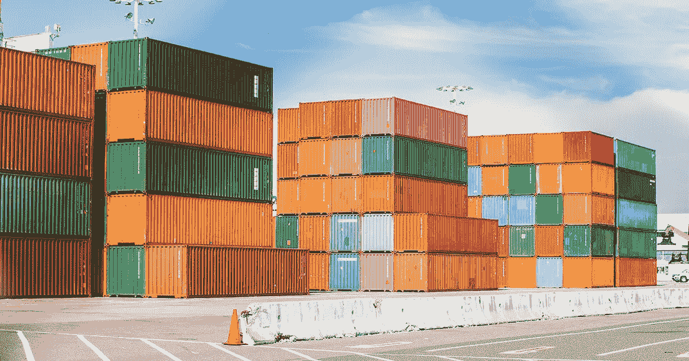
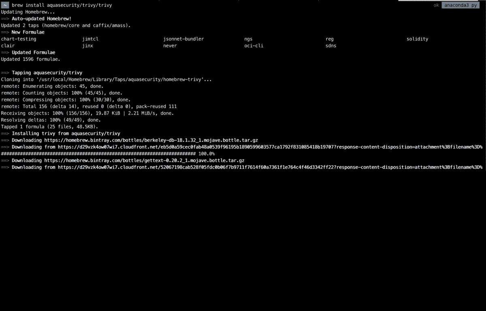
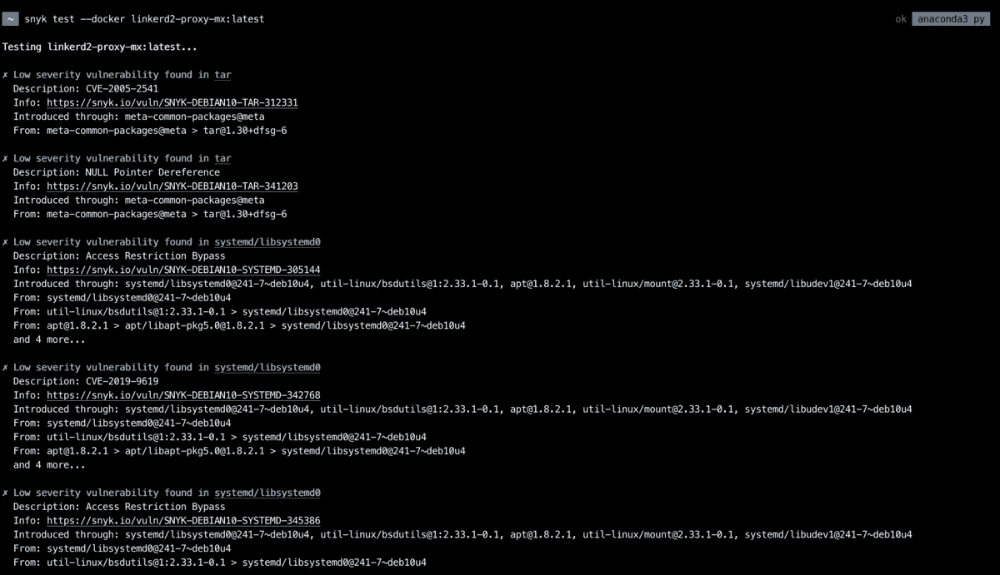
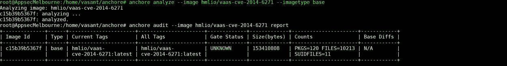
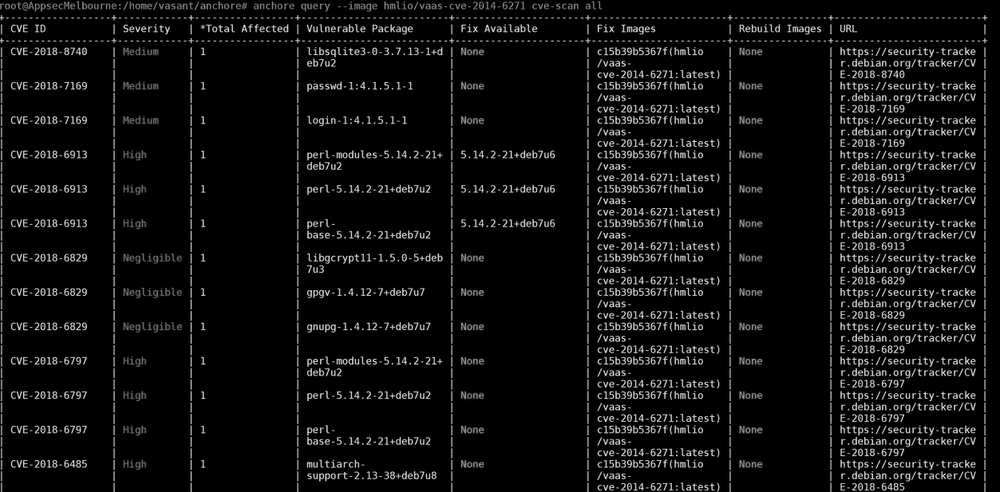
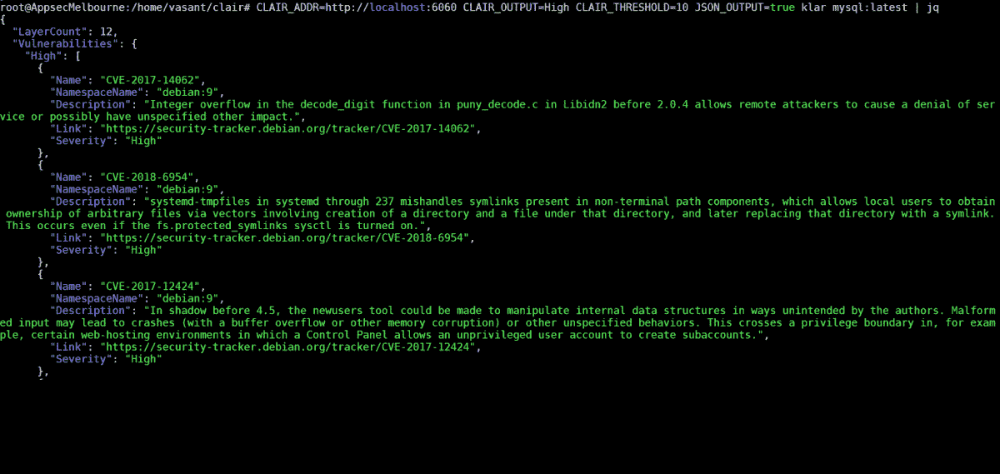
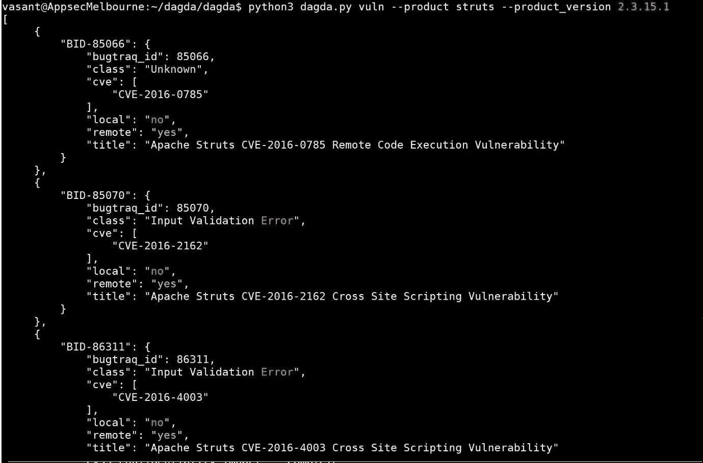
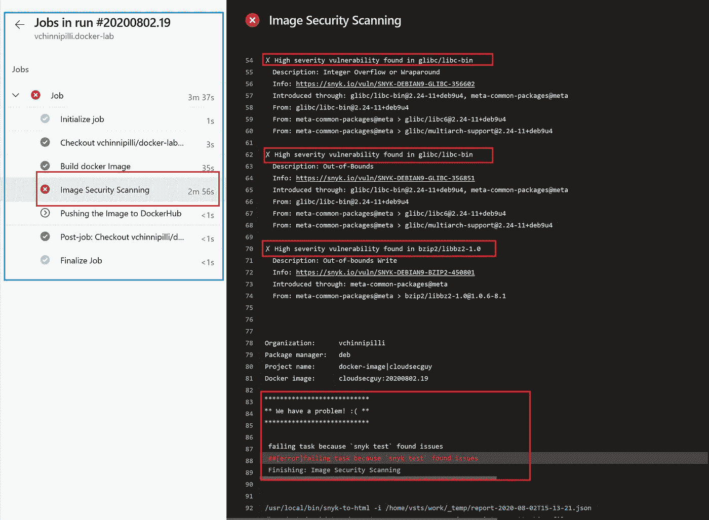
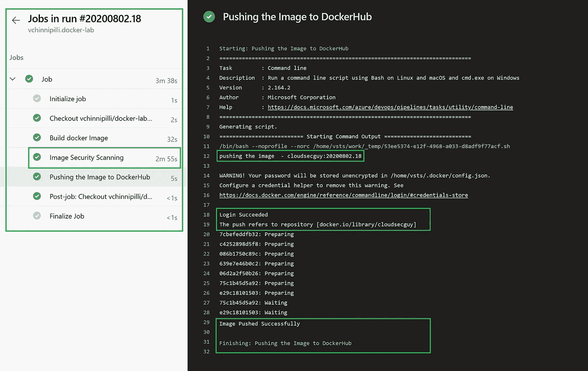

# 使用开源的容器漏洞管理

> 原文：<https://blog.devgenius.io/vulnerability-management-of-containers-using-opensource-1d864ccaaf83?source=collection_archive---------3----------------------->

容器彻底改变了应用程序开发，并席卷了整个企业——尤其是它们的构建和扩展方式。

使容器对开发人员有用的灵活性也带来了许多安全挑战。容器用户面临的最大的云安全威胁是容器等同于安全的错误假设。

在每个容器中，自然会有许多不同且各自复杂的组件，这些组件都可能带来安全风险和漏洞。随着容器应用的持续增长，对安全性的高度关注是绝对必要的。



在这篇博文中，我们将研究各种开源图像扫描工具，以识别和保护容器图像免受攻击。

1.  **繁琐**

一个简单而全面的漏洞扫描器，适用于容器和其他工件，适用于 CI。

## 装置

```
**Installing using Home Brew** brew install aquasecurity/trivy/trivy**Install Script** curl -sfL https://raw.githubusercontent.com/aquasecurity/trivy/master/contrib/install.sh | sh -s -- -b /usr/local/bin
```

## 扫描图像

```
trivy image knqyf263/vuln-image:1.2.3
```



参考:

[](https://github.com/aquasecurity/trivy) [## aquasecurity/trivy

### 一个简单而全面的漏洞扫描器，适用于容器和其他工件，适用于 CI。特里维(特里…

github.com](https://github.com/aquasecurity/trivy) 

**2。Snyk**

使用 Snyk，您可以直接从 CLI 测试、监控和保护您的容器映像。

## 装置

```
**Installing using Home Brew** brew install snyk**Install the Snyk CLI with npm** npm install -g snyk
```

## 扫描图像

```
snyk test --docker ubuntu:latest
snyk test --docker ubuntu:latest --file=Dockerfile
snyk monitor --docker ubuntu:latest --file=Dockerfile
```



参考:

 [## 使用我们的 CLI 工具测试您的容器映像

### 使用 Snyk，您可以直接从 CLI 测试、监控和保护您的容器映像，如下所示

support.snyk.io](https://support.snyk.io/hc/en-us/articles/360003946917-Test-your-container-images-with-our-CLI-tool) 

**3。主播**

Anchore Engine 是一个开源项目，为集装箱图像的检查、分析和认证提供集中服务。

## 装置

```
apt-get install python-pip python-rpm yum -ygit clone [https://github.com/anchore/anchore.git](https://github.com/anchore/anchore.git)
cd anchore/
pip install --upgrade --user .
export PATH=~/.local/bin:$PATHCool
```

## 扫描图像

```
anchore --help
anchore feeds list
anchore feeds sync
anchore analyze --image hmlio/vaas-cve-2014-6271
anchore audit --image hmlio/vaas-cve-2014-6271 report
anchore query --image hmlio/vaas-cve-2014-6271 has-package curl wget
anchore query --image hmlio/vaas-cve-2014-6271 list-files-detail all
anchore query --image hmlio/vaas-cve-2014-6271 cve-scan all
anchore toolbox --image hmlio/vaas-cve-2014-6271 show
```



扫描图像



查询扫描的漏洞

参考:

[](https://github.com/anchore/anchore-engine) [## 锚定/锚定引擎

### 有关 Anchore 引擎、Anchore CLI 和其他 Anchore 软件的最新信息，请参考…

github.com](https://github.com/anchore/anchore-engine) 

**4。克莱尔**

Clair 是一个开源项目，用于应用容器中漏洞的静态分析(目前包括 [appc](https://github.com/appc/spec) 和 [docker](https://github.com/docker/docker/blob/master/image/spec/v1.2.md) )。

## 装置

```
curl -OL [https://raw.githubusercontent.com/coreos/clair/master/contrib/compose/docker-compose.yml](https://raw.githubusercontent.com/coreos/clair/master/contrib/compose/docker-compose.yml)mkdir clair_config && curl -L https://raw.githubusercontent.com/coreos/clair/master/config.yaml.sample -o clair_config/config.yamlsed 's/clair-git:latest/clair:v2.0.1/' -i docker-compose.yml && \sed 's/host=localhost/host=postgres password=password/' -i clair_config/config.yamldocker-compose up -d postgrescurl -LO [https://gist.githubusercontent.com/BenHall/34ae4e6129d81f871e353c63b6a869a7/raw/5818fba954b0b00352d07771fabab6b9daba5510/clair.sql](https://gist.githubusercontent.com/BenHall/34ae4e6129d81f871e353c63b6a869a7/raw/5818fba954b0b00352d07771fabab6b9daba5510/clair.sql)docker run -it \
-v $(pwd):/sql/ \
--network clair_default \
--link clair_postgres:clair_postgres \
postgres:latest \
bash -c "PGPASSWORD=password psql -h clair_postgres -U postgres < /sql/clair.sql"docker-compose up -d claircurl -L https://github.com/optiopay/klar/releases/download/v1.5/klar-1.5-linux-amd64 -o /usr/local/bin/klar && chmod +x $_
```

## 扫描图像

```
CLAIR_ADDR=http://localhost:6060 CLAIR_OUTPUT=High CLAIR_THRESHOLD=10 JSON_OUTPUT=true klar mysql:latest | jq
```



参考:

[](https://github.com/quay/clair) [## 奎尔/克莱尔

### 注意:主分支在开发过程中可能处于不稳定甚至断裂的状态。请使用版本而不是…

github.com](https://github.com/quay/clair) 

**5。达格达**

Dagda 是一种工具，用于对 docker 映像/容器中的已知漏洞、特洛伊木马、病毒、恶意软件和其他恶意威胁进行静态分析，并监控 docker 守护程序和正在运行的 docker 容器以检测异常活动。

安装:

```
curl -s https://s3.amazonaws.com/download.draios.com/stable/install-sysdig | sudo bash
https://github.com/eliasgranderubio/dagda.git
cd dagda && sudo pip3 install -r requirements.txt
docker pull mongo
docker run -d -p 27017:27017 mongo
apt-get -y install linux-headers-$(uname -r)
```

用法:

```
python3 dagda.py start -d
export DAGDA_HOST='127.0.0.1'
export DAGDA_PORT=5000
python3 dagda.py vuln --init
python3 dagda.py vuln --init_status
python3 dagda.py check --docker_image jboss/wildfly
python3 dagda.py docker events
```



**6。CI/CD 中的连续集装箱安全**

传统上，安全性是由不同团队实施的独立流程。随着开发人员快速部署具有持续集成和交付(CI/CD)管道的容器，安全性应该是一种预先考虑，而不是事后考虑。这可以通过以 DevOps 的速度在 CI/CD 管道中自动化集装箱安全扫描来实现。

您可以使用上面列出的任何开源工具，并将它们集成到您的 CI/CD 管道中，以扫描图像并在漏洞变成漏洞之前识别它们。

您可以在构建阶段通过在构建之后扫描映像来实现这一点，并使任何具有可修复漏洞的构建失败，并通知负责的团队。修复后，重新扫描并允许构建被推入我们的注册表。

在下图中，在*构建 Docker 任务*之后，我们调用了*映像安全扫描任务*，其中已经对*构建 Docker 映像任务*中构建的映像进行了漏洞扫描，最终构建失败，因为已经识别出了漏洞。



如果您在修复/修补发现的漏洞后重新扫描映像，或者如果映像没有漏洞，则*映像安全扫描任务*将会成功，并且映像将被推送到可用于部署的存储库中。



这篇博文最初发表于:[https://www . cloudsecguy . dev/post/vulnerability-management-of-containers-using-open source](https://www.cloudsecguy.dev/post/vulnerability-management-of-containers-using-opensource)

容器的安全性取决于在其中运行的代码以及它所运行的基础设施。除了容器映像和其中的应用程序，容器本身也可能成为安全问题。
当启动和管理容器的容器运行时——如 containerd、CRI-O 和 rkt 等软件本身包含漏洞时，一个更严重的问题出现了。

在本系列的第 3 部分中，我将讨论保护 docker 基础设施的最佳 docker 安全实践，如果您想学习 Docker 的基础知识，可以参考本系列的第 1 部分。