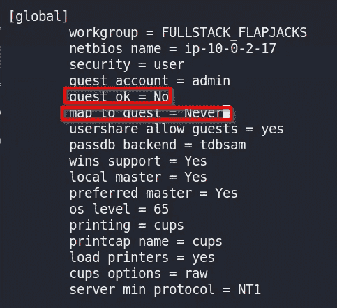
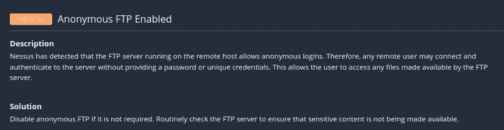
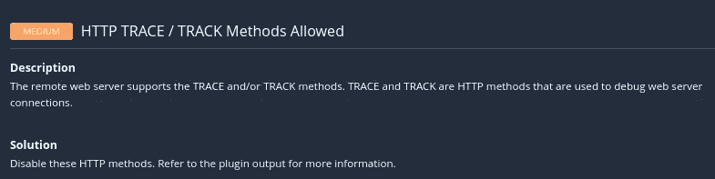

# Nessus 漏洞扫描和补救

> 原文：<https://blog.devgenius.io/vulnerability-scanning-with-nessus-and-remediation-60844d17bda4?source=collection_archive---------5----------------------->

## 涅索斯

Tenable 的 Nessus 是一个漏洞扫描工具，用于通过各种插件扫描网络中的已知漏洞。其他类型的漏洞扫描器包括 Qualys、Rapid7 和 OpenVAS。有几个不同版本的 Nessus 可供使用:

*   Nessus 必需品
*   Nessus 专业版
*   Tenable.io

Nessus Essentials 是我将使用的，因为它是免费的，你可以扫描多达 16 个不同的 IP 地址。另外两个版本是付费版本，带有附加功能。Essentials 将有利于教育工作者、学生或刚刚进入网络安全领域的人。这是一个很好的工具，可以用来更好地熟悉漏洞扫描器，学习如何解释结果，并使用结果来帮助确定漏洞修复的优先级。

这些扫描可以在没有凭证的情况下执行，并且将提供对从网络外部扫描的人可能发现的内容的洞察。另一方面，凭证扫描可能会发现网络内部的大量漏洞，并且应该使用只读凭证来执行。根据组织的需要，扫描也可以是侵入式或非侵入式的。

资产重要程度有助于指导关于所执行的扫描类型、扫描频率和补救优先级的决策。Nessus 的一个特性是能够配置自动扫描计划，并在检测到新漏洞时提供自动警报。另一个功能是能够创建扫描模板，这有助于减少配置未来扫描的错误。

在模板的帮助下，可以通过配置特定的插件来检查特定的漏洞，从而提高效率。您可以检查根据操作系统、应用程序或设备分组的漏洞。禁用不必要的插件将提高速度，减少“误报”我最近听说假阳性不是真的，它们只是一个调整你的扫描仪和警报的机会。让插件保持最新，如果可能的话每天更新，是扫描器检测漏洞的准确性的关键。

## 获取激活码

我将介绍如何在 VMware 托管的 Kali Linux 上设置 Nessus。首先，您需要注册，以便通过电子邮件接收激活码。你可以通过导航到[https://www.tenable.com/products/nessus/nessus-essentials](https://www.tenable.com/products/nessus/nessus-essentials)来实现。

Nessus 注册页面

**下载 Nessus**

注册后，它会提供一个提示，以便下载 Nessus。但是，如果没有，您可以导航到 https://www.tenable.com/downloads/nessus?的[loginatcited = true](https://www.tenable.com/downloads/nessus?loginAttempted=true)。

找到适合您的操作系统的下载。因为我是在 VMware 中为 Kali Linux 下载的，所以我将使用**Nessus-10 . 0 . 2-debian 6 _ amd64 . deb**。

Nessus 下载页面

## 安装 Nessus

下载完文件后，您需要导航到保存文件的目录。使用 **dpkg** 安装 Nessus。Dpkg 是一个中级命令行工具，用于安装、构建、删除和管理 Debian 软件包。运行带有 **-i** 标志的 dpkg 将安装指定的包文件。此命令需要使用 sudo 权限运行。其格式应该是: **sudo dpkg -i <您下载的 Nessus 包的名称>**

安装 Nessus 的命令

Nessus 解压缩后，它应该会为您提供启动服务的说明，以及在浏览器中导航到何处以配置扫描仪。给我的启动服务的命令是**/bin/system CTL start ness USD . service .**浏览器的地址应该是**https://localhost:8834/**

您的本地主机会有所不同。不要使用 magicbox

启动 Nessus 的命令

## 启动 Nessus

导航到该站点时，您可能会收到一条关于 SSL 证书的警告。您可以通过点击**高级**来忽略这一点，然后**接受风险并继续**。在下一个屏幕上，选择 **Nessus Essentials** ，然后继续。

如果您已经注册并申请了激活码，您可以点击**跳过**。但是，如果您还没有，您可以在此申请激活码。

输入您收到的激活码。

创建您的**用户名**和**密码**并点击提交。

接下来，你会看到 Nessus 正在编译用于扫描的插件。这可能需要一段时间，取决于各种因素，但我的大约需要 10-15 分钟。我见过耗时长达 15-25 分钟的。如前所述，建议定期下载任何新的插件，最好是每天下载。

## 配置扫描

当您第一次加载时，它会询问您是否要进行主机发现，以及您要扫描的 IPv4 CIDR 范围。我为 Nessus 提供了我的虚拟机使用的网络的 IPv4 CIDR 符号。您可以输入特定的 IP 地址、IP 地址范围、CIDR 符号或域名。输入目标后，点击**提交**。这将为您提供所提交目标的主机列表，并为您提供选择运行扫描的特定地址的选项。

您可以通过点击右上角的**新扫描**从**我的扫描**或**所有扫描**创建新扫描。

您可以运行不同类型的扫描，但对于此漏洞扫描，我们将重点关注**基本网络扫描**。开始扫描之前，您可以用不同的方式配置扫描。在 **General** 下，您可以命名扫描、提供扫描描述、保存扫描的位置以及定义扫描目标。

您可以设置执行该扫描的预定时间间隔。

如果配置了 SMTP 服务器，您可以在**通知**下设置通过电子邮件发送警报。

对于**发现**，您可以设置想要扫描的端口——通用、全部或自定义。这将取决于你在寻找什么。

在**评估**下，您可以设置扫描仪以各种方式扫描网络漏洞。

**凭证**提供了配置凭证扫描的机会。从网络内外的不同点运行扫描可能会发现不同的漏洞。

在**插件**下，您可以决定包含或排除哪些插件，从而使您能够调整扫描仪。

为目标配置扫描后，单击**保存**旁边的小箭头，然后单击**启动**；这将开始扫描。启动扫描还有其他一些方法。从“我的扫描”文件夹中选择一个扫描，您可以单击**播放按钮**启动扫描，或者您可以选择一个特定的扫描，然后从工具栏中单击**启动**。

配置后启动扫描

使用播放按钮从我的扫描启动扫描

从已配置的扫描启动扫描

一旦扫描开始，可以通过在**我的扫描**下选择该扫描来检查进度。我的扫描还将显示已运行的先前配置扫描的历史记录，以便您可以跟踪一段时间内的变化。

## 扫描结果

我对 AWS 上易受攻击的 EC2 实例进行了扫描。如果目标包括多个主机，它们将显示在**主机**下。我将回顾如何在扫描完成后进行导航。这些结果显示了发现的漏洞数量的总体概况。您可以看到一个彩色编码的饼图，表示漏洞不同严重级别的百分比。

特定扫描的主机选项卡

点击进入**漏洞**选项卡，将显示发现的特定漏洞——提供名称、家族以及漏洞出现的次数。

显示发现的所有漏洞的漏洞选项卡

在这里，您可以单击每个特定的漏洞，以获得每个漏洞的更多详细信息。这里有丰富的信息—漏洞的严重性、漏洞的名称、描述、解决方案、利用漏洞的输出、发现漏洞的主机、插件详细信息、风险信息、漏洞信息，以及了解漏洞更多信息的参考信息。掌握这些信息对于了解漏洞是什么、如何利用漏洞以及如何补救漏洞非常重要。CVSS(通用漏洞评分系统)也有助于洞察与漏洞相关的风险。

点击特定漏洞的示例

**VPR 主要威胁**选项卡提供了修复十大漏洞的优先级建议。

## **修复漏洞**

在尝试确定漏洞修复的优先级时，有许多因素需要考虑。风险=威胁 x 漏洞；没有其中之一，风险就不会存在。人们必须考虑漏洞被利用的可能性以及该漏洞被利用的影响。应对风险有不同的方式，包括:

*   降低风险—通过设计、实施和管理安全控制来降低风险
*   规避风险—改变业务实践消除潜在的风险
*   风险转移——将风险的影响从组织转移到某人或某物上。示例—购买涵盖该风险的保险单
*   接受风险——什么都不做，把接受风险作为经营企业的一部分

有些人可能认为，总是首先确定关键漏洞的优先级是最佳实践。但是，可能会出现这样的情况，即某个漏洞非常严重，但利用该漏洞的可能性非常小，因此它不会出现在补救列表的首位。通常，扫描的低级别或信息结果很容易被利用，可能会给组织带来巨大的不利影响。

不同的组织会有不同的优先级，因为每个组织都是独特的。需要保护的资产、对漏洞的了解、时间、金钱和复杂性是确定补救工作优先级时需要考虑的几个因素。

计划首先在沙盒环境中测试修复，以降低中断业务运营或损坏信息资产的可能性。通过重复最初检测到漏洞的漏洞扫描，检查以确保缓解措施有效。

我想对我的 Nessus 扫描在易受攻击的 EC2 实例上发现的漏洞进行补救。我将使用在我的 VPC 的私有子网中设置的实例。为了访问控制台，我使用 SSH 和在 AWS 中创建实例时创建的 PEM 文件。

## 弹震症

Shellshock 是 Bash 命令行界面 shell (GNU Bash 直到 4.3 版)中的一个 bug，它已经存在了 30 年，但在 2014 年作为 CVE-2014–6271 成为一个重大威胁。然而，直到今天，它仍然是对组织的威胁。多年来，该漏洞已被更新为 CVE-2014–7169，并一直修改到 2018 年。

这个漏洞很简单，也不贵，所以它今天仍然存在。针对此漏洞的修补程序是可用的，但是没有适当修补程序管理的组织仍然容易受到攻击。该漏洞使得攻击者能够远程利用 bash 从环境变量中执行无意的 Bash 命令，并可能具有提升的权限。Bash 本身并不使用互联网，但是很多内部和外部服务，比如 web 服务器，使用环境变量与服务器的操作系统进行通信。

输入净化是抵御这种攻击的一种方法。如果输入未经净化，攻击者可能会启动通过 Bash shell 执行的 HTTP 请求命令。这些命令可能导致信息泄露、拒绝服务(DoS)、创建一个返回给攻击者的反向外壳、启动程序以及执行恶意软件。

一种补救 Shellshock 的方法是应用合适的补丁。可以在扫描结果的参考信息部分找到该信息。

关于 Shellshock 的信息

但是，我将通过一些测试来手动修复此漏洞。

通过 HTTP 请求利用漏洞

由于 Nessus 能够通过将 HTTP GET 请求中的 User-Agent 修改为/cgi-bin/test.cgi 来执行远程代码执行，所以我尝试使用 Burp Suite 来测试同样的事情。我复制了用户代理的内容，但是将 Bash 命令的 id 改为 cat **/etc/passwd** 。

使用 Burp 套件测试 RCE

这里的问题似乎是 web 应用有一个统一的资源标识符(URI)**/CGI-bin/test . CGI**。web 服务器的文件通常在 **/var/www** 目录中，所以我决定去那里看看。我使用命令 ls **/var/www** 显示那里有一个 **cgi-bin** 目录。

我用 **cd** 换到 **cgi-bin** 目录，用 **ls** 列出内容，找到带有 **test.cgi** bash 脚本的文件。

我用**猫**读取了 **test.cgi 文件**。这个 bash 脚本有一个 shebang，用于告诉操作系统使用哪个解释器来解析文件的其余部分。这里，shebang 指向 **/usr/local/bin/bash** 。

test.cgi 文件的内容

我使用以下命令检查 Bash 的版本:

检查 Bash 版本

这向我展示了 bash 的这个版本是 4.3.0。我想检查一下这里是否有 bash 的其他版本，所以我运行了命令:**find/-name bash 2>/dev/null**。这将使用 find 命令从根目录开始查找名为 bash 的文件，并将任何标准错误输出到/dev/null。

寻找其他狂欢地点

bash 有 3 个不同的位置，包括我已经检查过的那个。我使用与之前相同的方法检查了另外两个 Bash 文件的版本。

/usr/bin/bash 的版本是 4.2.46

/home/ec2-user/bash-4.3/bash 的版本是 4.3.0

因为系统上有另一个 Bash 版本，所以我想看看它是否也容易受到攻击。我用 **vim** 编辑了 **test-cgi** 文件并将 shebang 改为指向 **/usr/bin/bash** 而不是 **/usr/local/bin/bash** 。

检查以确保它指向 Bash 版本 4.2.46

在将 test-cgi 文件指向 Bash 版本 4.2.46 之后，我检查了是否能够使用 Burp Suite 对该漏洞进行同样的利用。

我使用与之前相同的命令，但是响应返回“Testing”而不是“Testing”并输出/etc/passwd 文件。我发现有趣的是，它说 Bash 直到 4.3.0 版本都是易受攻击的，但 4.2.46 版本不是。似乎 4.2.46 版可能包含了针对此漏洞的热修复程序。当版本 4.3.0 发布时，该漏洞被重新引入 Bash。

## 中小企业客户帐户

软件不一定总是漏洞的原因；由于不安全的配置，可能会出现漏洞。SMB(服务器消息块)协议是一种网络文件共享协议，通常在 Windows 上使用。Samba 是 SMB 的免费软件实现，可以在大多数类似 Unix 的系统上运行。

SMB 在网络上的节点之间提供对文件和打印机的共享访问。另一个特性是提供一个经过验证的进程间通信机制，操作系统提供这种机制来允许进程管理共享数据。

将 SMB 配置为启用来宾访问是不安全的。我能够在没有密码的情况下连接到 ***测试*** 共享。在下面的命令中， **-U** 标志用于定义一个用户，而**" "**实质上提供了一个空的用户名。语法通常是:

> **smbclient <选项> \\ < ip 地址> \\ <共享名>**

但是，由于 shell 的限制，需要对反斜线进行转义。如果这里有任何敏感信息，泄露出来并不困难，所以需要解决这个问题。

在没有密码和空白用户名的情况下连接到 SMB

为了补救此漏洞，我们需要对 samba 配置文件进行一些更改。

在提升的权限下使用文本编辑器打开配置文件

在**全局下，客人 ok** 应设置为 **No** 和 **map to guest** 应设置为 **Never** 。

更改配置以修复漏洞

在进行了这些配置更改之后，我试图再次连接到**测试**共享，但是这次我被拒绝访问。

更改配置后尝试连接失败

## 不需要 SMB 签名

SMB 签名提供了使用加密技术对 SMB 连接进行数字签名的能力。数字签名保证了传输数据的完整性。每封 SMB 邮件都包含使用会话密钥和 AES 算法生成的签名。客户端将整个消息的哈希放入 SMB 标头的签名字段中。

这些签名提供了一种防止中间人攻击的方法。如果有人在传输中修改了消息，哈希将不会匹配。如果哈希不匹配，SMB 将知道数据已更改。签名还提供确认发送者和接收者身份的不可否认性。

要解决此问题，需要更改主机配置文件中的消息签名。在 Samba 中它被称为服务器签名，而不是消息签名。要获得这些设置，我们需要遵循与之前的补救措施类似的步骤。

导航到 **smb.conf** 文件中的**全局**部分。使用文本编辑器打开文件并更改配置。我更新了**服务器最小协议= SMB2** 并在底部添加了**服务器签名=强制**。保存文件并退出文本编辑器。

更改 smb.conf

为了使这些更改生效，需要重新启动 SMB。我用下面的命令重启了服务:**sudo system CTL restart SMB**。这应该可以修复漏洞，但在我再次运行漏洞扫描后，将会检查这一点。

## 匿名 FTP

FTP(文件传输协议)用于将文件从服务器传输到网络上的客户端。这是一个不安全的协议，因为它以明文显示所有内容，因此监听的人很容易获得凭据。密码重用可能是一个问题，因此攻击者可能会试图使用这些凭据来攻击其他服务。SFTP (SSH 文件传输协议)或 FTPS(安全文件传输协议)是更安全的文件传输方式。

匿名 FTP 允许用户使用用户名 Anonymous 通过 FTP 连接，无需密码。与 SMB 来宾帐户类似，在匿名登录的情况下将敏感信息存储在 FTP 中是有害的。为了连接到 FTP，请使用以下命令:

**FTP<IP 地址>T1。 **-p** 用于被动连接 FTP。**

使用匿名登录

权限仍然起着决定什么能被访问，什么不能被访问的作用。一旦我连接上了，我试着用命令 **mget -r.** 看看我能检索到什么。这个命令将在当前目录中递归地得到多个条目。

尝试下载文件

连接 FTP 后，我可以从 2 个文件中获取 1 个。在这种情况下，它只是一个简单的测试文件，但在现实世界中，它可能是一个配置文件、密码文件或任何其他敏感文件。

同样，此漏洞的存在是因为不安全的配置。为了修复漏洞，需要对配置文件进行更改。使用 sudo 权限打开配置文件。您的 ftp 配置文件的位置可能与我的不同。

使用 sudo 权限用文本编辑器打开配置文件

更改**匿名 _ 启用=否**。

将 anonymous_enable 更改为 NO

重新启动服务以使更改生效。

正在重新启动 FTP

在做了更改之后，我尝试使用匿名登录 FTP，得到的提示是登录失败。

补救后的匿名登录尝试

## HTTP 跟踪/追踪已启用

TRACE/TRACK 请求方法的目的是用来调试 web 服务器连接。但是，启用跟踪/追踪会使 Apache webs 服务器在与浏览器中的各种弱点结合使用时遭受 XSS(跨站点脚本)攻击。攻击者可能会窃取 cookies 或身份验证凭证。

我正在测试跟踪请求是否会收到 200 响应。我是通过使用以下命令完成的:

**curl-v-X TRACE http://10 . 0 . 1 . 43**

测试跟踪 HTTP 请求

在 Apache 安装中，默认情况下启用跟踪。在做了一些研究之后，我发现可以在 **httpd.conf** 中禁用跟踪，所以我使用了命令: **locate httpd.conf** ，得到了如下所示的结果。

查找 Apache 配置文件

用运行 **sudo** 权限的文本编辑器打开 **httpd.conf** 文件。

编辑 httpd.conf 文件的命令

将下面显示的文本附加到配置文件中，然后保存。

关闭跟踪/追踪的补救措施

使用命令重新启动 Apache:**sudo system CTL restart httpd**

在通过更改 httpd.conf 文件中的配置来修复漏洞之后，我尝试执行我之前运行的相同命令。我收到的不是 200 响应，而是 403 禁止响应。

补救后对跟踪请求的响应

## SSH 服务器 CBC 模式密码已启用

在 CBC(密码块链接)模式下，每个明文块在加密前都与前一个密文块进行异或运算。每个密文块都依赖于在此之前处理的所有明文块。为了使每个消息都是唯一的，必须在第一个块中使用初始化向量。

理想情况下，弱加密算法需要被更强的方法取代。第一步是备份 SSH 配置，以防出现问题。为此，我运行了以下命令:

**sudo CP/etc/ssh/sshd _ config/etc/ssh/sshd _ config . bak**

接下来，需要编辑配置文件以添加以下密码。
**密码 aes128-ctr，aes192-ctr，aes256-ctr**

重新启动 SSH 服务:**sudo system CTL restart sshd . service**

## 包装东西

修复后的 Nessus 扫描

在修复了一些漏洞后，我进行了另一次扫描。如上所述，所有已修复的漏洞都没有显示在扫描结果中。补救工作完成后进行扫描是确保消除漏洞的好方法。

希望您对 Nessus、漏洞管理和补救有了更多的了解。设置您自己的漏洞扫描器很容易，并且是评估您自己网络的安全状况的好方法。困难的部分是针对您的独特情况优先考虑漏洞补救。学校、银行、医生办公室和您自己的个人网络修复漏洞的优先级会有所不同。

了解您要保护的资产、威胁和漏洞的知识、资金、时间、复杂性和技能都是在确定补救漏洞的优先级时要考虑的因素。关键漏洞不一定总是最重要的。考虑这样一种情况——在一个系统上发现了一个严重的漏洞，但它非常复杂，攻击者很难利用。在同一个网络中，有一个容易被利用的低漏洞，使攻击者能够轻松地进入通过扫描在 40 个系统上发现的网络。在这种情况下，我认为修复低漏洞具有更高的优先级，以便减少攻击面。

这是一个有趣的练习。通过研究漏洞以及如何修复它们，我学到了很多东西。我使用每个漏洞的**参考信息**部分来研究如何修复特定的漏洞，当我找不到我需要的信息时，我求助于谷歌。这是老生常谈，但知识就是力量。