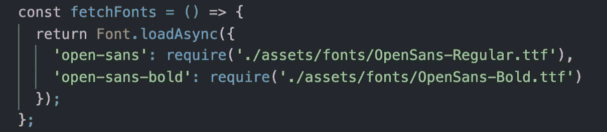
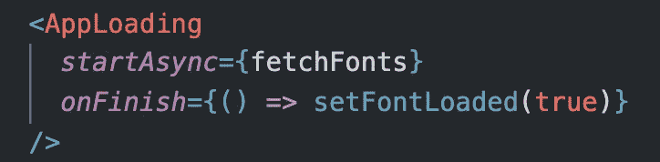
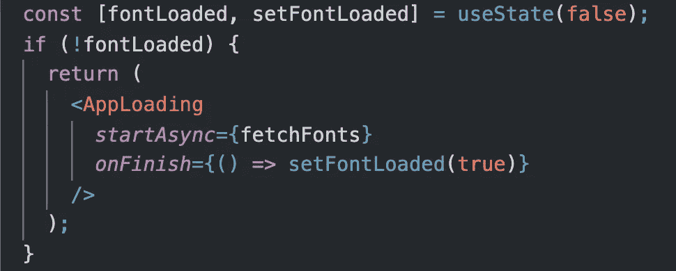

# 等待 React Native 中的异步加载

> 原文：<https://blog.devgenius.io/waiting-for-asynchronous-load-in-react-native-bc160f2389c7?source=collection_archive---------1----------------------->

## 使用 Expo 的应用组件有条件地渲染

[凯·皮尔格](https://unsplash.com/@kaip?utm_source=medium&utm_medium=referral)在 [Unsplash](https://unsplash.com?utm_source=medium&utm_medium=referral) 上的照片

AppLoading 是 Expo 提供的一个有用的组件，所以在遵循这个建议之前，请确保您正在使用 Expo 创建您的 React 原生应用程序。

# 当应用程序派上用场时

如果你的应用程序依赖于任何异步响应，AppLoading 将对你有用。我的应用程序在“App.js”文件中使用 AppLoading，因为我使用需要加载的字体。如果我的应用程序的组件立即渲染，他们可以尝试使用尚未加载的字体。在这里，我们可以使用 AppLoading 组件和某些道具来完成一些事情:

*   保持加载屏幕，直到不同的组件准备好呈现
*   启动异步加载
*   指定异步加载完成后要做什么

# 两个道具组合在一起

所有用于应用的道具从技术上来说都是可选的，但是如果你提供了至少两个道具，使用起来会容易得多。这两个道具一起作用，不能缺一不可。

## 开始异步

我们为这个道具传递了一个函数，这个函数在 AppLoading 一渲染就运行。该函数必须返回异步操作，因为它的伙伴属性依赖于响应。在我的 AppLoading 组件中，我将一个名为 fetchFonts 的函数传递给 startAsync prop。以下是 fetchFonts 的外观:

注意，fetchFonts()不是简单地调用`Font.loadAsync()`，它实际上是返回它。这一点很重要，因为否则 AppLoading 组件就无法查看异步调用何时结束响应。当 AppLoading 看到异步操作已经完成时，它运行传递给 onFinish prop 的函数。

## onFinish

onFinish 也接收一个函数，这个函数在 startAsync 一结束就运行。在我的 AppLoading 组件中，我传递了一个匿名函数 onFinish，该函数用一个新的布尔值更新状态变量。这将重新呈现应用程序组件，更新后的状态变量值将呈现应用程序的其余部分，而不是 AppLoading 组件。

# 这一切是如何结合在一起的

现在我们已经知道了 AppLoading 是如何与它的 props 一起工作的，是时候看看 AppLoading 组件是如何与我的功能性应用程序组件中的其他组件相适应的了。

因为我的应用程序组件是一个功能组件，所以我使用钩子来创建一个名为 fontLoaded 的状态变量，该变量跟踪所有内容是否都已加载。这样，当值改变时，组件必须重新呈现，因此条件被重新评估，这将呈现应用程序的其余部分，而不是 AppLoading 组件。最初，我将 fontLoaded 设置为 false。如果 fontLoaded 为 false，则 conditional 被设置为返回 AppLoading 组件。

当异步加载完成时，传递给 onFinish 属性的匿名函数将会运行。这个匿名函数使用与 FontLoaded 状态变量一起创建的 setFontLoaded 函数。我们将布尔值`true`传递给 setFontLoaded，这样当组件重新呈现时，FontLoaded 等于`true`。

当 fontLoaded 不等于 true 时，该组件仅返回 AppLoading。我们现在跳过 if 语句的内容，返回应用程序的其余部分。

# 开始之前，请记住您的导入内容

如果您认为这在您自己的 React 本机应用程序中可能有用，那么在使用这些有用的工具之前，您需要在您的文件中导入一些东西:

*   `import React, { useState } from ‘react’;` —使用 JSX 需要 React，使用状态允许您在功能组件中创建状态变量
*   `import { AppLoading } from ‘expo’;` — AppLoading 是 Expo 提供的一个组件，您需要在使用前导入它

 [## 应用加载

### 一个 React 组件，告诉 Expo 如果它是第一个也是唯一一个呈现在…

docs.expo.io](https://docs.expo.io/versions/latest/sdk/app-loading/)