# 在 Unity 中跳墙和滑墙

> 原文：<https://blog.devgenius.io/wall-jumping-sliding-in-unity-296bb75a539?source=collection_archive---------2----------------------->

## 在墙上跳，反弹，重复，直到我到达墙的顶部。以低于正常重力的速度滑下墙壁。

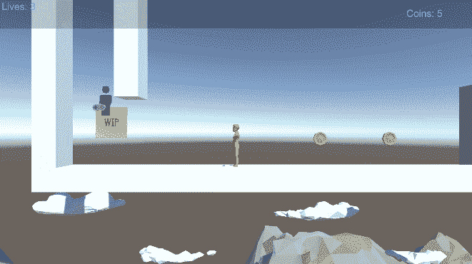

为了进行壁跳和壁滑，我需要一些信息:

1.  玩家在空中吗
2.  玩家撞到墙了吗
3.  与墙的碰撞有什么意义。
4.  我需要知道表面法线，以便向相反的方向反射。

# 检测碰撞

Unity 提供了一条消息，我可以用它来知道角色控制器在移动时碰到了什么东西。

[**角色控制器。OnControllerColliderHit**(ControllerColliderHit)](https://docs.unity3d.com/2021.1/Documentation/ScriptReference/CharacterController.OnControllerColliderHit.html)

[**ControllerColliderHit**](https://docs.unity3d.com/2021.1/Documentation/ScriptReference/ControllerColliderHit.html)为我提供了一些有用的信息。

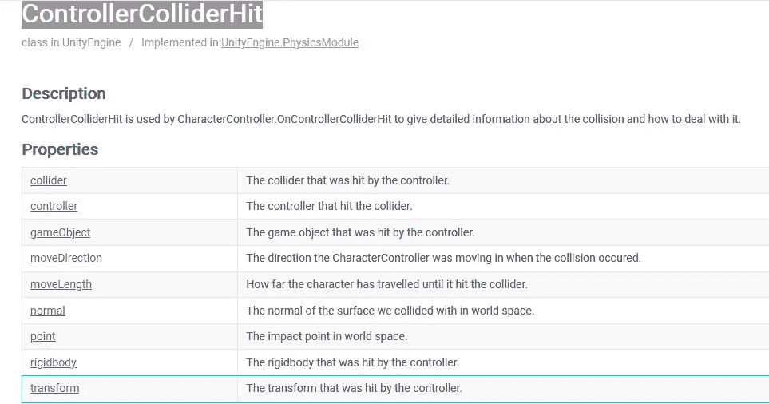

## 获取碰撞点&法线

我可以通过获得控制器碰撞器命中的 [**点**](https://docs.unity3d.com/2021.1/Documentation/ScriptReference/ControllerColliderHit-point.html) 来获得接触点。

我可以得到控制器碰撞器命中的与我碰撞的表面的 [**法线**](https://docs.unity3d.com/2021.1/Documentation/ScriptReference/ControllerColliderHit-normal.html) 。

我可以利用这些信息，用 [**Debug 画一条射线。画线**](https://docs.unity3d.com/2021.1/Documentation/ScriptReference/Debug.DrawRay.html) 在屏幕上显示我碰撞的地方。

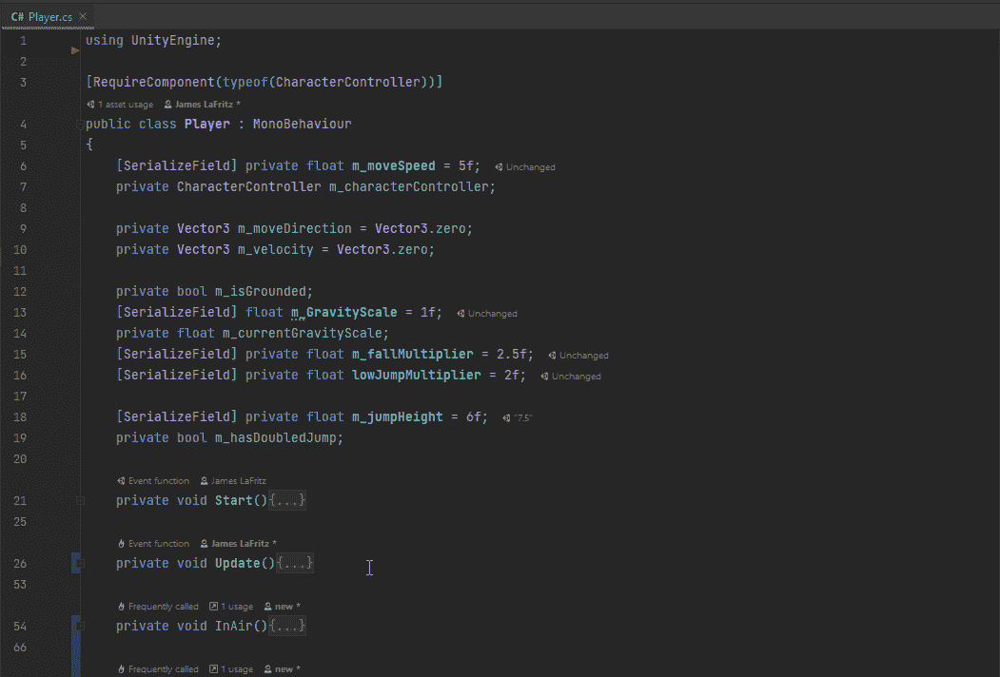

现在我在想象碰撞。我有发生碰撞的法线(信息#5)和碰撞点(信息#4)。

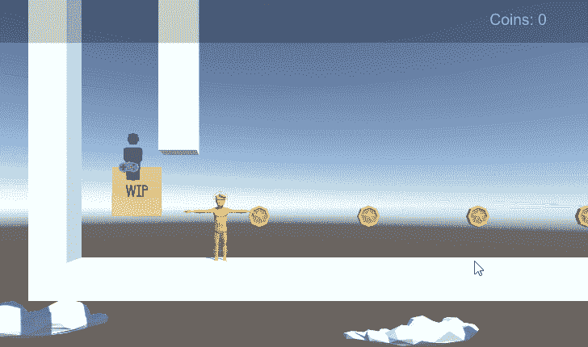

## 检测是否可以进行墙跳或墙滑

我需要一种方法来标记我的墙壁。我选择了目前游戏中的两面墙，并将它们标记为“墙”。我必须先将“墙”标签添加到标签中。

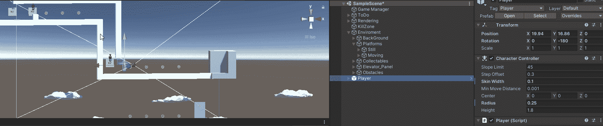

现在我知道了墙是什么，我将碰撞器的标签与墙的标签进行比较，检查玩家是否不在地上。如果两个条件都满足，我就画一条线，表示我可以跳墙。

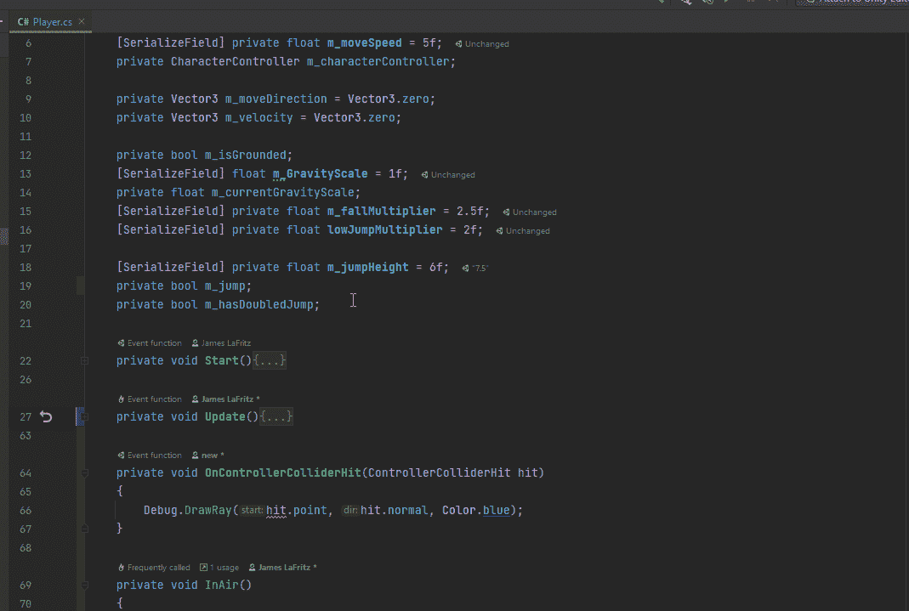

现在我有信息#1 和#2。

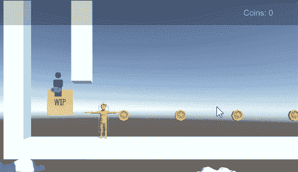

# 墙壁滑动

当我在这里的时候，我加入了一个逻辑，如果我接触到墙壁，我会施加不同的重力。大多数平台游戏都有角色在接触墙壁时表演墙壁滑行。我添加了一个将应用于重力的乘数。当与墙碰撞时，我设置了一个 bool，表示我正在接触墙。在更新方法中，我将它设置为 false，如果我被禁足，我还添加了一个检查来查看我是否没有接触任何东西([**)character controller。CollisionFlags**](https://docs.unity3d.com/2021.1/Documentation/ScriptReference/CollisionFlags.html) )并将其设置为 false。在我的应用重力方法中，我添加了一个检查来查看我是否接触到了一面墙，如果是，我就应用重力乘数。

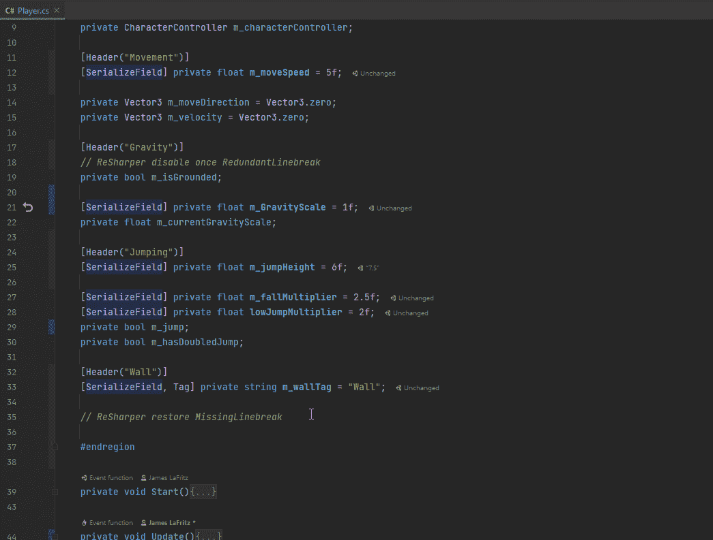

这具有无人注意的效果，如果执行双跳，能够爬上墙壁。

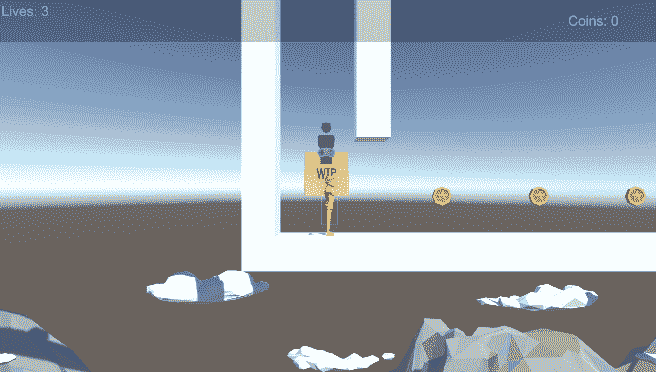

为了解决这个问题，我需要检查 Y 轴上的速度是否小于 0。同样，因为这是一个乘数，我把它改为乘以正常的重力比例。

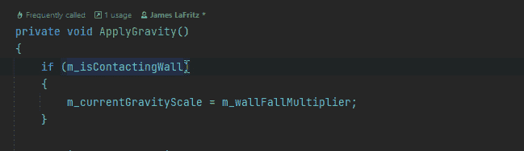

现在我的滑墙生效了。

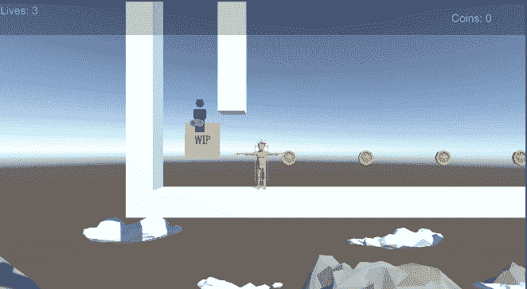

# 跳墙

为了从墙上跳下来，我需要检查是否按下了跳跃按钮。我在更新方法中已经有这个了。

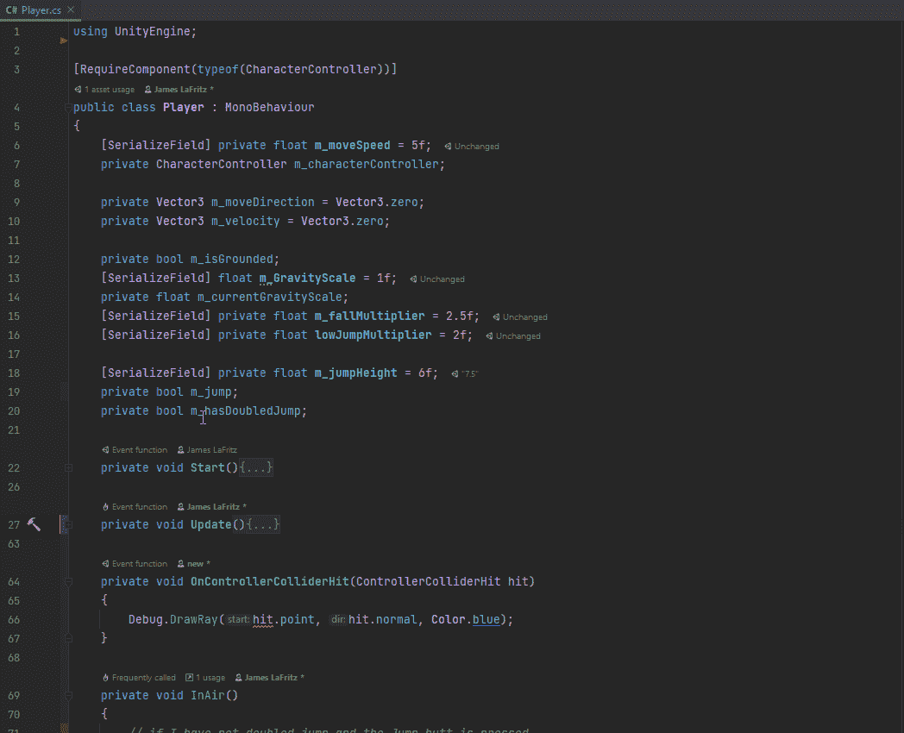

现在我需要添加一个检查来查看玩家是否在接触墙壁时跳跃。如果玩家在接触墙壁时按下了跳跃按钮，我将 Y 速度设置为跳跃高度，我也将移动方向设置为表面法线方向。

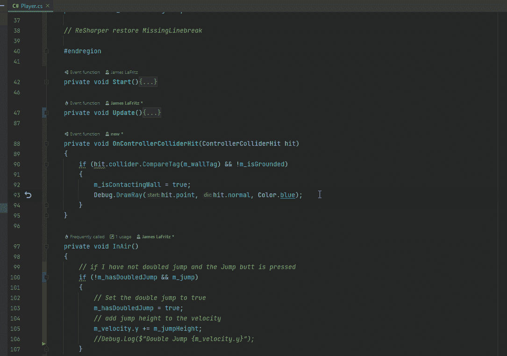

我现在可以跳上墙，但我不会从墙上跳下来。

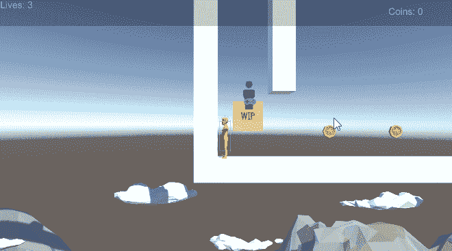

为了解决这个问题，我需要在玩家跳墙的时候禁用移动控制。

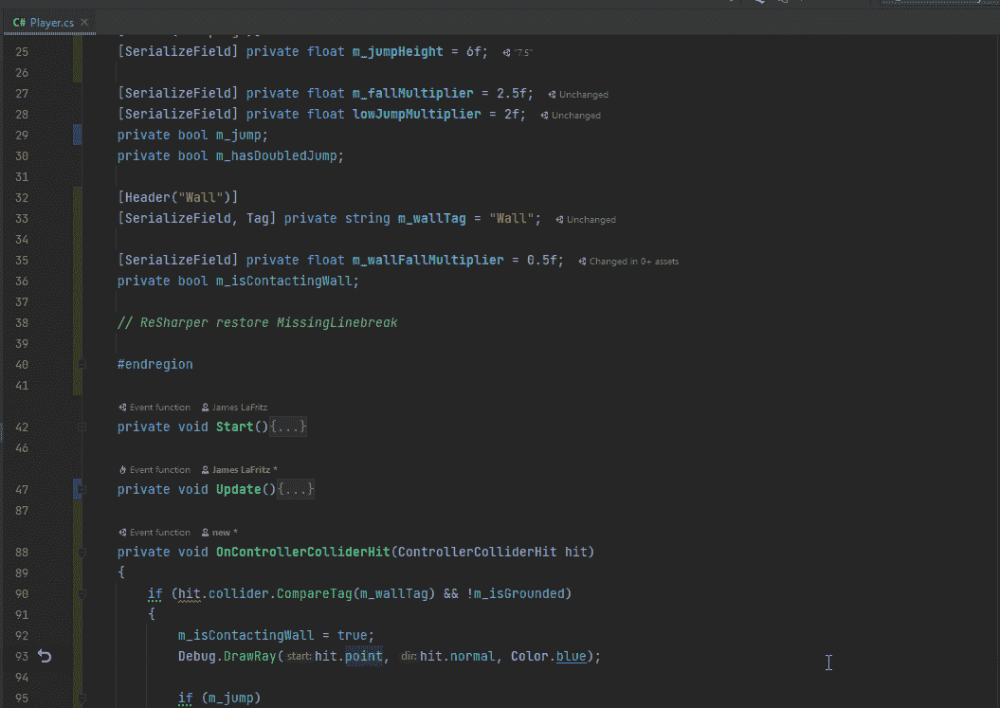

现在我可以跳墙了，但是还有一个小问题。

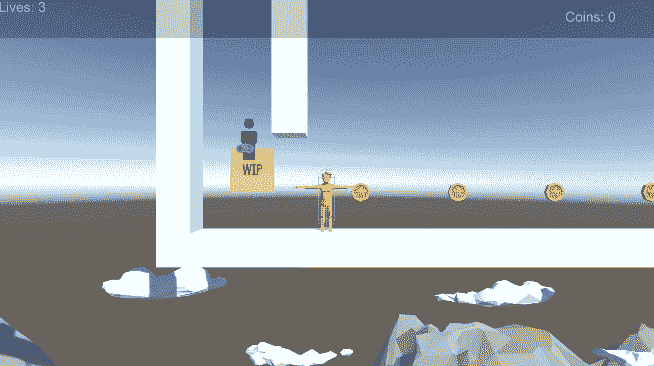

我可以从墙的底部跳墙，这会引起一些奇怪的旋转问题。要解决这个问题，我需要做的就是添加一个只与侧面碰撞的检查。

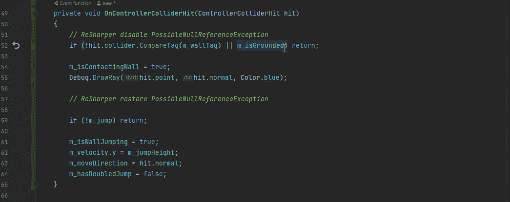

我也从设置移动方向改为只设置移动方向的 X 轴。

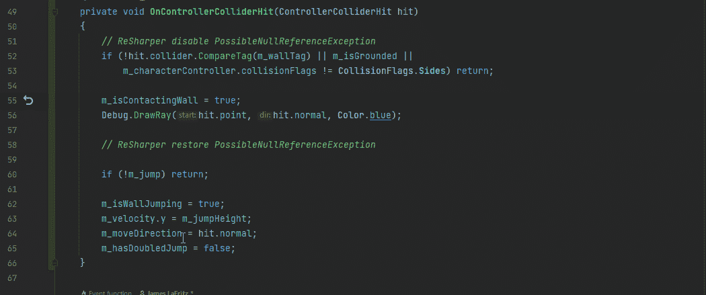

现在我的角色可以跳墙了。

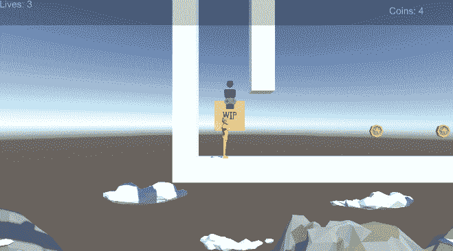

我想做的最后一步是让控制器碰撞器中的跳墙逻辑进入它自己的方法。这只是清理了方法，所以我不必担心返回条件会在添加其他东西(比如推盒子)时引起问题。

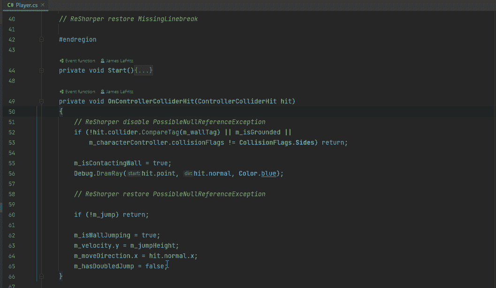