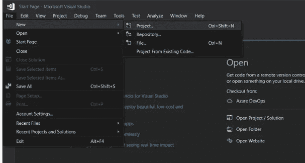
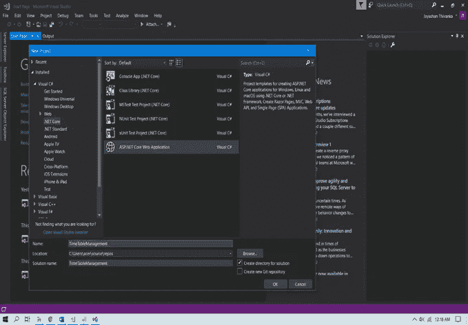
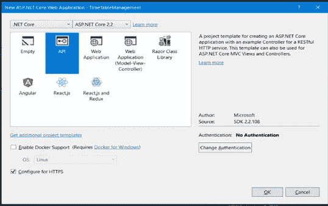
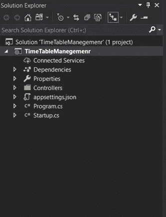
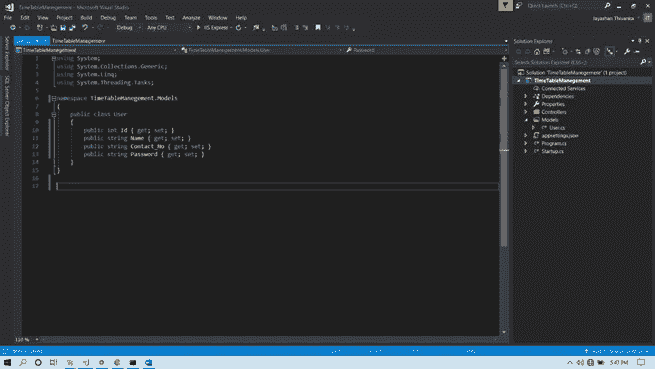

# 用 ADO 进行 Crud 操作。网

> 原文：<https://blog.devgenius.io/wanna-query-database-without-using-entity-framework-using-ado-net-64a6028c3665?source=collection_archive---------14----------------------->


实体框架建立在 ADO.net 之上。大多数人使用实体框架的代码优先方法或数据库优先方法，但是他们不具备关于 CRUD 操作的知识。本文讨论了如何简单地使用 ADO.net 进行创建、读取、更新和删除等基本操作。使用存储过程，你也可以使用 ADO.net 很容易地查询，这也将在后面的部分讨论。

首先，我们需要使用 SQL server management 或 SQL server object explorer 在 Visual Studio 中创建一个数据库，您可以连接到您的数据库。在这里，我将讨论使用一个虚拟项目的所有步骤。

创建数据库和表

```
CREATE DATABASE TimeTableManagementDB
```

现在我们将为用户创建一个表，并使用这个表进行查询

```
CREATE TABLE [User] (
[Id] INT IDENTITY (1, 1) NOT NULL,
[Name] NVARCHAR (MAX) NULL,
[Contact_No] NVARCHAR (MAX) NULL,
[Password] NVARCHAR (MAX) NOT NULL,
CONSTRAINT [PK_User] PRIMARY KEY CLUSTERED ([Id] ASC),
);
```

然后，我们需要创建一个新的 dotnet 核心应用程序，下面的屏幕截图将指导您创建一个新的 web API



单击“确定”创建应用程序



单击确定



单击确定。解决方案的创建是通过加载所有需要的文件来完成的。下面给出的是溶液结构图。



然后，我们必须创建一个模型来使用 ADO.net 执行 CRUD 操作。所以右键单击项目和一个新的文件夹来解决方案，并将其重命名为模型。这里我将使用用户模型来解释 CRUD 操作。要创建用户模型，右键单击模型文件夹，然后添加->必须选择类。将类重命名为用户。用户模型类应该如下所示



然后创建一个控制器来对数据库执行 CRUD 操作。为此，在 controllers 文件夹中添加一个名为 UserController.cs 的新类。下面是用户控制器类的源代码。

要访问数据库，首先我们必须连接到数据库，因为我们可以使用单独的上下文类。但是在这个例子中，我将在控制器的构造函数中创建数据库连接，如下所示

```
string ConnectionInformation = "Server=localhost;Database=TimeTableDB;Trusted_Connection=True;MultipleActiveResultSets=true";public SqlConnection MainConnection;public UserController()
{
   MainConnection = new SqlConnection(ConnectionInformation);
   MainConnection.Open();
}
```

*   **要获得所有记录，可以使用这两种方法**

*   **获取与 Id 相关的记录**

*   **添加一条记录**

*   **更新一条记录**

*   **删除一条记录**

*   **完整的控制器类如下**