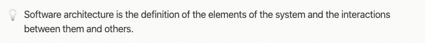
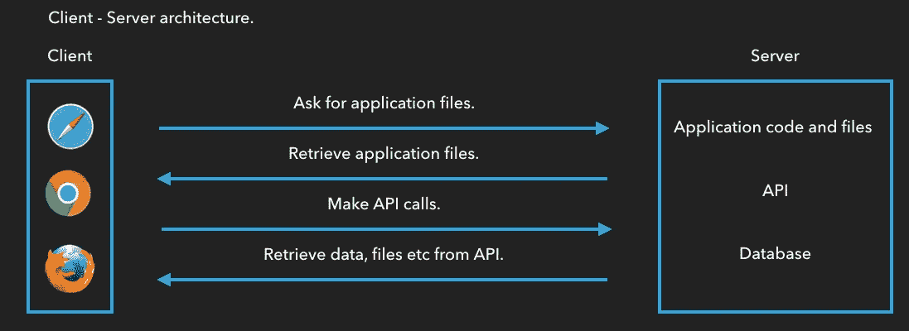
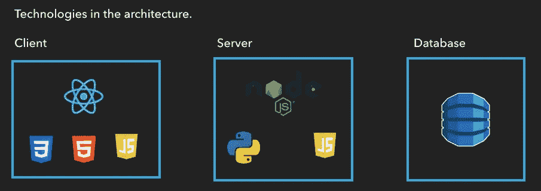
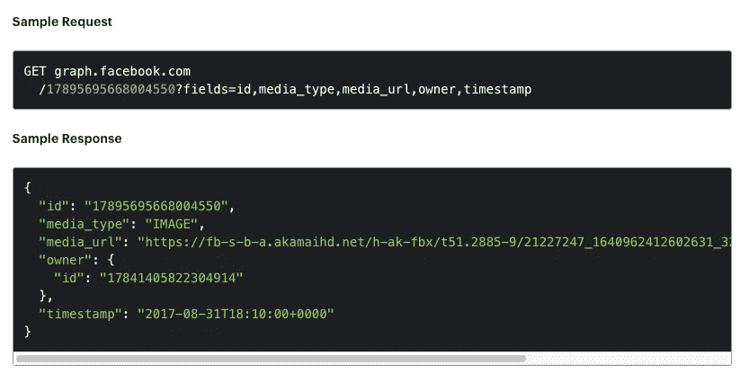

# 想成为一名 Web 前端开发者？

> 原文：<https://blog.devgenius.io/want-to-be-a-web-front-end-developer-718981847aa0?source=collection_archive---------37----------------------->

## 角色的职责和能力，以及其他哪些角色与它直接交互。

由 [Unsplash](/s/photos/html?utm_source=unsplash&utm_medium=referral&utm_content=creditCopyText) 上 [Greg Rakozy](https://unsplash.com/@grakozy?utm_source=unsplash&utm_medium=referral&utm_content=creditCopyText) 拍摄的照片

嗨，关于这个故事，我将解释什么是 web 前端开发人员，这个角色的职责和能力是什么，以及其他哪些角色直接与它交互。

在我的文章“如何开始编码”中，我谈到了选择一个平台和一种编程语言的重要性，以便在头脑中有一个清晰的路径。如果你选择网络浏览器作为平台，那你就来对地方了。

**那么让我们开始吧！**

web 前端开发人员是负责 web 应用程序客户端的人员。他们使用工具开发应用程序的用户界面，根据 UI/UX(用户界面/用户体验)团队给出的设计为其提供上下文、风格和功能。

有点迷茫？别担心，让我们深入了解每一部分。

什么是 web 应用程序的客户端？

web 应用程序的客户端可以描述为用户在浏览器、界面或应用程序视图中看到的内容。

此时也许会问自己还有另一面？答案是肯定的。

当我们开发一个 web 应用程序时，大部分时间它都遵循客户端-服务器架构。即使强硬的前端开发人员只处理客户端，他们也必须理解什么是服务器端。

web 应用程序的服务器端可以被描述为我们的应用程序的大部分逻辑的中央处理器。大多数时候，它负责存储、处理和转发数据和指令。

**前端开发者如何创建接口？**

为了回答这个问题，假设我们想要开发“X”web 应用程序，对于这个应用程序，您是前端开发人员。在开发这个应用程序时，你不会是一个人，因为有不同的团队承担着特定的责任，他们将与你一起完成这个项目。

让我们了解一下各队！

UI/UX 团队应该提供应用程序的界面设计、线框和相应的资产。

网络应用程序设计的 vision 免费应用套件。

软件架构团队或工程经理应该为应用程序提供架构图和工具集。

后端团队应该提供 API 文档。

脸书 API 服务。

有了最后的资源，你就可以开始工作了。正如您可以注意到的，架构师和经理为项目定义了技术，如上面的两个图表所示，他们根据项目的需求，利用他们的经验来定义最佳选项。您的职责是在客户端使用这些技术来创建应用程序。

就本例而言，您将使用 HTML 来渲染用户界面并为其提供上下文，使用 CSS 来赋予其风格，使用 JavaScript 来管理应用程序的逻辑、动画和其他组件，并作为一个库来帮助您创建界面。正如我之前提到的，你将与服务器端进行交互，尽管这种交互大多数时候只限于调用 API。

对这个角色的总结就到此为止。如果你喜欢它并想进入它，我强烈建议你按照下面的顺序学习这些技术。

1.  学习一门编程语言。
2.  学习调用 REST API。
3.  学习 HTML。
4.  学习 CSS。
5.  学习一个库或框架。

HTML 和 CSS 是前端开发人员的必备知识，因为这些技术是浏览器所需要的。

基于个人偏好和市场，我对每种技术的建议是:

1.  编程语言:JavaScript。
2.  使用 JavaScript 使用 rest API。
3.  标记语言:HTML。
4.  样式表 CSS。
5.  UI 库 React + React 钩子。

还有其他开发 web 应用程序的编程语言，比如 Java，但我认为 JavaScript 是最友好的开始方式，也是市场上最常用的。另一方面，React 的主张来自于教授新的前端开发人员技术，这些技术在市场上很受欢迎，会给他们的职业生涯带来额外的价值。

在我接下来的故事中，我将谈论前端开发中使用的每一种技术，希望能够帮助那些想开始前端开发生涯的读者。

像往常一样，任何疑问都可以给我发电子邮件[leadluiss@gmail.com](mailto:leadluiss@gmail.com)😄下一次再见。