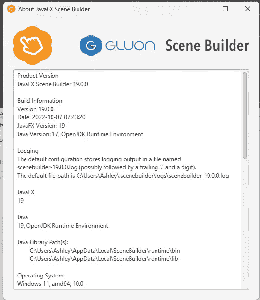
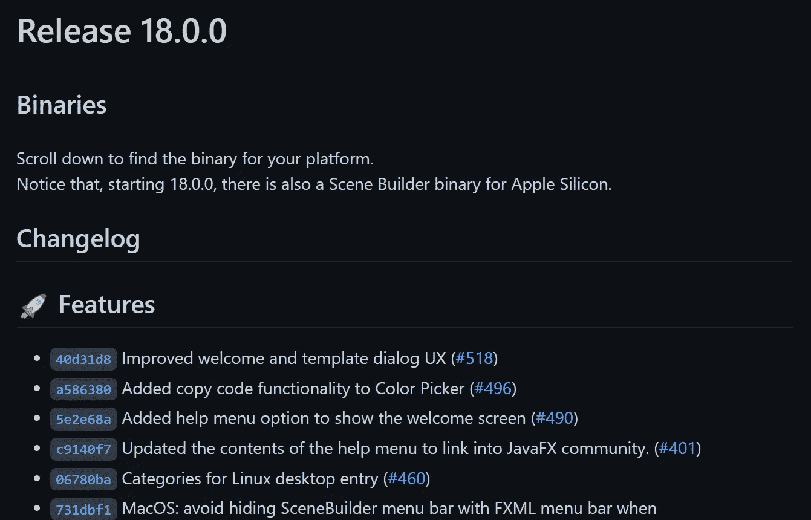
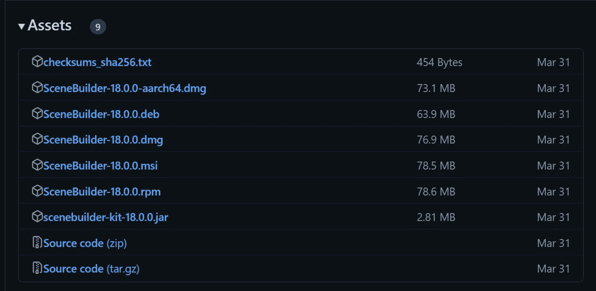
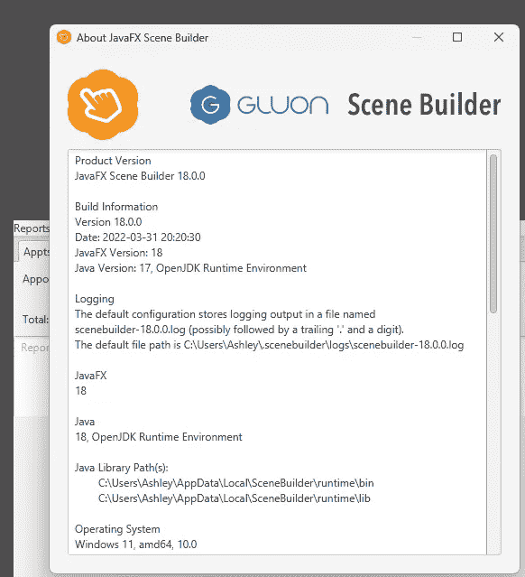
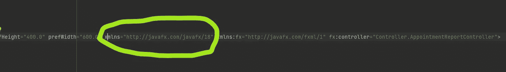
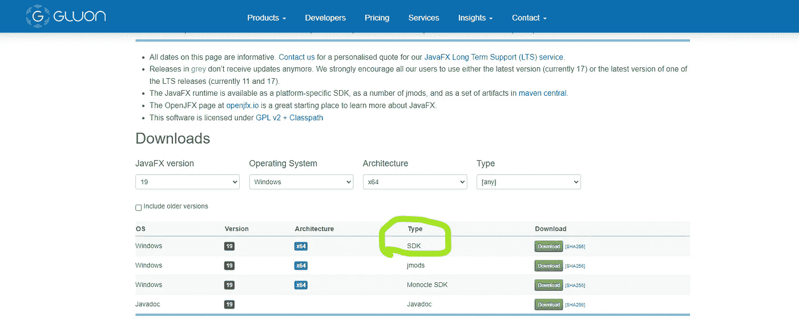
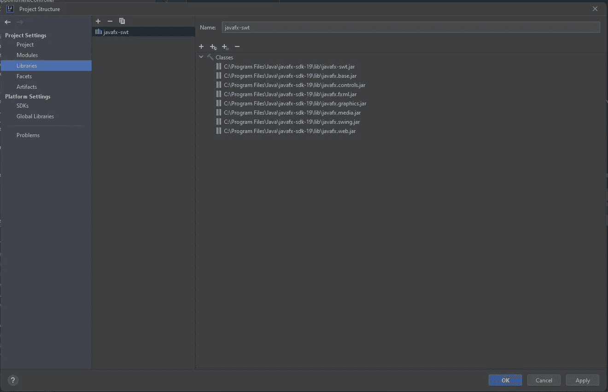
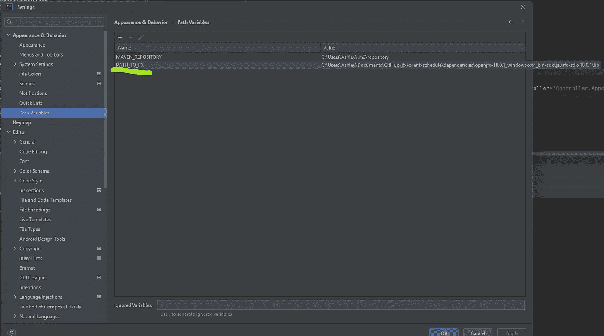

# "警告:由 18.0.1 版的 JavaFX 运行时使用 19 版的 JavaFX API 加载 FXML 文档"

> 原文：<https://blog.devgenius.io/warning-loading-fxml-document-with-javafx-api-of-version-19-by-javafx-runtime-of-version-18-0-1-a6cd14359479?source=collection_archive---------1----------------------->

在更新我的 SceneBuilder 版本后，我开始看到这个错误。

SceneBuilder 给我看过一个对话框，问我要不要更新，我没多想，“当然，我会更新的”。

更新程序似乎失败了，但没关系，所以我想在 scenebuilder 网站上下载并运行最新版本的 SceneBuilder 安装程序，以确保在更新过程中是否有任何东西被破坏，然后运行此安装程序肯定会清除所有这些，我会有一个干净的石板。

这是我最后得到的版本。

不幸的是，我的 Java 项目仍然使用 JavaFX 18.0.1，因此我在 Java 代码中看到了错误消息。

基本上，此时我有两个选择，我可以将我的 SceneBuilder 版本退回到 18 版，这样我就可以在 SceneBuilder 和我用 Intellij 构建的 Java 项目中继续使用 18 版

运筹学

我可以更新我的项目以使用 JavaFX 19。

哪一种适合您取决于您的代码库和设置，所以我将这两种技术都包含在内，因为我尝试了这两种技术。

## 回到 SceneBuilder 方法的版本

如果您想了解如何在 Intellij 方法中更新 JavaFX，请向下滚动本节。

在 Gluon 网站上，我发现很难找到 18.0.1 版本的下载，但我确实在 github 上找到了发布页面:

 [## 发布 gluonhq/scenebuilder

### 此时您不能执行该操作。您已使用另一个标签页或窗口登录。您已在另一个选项卡中注销，或者…

github.com](https://github.com/gluonhq/scenebuilder/releases) 

向下滚动，直到找到版本 18，就像自述文件所说的，下载将在该块的末尾。

展开显示“资产”的小部分，选择您想要的下载。我用的是 Windows，所以我选择了。msi 文件安装程序选项。

我的安装程序如下所示:

所以现在当我打开 SceneBuilder，然后打开帮助->关于 SceneBuilder 时，我的版本数据看起来是这样的

我敞开心扉拯救我的。fxml 文件在 SceneBuilder 中，我主要寻找的是，它应该在我的 fxml 文件的根节点中指定版本 18，而不是版本 19

这个显示的是版本 18，而当我遇到错误时，我看到的是版本 19

如果你确保你所有的 FXML 文件在 18 版本上都匹配，并且你的场景编辑器回到 18 版本，希望这对你有用。

## IntelliJ 中 JavaFX 版本 19 的更新

转到此页面:

 [## JavaFX -胶子

### 路线图发布正式发布日期最新版本长期支持扩展或定制支持详细信息 2023 年 3 月 20 日(计划中)…

gluonhq.com](https://gluonhq.com/products/javafx/) 

这是 JavaFX SDKs 的下载页面，几乎包含所有版本。

使用组合框选择您的操作系统和架构等，您的下载将显示在过滤列表中:

我只想要 SDK，所以我要下载它。

现在只需关注我写的关于如何在 IntelliJ 中更新 JavaFX 的另一篇文章。请记住我在设置版本 18 时制作的教程，您将为版本 19 做完全相同的事情，所以在查看屏幕截图时请记住这一点。

 [## IntelliJ:如何将 JavaFX SDK 添加到 Java IntelliJ 项目中

### 转到 Java FX SDK 下载页面[1]。

ashley-tharp.medium.com](https://ashley-tharp.medium.com/intellij-how-to-add-the-javafx-sdk-to-a-java-intellij-project-38d8073b7809) 

以下是文件项目结构中我的库的屏幕截图:

如果您和我一样，喜欢使用环境变量来简化在不同计算机上运行，那么您应该更新所有指向 FX 库的路径变量，

我倾向于使用“PATH_TO_FX”这样的约定，我将它存储在文件->设置->外观和行为->路径变量中

如果你还没有加入 Medium，但你想加入，请点击这里。通过我的推荐链接注册 Medium，我将获得一小笔佣金。