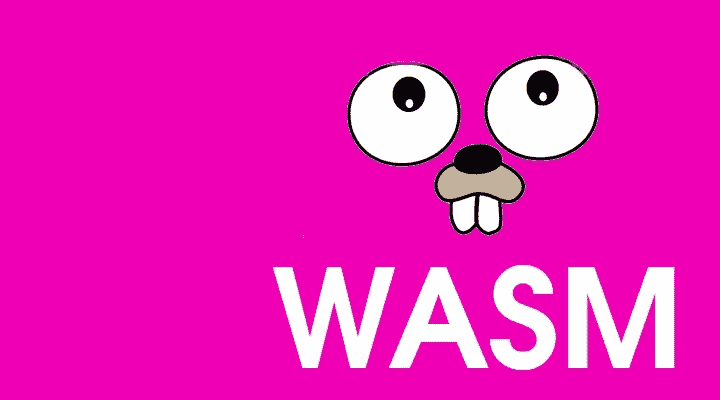
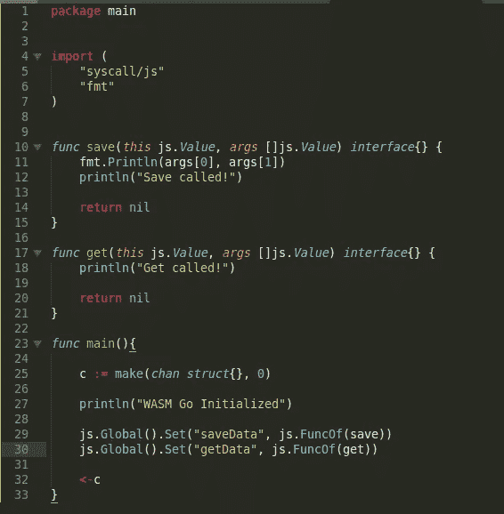
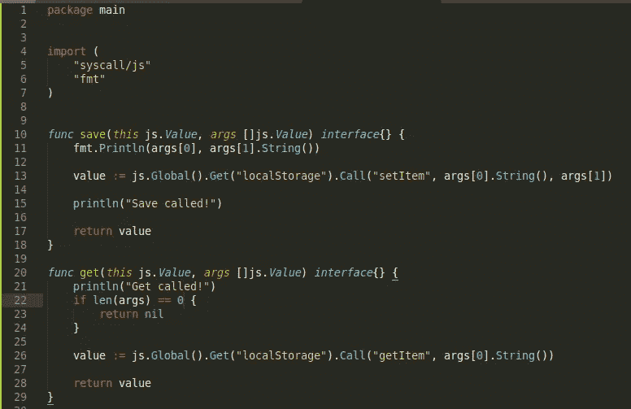
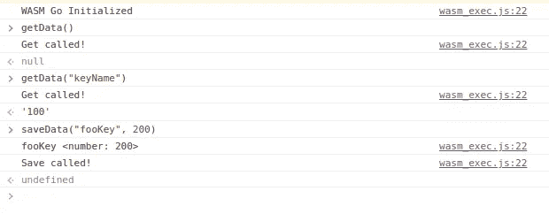
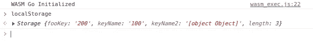

# 去 WASM 拿储物。

> 原文：<https://blog.devgenius.io/wasm-program-with-browser-storage-6b3d4accd7d2?source=collection_archive---------5----------------------->



Web Assembly，俗称 WASM，于 2015 年首次公布。它使开发者能够在浏览器中运行机器代码。我第一次看到 WASM 是在更新到 Unity 5 之后。WASM 是部署目标之一。我喜欢能够通过 HTML 部署我的游戏的想法。用 C#构建 HTML5 游戏在当时也是史无前例的。通过 HTML 部署将允许人们不用下载就能玩我的游戏。作为一个新的出版商，这比让人下载 2GB 的二进制文件更容易。自 2015 年以来，更多的语言增加了对 WASM 的支持。从 1.11 版本开始，Go 增加了实验性的 WASM 支持。在这篇文章中，我将尝试用围棋 WASM 构建一个数据存储程序。该计划的目的将是抽象的存储和检索数据。我选择了一个存储程序，因为 Go 有很好的数据操作包。

# 基本 WASM 计划

在 Go 中启动一个 WASM 项目非常简单。你需要一个名为`main`的包，它有一个主函数。设置完成后，您需要运行以下命令来构建 WASM 二进制文件:

```
GOARCH**=**wasm GOOS**=**js go build **-**o lib.wasm main.go
```

该命令将输出一个名为`lib.wasm`的文件，这是您的浏览器将运行来启动您的程序的可执行文件。要让它充分发挥作用，还需要其他步骤。我在文章的底部添加了一个教程的链接。为了保持文章简短，我将跳过设置步骤。为了开始存储程序，我将更新我的程序的 main 函数。

# 桥接转到 Javascript

我将初始化一个通道，并在函数结束时等待通道响应。这是为了防止程序关闭。这比使用循环要干净得多。下一步，我需要定义两个 Go 函数，一个用于保存数据，一个用于检索数据。我知道不鼓励使用 syscall，但是我导入了`syscall/js`,因为我需要它来访问浏览器窗口。我将在窗口对象中注册 Go 函数。这就是浏览器使用 Go 功能的方式。`js.Global()`将返回`window`对象。链接功能`Set`将功能设置为指定的键。将生成必要的代码，使您的函数可以通过 JS 调用。桥接到 Javascript 的函数需要某种签名。生成的主文件将如下所示:



我定义了两个新函数来处理数据的保存和存储，名为 save 和 get。如果您注意到了，导出的函数需要有特定的签名。两个函数都有一个名为`args`的参数，args 是从函数的 JS 调用中传递的参数数组。在执行您的 WASM 二进制文件时，这些函数将在您的浏览器窗口中可用，就像函数`Set`中指定的键一样。例如，`save`可以用`window.saveData("key", "data")`调用，`args`的值就是`["key" "data"]`。尽管 WASM 可以运行所有这些简洁的代码，但它仍然运行在 Javascript VM 中。这意味着二进制文件不能访问任何文件系统或存储机制。那么这个存储程序将在哪里存储数据呢？浏览器提供了一种存储数据的机制。在这篇文章中，我将使用`localStorage`来保存和检索数据。

# 访问系统调用

我将进行更多的系统调用，但是不用担心，这里的系统是浏览器窗口。为了能够存储和检索来自`localStorage`的数据，我需要一个访问浏览器窗口的方法。我使用函数`js.Global()`来访问窗口对象。我利用`js.Value`方法`Call`来调用 localStorage 函数。在更复杂的情况下，数据可以在保存前加密，或者在检索前解密。下面是最终的`save`和`get`函数的样子:



需要注意的一个重要方面是，我因为访问一个空参数而导致程序崩溃。我做的一项工作是计算 arg 数组的长度，如果没有指定 arg，就提前返回。下面是 chrome inspector 中运行的程序的截图:



如你所见，我正在访问分配给窗口的功能。我还检查 localStorage 的值，以验证数据是否被持久化。你可以自己试试，来源在帖子的最下面。现在我已经在 WASM 建立了一些东西，我将深入研究我遇到的限制。

# 限制

正如我前面提到的，没有为函数指定足够的参数会导致程序崩溃。奇怪的是，JS 端没有抛出异常/错误。这是在编写 WASM 应用程序时要记住的事情，因为函数调用可能会悄无声息地失败。传递给函数的对象成为类型`js.Value`。这使得编写代码非常困难，因为`js.Value`对象是用函数访问和更新的。我确实提到了加密数据，但是，这样做可能会有问题。这是一个问题，因为 WASM 二进制文件可以被反向编译，可能会暴露机密信息。

# 结论

这是我的第一个 WASM 项目。这很容易学习，因为为其他目标编译的工作流与 WASM 类似。我首先测试的是 Goroutines。我喜欢的是，这在 WASM 行得通。为了获得额外的支持，Go 社区已经开发了用 WASM 进行自动化测试的包。我在下面的源代码中放了一个到其中一个库的链接。我将探索的下一个途径是如何将 TCP 支持带到 WASM。今天我留给你们的问题是，WASM 能取代传统的应用层吗？我一直在考虑建立一个 SQL WASM 客户端。拥有一个本地 SQL 客户端应该很棒吧？想象一下在 React 和 Angular 中运行 SQL 语句。

来源

[](https://tutorialedge.net/golang/go-webassembly-tutorial/) [## Go WebAssembly 教程-构建计算器教程

### 在本教程中，我们将学习如何将 Go 程序编译成 WebAssembly

tutorialedge.net](https://tutorialedge.net/golang/go-webassembly-tutorial/) [](https://github.com/cheikhshift/medium_examples/tree/main/wasmstorage) [## medium _ examples/wasmstorage at main cheikh shift/medium _ examples

### 中型文章的代码示例。在 GitHub 上创建一个帐户，为 cheikhshift/medium_examples 开发做贡献。

github.com](https://github.com/cheikhshift/medium_examples/tree/main/wasmstorage) [](https://github.com/agnivade/wasmbrowsertest) [## GitHub-agnivade/wasmbrowsertest:在浏览器中运行 WASM 测试

### 在浏览器中轻松运行 Go wasm 测试。如果你有一个针对 wasm 平台的代码库，你很可能会…

github.com](https://github.com/agnivade/wasmbrowsertest)