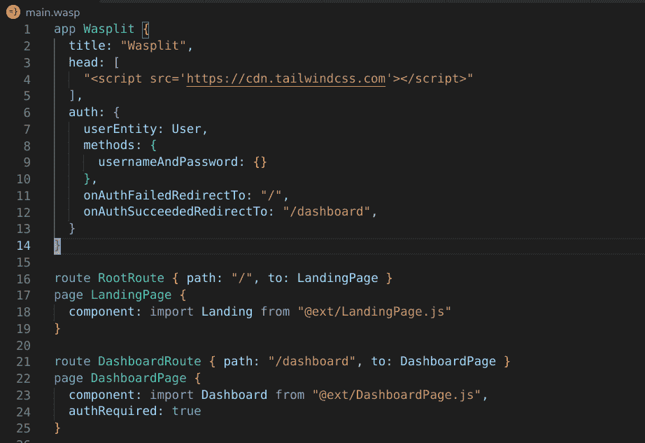
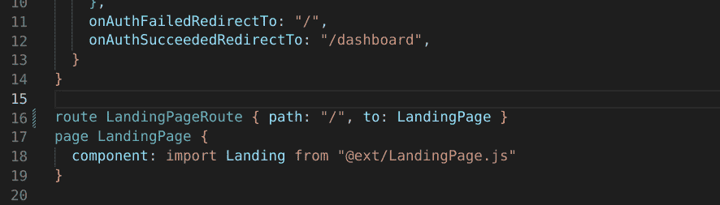
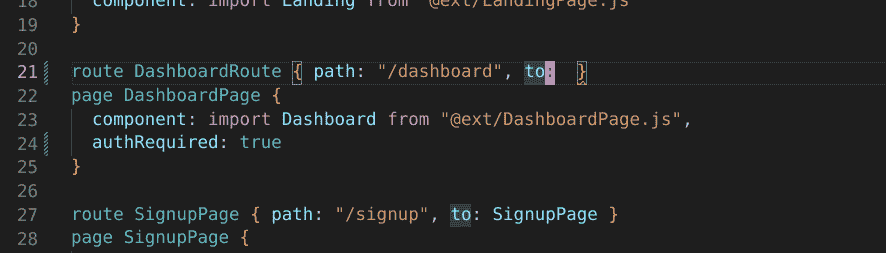
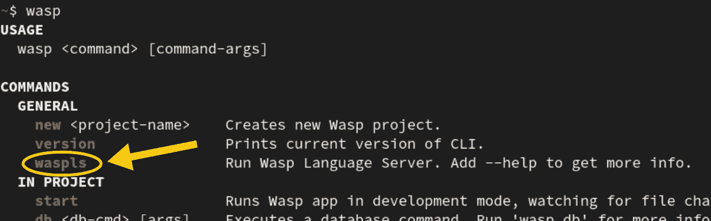
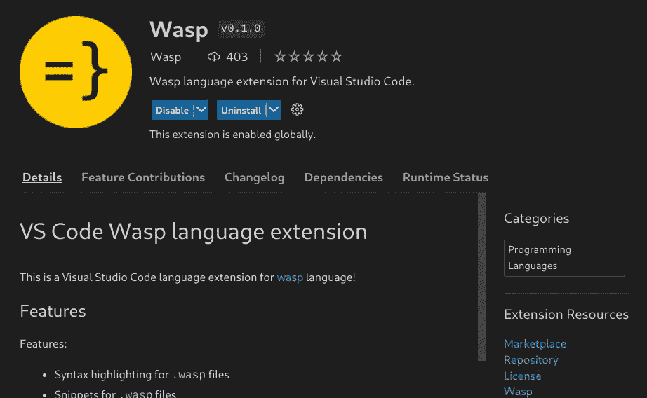
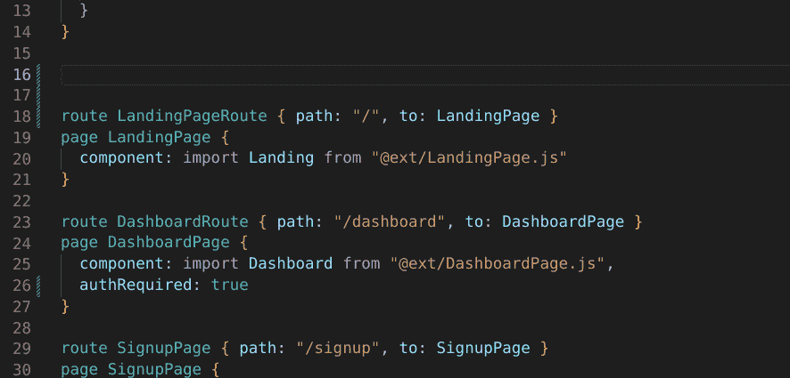

# Wasp Beta 带来了主要的 IDE 改进

> 原文：<https://blog.devgenius.io/wasp-beta-brings-major-ide-improvements-d985c8d07fae?source=collection_archive---------12----------------------->

随着 Beta 版(0.7)，Wasp 将其 IDE 游戏带到了一个全新的水平！

到目前为止，Wasp 在 VSCode 中除了基本的语法突出显示之外没有太多功能，但是现在它有了:

**1)Wasp 语言服务器，为您带来以下内容。wasp 文件:**
—编辑器中的实时错误报告
—自动完成(目前是基本的)

**2)** **VSCode Wasp 语言扩展** :
—片段(用于`page`、`query`、`action`、`entity` )
—改进的语法突出显示。wasp 文件
—与上述语言服务器集成

**3)支持流行的 ide，全面支持 Wasp 项目中的 Javascript 和 Typescript 文件。**

VSCode 中的 Wasp IDE 支持:语法高亮、代码片段、实时错误报告。

VSCode 中的 Wasp IDE 支持:语法高亮、代码片段、实时错误报告。

# Wasp 语言服务器

Wasp 语言服务器(WLS)是智能 IDE 功能(如实时错误报告和自动完成)背后的“大脑”——因此，如果 IDE 在某种程度上确实理解您的代码，那么它就是语言服务器！

> 提示
> 出于好奇，在 Github 上查看 WLS 的源代码:[https://Github . com/Wasp-lang/Wasp/tree/main/wapc/waspls/src/Wasp/LSP](https://github.com/wasp-lang/wasp/tree/main/waspc/waspls/src/Wasp/LSP)

# 特征

## 实时错误/警告报告

WLS 在你工作时为你编译 wasp 代码，并通过红色曲线直接在编辑器中显示任何错误。

## 自动完成[和](https://wasp-lang.dev/blog/2022/12/01/beta-ide-improvements#autocompletion)

WLS 知道你现在在代码的哪个部分，并为它提供适当的完成。

> 注意
> 
> 现在 WLS 在这方面相当幼稚，当它意识到你需要一个表达式时，它主要关注于提供可用的表达式。这很有帮助，但只是一个开始，在未来的版本中它会变得更加智能！

# 一点历史:为什么语言服务器很酷

几年前，没有标准化的方法来为你的语言编写类似语言服务器的东西，相反，每种语言都做自己的事情，然后每个编辑器/IDE 也会实现自己的逻辑层来使用它，这是每个编辑器需要做的大量工作！

幸运的是，微软随后提出了[语言服务器协议](https://microsoft.github.io/language-server-protocol/)——一种由语言创建者实现的“智能”部分和使用它的编辑器/IDE 部分(语言扩展)之间的标准化通信方式。这使得每个编辑器只需实现一次与语言服务器交互的逻辑，就可以用于任何语言服务器！

这对我们语言的创造者来说是非常好的，因为这意味着一旦我们为我们的语言实现了一个语言服务器，大部分工作就完成了，并且我们需要为每个编辑器做的工作是可管理的。

现在 WLS 只被 VSCode Wasp 语言扩展使用，但是由于语言服务器协议的本质，添加对其他编辑器的支持应该是相对容易的。如果你有兴趣帮忙，请查看这个 GH 问题。

# 设置[和](https://wasp-lang.dev/blog/2022/12/01/beta-ide-improvements#setup)

最好的事情:作为一个 Wasp 用户，你不需要做任何事情来设置 WLS！它已经与您安装的`wasp` →捆绑在一起，所以如果您可以在您的机器上运行`wasp`项目，您就已经有了 WLS，并且它总是您当前 wasp 安装所需的正确版本。你唯一需要确保的是你有`wasp`版本≥ 0.6，和一个相对新鲜的 VSCode Wasp 语言扩展。

检查你的`wasp`版本是否包含 WLS 的一个简单方法是运行它并查看它的使用说明:它应该提到`waspls`作为命令之一。

# Wasp VSCode 扩展

如果我们将 Wasp 语言服务器(WLS)称为“后端”，那么 [VSCode Wasp 语言扩展](https://marketplace.visualstudio.com/items?itemName=wasp-lang.wasp)将是“前端”→它负责一切，以确保您在 VSCode 中使用 Wasp 有良好的体验，同时将最困难的工作委托给 WLS。

> 提示
> 出于好奇，你可以在这里查看它的源代码，它的核心只有一个文件:[https://github . com/wasp-lang/vs code-wasp/blob/main/src/extension . ts](https://github.com/wasp-lang/vscode-wasp/blob/main/src/extension.ts)

# [功能](https://wasp-lang.dev/blog/2022/12/01/beta-ide-improvements#features-1)

## 语法高亮

这里没有什么出乎意料的:它识别 Wasp 语法的不同部分，比如类型、值、标识符、注释、字符串……并适当地给它们着色。

如果你想知道这是如何实现的，请查看[https://github . com/Wasp-lang/vscode-Wasp/blob/main/syntaxes/Wasp . TM language . YAML](https://github.com/wasp-lang/vscode-wasp/blob/main/syntaxes/wasp.tmLanguage.yaml)→Wasp 的整个语法是通过这种“神秘的”旧 TextMate 格式描述的，因为这是在 vs code 中实现的方式。

## 片段

Wasp 允许您快速生成新的`page`、`query`、`action`或`entity`的代码片段！

在这里查看我们的代码片段定义:[https://github . com/wasp-lang/vs code-wasp/blob/main/snippets/wasp . JSON](https://github.com/wasp-lang/vscode-wasp/blob/main/snippets/wasp.json)。在 VSCode 中，定义它们并添加新的其实很容易。

## 实时错误报告+自动完成

如上所述，这是通过将工作委托给 WLS 来完成的！

# Wasp 项目中对 Javascript / Typescript 的 IDE 支持

由于 Wasp 的方法非常独特，让 ide 为 Javascript / Typescript 提供所有常用功能并不完全可行，相反，IDE 会与文件所在的上下文有些混淆，例如，无法为某些值提供“转到定义”，或者不知道如何遵循导入路径。

Wasp Beta 解决了这个问题！我们通过稍微改变 Wasp 项目的结构并添加 tsconfig.json 文件来解决这个问题，这些文件为 ide 提供了正确分析 JS/TS 源文件所需的信息。

要了解 Wasp Beta 中关于类型脚本支持的更多信息，请查看这篇博文！

# 未来会怎样？

尽管 Wasp Beta 极大地改进了 IDE 对 Wasp 的支持，但我们仍有很多地方需要改进:

**1)通过 WLS 实现更智能的自动完成功能。**
——现在当你需要一个表达式时，它表示任何表达式。将来，我们希望它能准确地知道所需表达式的类型，并只建议该类型的表达式！因此，如果我在`route ... { to: <my_cursor_here> }`中，那么我只想在建议的完成中看到`page` s，而不是`queries`或`actions`或其他什么。
—此外，我们还希望它自动完成字典字段→因此，如果我在`route ... { <my_cursor_here> }`，它应该为我提供`path`和`to`作为完成，因为它们是`route`字典中唯一有效的字段。

**2)除 VSCode 之外的其他编辑器的扩展。现在我们有了 Wasp 语言服务器，实现起来应该不会太难！对于潜在的贡献者来说，这也是一项伟大的任务:如果你感兴趣，请查看这期《生长激素》。**

实施 Wasp 代码格式化程序。我们可以让它成为 WLS 的一部分，然后让编辑器扩展在保存时调用它。

4)在中改进对 PSL (Prisma 模式语言)的支持。wasp 文件。

如果这些听起来很有趣，欢迎加入我们的 [Github](https://github.com/wasp-lang/wasp) ，或者加入关于[不和](https://discord.gg/rzdnErX)的讨论！