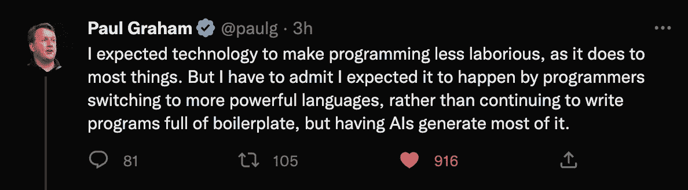

# 观看我们利用 Wasp 和 ChatGPT 在 9 分钟内构建*真正*的全栈应用🚀 🤯

> 原文：<https://blog.devgenius.io/watch-us-build-a-truly-full-stack-app-in-just-9-minutes-w-wasp-chatgpt-fd7cb53bae01?source=collection_archive---------7----------------------->

目前有很多关于 ChatGPT 的炒作，这是有充分理由的。太神奇了。但也有一些非常有效的批评:它只是通过为我们编写样板文件来消除编程中的繁重工作，这是我们作为开发人员必须维护的！



PG 在上面的评论中完全正确，但是他没有意识到的是，有一些语言试图克服这个问题，而 [Wasp](https://wasp-lang.dev) 就是其中之一。

Wasp 的独特之处在于，它是一个使用超级简单的**语言**来帮助你构建 web 应用的框架:前端、服务器和部署。但它不像 Java 或 Python 那样复杂，它更类似于 SQL 或 JSON，所以学习曲线真的很快(从技术上讲，它是一种**领域特定语言**或 **DSL** )。

自己去看看吧:

```
/* main.wasp */

app todoApp {
  title: "ToDo App",  /* visible in tab */
  auth: {  /* full-stack auth out-of-the-box */
    userEntity: User,
    externalAuthEntity: SocialLogin,
    methods: {
      usernameAndPassword: {},
      google: {}
    }
  }
}

route RootRoute { path: "/", to: MainPage }
page MainPage {
  /* import your React code */
  component: import Main from "@client/Main.js"
}
```

有了上面这个简单的文件，Wasp 将继续为您编译一个真正的全栈 web 应用程序，它有一个 React 前端和一个 ExpressJS 服务器。然后，您可以自由地使用 React、NodeJS、Prisma 和 react-query 构建重要的特性。

最棒的是，你甚至不需要参考文档就可以理解 Wasp 的语法。这意味着人工智能也可以很容易地使用它。因此，与其让 AI 为我们创造一大堆样板文件，我们不如想“【ChatGPT 能写 Wasp 吗？如果可以的话，我们所需要的就是让它创建一个文件，然后 Wasp 的能力会处理剩下的。**不再有无尽的样板文件！**

所以这正是我们在上面的视频中想要找到的。结果呢？这么说吧，他们不言自明。


点击此处观看视频:[https://youtu.be/HjUpqfEonow](https://youtu.be/HjUpqfEonow)