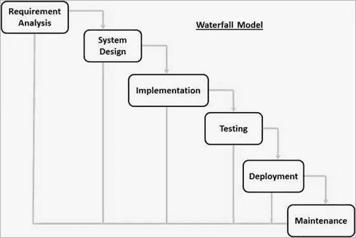

# 瀑布方法

> 原文：<https://blog.devgenius.io/waterfall-methodology-ebb45ba2b589?source=collection_archive---------4----------------------->

# 什么是瀑布方法论？

瀑布方法是一种线性的项目管理方法，在项目开始时就收集利益相关者和客户的需求，然后创建一个连续的项目计划来满足这些需求。瀑布方法之所以如此命名，是因为项目的每个阶段都像瀑布一样连续不断地向下延伸。

这是一种彻底的、结构化的方法，并且已经存在了很长时间，因为它很有效。一些经常使用瀑布方法的行业包括建筑、IT 和软件开发。然而，术语“瀑布”通常在软件环境中使用。

甘特图是在瀑布中工作的项目经理的首选工具。使用甘特图可以绘制子任务、相关性以及项目生命周期中的每个阶段。

# 瀑布模型的阶段

瀑布方法是第一个在软件工程中广泛使用的 SDLC 模型，以确保项目的成功。在“瀑布”方法中，软件开发的整个过程被分成不同的阶段。在这个瀑布模型中，通常，一个阶段的结果作为下一个阶段的输入。

下图展示了瀑布模型的不同阶段。

瀑布模型中的连续阶段是

*   **需求收集和分析**——待开发系统的所有可能需求都在此阶段捕获，并记录在需求规格文件中。
*   **系统设计**—第一阶段的需求规格在此阶段进行研究，并准备系统设计。该系统设计有助于指定硬件和系统要求，并有助于定义整体系统架构。
*   **实施**——根据系统设计的输入，系统首先在称为单元的小程序中开发，然后集成到下一阶段。每个单元都被开发并测试其功能，这被称为单元测试。
*   **集成和测试**—在每个单元测试后，实施阶段开发的所有单元都集成到一个系统中。集成后，测试整个系统是否有任何故障和失效。
*   **系统部署**——一旦完成功能和非功能测试；产品在客户环境中部署或投放市场。
*   **维护**—客户端环境中出现了一些问题。为了解决这些问题，发布了补丁。此外，为了增强产品，一些更好的版本发布。维护是为了在客户环境中实现这些变化。

所有这些阶段都是相互级联的，在这些阶段中，进展被视为稳定地向下流动(就像瀑布一样)。下一个阶段只有在为前一个阶段定义的一组目标实现后才开始，并被签署，因此命名为“瀑布模型”。在这个模型中，阶段不重叠。

# 瀑布模型示例

让我们假设一个简单的项目，然后用你刚刚学到的瀑布阶段来计划和执行它。对于我们的例子，我们会说你正在为一个客户构建一个应用程序。以下是您为达到最终交付成果而采取的步骤。

# 优势

瀑布开发的优点是它允许部门化和控制。可以为开发的每个阶段设定一个时间表，并且产品可以一个接一个地通过开发过程模型阶段。

开发从概念开始，经过设计、实施、测试、安装、故障排除，最后到运行和维护。开发的每个阶段都严格按照顺序进行。

瀑布模型的一些主要优势如下

*   简单，易于理解和使用
*   由于模型的刚性，易于管理。每个阶段都有具体的交付成果和审查流程。
*   一次处理和完成一个阶段。
*   适用于需求非常明确的小型项目。
*   明确定义的阶段。
*   熟知的里程碑。
*   容易安排任务。
*   过程和结果都有很好的记录。

# 不足之处

瀑布开发的缺点是它不允许太多的反思或修改。一旦一个应用程序处于测试阶段，就很难回头去修改一些在概念阶段没有被很好地记录或考虑的东西。

瀑布模型的主要缺点如下

*   直到生命周期的后期才生产出可工作的软件。
*   高风险和不确定性。
*   对于复杂的面向对象的项目来说，这不是一个好的模型。
*   对于长期和正在进行的项目来说，这是一个糟糕的模型。
*   不适合需求处于中度到高度变更风险的项目。因此，这种流程模型的风险和不确定性很高。
*   很难按阶段来衡量进展。
*   不能适应不断变化的需求。
*   在生命周期中调整范围可能会结束项目。
*   集成就像一场“大爆炸”。在最末端，这不允许及早识别任何技术或业务瓶颈或挑战。

对于刚刚推出新网站或新应用程序的公司，我们为您提供了优惠。如果您不确定您的网站/移动应用程序是否安全无故障，我们可以为您提供免费的基础设施测试审计。

所以你可以知道你的应用程序是否让你的潜在客户感到沮丧。要申请免费审计，请发邮件到 stackedqa@gmail.com 给我们，并注明你的主题为“免费测试审计”

在社交媒体上关注我们:

[脸书](https://www.facebook.com/StackedQA)，[推特](https://twitter.com/stackedqa)， [Instagram](https://instagram.com/stackedqa) ，& [Linkedin](https://www.linkedin.com/company/stackedqa)