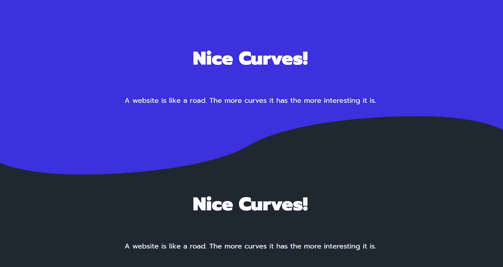
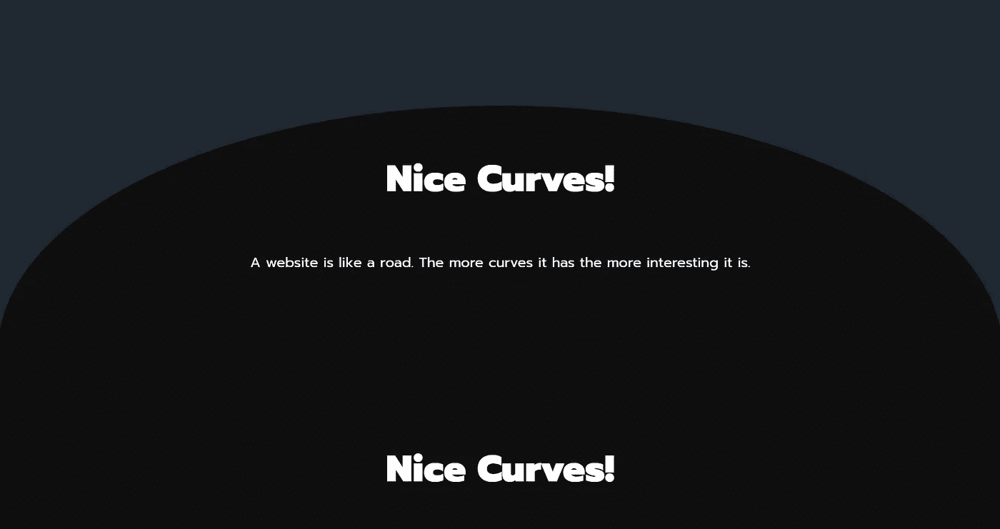
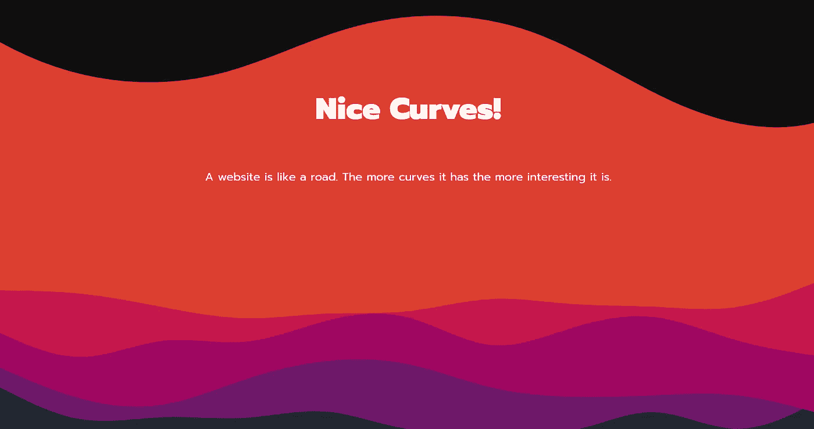
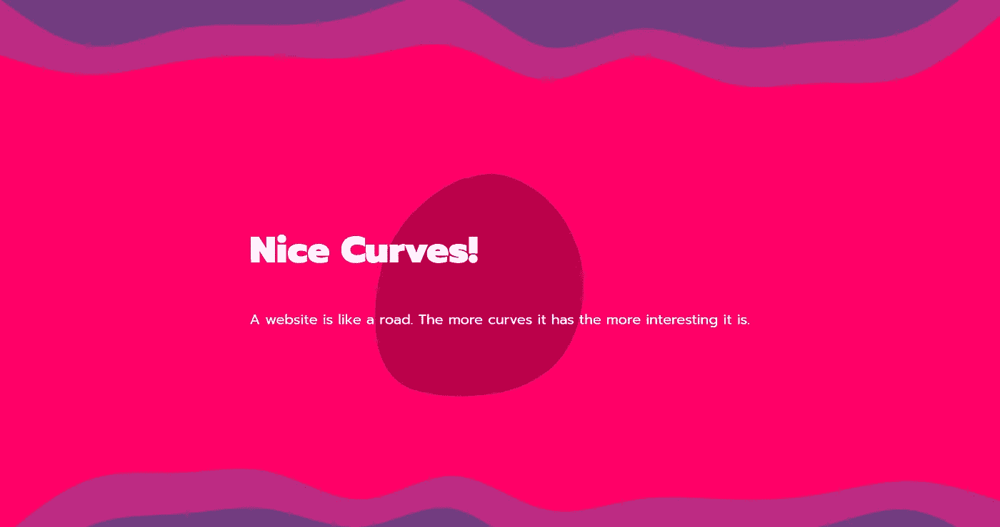

# CSS 和 SVG 的波浪背景

> 原文：<https://blog.devgenius.io/wavy-background-with-css-svg-4910821c2b87?source=collection_archive---------3----------------------->

波浪形背景在过去几年的设计中风靡一时。在这篇文章中，我将帮助你用 CSS 和 SVG 制作不同的波浪背景。

# 1) CSS 版本

## 波型



波型与两个椭圆伪元素重叠。很难做到完美的定位，但在大多数情况下，这已经足够了。

*index.html*

```
<section>
      <!-- content here -->
      <div class="curve"></div>
    </section>
```

*style.css*

```
section {
    position: relative;
    display: flex;
    flex-direction: column;
    align-items: center;
    min-height: 400px;
    padding-top: 100px;
    background: #3c31dd;
}.curve {
    position: absolute;
    height: 250px;
    width: 100**%**;
    bottom: 0;
    text-align: center;
}.curve::before {
    content: '';
    display: block;
    position: absolute;
    border-radius: 100**%** 50**%**;
    width: 55**%**;
    height: 100**%**;
    transform: translate(85**%**, 60**%**);
    background-color: hsl(216, 21**%**, 16**%**);
}.curve::after {
    content: '';
    display: block;
    position: absolute;
    border-radius: 100**%** 50**%**;
    width: 55**%**;
    height: 100**%**;
    background-color: #3c31dd;
    transform: translate(-4**%**, 40**%**);
    z-index: -1;
}
```

## 气泡图案



气泡图案创建了一个椭圆形状，在内容的顶部延伸。它只需要 CSS 来创建效果。

*index.html*

```
<section class="bubble">
      <!-- content here -->
    </section>
```

使用伪元素`**::after**`为内容设置一个椭圆形的边框半径。

*style.css*

```
.bubble::after {
    content: '';
    border-top-left-radius: 50**%** 100**%**;
    border-top-right-radius: 50**%** 100**%**;
    position: absolute;
    bottom: 0;
    z-index: -1;
    width: 100**%**;
    background-color: #0f0f10;
    height: 85**%**;
}
```

# 2) SVG 版本

## 分层波



向元素添加波形的最简单方法之一是使用 [**ShapeDriver**](https://www.shapedivider.app/) 工具。它允许你创建一个 wave 效果，生成一个 SVG 路径和需要的 CSS 代码来设计它。

要添加更复杂的分层波浪，您可以使用 [**Haikei** app](https://haikei.app/) 随机生成各种美丽的波浪、水滴和其他形状。您可以使用这些形状中的任何一个作为 CSS 元素的背景图像。确保图像的纵横比与从应用程序导出的 SVG 相匹配。

*style.css*

```
.spacer {
    aspect-ratio: 960/300;
    width: 100**%**;
    background-repeat: no-repeat;
    background-position: center;
    background-size: cover;
}

.layer1 {
    background-image: url('./your-image.svg');
}
```

## **动画斑点**



[**KUTE.js**](http://thednp.github.io/kute.js/svgTransform.html) 是一个 JavaScript 库，可以轻松制作 SVG 元素的动画，或将一个形状变形为另一个形状。下面的代码可以应用于内嵌 SVG 的路径。

*index.html*

```
<svg>
    <path id="blob1" />
    <path id="blob2" style="visibility: hidden" />
</svg>
```

*app.js*

```
const tween = KUTE.fromTo(
    '#blob1',
    { path: '#blob1' },
    { path: '#blob2' },
    { repeat: 999, duration: 3000, yoyo: true }
).start(); 
```

如果你喜欢这篇文章，分享给你的朋友和同事吧！