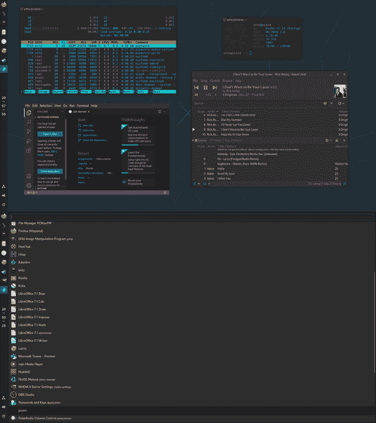

# 2022 年我在威兰和英伟达的经历

> 原文：<https://blog.devgenius.io/wayland-and-nvidia-in-2022-2f0407fb34f4?source=collection_archive---------0----------------------->

传统上，我们一直使用 XOrg 或 X11 作为 Linux 中的标准显示服务器。然而，这是一个老软件，在一定程度上是为更老的时代的需要而优化的，可以认为是臃肿的，并有一些内在的安全缺陷，如键盘记录漏洞。这就是韦兰的用武之地。Wayland 是另一个显示协议，据我所知，它的目标是比 X11 更现代、更紧凑、更安全。

## 一些历史

长期以来，与 AMD 或英特尔相比，英伟达在 Wayland 兼容性方面远远落后。虽然英特尔和 AMD 的开源驱动程序已经实现了对 GBM API 的支持，这是一种更标准的方法，但 Nvidia 选择了较少使用的 EGLStreams API。由于这些驱动程序是专有的，社区也不能实现这些功能。有一个新的驱动程序，这是一个替代的开源 Nvidia 驱动程序，但我稍后也会讨论它。

唯一能正确支持 EGLStreams 的桌面或排版软件是 GNOME 和 KDE。wlroots 还有一个兼容 EGLStreams 的修改，名为 wlroots-eglstreams，它允许更多的合成器(合成器相当于一个窗口管理器/桌面)，但我不知道它的效果如何。

不过，Nvidia 在最近一段时间改善了它的支持。驱动程序版本 470 为 XWayland 带来了硬件加速，这是一个在 Wayland 上运行 X11 软件的兼容层。由于这种支持，XWayland 现在可以提供不错的性能。

驱动程序 495 最终带来了对更常见的 GBM API 的支持。这也是我开始体验韦兰的地方。

# **我在韦兰的经历**

我的显卡是 RTX 2070 超级版，在我试用 Linux 之前很久就有了。我第一次尝试 Wayland 是在我使用 Gentoo 的时候，当时 495 驱动程序在 Portage 的仓库中发布成 beta 版后不久，因为我觉得它在这一点上可能是有效的。我试过 Sway，因为那是一个非常有名的韦兰排字工。

排字工人在工作，但是有它的注意事项。首先，我必须确保变量 WLR _ 否 _ 硬件 _ 光标等于 1，否则光标将不可见。其次，我不得不用他们不支持的 GPU 启动标志废话来启动 Sway。

当它运行时，它有一些问题。也就是说，我无法在 Wayland 下运行任何软件。我可以运行 XWayland 软件，但不是本地的。我没有太多的麻烦去排除故障，因为它是一个测试版的驱动程序，我不想在那个时候投入时间。因此我去了 Xorg 几个月。

## 回到韦兰

大约两周前，我想我可以再试试韦兰。我现在运行 NixOS，但这应该不会对韦兰产生太大影响。我决定从摇摆开始。我按照 NixOS Wiki 对 Sway 的说明，用和以前一样的额外步骤让它运行起来。

然而，它再次启动良好，但体验仍然不是很好。这一次软件可以运行了，这无疑是一个进步。然而，有很多图形问题，比如到处闪烁。我在配置中将输出调整到我屏幕的刷新率(240Hz ),但一点帮助也没有。

因此，我放弃了 Sway，并决定尝试 GNOME，因为 GNOME 已经被支持了很长时间。对于像我这样的独立 WM 人员来说，这可能很奇怪，但是很有可能去掉 GNOME，所以它本身是可行的。

我没有闪烁问题，应用程序运行，但有一个警告:我从来没有能够用我的 Nvidia 卡在 Wayland 上运行 OBS。

我定制了 GNOME，让它对我更有用。只有一个栏，但没有应用程序菜单或活动视图的东西。

以下是我拥有的桌面和 sirula 应用程序菜单配置的截图:

## GNOME 的优点是什么

现在，它的配置已经有些合适了，大多数情况下，它都相当不错。用户界面有很好的快捷方式等等。没有一个合适的 WM 好，但一点也不差。

使用超级键和 wasd 键，我可以在屏幕上定位窗口。我可以用 Super 和 Enter 启动 kitty(一个终端模拟器),用 Super 和 Escape 启动应用程序菜单。还有很多，但是捷径很管用。

如前所述，不存在图形问题。屏幕刷新率之类的也没有给我任何问题。

在软件方面，我确实不得不使用 VSCodium 之类的东西，因为它需要一些额外的启动标志才能在 Wayland 下运行，但没什么太糟糕的。

GNOME 有什么不好的地方

仍然有一些问题被证明是相当重要的。具体来说，火狐。这东西真的会给我带来麻烦。我总是不得不设置很多东西来让它工作，即使是远程接受，但在 X11 下，在初始设置过程之后它总是可用的。在这里，没有那么多。

基本的网络浏览功能正常，但一个关键功能却不行:新窗口。如果我尝试运行 Firefox 的多个窗口，它通常会死机，过一会儿就会关闭。同样，前一个窗口将被冻结，直到新窗口关闭。不过，有时新窗口实际上会工作。

我遇到的另一个问题是，我为工具条、dash to panel 和 just perfection 使用的扩展有某种冲突，每当我重新构建我的 NixOS 配置并重新登录到 DE 时，底部的实用程序图标会被水平放置。这很烦人，所以我禁用了除了第一卷以外的所有图标，因为出于某种原因我不能自己关闭它。

# 那怎么办呢？

我决定再给其他排字工人一次机会。

## Wayfire

首先，我尝试了 Wayfire。你猜怎么着？没有火狐新窗口的问题。然而，闪烁和东西还在那里。再次没有配置，我可以解决它。我尝试了 Wayfire 配置中的所有选项，刷新率从 60 到 240 不等，但都没有用。

所以这也不可用。其他排字工怎么样？

## 河

我偶尔在 unixporn reddit 上看到过这个。又是一个瓷砖排字工。然而，它没有正常运行。它启动了，但只给了我一个空白的蓝屏。不得不在另一个 TTY 杀死它。配置输出并没有改变什么。

## 不真实的

这个不仅仅是一个空白的屏幕。它给了我一个空白的屏幕，但它也锁定了我的键盘，所以我甚至不能去另一个 TTY，因此必须重新启动。

## 光

像纸板一样，但屏幕上有壁纸而不是空白颜色。

## DWL

另一个空白屏幕，但没有锁定我的键盘。没什么好说的了。

## KDE

我选择这个作为最后的尝试。它还支持 EGLStreams，所以它不应该有 wlroots 合成器的图形问题。虽然它没有这些问题，但它有其他问题。

在 Nvidia 卡上，KDE 对我来说从来都不是一次好的经历。在 X11 下，它有口吃的问题。但这和韦兰版比起来不算什么。在韦兰模式下，由于某种原因，它的运行速度可能只有正常速度的 1/5。一切都极其缓慢，而且断断续续，无法用于任何扩展。禁用动画没有任何帮助。

# 新近到达的

新的是 Nvidia 卡的第三方开源驱动程序。然而，它们对现代 Nvidia 卡并不适用。我的卡被限制在其最低时钟速度，所以它比股票慢得多。

虽然我对表演很满意，但还有另一个问题。任何高于 60 赫兹的频率都会导致我屏幕的上半部分变黑。我找不到任何解决办法。

# 结论

GNOME 一点也不差。如果它没有引起 Firefox 的问题，我会过得很好。

就 GBM 和 wlroots 支持而言，我的经验是它还没有达到被正确使用的程度。比以前好，但还不够好。

于是我回到了 X11。

# 与 AMD 相比如何

我也有一台运行 AMD APU(锐龙 5 4500G)的笔记本电脑，所以我一直在和韦兰捣乱。我今天甚至卖掉了我的 Nvidia 卡，因为它现在对我的需求来说太大了，所以我买了一个 RX580，这样我的桌面可以在我得到它的时候得到更好的支持。

至于笔记本电脑，它现在是我唯一的电脑，因为我现在的台式机没有 GPU。我选择的排字工人是 Wayfire。我还对它进行了配置，让它做我想做的事情。我可能会改变合成器，虽然，因为我只使用这一个作为第一选择，由于容易配置。

坦率地说，所有的 Nvidia 问题都消失了。没有图形闪烁或任何东西。我现在甚至可以运行 OBS 了，虽然我还没有弄清楚如何让屏幕截图工作，但我最终会弄清楚的。