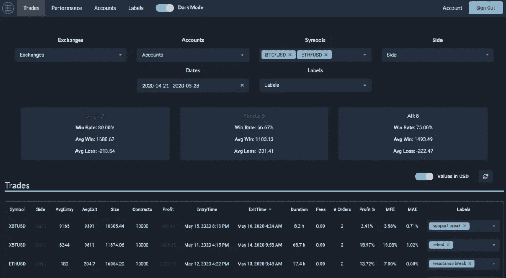
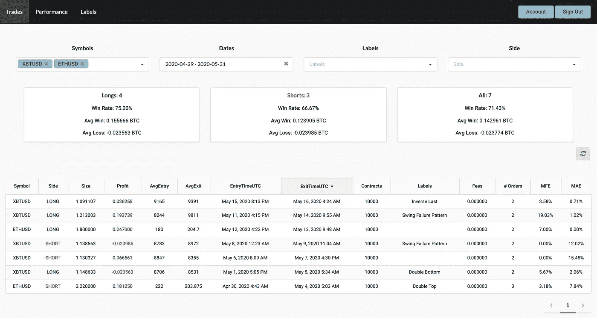
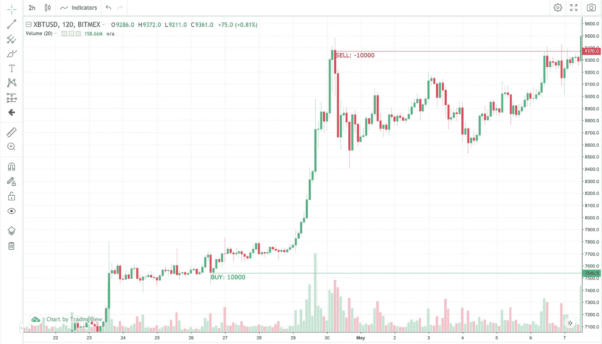
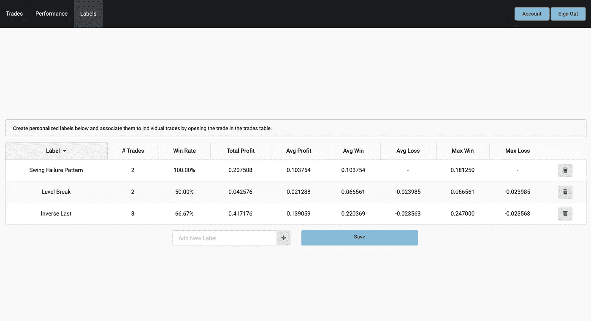
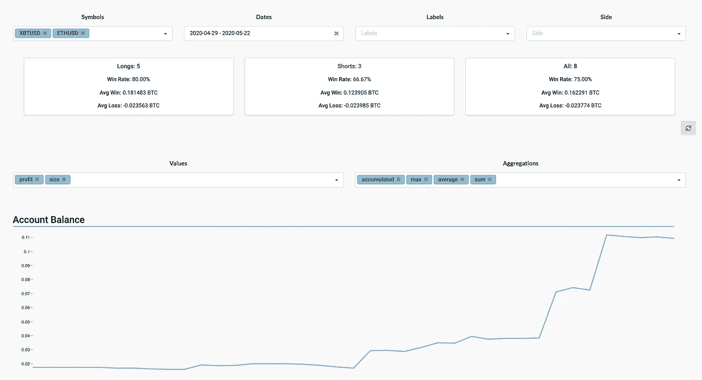
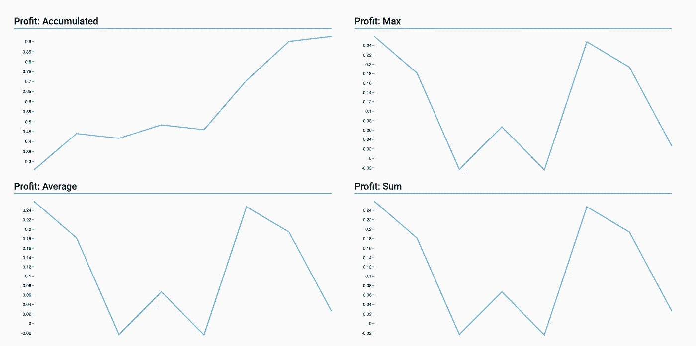

# 我们为 BitMEX 开发了自动化交易日志

> 原文：<https://blog.devgenius.io/we-developed-an-automated-trading-journal-for-bitmex-c2c9d141c775?source=collection_archive---------7----------------------->

你怎么想呢?

来源:edgesheet.com

如果你交易，你可能听说过交易日志。交易日志可以记录你的交易，帮助你找到优势。

你的交易主要反映了两件事:你看待市场的方式和你对市场的情绪反应。这就是为什么写日志能让你的交易系统清晰——它能让你发现市场和你自己的模式。

它还能帮助你想出策略，并评估它们在每个市场的表现。一旦你找到了自己的优势，日记也可以帮助你通过调整进场、止损或目标来调整和改善它。

记录你的交易可能是衡量你作为交易者发展的最简单有效的方法。

我和我的朋友在 BitMEX 上交易。我们开始在电子表格上手动记录日志。这很费时间，但很有效。直到我们开始忘记注册我们的一些交易…

最终，我们意识到值得在这方面投入一些时间，创造一种更好的方法来记录交易。因此，我们决定使用 BitMEX 的 REST API，创建一个完全自动化的交易日志。

## 我们称之为 [EdgeSheet](http://www.edgesheet.com) ，它非常棒。

我们使用 BitMEX 的只读 API 密钥自动获取我们的交易历史。通过累计每个符号的买入和卖出数量，订单被分组为交易。我们把交易整齐地显示在一个有一些过滤选项的表格上。

来源:[https://www.edgesheet.com](http://www.edgesheet.com/)

对于图表，我们使用了交易视图的 API，并添加了进场和出场标记，这使得回忆每笔交易背后的逻辑以及交易是如何进行的更加容易。我们确保这个功能也适用于过期的符号，因为这是我们最喜欢的杂志之一。

从交易表中点击任何交易，我们都可以在图表上看到它。

来源:[https://www.edgesheet.com](http://www.edgesheet.com/)

我们希望通过模式轻松地搜索和过滤交易，所以我们实现了一种为交易分配标签的方法。当我们想要评估每个策略在全球水平上的表现时，或者对于单独的符号，甚至对于多头和空头，这是很方便的。

资料来源:https://www.edgesheet.com

为了更好地进行概述，我们添加了一个性能仪表板，其中包含我们在交易表和帐户余额演变中使用的所有相同过滤器。我们还包括了一些值和聚合类型，它们可以组合在一起显示变量的平均值、最小值、最大值和累计量，如利润、交易次数、费用、MAE 和 MFE。这些量显示为等距“时间段”的函数。

来源:https://www.edgesheet.com

来源:https://www.edgesheet.com

我们喜欢使用我们的日志，所以我们决定以每月订阅费的方式公开它，这样我们可以保持我们的系统和大脑运行:)

**如果你喜欢，试试我们的免费试用版，分享一下，如果有任何问题，请联系我们。我们有更多的想法，我们渴望得到反馈！**

F 关注我们的 [**Twitter**](https://twitter.com/EdgeSheet) 和[**insta gram**](https://www.instagram.com/edgesheet/)**@ edge sheet**了解更多信息和功能更新。