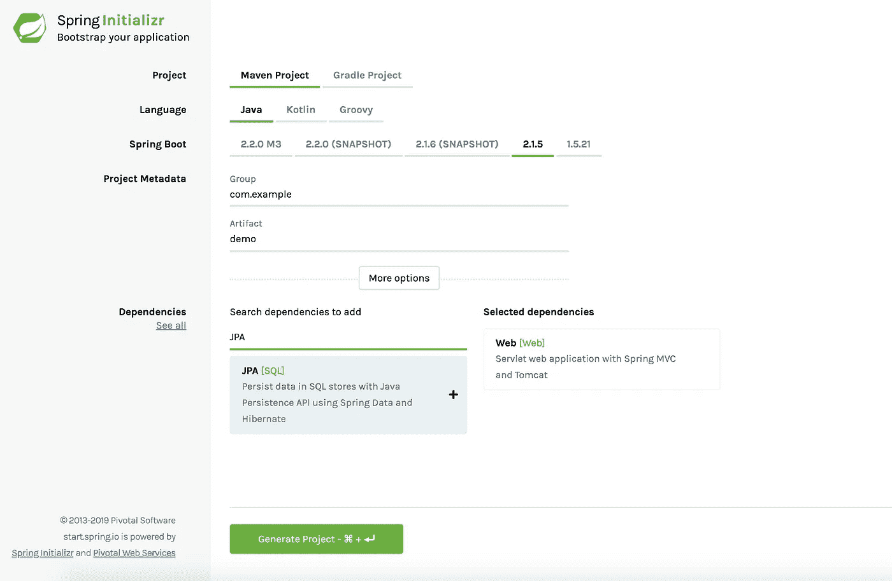

# 我们不再这样开发软件了！

> 原文：<https://blog.devgenius.io/we-dont-develop-software-this-way-anymore-c8aadf7d14a7?source=collection_archive---------7----------------------->


我们今天开发软件的方式与本世纪初开发软件的方式不同。例如，就 Java 开发而言，那时，我们非常习惯于以一种特定的方式创建 Java 应用程序。

在第一阶段，我们会使用一个像 Maven 这样的依赖管理系统来帮助我们管理我们的应用程序所依赖的外部库，这些库也是我们的构建工具。

我们可以使用 core Java(只是 Java，即 JavaSE)进行开发，但通常我们最终会使用像 Spring 或 JavaEE 这样的应用程序框架，因为您的应用程序需要像“企业”应用程序一样。

总之，我们将所需的 Spring 依赖项放入 pom.xml 文件中。如下图所示:

你也可以混合一些“JavaEE”特有的特性，这样你也可以包含那些依赖项。(混合 Spring 和 JavaEE 是很常见的)

然后，为了让我们的企业应用程序“生产就绪”,我们需要的几样东西之一是某种形式的日志记录作为起点。因此，我们为应用程序设置了日志记录。

我们通常需要根据您的日志记录要求来配置它:

例如

好了，现在可以上线了。我们需要将它部署到我们的环境服务器上。它最终会投入生产，但首先它需要先进入测试服务器进行测试。

如果我们正在做 CI(这总是一个好主意)，您将让您的构建服务器构建您的工件——jar、war、ear 或 sar 文件。构建作业会将构建好工件推到像 Nexus 这样的集中式工件存储库中。如今，像 JFrog 的 Artifactory 这样的其他工具将是更常见的选择，甚至可以使用云提供商提供的工件库(如果您将应用程序托管在云上)，如 AWS 的 CodeArtifact。

您运行您的部署步骤(无论是手动进入 linux 裸机服务器或虚拟机并执行 unix 命令，通过部署服务工具如 RunDeck，还是使用配置管理工具如 Puppet、Chef、Salt 或目前更流行和更现代的选择— Ansible)来自动将工件部署到环境中的服务器。

您的应用程序通常运行在成熟的企业应用服务器上，例如:Red Hat 的 **JBoss(现在是 wildly)**、IBM 的 **WebSphere** 、Oracle 的 **WebLogic、**或其他不太知名的开源应用服务器( **Geronimo、TomEE、Resin、JOnAS** )

或者…

如果你的应用完全基于网络，也就是说，只使用 JavaEE 的网络特性(Servlets，JSP，JSTL，JAX-RS，JAX-WS 等等),你的应用可以存在于一个网络服务器容器中。).这些通常也被称为 Servlet 容器。例子包括:**阿帕奇的 Tomcat，Jetty，under flow**，还有更多…

## 快进 20 年。

我们很少再构建“应用程序”了。相反，我们构建微服务(在 Java 世界中通常使用 Spring Boot ),它作为独立和隔离的 web 服务，公开一组 RESTful(或非 RESTful)端点供其他客户端使用(通常是 JSON 数据格式)。

要创建一个 Spring Boot 项目，您可以通过访问 Spring Initializer 项目生成器来轻松设置它:

https://start.spring.io/

您可以填写如下所示的表格，然后点击您想要的依赖项。您可以选择是使用 Java、Kotlin 还是 Groovy 应用程序，还可以选择使用哪种构建工具(Maven 或 Gradle)。



就是这样！单击屏幕底部的绿色大按钮“Generate Project ”(生成项目)后，就会为您创建一个示例模板 Spring Boot 项目。

您不再在应用服务器/web 容器中运行您的应用程序，而是可能在容器中运行以进行部署。Docker 是显而易见的选择。为此，您可以在项目文件夹的根目录中放入一个`Dockerfile`。一个非常简单的例子`Dockerfile`如下所示:

```
FROM openjdk:8 LABEL maintainer=Colin ButEXPOSE 8090 # Install artifactVOLUME /tmpADD user-service-1.0-SNAPSHOT-with-dependencies.jar user-service.jarRUN sh -c 'touch /user-service.jar'ENTRYPOINT ["java","-jar","/user-service.jar"]
```

# 摘要

本世纪初，我们开发了现在所谓的“单片”应用程序(作为一个大的单一代码库),并可能连接到关系数据库进行数据管理。我们要么使用原始 JDBC，要么使用 ORM 解决方案进行数据访问。为了提高性能，我们通常在里面的某个地方放一个缓存机制。因为我们在制作“应用程序”，所以我们通常使用服务器端页面技术(JSP)进行服务器端页面渲染，它提供了一个“视图”(html)。

但是现在，我们不是为您的代码库创建一个工件，而是构建一个容器映像(Docker)。我们没有部署到大型应用服务器/Web 服务器容器上，而是从这些 Docker 映像运行容器，并让容器编排框架(Kubernetes)为我们管理这些容器。

## 最后的想法

因为我们这些天的发展与过去完全不同，我们真的不能用和那时一样的心态和思维方式。我们需要以“微服务方式”开发微服务。如果你想开发微服务(这是开发软件的现代方式…)，你不能真的使用和你构建‘单片’应用程序时一样的方法。事情肯定不一样了！首先，我们正在使用的技术是完全不同的。

一个更具体的例子是；构建 Docker 容器映像并不等同于创建 jar 或 war 工件。

您的工件代表可以部署到服务器上的代码或应用程序本身，而容器映像是创建您的应用程序需要运行的一切的蓝图，即您的应用程序+与之配套的整个基础架构(运行时+二进制文件+操作系统)。

总而言之，以上论证了**两种不可比拟的哲学**因此，开发每一种方式都需要完全不同的方式/方法。

世界在变化和移动..软件也需要移动

行业期待下一次革命！

## 哦，还有最后一个外卖

当从 JBoss/Tomcat 迁移到 Docker/Kubernetes 时，我不建议进行“对等”转换。

运行在 JBoss/Tomcat 上的应用和运行在 Docker/Kubernetes 内部的应用并不是直接等价的。

所以…

您将需要您的旧的单片遗留应用程序来适应新的生活方式，这些生活方式需要驻留在 Kubernetes pod 中运行的 Docker 容器中…