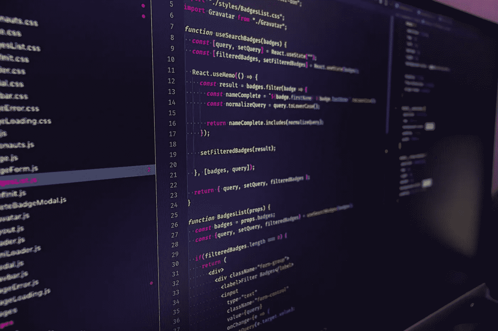

# 我们不必为哪个框架最好而争论

> 原文：<https://blog.devgenius.io/we-dont-have-to-fight-over-which-framework-is-best-9eae79d6abe9?source=collection_archive---------31----------------------->

菲利贝托·桑蒂兰在 [Unsplash](https://unsplash.com/s/photos/react?utm_source=unsplash&utm_medium=referral&utm_content=creditCopyText) 上拍摄的照片

## 框架只需要互相学习

我最近发现了一个新的前端框架，叫做[曲柄](https://crank.js.org/)。该框架诞生于作者对最近 React APIs 复杂性的幻灭。与 React 类似，Crank 使用 JSX 并遵循功能组件模型。然而，与 React 不同，它拒绝 React 的坚定信念，即渲染应该是“纯粹的”。有了它，Crank 能够利用标准的 JavaScript 模式，如异步函数和生成器，来支持复杂的呈现场景，如呈现有状态组件或异步呈现。也就是说，仅仅通过利用原生 JavaScript 行为，您就不再需要复杂的专用 API，如 React Hooks 或 React suspension。它甚至比 React 更“只是 JavaScript”。

然而，在一篇宣布该框架的博客文章中，作者带着明显的歉意，理解在疯狂且有时势不可挡的前端 JavaScript 世界中引入另一个框架的疲劳。但是让我震惊的是，整个开源项目的作者不得不对他们试图带给这个领域的创新感到抱歉。这是为什么呢？

我们作为开发人员，尤其是在快速发展的前端 JavaScript 世界中，紧紧抓住我们的框架。我们不惜一切代价支持自己的框架，捍卫它，摧毁其他框架，并强调为什么我们的决定是每个其他开发人员都应该做出的。我已经看到了足够多的“react >>> angular”或“vue >>> react”评论和推文，足以让我度过一生。很明显，人们有一种为我们花费多年时间构建的框架辩护的自然倾向。自动拒绝对该技能的新威胁是可以理解的。但是，这也是短视的。

今天存在的每一个框架都是因为之前的框架和现在与之竞争的框架而存在的。React 可能引入了创新和变革性的概念，如虚拟 DOM 和单向数据流，但框架领域的竞争仍然一如既往地激烈。其他框架采用了这些概念，发展并把它们与自己的创新结合在一起。Vue 在精神上与 React 相似，关键是它的生态系统采用了不同的方法，比 React 更适合初学者的“内置电池”体验。早在 2015 年，Ember 就为其框架带来了大量“受 React 启发的编程模型改进”，将这些变化与出色的 CLI 体验结合在一起，这至少部分启发了 create-react-app 的创建。create-react-app 是一个 CLI 工具，它解决了 react 难以“开始”的长期批评。创新是双向的，有时会绕了一圈。

这只是对创新如何在整个空间中共享的皮毛。如果没有围绕它的其他框架，您最喜欢的框架就不会存在。我不是说我们不能建设性地批评其他项目和框架，事实上，这就是框架如何能够改进彼此的想法。这正是 Crank 试图做的。然而，对你使用的框架采取精英主义的态度是有害的，也是不必要的。想用什么就用什么，但要让其他人愉快地做同样的事情。

我不知道 Crank 会走多远，也不知道它是否会打破过去的小众框架。但是它提出的迷人的想法意味着无论它做什么，整个生态系统和反应都会因此而变得更好。这也适用于今天的其他主要框架。有他们在总比没有好。仅仅因为你不使用其他框架就放弃它们是适得其反的。我们不应该营造一种环境，让作者不得不对他们提出的想法感到抱歉。最终，框架不会赢，思想会赢。