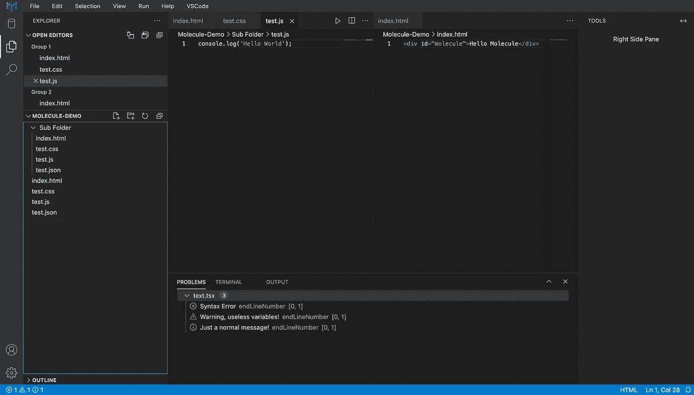
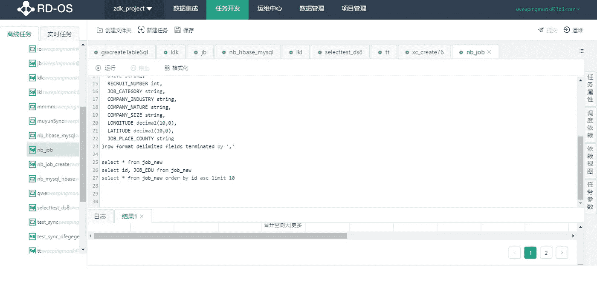
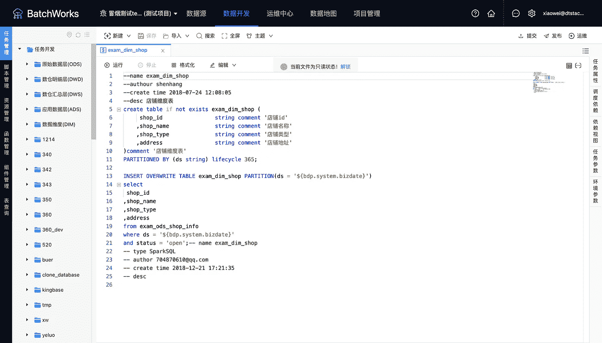
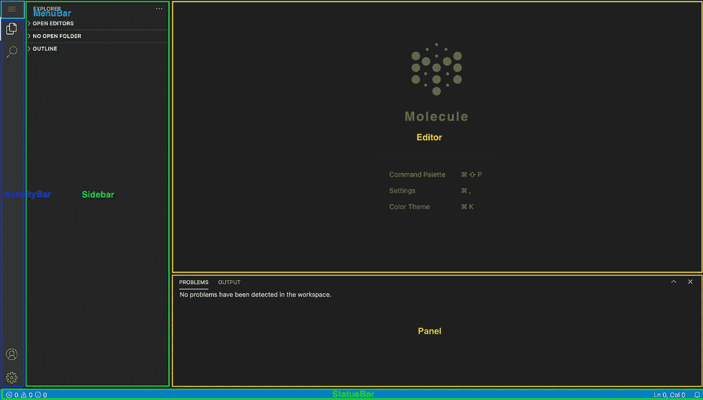

# 我们开放了一个轻量级的 Web IDE UI 框架！

> 原文：<https://blog.devgenius.io/we-opened-a-lightweight-web-ide-ui-framework-4acda45353db?source=collection_archive---------7----------------------->

**分子**

> *一个轻量级的 Web IDE UI 框架*

# 介绍

[分子](https://github.com/DTStack/molecule)是用 React.js 构建的轻量级 Web IDE UI 框架，灵感来自 VS 代码。我们设计了类似于 VS 代码的扩展 API，帮助开发者更高效地开发 Web IDE 系统。在 Monaco 编辑器中，我们提供了 Keybinding 和 QuickAccess 的 extract APIs。

由于扩展机制，开发人员可以将业务代码从 IDE UI 中分离出来，但为了专注于业务迭代，IDE UI 的一部分几乎转移到了孤立的迭代中。这是一个更好的方法，使产品可以保持移动。

# 动机

在 [DTSTack](https://www.dtstack.com/dtinsight/) 中，我们有许多 Web 应用，比如批处理/流任务开发、分析、数据源管理、算法开发。开发人员需要在我们的平台上编码、调试，所以 IDE 是我们产品中的常见场景。

*早期 Web IDE 产品版本*

这个截图展示了 IDE 的早期版本，这个产品还很简单。IDE UI 基于 React.js、Ant Design 和 Codemirror 等技术。此外，由于 IDE Workbench 应用于我们的多个产品，我们必须抽象出一个简单的 IDE UI React 组件来与其他产品共享。

*当前 Web IDE 产品版本*

随着业务的增长和产品的迭代，Workbench 中的功能越来越复杂。众所周知，交互和视觉的产品每年都在升级，但早期的前端架构太胖，可扩展性差，不能支持新的功能和设计。UI 设计师总是很困惑为什么升级前端的成本这么高。

2019 年，我们研究了 [Cloud9 IDE](https://github.com/c9) 、 [VS Code](https://github.com/microsoft/vscode) 、 [Eclipse 忒伊亚](https://github.com/eclipse-theia/theia)解决方案。这些产品具有良好的 UI 抽象、可扩展性和 IDE 的全部功能。但是，这么多的功能对我们的产品来说是没有用的，为我们的团队定制太难了。另一个原因是我们的 React.js 代码也很难与这些解决方案集成。

因此，我们想要一个解决方案，它具有良好的 UI 抽象，易于定制的 UI，颜色主题，对 React.js 应用程序友好。最后，VS 代码启发了我们。该小组试图制造出分子。

# 核心功能

分子用 Typescript 编写，应用了 React.js、Monaco Editor 等技术，主要特点是:

*   内置 VS 代码工作台 UI
*   与 VS 代码颜色主题兼容
*   通过 React 组件轻松定制工作台
*   内置摩纳哥-编辑器命令调色板，按键绑定功能
*   支持 i18n，内置 zhCN 和英语
*   内置设置，支持通过扩展进行编辑和扩展
*   内置的基本浏览器，搜索组件和支持通过扩展扩展
*   打字稿准备好了

工作台零件

这张图是 Molecule 默认的 IDE 工作台，基本上像 Workbench、ColorTheme、QuickAccess、Keybinding、i18n、Settings 等等功能都很容易通过扩展 API 进行扩展。

# Molecule 与其他 Web IDE 解决方案有什么区别？

*   React.js 应用友好
*   基于 React.js 组件和更强大的 UI 定制能力
*   兼容 VS 代码这么多 ColorTheme 扩展
*   只关注 UI，前端开发者很容易理解。
*   如果你愿意，可以支持扩展文件系统、版本控制、LSP、DAP、终端等特性

# 怎么用？

请阅读[快速入门](https://dtstack.github.io/molecule/docs/quick-start)。

# 将来的

Molecule 目前只发布了一个测试版。API 不够稳定。从 VS 代码中引用的一些概念是过度设计的。我们将使扩展 API 更加强大。不断优化 UI 和 ColorTheme 的细节，开发更丰富的布局系统。

# 最后

希望我们的经验对你有所帮助！

*   GitHub:【https://github.com/DTStack/molecule 
*   网址:【https://dtstack.github.io/molecule/en/ 
*   预告:[https://dtstack.github.io/molecule-examples/#/](https://dtstack.github.io/molecule-examples/#/)