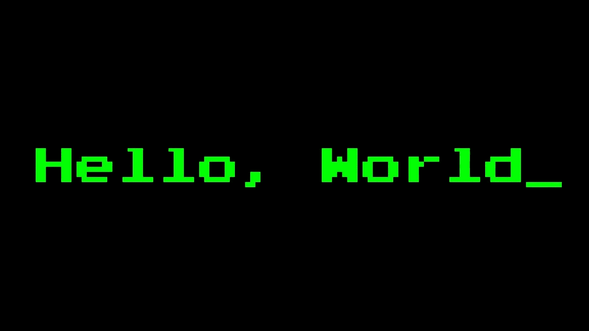

# 我们应该永远摆脱 HelloWorld💩

> 原文：<https://blog.devgenius.io/we-should-get-rid-of-helloworld-forever-44b3f5b87bb2?source=collection_archive---------3----------------------->

## 过去 30 年来，我读过的每一篇教程都是以臭名昭著的“Hello World”为例开始的。这可能是我们写蹩脚软件的原因之一。



[“你好世界](https://en.wikipedia.org/wiki/%22Hello,_World!%22_program)”是我们第一个用各种语言制作的节目。

我们可以通过计算产生预期输出所需的行数来衡量语言的复杂性。

我们还可以计时一个*新手*要花多少时间才能想出解决方案(这也被称为*时间到你好世界】(TTHW)* 。

这两个指标与生产率无关。

许多网站用多种语言编译不同的 *Hello World* 程序。

[](http://helloworldcollection.de/) [## Hello World 系列

### 互联网上最大的 Hello World 程序集合。

helloworldcollection.de](http://helloworldcollection.de/) 

# 问题

这个 *Hello Word* 的例子在开发人员开始编程的第一步时就引入了很多问题。

1.  它在许多语言中使用 [*全局变量*](https://en.wikipedia.org/wiki/Global_variable) 。全局函数是一种代码味道。在他们的第一个例子中把它们教给新来的人是矛盾的。
2.  *Hello World* 产量[副作用](https://en.wikipedia.org/wiki/Global_variable)(对控制台、文件系统、打印机等。).
3.  我们编写代码，但我们无法测试它是否工作。我们可以手动检查输出，但我们的软件不能断言我们的结果是正确的。
4.  如果我们的“hello world ”( T21)今天有效，我们不能保证它明天还会继续有效。

[](https://medium.com/dev-genius/code-smell-17-global-functions-d32b8796d284) [## 代码味道 17 —全局函数

### 受到面向对象编程的阻碍，许多混合语言支持它。开发者滥用它们。

medium.com](https://medium.com/dev-genius/code-smell-17-global-functions-d32b8796d284) 

# 解决方案

所有开发人员都应该从以下几点开始:

```
function testFalse()
{
    Assert(1==2)
}
```

# 优势

1.  我们从一个失败的测试开始。这是根据*测试驱动开发*技术开始开发软件的第一步。
2.  我们用开发人员的第一个指令向他们介绍了一个[持续集成/持续开发](https://en.wikipedia.org/wiki/CI/CD)管道。
3.  我们不使用全局变量或副作用。
4.  我们展示了早期测试的重要性。
5.  我们强调从第一秒开始就有工作代码和自动化测试是多么重要。

[](https://medium.com/dev-genius/how-to-squeeze-test-driven-development-on-legacy-systems-3e66625c4fb1) [## 如何在遗留系统上挤压测试驱动开发

### 我们都喜欢 T.D.D .我们知道它的好处，我们已经阅读了一千篇关于如何使用它来构建系统的教程…

medium.com](https://medium.com/dev-genius/how-to-squeeze-test-driven-development-on-legacy-systems-3e66625c4fb1) 

# 结论

我们需要停止把 HelloWord 作为一门语言的第一句话。

下次遇到新的花式语言，请从破题开始。

这一系列文章的部分目标是为软件设计的辩论和讨论提供空间。

[](https://mcsee.medium.com/object-design-checklist-47c63d351352) [## 目标设计清单

### 这是已经发表的软件设计文章的索引。

mcsee.medium.com](https://mcsee.medium.com/object-design-checklist-47c63d351352) 

这篇文章也是西班牙文[这里](https://mcsee.medium.com/deber%C3%ADamos-deshacernos-de-holamundo-para-siempre-1bdc8d4bb38c)。