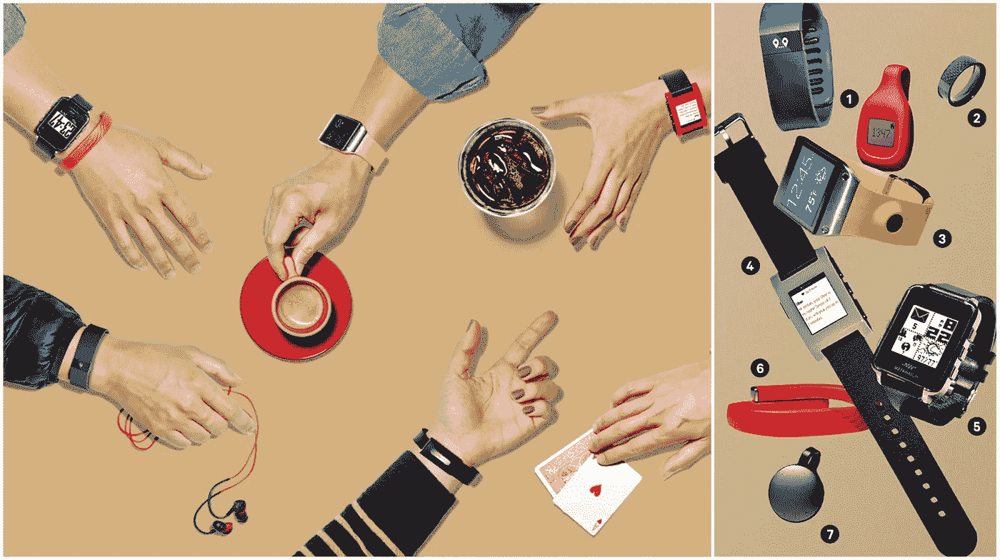
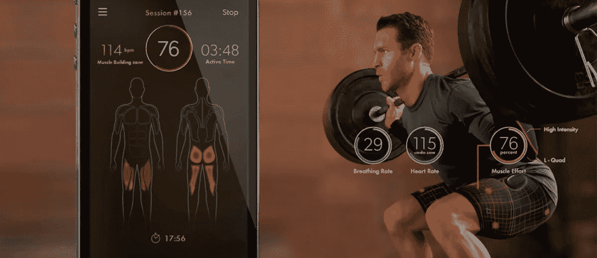
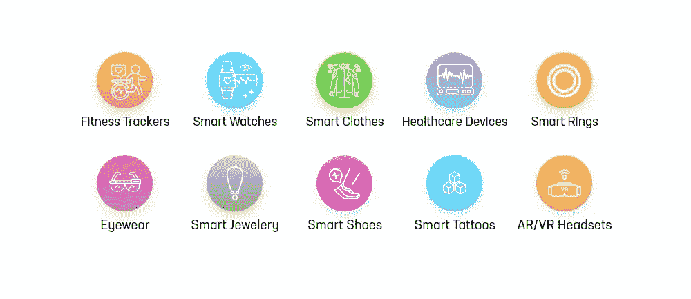
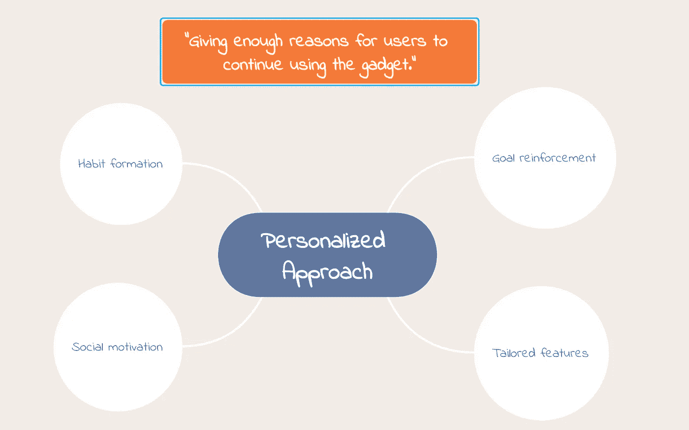

# 可穿戴技术，走向何方？

> 原文：<https://blog.devgenius.io/wearable-technology-where-is-it-heading-7f7a9236ae4f?source=collection_archive---------3----------------------->

可穿戴设备已经在科技领域创造了一种趋势，并且变得越来越受欢迎。随着技术的发展，这种趋势只会越来越明显。

来源:Pebble/pinterest

可穿戴技术已经走过了漫长的道路。你知道第一个可穿戴技术可以追溯到 13 世纪眼镜发明的时候吗？还是那句话，取决于你想怎么称呼技术。

然而，可穿戴技术在蓝牙耳机于 2002 年首次推出时获得了主流普及，随后 Fitbit 和谷歌眼镜等健身追踪器因可穿戴技术而受到欢迎。

> 后来，2014 年被称为“可穿戴技术年”

与过去不同，所有这些健身追踪器不仅仅是计算步数和卡路里。像 Apple Watch 这样的设备还可以跟踪癫痫发作，可以给你准确的心电图，并在紧急情况下自动拨打 911，以及许多其他功能。

可穿戴技术不再仅仅局限于健身。现在已经跨行业传播了。像李维斯、阿索斯、Hexoskin Smart、Owlet Smart Sock 这样的公司已经开始从传统的布料制造行业向可穿戴技术行业进军。

来源:https://bustedwallet.com/athos-wearable-fitness-technology/

谷歌已经与李维斯合作了“提花”项目，以创造智能服装，为用户提供一种用日常穿着的面料控制小工具的方法。这些织物对精确的手势做出反应，让用户控制像打电话、浏览屏幕和更多功能这样的动作。类似的，三星的——汤米·席尔菲格的 HumanFit 公司也推出了带有太阳能电池的衣服，为设备充电。

来源:Bossa.mx

更多信息:【https://www.youtube.com/watch?v=OqimqTf6EP8】T2

**什么都可以归类为可穿戴技术？**

任何可作为附件佩戴的电子设备，可嵌入衣服或具有实际用途的免提装置中，由微处理器驱动，并通过互联网增强发送和接收数据的能力。

*举几个例子:*

目前市场上不同种类的可穿戴设备

目前可穿戴设备的采用率正在增长。然而，另一方面，客户在短时间内就失去了兴趣。在 Endeavor Partners 进行的一项调查中，估计至少有 30%的退货率，约 50%的用户在购买后的六个月内失去兴趣，这是当今可穿戴技术行业的最大挑战。重要因素包括入门级价位、外形尺寸和采集参数的准确性。

> 公司发现“正确”使用可穿戴设备是一项艰巨的任务。

不同的用户使用小工具进行各种活动；找到对人们真正有用和可取的共同点并不容易。

## 现在，可穿戴行业将走向何方？

我们无法准确预测，但是，这是我的看法。

**设计和体验:**

极致的设计和工程是可穿戴设备成功的最关键因素。它的设计和体验部分非常重要，因为它们在“用户便利性”方面起着至关重要的作用。这些将是许多公司未来的重点领域。

> “你可以拥有世界上最棒的产品，但如果它没有正确的设计美感，没有人会穿超过一周。”Metawatch 首席执行官。

**个性化:**

一旦设计和体验被分类，现在的焦点将是“给用户继续使用它们的理由”

理解用户是至关重要的；这些全天候佩戴在身上的物品，将它们设计成个性化是最重要的。公司将专注于改善这一方面，采取“个性化的可穿戴技术”

**无缝连接:**

能够整合几乎所有的东西。每家公司现在都在努力为其所有产品创建一个公共平台，使客户能够像移交功能一样顺利、轻松地将数据从一个设备转移到另一个设备。这是一件实质性的事情。

可穿戴设备似乎也在朝着身份认证的方向发展，作为一种手段，可以做一些事情，如打开家门，参加音乐会，甚至在商店买东西，而不必经过结账过程。

**高效准确:**

在过去的几年里，可穿戴技术有了很大的改进，并且做了很多开发，使其更具情境性和相关性。例如，心跳监测器现在可以与 GPS 和所有其他经典跟踪系统配合使用，以创建用户活动水平的更准确图像。

随着新技术的出现，公司将专注于创造足够多的“有效”功能，效率在技术上是有保证的。

可穿戴技术在未来还能变得更加复杂吗？你有什么看法？

来源:博客，科技网站。