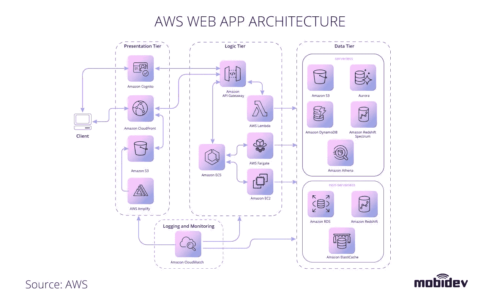

# Web 应用架构:2021 年选择合适的类型

> 原文：<https://blog.devgenius.io/web-application-architecture-choosing-the-right-type-in-2021-c418650331d4?source=collection_archive---------1----------------------->

Web 应用程序架构是一个高层结构，它决定了您的产品和业务的运营、执行和扩展方式。如今，在选择 web 应用程序架构的阶段，您经常会迷失在软件开发市场上的各种选项中。越多新的名字和趋势出现，就越难做出决定。同构、渐进式 web 应用、SPA 或 SSR——对你来说，最好的现代 Web 应用架构是什么，使用什么标准进行评估？在本文中，我们涵盖了 Web 可用的主要前端架构类型，并解释了它们实现的特点。

# 什么是 Web 应用程序 vs 网站

首先，我们来定义一个 web app。这是一个客户端-服务器应用程序，其中有一个浏览器(客户端)和一个 web 服务器。web 应用程序的逻辑分布在服务器和客户机之间，有一个信息交换通道，数据存储位于本地或云中。

网络应用是网站发展的一个阶段，事实上，它们有很多共同点。区分网站和 web 应用的因素是*交互性*、*集成*和*认证*。

换句话说，一个网站的可定制性、交互性和功能性越强，它就越接近于被称为网络应用*。*

# Web 开发中的三层架构

现代 web 应用程序仍然使用 [3 层架构](https://www.ibm.com/cloud/learn/three-tier-architecture)概念，将应用程序分为*表示层、应用层*和*数据层*。

在 3 层 web 应用程序架构中，每一层都运行在自己的基础设施上，可以由不同的团队并行开发。这种结构允许根据需要更新和扩展每一层，而不会影响其他层。

# Web 应用程序架构的类型

为了帮助您了解建议的产品方法是否真正符合您的业务需求，我们将根据我们认为对业务最重要的标准来评估现代 web 应用程序架构类型，即*性能、UI、SEO、可链接性*和*开发方面的实现速度*。

# 服务器端渲染(SSR)

谈到非常基本的 web 原则，我们通常指的是客户端-服务器架构。客户端向服务器请求内容，业务逻辑和数据库位于服务器上。使用简单的 JavaScript，静态网页将请求发送给服务(可能是 API)。该服务返回数据并向客户端显示一个 HTML 页面。

如果您的应用程序是服务器端呈现的，则从服务器获取内容并传递给浏览器以显示给用户。如果 HTML 页面呈现在服务器端，用户必须在浏览器从服务器获取页面之前导航到该页面。这意味着需要更多的时间向用户显示内容。为了缓存页面内容，Nginx 通常提供这种方案，Nginx 是一种 web 服务器，也可以用作邮件代理和负载平衡器。

**优点&缺点。HTML 在服务器上呈现的事实提供了许多优势，如 SEO、可链接性和即时首页加载。当浏览器中禁用 JS 时，服务器端渲染正在工作。由于代码是在服务器上处理的，所以对浏览器没有特别的要求，这使得我们可以立即发现错误。然而，SSR 不能处理繁重的服务器请求(重复的 HTML、CSS)，这导致当服务器加载或整个页面重新启动时呈现缓慢。但是这种基本 web 应用程序架构类型的真正致命弱点是与最终用户的交互较差，并且无法创建成熟的 UI。换句话说，如果你需要建立一个简单明了的网站，SSR 是一个简单而划算的方法。任何编程语言和后端都可以实现这种架构类型。**

# 静态站点生成(SSG)

静态站点生成的过程包括一个生成器，它自动对单个 HTML 页面进行编码，从模板中创建它们。选择静态站点生成，您会收到一个位于或任何服务器上的简单静态网站，其中包含一个已生成的 HTML 页面，可根据请求提供给用户。所以，当有人访问你的网站时，不需要每次都生成它——服务器只是通过一个 API 发送已经存在的数据。

**优点&缺点。**首先，这种方法仅适用于网站。除此之外，除非添加新的数据或组件，否则生成的网站页面的内容不会改变。这意味着一旦你想添加新的内容，你必须完全重新生成网站。这是严重限制其适用的商业案例的主要缺点之一。

不过，优势之一是通过 CDN 传送静态内容的速度很快。此外，在 SSG，所有服务器操作和数据库工作都是通过独立于网站的 API 实现的。这种选择很简单，因此实现起来完全负担得起。

简单的[静态站点生成器](https://jamstack.org/generators/)的例子有 Jekyll 和 Hugo，而 Gatsby 和 VuePress 适合实现更复杂的解决方案。

# 单页应用程序(SPA)

SPA 是一种在浏览器中工作的网络应用程序。当需要显示新数据时，不需要重新加载页面。这种网络应用架构类型在我们的日常生活中被广泛使用:脸书、Gmail、谷歌地图、GitHub 和推特——它们都是单页应用。

**赞成&反对。**与 SSR 和 SSG 不同，SPA 允许您构建交互式网络应用。它使用一个应用编程接口与服务器通信。这种架构有利于轻松扩展您的产品。此外，如果需要一个移动应用程序，API 开发也不需要额外的努力——移动应用程序可以使用与 Web 相同的 API。

SPA 允许在应用程序完全加载到浏览器中后进行快速渲染，并为最终用户创建高度响应的软件。与此同时，它“杀死”了你的搜索引擎优化，并限制了链接性，因为这种功能的实现需要额外的努力。其他的缺点包括第一次加载需要很长的时间，糟糕的路由和对过时浏览器的有限支持。作为一种相当昂贵的网络架构类型，SPA 非常适合为 B2C 用户创建响应性用户界面。

# 渐进式网络应用程序(PWA)

似乎在过去的几年里，每个人都在谈论 pwa。他们有什么特别之处？他们真的解决了网络应用开发的所有问题吗？

渐进式 web 应用程序架构使用了一个单一页面 web 应用程序的逻辑，然后在浏览器中运行一些服务。这意味着需要考虑的要点是，浏览器和操作系统都需要支持这套标准。

对最终用户来说，渐进式 web 应用程序实际上意味着当他们访问网站时，在启动屏幕(不是浏览器，而是操作系统的屏幕)上添加该应用程序的弹出窗口。如果用户接受，应用程序会自动添加到设备中。

[实现 PWA](https://developers.google.com/web/ilt/pwa/introduction-to-progressive-web-app-architectures) 允许您的 web 应用程序支持离线体验、后台同步和推送通知。这打开了对以前需要本机应用程序的功能的访问。同时，为您的项目选择 PWA 架构时，您需要记住大多数功能在 iOS 上是不可用的。分析每个具体的业务案例是值得的。

**赞成&反对。**视窗、安卓和 iOS 支持渐进式网络应用架构(但 iOS 禁用离线模式)。开发人员可以远程向 web 应用程序添加更新。PWA 是安全的，因为它使用 HTTPS。与此同时，最终用户甚至不用去游戏市场或应用商店就可以安装 PWA。这种架构类型的缺点之一是需要选择完全支持它的浏览器和操作系统。

> 像 PWA 这样的选择并不适合初创公司。如果业务稳定，并且产品负责人知道谁是他的最终用户，以及他们期望什么类型的体验(例如，他们中的大多数是 Android 用户)，那么效率会相当高。但是对渐进式网络应用程序的支持并不广泛。最近，Firefox(仍然[占美国市场 6.3%的份额](https://www.statista.com/statistics/272697/market-share-desktop-internet-browser-usa/))停止支持 PWA”，这证明这种 web 架构类型仍然不稳定。
> 
> 谢尔盖·里科夫，**MobiDev 的 JavaScript 团队负责人**

# **同形的**

**另一种现代的 web 应用架构叫做同构。这是一种可以在客户端和服务器端运行的 JavaScript 应用程序。首先，客户端加载一个 HTML，JavaScript 应用程序被上传到浏览器，然后应用程序开始像 SPA 一样运行。**

****

> **与 SPA 不同，这里第一次渲染发生在服务器上。换句话说，当用户键入 web app 地址时，服务器首先完全呈现 HTML (JS bundles)。这使得谷歌爬虫检查网页，并使你的网络应用搜索引擎优化工作。结果，一个企业得到了一个已经呈现的页面和一个 SPA web 应用的 JS 包。**
> 
> **谢尔盖·里科夫，MobiDev 的 JavaScript 团队负责人**

****优点&缺点。**与服务器端渲染不同，同构 web 架构提供了快速的数据更新、响应能力和多种 UI/UX 选项。当加载服务器时，它确保更快的渲染，因为处理的代码被传输到客户端。与客户端渲染不同，它允许在浏览器中即时显示，用户友好的路由，搜索引擎优化和可链接性。这种 web 应用程序架构类型的唯一缺点是只有 JavaScript 完全支持它。通常，这意味着可供选择的技术仅限于基于 JS 的框架和工具。**

# **微前端**

**在其他 web 应用程序设计原则中，我们区分了微前端，这是一种基于将前端应用程序分解为独立的“微应用程序”来协同工作的方法。对于最终用户来说，它们都位于一个页面上。**

****

**这种 web 应用程序架构类型是模块化的，这意味着页面和小部件是完全独立的应用程序。使用这种方法，开发和部署是并行进行的。但同时，结构让你的 app 变得复杂，造成代码重复。**

> **微前端架构的一个不可否认的好处是它的可扩展性。它非常适合企业客户，因为大规模软件部件的开发通常是在几个团队之间进行的。微服务出现在后台和前台，并且可以根据您的团队和云中运行的负载进行扩展。**
> 
> **安东·洛格维年科，**mobi dev 的 PHP 团队负责人****

# ****Node.js 和新的 Web 前端****

****这个概念最初是由 Nicholas C. Zakas 在 2013 年提出的，现在用于复杂的 web 解决方案。****

*****“将后端 UI 层从后端业务逻辑中分离出来在更大的 web 架构中是有意义的。为什么前端工程师要关心执行关键业务功能所必需的服务器端语言？为什么这个决定会泄露到后端 UI 层呢？前端的需求和后端的需求是根本不同的”，*这就是 Zakas 如何作为这种 web 应用开发类型的主要原则。****

****这种类型的 web 应用程序架构由基于 Node.js 的服务器和 UI 层组成。除此之外，业务逻辑服务器可以用任何语言编写(让我们以 PHP 为例)，并使用 API 与服务器通信。****

********

****事实上，新的 web 前端方法允许我们使用同构架构类型、SSR 或 SPA、用于移动设备的 API 和可链接性的所有优势。与同构的 web 应用程序不同，对语言或业务逻辑平台没有任何限制。尽管需要注意的是，开发一个使用新的 web 前端逻辑的 web 应用程序比使用 SSG 或 SSR 类型的要花费更长的时间。为了节省开发时间，我们建议使用 [Next.js 和 Nuxt.js](https://nodesource.com/blog/next-nuxt-nest/) 框架。****

****当开发同构的 web 应用程序时，新的 web 前端的概念是合适的，其中已经存在 API 服务器。****

# ****用于 Web 应用程序开发的云架构****

****说到 web 应用程序架构，我们将简要介绍它的服务器端部分。云架构意味着服务器由云提供商管理，如 Amazon AWS、Azure 或 Google Cloud。除了托管服务器之外，这些提供商还提供复杂的服务，允许构建在云中托管和管理的 web 应用程序。****

# ****AWS 无服务器 web 应用程序架构****

****[AWS 无服务器服务](https://aws.amazon.com/getting-started/hands-on/build-web-app-s3-lambda-api-gateway-dynamodb/)是最受欢迎的云解决方案之一，用于实现微服务、移动后端和单页面应用等流行模式。下面的方案给出了 AWS web 服务如何使用我们前面解释的 3 层架构逻辑来创建 web 应用程序的理解。****

********

# ****Azure web 应用架构****

****Azure 提供各种各样的云计算服务,允许你构建基本的、安全的无服务器 web 应用。****

****一个基本的 web app 是用 *Azure App Service* 和 *Azure SQL 数据库*构建的。结合了 *Web 应用、前门、功能应用、Azure DNS、Azure 认知搜索*，有助于提高 Azure App 服务 Web 应用的可扩展性和性能。****

****一个用 Azure 开发的无服务器 web 应用程序提供来自 *Azure Blob 存储*的静态内容，并使用 *Azure 函数*实现一个 API。API 从 web 应用程序读取数据并将结果返回给 web 应用程序。****

*****Azure App Service Environment(ASE)*用于在需要额外安全性的地方部署 web 应用。****

# ****在 Google 云平台上设计高度可扩展的 web 应用****

****根据您的业务需求、开发和基础设施团队的成熟度，GCP 提供或*计算引擎*或 *Kubernetes 引擎*用于构建可扩展架构的 web 应用。了解更多关于使用 [Kubernetes 进行 web 应用开发的信息](https://mobidev.biz/blog/when-why-how-use-kubernetes-app-development)。****

# ****最后的想法****

****为 web 和移动应用程序选择最佳架构时，您可能会发现自己迷失在市场上可用的各种 web 架构类型中。现代 web app 架构包括同构、PWAs、微前端等等。亚马逊、谷歌和微软等大型市场参与者提供复杂的结构，在 web 应用程序的三层构建云架构。在本文中，我们详细概述了主要的 web 应用程序架构类型。但是对于任何软件开发努力来说，关键的收获都是一样的。在选择架构类型时，请注意您业务的特定需求，并定制我们列出的标准，以评估可用选项，从而选择最适合您的方案。****

****由 [MobiDev 的 JavaScript 团队负责人塞维多夫·卢恰尼诺夫撰写。](https://mobidev.biz/services/web-application-development)****

*****全文原载于*[*https://mobidev . biz*](https://mobidev.biz/blog/web-application-architecture-types)*，基于 mobi dev 技术研究。*****