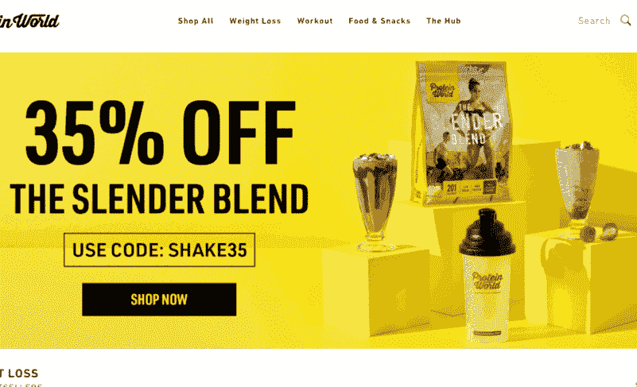

# 网页设计原则

> 原文：<https://blog.devgenius.io/web-design-principles-with-examples-b3fb9c622e57?source=collection_archive---------0----------------------->

当人们访问你的网站时，他们首先感受到的是设计。即使你的网站功能强大，糟糕的设计也会让这些功能变得毫无价值。所以在这篇博客中，我将介绍一些网页设计原则和它们的历史。我也会分享一些可以帮助你设计网站的资源。

## 我们开始吧

## 1.颜色

选择正确的颜色非常重要，你不能只选择你最喜欢的颜色。一个多彩的网站并不意味着使用所有不同的颜色，保持一致，选择一种颜色作为你的主题颜色。挑选颜色时，考虑你的调色板的情绪。

*颜色的五种情绪*

## -红色

红色酷似**爱情**、**能量**和**强度**。它是色轮中最强大、最强烈和最明亮的。红色主题多用于电商、娱乐、时尚类网站。权力越大，责任越大——过多使用红色会给你的设计带来负面影响。还有，红色不适合自然相关的网站。示例:

## 黄色

黄色代表**快乐**、**智力**和**注意力**。你应该小心使用黄色，因为使用亮黄色作为背景会伤害用户的眼睛，尤其是当你的网站需要长时间使用的时候。黄色非常适合标题、标志、按钮等。所以综上所述，如果你的网站是用户需要花更多时间的东西那么黄色就不是最好的选择。

黄色主题网站的好例子:

## 绿色

绿色是关于**新鲜度**、**安全**和**成长**。这就是为什么大多数食品、营养、有机产品公司使用绿色调色板的原因。这就是他们如何用数字方式传达产品的新鲜度。因此，如果你的网站是食品或自然相关的，那么绿色是你的选择。

以下是一些例子:

## -蓝色

蓝色— **稳定**、**信任**和**宁静**。现在你知道为什么大多数金融公司、加密货币公司的网站都是蓝色的了。此外，一些主要的社交媒体网站，如 Twitter、LinkedIn 都是蓝色主题的，因为他们让人们在使用他们的平台时感到安全、信任和积极。所以使用社交媒体来传播积极的信息😉。

示例:

## 紫色

最后是紫色，紫色表示**皇族**、**财富**和**女人味**。这些话说明了一切。所以针对女性的网站更有可能使用紫色。

示例:

因此，根据你想通过网站传达给用户的信息，选择合适的颜色。当然，你不只是在你的网站上使用单一的颜色，所以使用这两个工具来组合颜色来匹配你的主题颜色。

1.  [土坯颜色](https://color.adobe.com/create/color-wheel)
2.  [彩色狩猎](https://colorhunt.co)

## 2.排印

排版是网站的另一个重要部分。我看到很多网站在选择字体上失败了。如果你的网站有更多的阅读内容，那么字体真的很重要。我们来看一些关于字体的历史。有两大字体系列。

## -衬线

衬线字体的灵感来自古代大理石雕刻。很难雕刻 90 度角，所以这就是为什么衬线字体有三角形的曲率。衬线字体让你觉得严肃、权威、老气。衬线有许多子类型，如旧式，过渡和现代。

像颜色一样，字体也有情绪。现在衬线字体被视为**传统**、**稳重**、**可敬**。

VOGUE 是衬线字体的最好例子。

## -无衬线

无衬线是**感性的**、**简单的**和**直白的**。无衬线有完美的直角。大多数创业公司倾向于使用无衬线字体。您可以在正文中使用无衬线字体，因为它使文本更具可读性。

提示 1💡:选择字体时，不要选择两种以上不同的字体。提示 2💡:避免使用这些字体——漫画 sans 、**克里斯汀**、**库尔兹**、 **viner** 和**纸莎草纸**。这些字体很难阅读，只是为了好玩。

在决定字体系列之前，仔细检查一下 cssfontstack 以了解哪些字体可以安全使用。

## 3.用户界面

在学习了色彩理论和排版之后，接下来你需要知道的是用户界面设计。UI 是关于你如何在你的网站上使用和安排东西。UI 有五个因素— **1。层次结构**， **2。布局**， **3。对齐**和 **4。空格**和 **5。观众**。让我们用例子来了解这些因素。

## -等级制度

文本层次结构的一个简单示例:

这里主要的事情是谁的证书，对于左边的那个更合适。用户可能没有时间阅读所有的文本，因为这样会首先分层突出最重要的信息。

颜色层次示例:

请查看绿色方框中突出显示的点。这些是大多数人考虑产品的因素，对吗？这就是颜色等级。巧妙地使用色彩来突出需要吸引用户的东西。

尺寸层级示例:

现在看看这个网飞注册页面。这里 1 > 2 > 3 大小。他们想向游客展示的第一件事就是网飞。第二个首选是他们想要你的电子邮件。第三件事与其他两件事相比很小，因为他们没考虑那么多。

## -布局

布局是关于你如何安排你的网站元素。不要把所有的东西都放在和维基百科一样的地方，这样太乏味了。将元素分成不同的部分。如果文本太多，就把每一行剪成 60 个字符。

看看这个— [csslayout](https://csslayout.io)

## -对齐

对齐是关于如何相对于其他元素定位一个元素。

请看这个例子:

明白区别了吗？即使两个网站有相同的内容，只是不同元素的排列有很大的不同。

## -空白

空白是指元素周围的空间。

## -观众

是的，受众是 UI 的一个因素。了解你的目标受众，为你的受众设计。例如， **YouTube** 和 **YouTube kids** 的主题是不同的。

所有游戏网站的主题完全不同于其他网站。

## 4.用户体验(UX)

让我们继续去 UX。直到现在我们试图吸引用户，现在我们需要给用户留下深刻印象。当用户界面吸引用户的时候，UX 让用户舒适地使用你的网站。同样，在 UX 你需要考虑五个因素。简单性， **2。一致性**， **3。阅读模式**， **4。所有平台设计**和 **5。深色图案**

## -简单

在同一个地方放太多的内容会让用户头疼，因为他们不知道去哪里看。通过安排和减少内容来保持事情的简单。简单就是美。亚马逊网站的 UI 和 UX 都不好(如果你知道下面的原因评论)，但是有那么多设计简单的电商网站。

## -一致性

一致性使你的网站易于理解和导航，尤其是当你的网站被非技术人员、小孩或老人使用时。

## -阅读模式

阅读模式指的是用户如何看待你的网站。有一些布局称为 Z 布局，F 布局等..，可用于设计元素的布局。

## f 布局

在 f 布局中，重要内容将位于左侧。看这个例子，

## z 形布局

z 布局包括标志(1)，注册按钮(2)或类似的东西，一些文本(3)和行动呼吁按钮(4)。

## -所有平台设计

说到底，你不仅仅是为桌面创建一个网站，它还需要在不同的设备之间做出响应。

## -避免深色图案

黑暗模式是指为了公司的利益欺骗用户的行为。你可能会获得短期利益，但从长远来看，你会失败。

所以，如果你遵循这些原则，那么你就能做出伟大的设计。

对于一个好的网页设计，你还会考虑哪些原则？评论如下👇

## week⚒️的⚒️Tool

[CODELF](https://unbug.github.io/codelf/) 为变量和函数命名想太多？😂那么这个工具就是给你的！

希望这对你有帮助！留作参考。追随更多的精彩😀。你可以在[推特](https://twitter.com/rakesh_at_tweet)上和我联系。