# 更好的网页设计系统策略——组件、可重用性、技术和成功。

> 原文：<https://blog.devgenius.io/web-design-system-that-is-not-a-build-it-from-scratch-with-some-confidence-af77fb1d23e5?source=collection_archive---------7----------------------->

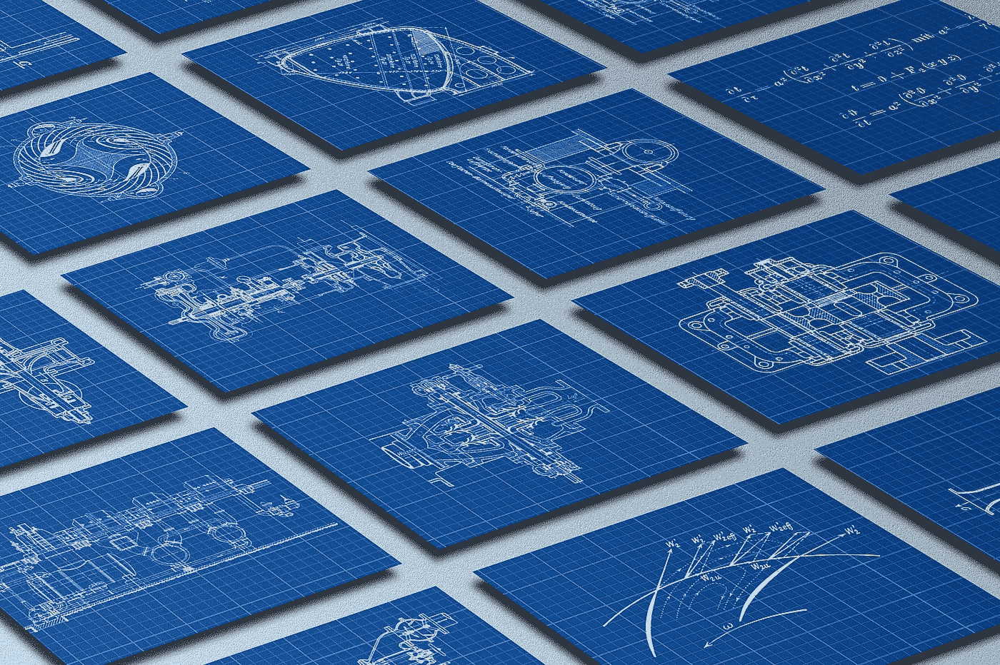

# 介绍

我很幸运为不同的公司从零开始建立了一些非常成功的设计系统。幸运的是，我也有机会看到和经历了一些完全浪费时间，在计划、执行和最重要的——实施方面绝对是一场灾难。这就是为什么我决定写一篇文章，涵盖这个非常非常广泛的话题，如果你要开始这样的旅程，给你一个坚实的起点。

我试图解释我是如何处理这样一个复杂的话题，而不开发出会成为公司最可怕的“特性”的东西。不幸的是，我不能在一篇文章中涵盖所有的内容，所以我决定不要太技术性，因为每个开发堆栈都需要不同的方法。对你来说，更重要的是理解原则、高层次的目标和使这样一个项目成功的计划，而不是可能与你的情况无关的激烈的细节。

# 什么是“设计系统”？

这是一个乐高积木的集合，包括手册、图片、使用示例和你可以创造的创意。选择它们在几分钟内建造一座中世纪城堡，或者一只里面有恐龙的千年鹰，如果你愿意的话。

无论您创建什么，所有这些项目都将共享相同的元素和构建块，您可以交换、替换或升级它们。任何人都可以很容易地在城堡里增加一个马厩，或者在猎鹰周围建造一个完整的空间站。用新的、更好看的、适合你的项目的东西来替换你的建筑的特定部分也是相当容易的(让我们从移走恐龙并把丘巴卡放回去开始！).

## 一个好的设计系统最重要的好处是:

*   设计和行为的一致性(用户界面/UX)。
    每一个元素都建立在相同的原则和设计语言上，使它们在页面之间保持一致，现在只是从外观上&感觉上，但最值得注意的是，它们的行为方式。例如，输入字段可能支持验证、错误、消息、图标、占位符、不同的风格和大小。没有一个设计系统，就很难开发出跨所有形式的一致性，开发人员倾向于采用“最后看到的代码”，以某种不可预知的方式重用它，修改并发布它。很快，每一页看起来都会稍有不同，没有什么是可以全局“固定”的。设计系统的缺乏是品牌重塑和网站设计更新的噩梦。
*   **发展更快。**
    用积木搭建乐高城堡要比用一大块塑料(以及切割、形状、颜色等)来搭建更容易。).开发者不必担心表单、菜单或按钮的本质细节。相反，他们可以使用现有的组件，并根据需要在其上添加额外的自定义功能。这加快了产品-设计-开发之间的沟通，并使最终结果可预测，更容易交付。
*   **少测试。每一个合适的设计系统都应该有可靠的单元测试、视觉测试和功能测试。一旦它们就位，所有极端的边缘场景都将被覆盖，不必成为特定新特性测试的一部分。一般来说，根据需要自动化、跳过或重用大量测试要容易得多，这使得代码交付更加简单。**
*   **质量。**
    我们可以在给定的功能上多花一点时间，以确保它已经过性能优化、良好记录和测试。因为它可以跨多个地方重用，所以质量是第一位的，并且组件在未来的使用变得可预测。如果有一个 bug，在一个地方修复比找到/替换一段代码更容易，这段代码可能在任何地方都一样，也可能不一样。
*   **和更多…** 可扩展性、可维护性、改进的可访问性、更好的知识共享、共享所有权(潜在的)、团队合作…

**设计系统的缺点**是开发需要时间，一些决策者会认为启动这样的项目没有价值。让我向你保证**创建一个**实体设计系统和组件库并不容易。它需要工程和设计师的大量投资来创建一个计划并很好地执行它。更难的是证明“产品至上的公司”的努力，在那里唯一重要的是另一个功能，没有人在乎应用程序的质量，也没有人关注技术债务(ps。他们总是说他们有)。

这是一场战斗，我们，软件工程师，应该始终领导交付最好的和最平衡的结果，满足大多数人。最终，在未来的几年里，我们将不得不接受这些解决方案。

# 从哪里开始？

你计划得越好，你以后要做的工作和重新分解就越少(很明显，对吗？).从我的经验来看，最初的准备不应该超过几个星期，记住其他类型的工作仍然需要在此期间发生。所以我们开始吧！

*   回顾当前状态。
    如果你不知道你从哪里开始，你就无法朝着你的目标前进。回顾 web 应用程序的当前状态，了解如何改进以及最终目标应该是什么。这个阶段需要考虑的事情:
    ——当前代码的重复和可重用性。
    ——引入新功能时的测试和复杂性。你的 CSS 中有多少颜色和其他类型的“变量”？
    -构成您的应用的基本组件是什么，哪些应该是设计系统的一部分，哪些只是一次性的。
    -现在的 app 有哪些最痛的咬口(我猜:表单？)
    -哪里可以简化你的代码
    -哪些东西你应该清理掉，删除掉，再也不提？
    -还有更多…只要明白你现在到底在哪里。
*   没有蓝图，你无法建造摩天大楼。
    和你的团队一起决定你想要构建什么，它将如何工作，以及它将如何在未来帮助你。定义组件的所有级别，从变量(令牌)到复杂功能，并指定未来所有构建模块的总体配置属性和风格。
*   **推销你的设计系统。**
    你得推销这个想法。开发者在这个过程中是最重要的，因为你需要他们的支持来推动整个事情的进展。在大多数情况下，设计师已经在船上，不需要什么说服力。他们喜欢设计系统，这也是他们已经开始工作的方式(很有可能)。由于项目需要时间和金钱，高层管理需要一些说服力，你的重点应该是成本、速度和质量。了解这些人真正关心的是什么，并确保项目将直接惠及他们(客户满意度或更快的上市时间，无论他们关心什么)。你需要让项目与他们的价值观和目标保持一致，获得情感上的认同，并引入一个不会太大的计划——如果大的计划不可能实现，就小步实施。最后，没有什么比数字更有说服力。例如，当我们在 2015 年开始我们的第一个设计系统时，在最初的审查过程后，我们发现整个网站有 76 种黄色(应该是 2 种)，没有一种形式以相同的方式工作或共享任何代码。我们可以根据这些信息快速预测改进如何转化为$$$和时间。这个项目最终交付的比我们承诺的要多。
*   与设计师一起创建一个组件库。
    定义所有设计系统的层次(我稍后会谈到)，并设定组件应该如何使用的原则。设计团队需要一个良好的开端，探索各种选择，缩小他们想要构建的范围。我的经验告诉我，他们通常会推动一个过于复杂的解决方案，有 20 种不同的字体大小，50 种颜色，可能还有 10 种不同的间距选项。简单更好，如果某些元素需要更复杂一点，你可以在未来这样做(可能永远不会，因为你发现它们是不必要的)。
*   **将工作与重新架构联系起来，因为这是做这件事的正确时机。**
    引入设计系统的最佳时机莫过于做一些重要的重新架构工作。通常，设计系统是首先进行架构变更的绝佳理由。如果你设法走这条路，明智地利用你的时间，因为这种机会每五年(或更少)才有一次。
*   拥有它。虽然每个人都应该能够编辑和维护设计系统，但是你需要有人来宣传这个想法，跟踪变化，并帮助指导项目。为这项工作创建一个专门的团队通常不是最好的方法，因为它在真实用户、应用程序和开发人员之间造成了脱节。大量的开销和通信挑战。另一方面，如果你在一家有 500 多名开发人员的公司工作，一个专门的团队监督项目可能是正确的方法。请记住，他们的角色应该只专注于管理项目，设定方向，并帮助其他工程师使用它，而不是唯一的贡献者和建设者。

# 成功的关键&一个可靠的设计系统最重要的方面。

*   **易用性。如果我只能从这个列表中选择一样东西来记住，那就是这个。许多库和开源项目的成功主要基于它们的易用性——安装、优秀的文档指南、真实的例子和简单的实现。完成了。这是你的设计系统成功的关键。如果你在这里失败了，你会遇到很多阻力，会和所有团队进行永无止境的斗争。人们会在任何时候努力破坏这个项目。它将开启讨论，使之成为一个民主的过程，你令人印象深刻的设计系统将在看到真实世界之前失败。**
*   **良好的组件层次结构。**
    稳固而深思熟虑的组件层次结构。从令牌和变量这样的简单元素开始，每一步都变得更加深入和复杂。稍后我会用一些例子更详细地描述层次结构，让你更好地了解一个好的层次结构是什么样子的。
*   一切事物的好命名。
    避免根据颜色的实际颜色来命名颜色。避免使用灰色托盘的全名，如“米色、灰色、浅灰色、中灰色”。不要根据特性或产品关系来命名组件。所有标记都应该有前缀，如颜色-*、大小-*、空格-*，等等。可能还有更多我应该提到的，但这个想法是要小心命名。如果你很早就发现了一个错误，那就改变它，不要等待。
*   **让它成为一个公司项目。**
    允许来自所有开发人员的贡献，只要他们在完整的测试覆盖范围内做得好，并且有一个有效的用例(不是所有东西都应该是设计系统的一部分)。通常，这个过程从设计团队开始，因为他们已经知道他们想要构建的是一次性的还是永久性的组件。在某些情况下,“乐高积木”应该在特定页面的上下文中被修改/覆盖。不要让所有微小的改变成为设计系统配置和属性的一部分；这会使它变得不可维护。对项目的贡献应该是毫不费力的，如果每一个改变都需要一个复杂而漫长的过程或者依赖另一个团队来做出任何改变，这将会伤害项目。
*   **可测试性、单元测试和视觉测试。**
    由于多个应用程序和团队可能依赖于设计系统，所以像[版本](https://andrewwinnicki.medium.com/better-versioning-for-frontend-applications-and-not-only-is-like-traffic-lights-for-engineers-380e9beb6a42)、文档和发布流程这样的东西是必不可少的。但最重要的是所有类型的测试，以确保变化不会破坏现有的功能。不能依赖人工测试，自动化是关键。
*   **风格指南实现页面(故事书？)**
    文档&指南应该便于随时随地访问。它们不仅会被开发者使用，也会被设计者和利益相关者使用。一个好的设计系统应该有一个简单的复制/粘贴代码功能的现实生活中的实现示例，以节省使用定制道具尝试特定组件的时间。
*   考虑可及性。
    这只是一个让事情变得比以往更好的机会。易访问性经常被忽视，设计系统是管理它的最简单的方法，包括 aria 标签和焦点控制。
*   **开发 it 的合适团队/人员。**
    项目初期加的人越多，失败的可能性越大！设计系统的理想起点是一个，也许是两个工程师+一个设计师。仅此而已。正如我在第一点中提到的，简单是关键，这也包括参与项目的团队。
*   **不要试图解决所有问题，涵盖所有场景。** 这不可能，也没有道理。

# 设计系统失败的几个原因？

*   一个团队孤立地开发设计系统，与公司的实际产品开发脱节。
*   复杂的实现需要大量重写现有应用程序中的每个视图和功能。
*   一个设计系统，强制改变应用程序的构建过程，并且毫无理由地引入新的语言/库。
*   太大、太重、太胖的代码库和低劣的性能。
*   缺乏正确的层次结构和设计系统构建，只关注复杂的组件(例如，没有令牌，但有一个用于所有内容的 React 组件)。
*   进度和目标沟通不畅。
*   缺乏公司工程师的认同，每个人都被迫使用新的设计系统。
*   产品和设计团队没有努力交付有价值的东西。

# 使用现成的组件库？

在为 ESGgen 构建我们最新的设计系统之前，我研究了能够提供开箱即用解决方案的组件库。我四处寻找支持最常用元素的东西，尤其是表单，因为我们在任何地方都使用它们，而不想从头开始开发它们。所以我尝试了几个像 Vuetify(我最初很兴奋)，Vue Material，Vux 等等。

哦，天哪…那是一次令人失望的经历！它们中没有一个处于我认为对我们的项目“可用”的状态，突出的两个主要问题是有限的定制和包大小(应用程序性能)。虽然我不得不称赞他们中的一些人非常容易接近。

## 有限定制

您只能做 API 允许和可用的事情。是的，大量的道具和选项，但它们仍然是有限的。我相信很多东西可以被绕过和破解，但这需要大量的时间投入。我还担心，即使我们可以忍受这些限制，我们不能忍受也只是时间问题，而且从一个组件库转移到另一个组件库会比现在开始做更多的工作。

## 尺寸/性能

我们目前的应用程序在初始加载时的大小约为 500KB，包括我们的设计系统、核心功能、Vue、视图、样式、图像和其他小部分。在添加了一个组件库(我不会说是哪一个)并使用了一个简单的表单输入字段之后，突然，我们有了一个**额外的 1.2MB 的代码**不是三摇。这使得我们的初始加载时间慢了 2 倍。遗憾的是，这是几乎所有开箱即用组件库的最大缺点——**它们太胖了！**

## 你应该考虑他们吗？

是啊！它们将非常适合小型应用程序和个人项目。你只需要记住，一旦你开始关心性能和文件大小，想要定制一些东西，你将会面临许多你自己带来的挑战。

出于上述原因，我决定对于一个基于公司的项目，我不会使用任何现成的解决方案，如果你在团队中工作，关心性能和未来的增长，并且需要灵活性，我强烈建议任何人都不要使用。他们只是还没有到那一步。

# 综合设计系统的要素

一个基于我在 2022 年工作的最新设计系统的良好层级的例子。

## 第 1 级—基础知识(代币和核心)

令牌和变量不仅会在设计系统的所有其他级别中重复使用，还会在设计系统之外重复使用。比如颜色、间距、字体和文本结构。在我们的例子中，它还包括默认的 CSS 规范化，网格，以及我们如何预先设置链接和图像的样式。此外，它还为 SMACCS 等某些功能提供了 mixins。第 1 级定义了每个人在他们的应用程序、网页或 CMS 中使用设计系统的核心规则。

**示例:** CSS/SASS 变量(令牌)、网格系统、主题、图标、CSS 规范化、BEM/SMACCS 方法、SASS 实用程序混合

## 级别 2 —类别(原子)

我注意到有时候设计系统会跳过类的概念。一切都是一个组件，甚至是一个简单的按钮，但是当你试图将你的设计系统与一个简单的营销团队 CMS(例如 WordPress)集成时，这会造成不必要的复杂性，并使事情变得更加困难。我喜欢为简单的元素使用类，因为它们快速而灵活。最重要的是，我们提供实用程序类来帮助设计文本、间距、颜色和其他任何可能对开发者有帮助的东西。

**示例:**按钮、包装器、文本工具、间距工具、表格、标注框

## 3 级—成分(分子)

这些是全局注册的适当组件(在我们的例子中是 Vue ),无需不必要的导入就可以使用。附带关于如何将它们与所有参数一起使用的良好文档。正确的单元测试变得至关重要，因为这些组件是更复杂功能的基础。

**示例:**表单组件(全部)、折叠、弹出、工具提示、进度条

## 第 4 级—复杂组件(有机体)

组件，但更复杂，可能会重用所有以前级别的元素并进行组合。基本上，任何你不能简化到适合第三级的东西。

**示例:**导航、页眉、页脚、用户菜单、错误处理程序(事件驱动)、警告(事件驱动)

这还包括事件触发组件，如错误句柄，任何 JavaScript 代码都可以在任何时间、任何地点调用错误句柄来向用户显示意外(或预期)的错误。

# 不是典型的“原子设计”方法？

当我在 2015 年从事第一个设计系统的工作时，我没有过多地阅读如何启动这样一个项目，原子设计概念在这个阶段是新的。因此，我决定运用常识，从团队中收集反馈，构建一些我们想要使用的东西，从我们的错误中学习，并随着我们的前进而改进。

我脑子里的想法与原子设计方法有很大的重叠，这是我不久前才发现的。尽管如此，我还没有决定在为 ESGgen 构建最新的设计系统时遵循它。

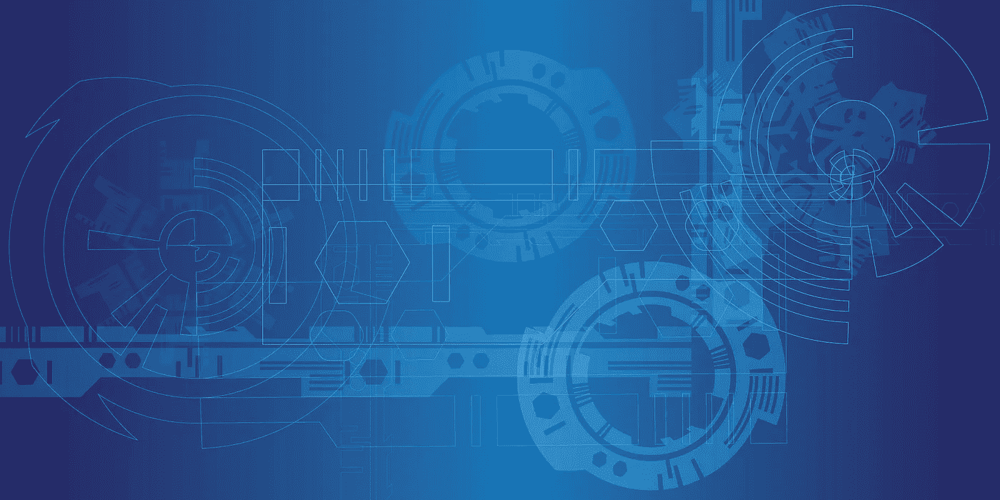

# 技术、规模、发展和其他基于您的背景需要考虑的事情。

我不想在技术细节上走得太远，因为每个设计系统都应该以适合您当前开发标准和技术的方式构建。所以让我们只触及一些次要的事情…

## 存储库、包、版本。

没有一种方法适合所有人，因为正确的选择取决于团队设置和组织规模。我默认的起点是前端的 monorepo，它带有一个坚实的架构，鼓励创建一个共享的核心。设计系统也是它的一部分——更新它更容易，所有应用程序都会在下一个版本中自动继承更改。管理设计系统版本，独立的发布周期，协调谁何时应该使用什么。

对于较大的组织，无论是大规模建设还是没有从 monorepo 中受益，我都鼓励创建单独的 repo，并允许设计系统作为软件包或 GIT pull 安装。这将需要一个适当的发布过程、发布说明、文档和语义版本化，以使开发者清楚明白所做的改变以及它们将如何影响他们的代码。简单地说，这种方法需要更多的维护。由于一切都是孤立的，外部开发人员的任何改变都有点困难和令人沮丧。由于公司的规模，我们曾经被迫采用这种方法，这种方法非常有效，尽管团队之间的沟通非常好。这在很大程度上取决于组织的文化，你需要所有权和额外的努力才能成功。

## 处理 CSS 和一般样式。

我的选择是 SASS，有了 BEM mixin(NPM SASS-BEM-mixin)，CSS 代码变得非常可预测，非常可重用，而且不仅仅是在你的应用程序的上下文中。由于 BEM/SMACCS 方法对于类命名的简单性和逻辑性，它可以被非技术人员立即使用。我们已经两次被要求在营销网站(WordPress)上提供高水平的样式，以带来设计的一致性，这就是 SASS 方法工作得非常好的地方。

由于这个原因，并且事实上类名对于非技术人员来说毫无意义，最后，开发人员对输出没有太多的控制(更难优化)，我不鼓励使用样式化组件。但是，你可能没有能力抛弃它，所以你必须活下去。

## 展示所有组件的最佳方式是什么？

故事书似乎是最受欢迎的方法，这是有原因的。它灵活、强大且充满活力。我喜欢它，但只使用过一次，因为它需要设置和特定的配置方法。我们想要显示的每个组件都必须以故事书的方式定义，这不是开发人员将如何实现它。

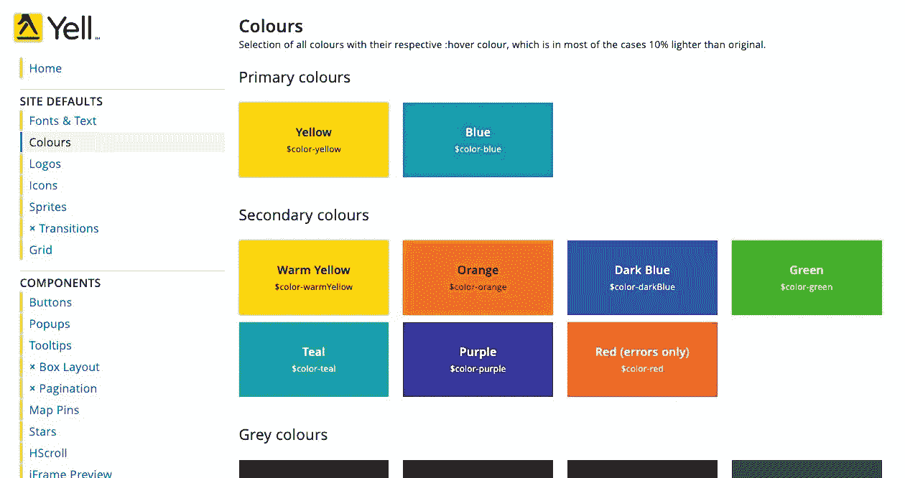

耶尔的设计系统(定制)

我的默认方法是使用一些允许实现组件的东西，就像开发人员在整个应用程序中做的一样。现实生活中的代码。目标是构建风格指南页面，其中每个视图展示设计系统组件的不同风格和带有属性和功能的示例。无需挖掘源代码就可以复制代码，就像一头猪在海滩上寻找块菌一样，这些代码被用来展示一个特定的例子。最重要的是，每次我们发布主应用时，这些风格指南页面都用于视觉测试(像 backstopJS)，端到端测试和性能。一体化和真实实施。易于使用，易于构建。

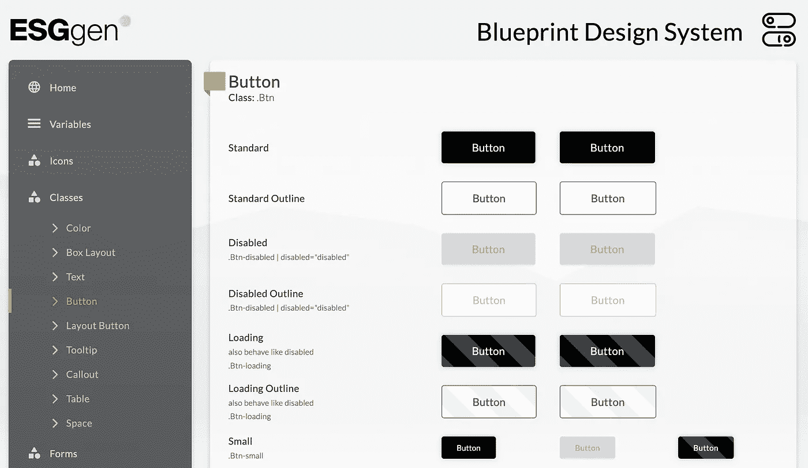

## 使用样式指南页面做更多事情。

因为我们(通常)遵循 JSDoc 来记录我们的代码，所以我们可以很容易地添加代码文档和组件。样式指南页面不仅是可视化的，而且是实现指南和文档。当然，像这样的高级功能应该隐藏在某种登录或限制访问之后，但这完全取决于您。

# 我们设计系统的几个真实例子。

我最新设计系统项目的一些截图和真实例子。请注意，它仍在进行中，仍在缓慢发展。

## 级别 1:变量和令牌

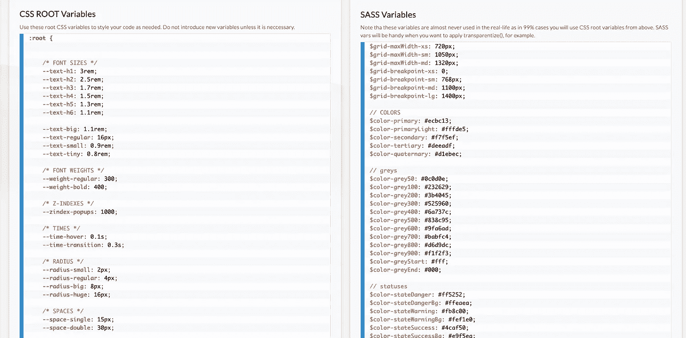

ESGgen 设计系统

顶级配置。基本上，一切都从这里开始，并在整个过程中被重复使用。当您在样式指南页面中显示这样的配置时，使用类似 PrismJS 的东西来突出语法是一个好主意。这就是我们对 SASS 和 CSS 变量所做的。上面的代码实际上是两个文件的原始导入。

## **第一级:图标**

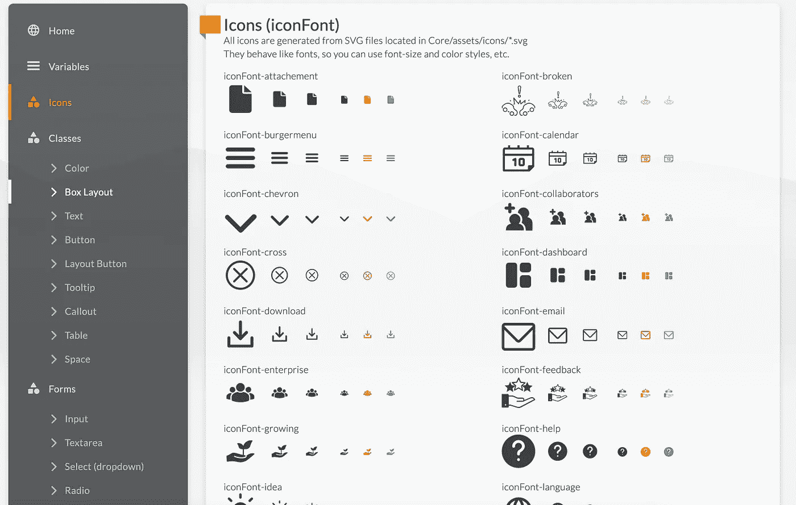

ESGgen 设计系统

具有不同显示选项的所有可用图标提供了它们在不同场景下的外观。在我们的例子中，我们使用 iconfonts 从 SVG 文件中生成自定义字体。这是一种超高效且非常灵活的方法。但是，你需要记住，在某些情况下(可访问性问题)，这不是一个好的解决方案，你可能需要创建精灵来代替。该部分完全自动化，无需人工维护。

## 级别 2:按钮(基于类)

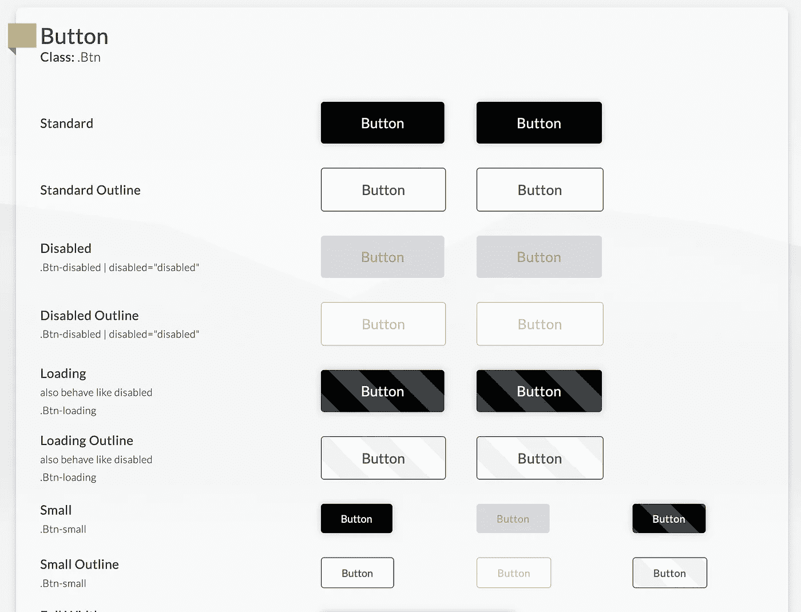

ESGgen 设计系统

各种风格的按钮，包括如何使用它们的描述和任何附加注释。这可能是你的应用程序中最简单的组件了。

## 级别 2:工具提示(基于类)

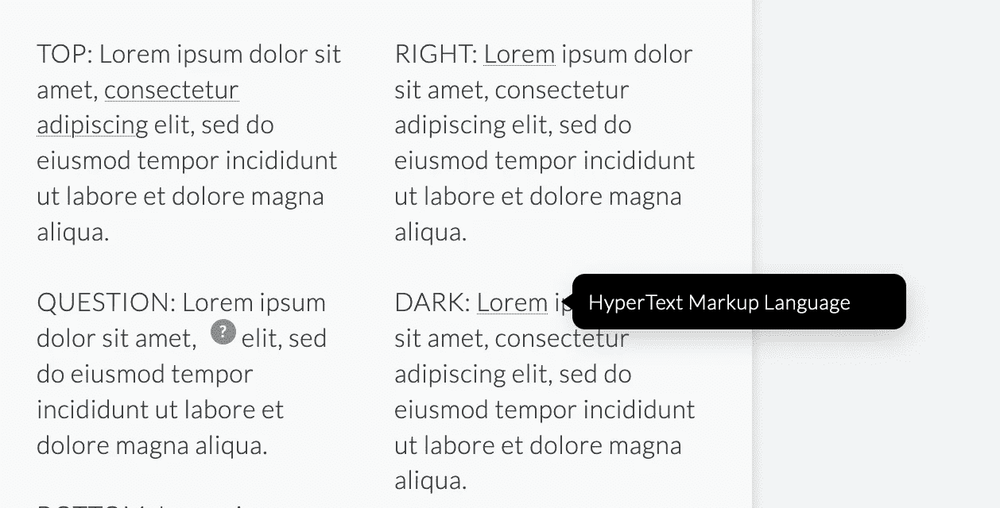

ESGgen 设计系统

因为工具提示不需要任何 Javascript，所以它们是基于类的，用数据工具提示属性来显示内容。这种方法的好处是工具提示可以应用于任何元素——按钮、链接、文本、标题、表单……基于类的组件是高度可重用的。

## 级别 3:表单输入(组件)

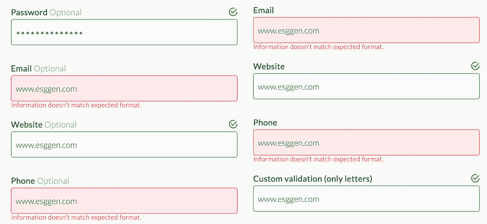

ESGgen 设计系统

构建表单控件是一项重要的工作，需要考虑很多选项、配置、验证和其他事情。相反，一旦完成，这些组件最不可能改变。一旦发展起来，它们往往会在很长一段时间内保持“不变”。除非你搞砸了什么:)

## 级别 3:进度线

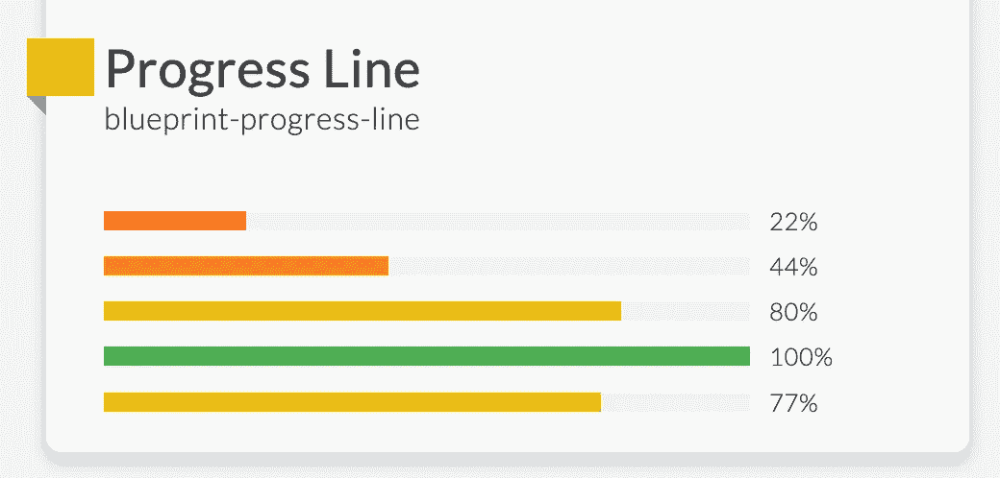

ESGgen 设计系统

进度线是简单的 3 级组件的一个很好的例子。这只是一个进度条，我们提供了一个%值，这不仅会显示正确长度的酒吧，而且还会动画，改变基于%的颜色，并在输入改变时被动更新。我们还有一个循环进度组件。

## 级别 4:错误处理程序(事件驱动)

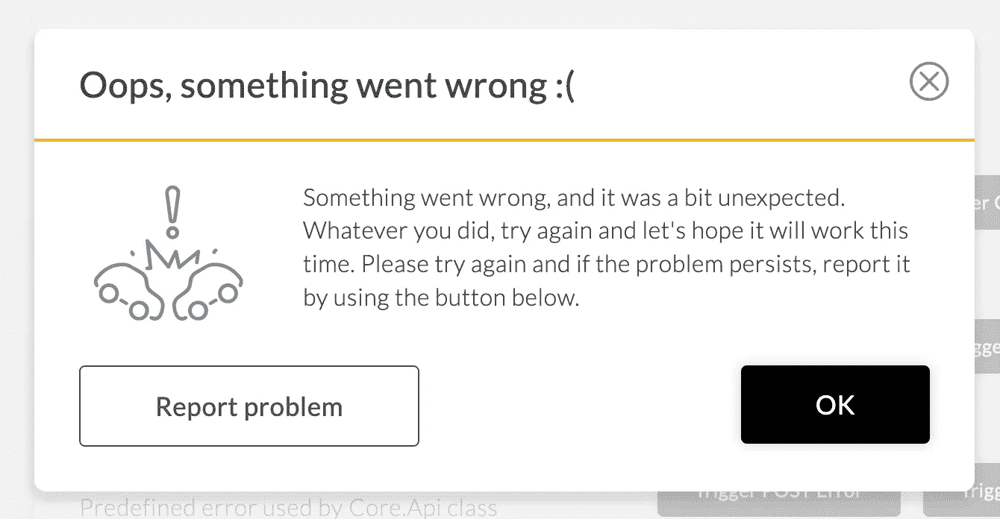

ESGgen 设计系统

这个例子是来自错误处理程序的“意外错误”，由 JavaScript 自定义事件触发。它重用层次结构中的其他元素，如按钮、图标，并且都显示在一个弹出组件中。该事件可以接受额外的参数，如标题，内容和按钮配置，所以很容易使用。最重要的是，这种类型的组件可以从 vanilla JS(而不是 Vue)中触发，当 API HTTP 请求由于某种原因失败时，我们会这样做。赞美诗您可能不需要这样的基于事件的组件。

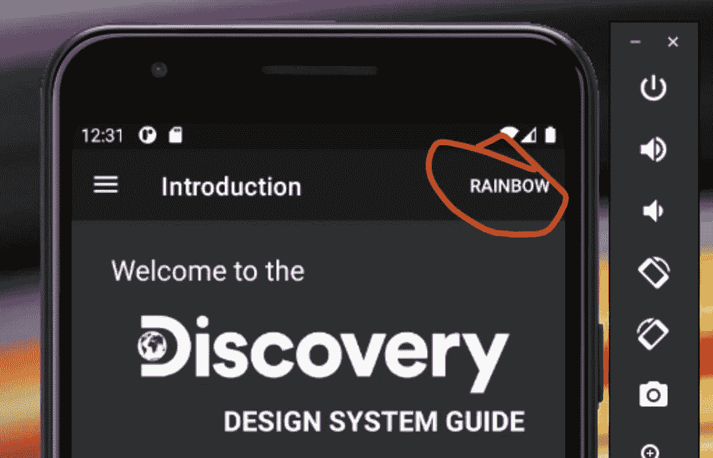

发现+设计系统，安卓

# 超越网络。为 iOS 和 Android 设计系统？

如果你认为为一个平台构建一个可靠的、可重用的组件库是困难的，那么你只能想象跨多个平台并尽可能地共享它是多么具有挑战性。

作为我在 Discovery+的旅程的一部分，我们开始了一个设计系统项目，该项目跨越了 web、Android、iOS 和连接设备(Web 技术)，其背后的团队专注于找出可以共享的内容以及如何在考虑可扩展性的情况下进行构建(JS/React、Swift/CocoaPods、Kotlin)。我们最终共享了颜色、间距、文本风格等所有的符号。从这一点开始，每个平台都采取了稍微不同的方法。该团队遵循了我在本文中描述的类似过程，并找出了应用程序的当前状态，我们应该瞄准的未来，绘制了所有 DS 级别，并将所有组件放在一起，以简化所有平台的 UI。在 9 周内，我们有了一个适用于所有平台的工作框架，并且在我们现有的应用程序中实现了 1 级令牌。这是旅程真正开始的地方…但这是另一篇大型博客文章的主题。

简而言之…这是可能的，也是艰难的，但是如果你需要保证所有平台上相似的用户体验和一致性，没有什么可以阻止你这样做。

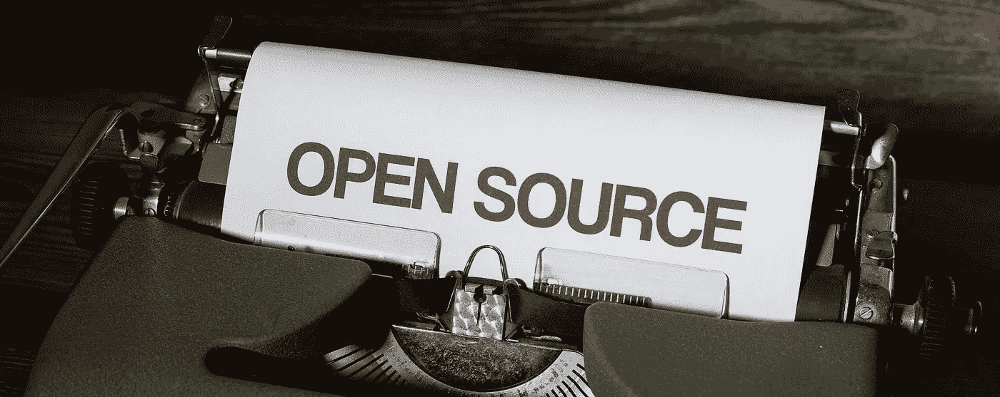

# 我们要开源我们的(ESGgen)设计系统和组件库！

在我们构建 ESGgen 设计系统的同时，我已经在思考如何与世界分享。这么多的努力投入到创建它，照顾性能，可访问性和解决所有的边缘情况…我不希望任何人经历相同的旅程，如果他们没有必要。

我们希望将它开源，允许人们贡献代码，定制代码，并从所有投入的努力中受益，包括多语言支持和超轻量级、适当的树型代码，您可以在任何地方添加这些代码。当然，这意味着这个项目只能作为 Vue 设计系统使用，这可能是唯一的限制；)

如果你有兴趣成为这样一个项目的一部分，请告诉我。我认为我们需要一些帮助来使它成为一个真正的开源项目。

# 最后一句话…

如果你到了这里，这意味着你躲过了我关于媒介的最全面的文章。我不想把它分成小块，拖很久。一篇涵盖概念、准备和真实例子的文章，希望能给你一个如何和从哪里开始的想法。**去玩吧！**