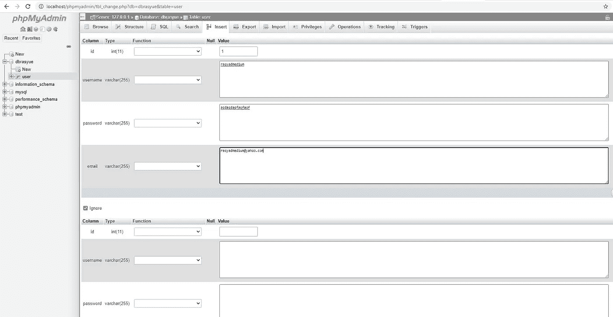

# 用 PHP 从零开始进行 Web 开发，适合初学者

> 原文：<https://blog.devgenius.io/web-development-with-php-from-scratch-for-beginners-a8bed954e9f8?source=collection_archive---------2----------------------->

## 本教程将为初学者从头开始讲述用 PHP 进行 web 开发的基础知识。


php web 开发

# 设置环境

首先，让我们在机器上设置 PHP 开发环境。

我们可以使用 Apache 服务器或者 Nginx 服务器来运行 PHP 脚本，但是为了简单起见，我建议使用 XAMPP 或者 WAP。

注意，在这篇文章中我将使用 XAMPP。

你可以在这里找到 XAMPP。安装相当容易。

安装完成后，转到`C:/xampp`，或者如果您选择安装在不同的目录中，请在您之前选择的目录中找到 xampp 文件夹。

找到`xampp_start.exe`并启动它。这将启动 **Apache** 服务器和 **MySQL** ，您可以通过 **phpmyadmin 访问它们。**


实际上，XAMPP 只是另一个帮助我们快速启动 Apache 和 MySQL 的应用程序。你总是可以分别安装 Apache 和 MySQL，但是如果你是新手的话，这样做会很费时间。

## 为什么我需要 Apache 来运行 PHP？

我从初学者那里得到很多困惑，因为你总是可以在你的浏览器(Chrome/Mozilla/Edge)上打开你的 HTML 文件，那么为什么我们不能对 php 文件做同样的事情呢？

解释一下，当你写一个 PHP 文件时，你需要一个解释器来读取 PHP 文件并运行你在 PHP 文件中编写的代码。没有解释器，PHP 文件就像任何其他文本文件一样。

对于 web 服务器，服务器不仅会调用一个解释器来读取 PHP 文件，还会做其他事情，比如发出 HTTP 请求、发送邮件等等。

实际上，只要您有解释器，您总是可以从命令行运行 PHP 脚本。然而，我们不会这样做，因为这篇文章是关于 web 开发的，所以我们需要一个 web 服务器和一个浏览器。

## Apache httpd.conf 文件

在我们开始编码之前，如果你是一个初学者，我想借此机会向你介绍一下 Apache `httpd.conf`文件。

这是一个控制 apache web 服务器行为的文件，不过我们不会深入讨论这个文件。我们在这个文件中唯一要做的事情是改变文档根。

打开文件，找到`DocumentRoot`。

```
DocumentRoot "C:/xampp/htdocs"
<Directory "C:/xampp/htdocs">
    #
    # Possible values for the Options directive are "None", "All",
    # or any combination of:
    #   Indexes Includes FollowSymLinks SymLinksifOwnerMatch ExecCGI MultiViews
    #
    # Note that "MultiViews" must be named *explicitly* --- "Options All"
    # doesn't give it to you.
    #
    # The Options directive is both complicated and important.  Please see
    # [http://httpd.apache.org/docs/2.4/mod/core.html#options](http://httpd.apache.org/docs/2.4/mod/core.html#options)
    # for more information.
    #
    Options Indexes FollowSymLinks Includes ExecCGI#
    # AllowOverride controls what directives may be placed in .htaccess files.
    # It can be "All", "None", or any combination of the keywords:
    #   AllowOverride FileInfo AuthConfig Limit
    #
    AllowOverride All#
    # Controls who can get stuff from this server.
    #
    Require all granted
</Directory>
```

默认情况下，当您安装 xampp 时，`DocumentRoot`将指向`xampp/htdocs`，这意味着它将服务于`htdocs`目录中的文件。

继续创建一个新的文件夹，你想怎么命名就怎么命名，然后像修改`C:/xampp/htdocs/your_project_folder_name`一样修改`DocumentRoot`。

你可以随时改变`DocumentRoot`路径到任何你喜欢的地方。在我看来，这是一种更干净的方式来组织你的 PHP 项目。

# 是时候开始编码了！

在我们开始编码之前，您需要具备两件事情:

1.  得到你选择的 IDE。(Visual Studio 代码、Atom、Eclipse 或者 Notepad++)。
2.  确保已经从 xampp 启动了 Apache。如果您使用的是最新版本 8 或更高版本，请转到`C:/xampp/htdocs/xampp_start.exe`开始启动服务器。


现在，进入你在`htdocs`文件夹中创建的`*your_project_folder*` 。

创建一个新文件，命名为`index.php`。打开它，粘贴以下内容。

```
<!DOCTYPE html>
<html>
<head>
<title>My First Website</title>
</head>
<body>

<h1>Hello, World!</h1>

</body>
</html>
```

当然，我们需要从传统的`Hello, World!`页面开始。保存文件，记得用 xampp 启动 Apache。打开浏览器，进入`localhost`。你会看到编程的传统。你好，世界！。


index.php

那么，现在让我们更进一步。

## 网站页面的基本布局

任何一个普通的网站页面通常至少由三个独立的部分组成，分别称为`header`、`footer`和`main`。

你现在可能已经猜到了`header`是页面的一部分，它显示了网站的徽标、导航菜单、搜索、用户资料等。

`footer`是网页的底部，我们通常在这里展示各种东西，比如社交媒体链接、联系我们菜单、隐私&政策等等。

`main`段好了，现在你可能已经知道`main`段是在`header`和`footer`之间的一段。

你还可以在网站上看到其他东西，比如侧边栏，这在管理页面和网站小部件中很常见..

## 创建包含页眉、主页和页脚的页面

打开你的`index.php`页面，粘贴以下内容。

```
<!DOCTYPE html><html><head><title>My First Website</title><link rel="stylesheet" href="https://maxcdn.bootstrapcdn.com/bootstrap/4.0.0/css/bootstrap.min.css" integrity="sha384-Gn5384xqQ1aoWXA+058RXPxPg6fy4IWvTNh0E263XmFcJlSAwiGgFAW/dAiS6JXm" crossorigin="anonymous"><script src="https://maxcdn.bootstrapcdn.com/bootstrap/4.0.0/js/bootstrap.min.js" integrity="sha384-JZR6Spejh4U02d8jOt6vLEHfe/JQGiRRSQQxSfFWpi1MquVdAyjUar5+76PVCmYl" crossorigin="anonymous"></script><script src="https://code.jquery.com/jquery-3.2.1.slim.min.js" integrity="sha384-KJ3o2DKtIkvYIK3UENzmM7KCkRr/rE9/Qpg6aAZGJwFDMVNA/GpGFF93hXpG5KkN" crossorigin="anonymous"></script><script src="https://cdnjs.cloudflare.com/ajax/libs/popper.js/1.12.9/umd/popper.min.js" integrity="sha384-ApNbgh9B+Y1QKtv3Rn7W3mgPxhU9K/ScQsAP7hUibX39j7fakFPskvXusvfa0b4Q" crossorigin="anonymous"></script></head><body><div class="container"><header class="d-flex flex-wrap align-items-center justify-content-center justify-content-md-between py-3 mb-4 border-bottom"><a href="/" class="d-flex align-items-center col-md-3 mb-2 mb-md-0 text-dark text-decoration-none"><svg class="bi me-2" width="40" height="32"><use xlink:href="#bootstrap"/></svg></a><ul class="nav col-12 col-md-auto mb-2 justify-content-center mb-md-0"><li><a href="/" class="nav-link px-2 link-secondary">Home</a></li><li><a href="/products.php" class="nav-link px-2 link-dark">Features</a></li><li><a href="pricing.php" class="nav-link px-2 link-dark">Pricing</a></li></ul><div class="col-md-3 text-end"><button type="button" class="btn btn-outline-primary me-2">Login</button><button type="button" class="btn btn-primary">Sign-up</button></div></header><div style = 'min-height: 750px'><h1>Home Page</h1></div><!-- Footer --><footer class="page-footer font-small blue pt-4"><div class="container-fluid text-center text-md-left"><div class="row"><div class="col-md-6 mt-md-0 mt-3"><h5 class="text-uppercase">My Footer</h5></div><div class="col-md-3 mb-md-0 mb-3"><h5 class="text-uppercase">My Links</h5><ul class="list-unstyled"><li><a href="#!">Link 1</a></li></ul></div></div></div></footer></div></body></html>
```

重新加载页面，你会看到一个基本的页眉和页脚。


主页

暂时把你`index.php`当作你的主页。你可以在页面顶部的导航栏中看到 3 个菜单。

不幸的是，目前只有`Home`菜单可以用，其他两个都不行。

这是因为相应菜单的页面尚不存在。

让我们继续创建这两个页面。

## 创建更多页面

在 PHP 中，网页本质上是一个`.php`文件。如果你是初学者，如果这让你困惑，请允许我解释。

当你打开浏览器，输入`localhost/products.php`，然后按回车键，你实际上是在向服务器发送请求，服务器读取、解释请求并返回响应。在这种情况下，服务器将通过发送`products.php`文件来响应，该文件将作为网页呈现在您的浏览器上。很简单，对吧？

继续创建两个新文件，`products.php`和`pricing.php`。

从`products.php`和`pricing.php`开始复制下面的代码

```
<!DOCTYPE html><html><head><title>My First Website</title><link rel="stylesheet" href="https://maxcdn.bootstrapcdn.com/bootstrap/4.0.0/css/bootstrap.min.css" integrity="sha384-Gn5384xqQ1aoWXA+058RXPxPg6fy4IWvTNh0E263XmFcJlSAwiGgFAW/dAiS6JXm" crossorigin="anonymous"><script src="https://maxcdn.bootstrapcdn.com/bootstrap/4.0.0/js/bootstrap.min.js" integrity="sha384-JZR6Spejh4U02d8jOt6vLEHfe/JQGiRRSQQxSfFWpi1MquVdAyjUar5+76PVCmYl" crossorigin="anonymous"></script><script src="https://code.jquery.com/jquery-3.2.1.slim.min.js" integrity="sha384-KJ3o2DKtIkvYIK3UENzmM7KCkRr/rE9/Qpg6aAZGJwFDMVNA/GpGFF93hXpG5KkN" crossorigin="anonymous"></script><script src="https://cdnjs.cloudflare.com/ajax/libs/popper.js/1.12.9/umd/popper.min.js" integrity="sha384-ApNbgh9B+Y1QKtv3Rn7W3mgPxhU9K/ScQsAP7hUibX39j7fakFPskvXusvfa0b4Q" crossorigin="anonymous"></script></head><body><div class="container"><header class="d-flex flex-wrap align-items-center justify-content-center justify-content-md-between py-3 mb-4 border-bottom"><a href="/" class="d-flex align-items-center col-md-3 mb-2 mb-md-0 text-dark text-decoration-none"><svg class="bi me-2" width="40" height="32"><use xlink:href="#bootstrap"/></svg></a><ul class="nav col-12 col-md-auto mb-2 justify-content-center mb-md-0"><li><a href="/" class="nav-link px-2 link-secondary">Home</a></li><li><a href="/products.php" class="nav-link px-2 link-dark">Features</a></li><li><a href="pricing.php" class="nav-link px-2 link-dark">Pricing</a></li></ul><div class="col-md-3 text-end"><button type="button" class="btn btn-outline-primary me-2">Login</button><button type="button" class="btn btn-primary">Sign-up</button></div></header><div style = 'min-height: 750px'><h1>Products Page</h1></div><!-- Footer --><footer class="page-footer font-small blue pt-4"><div class="container-fluid text-center text-md-left"><div class="row"><div class="col-md-6 mt-md-0 mt-3"><h5 class="text-uppercase">My Footer</h5></div><div class="col-md-3 mb-md-0 mb-3"><h5 class="text-uppercase">My Links</h5><ul class="list-unstyled"><li><a href="#!">Link 1</a></li></ul></div></div></div></footer></div></body></html>
```

`pricing.php`

```
<!DOCTYPE html><html><head><title>My First Website</title><link rel="stylesheet" href="https://maxcdn.bootstrapcdn.com/bootstrap/4.0.0/css/bootstrap.min.css" integrity="sha384-Gn5384xqQ1aoWXA+058RXPxPg6fy4IWvTNh0E263XmFcJlSAwiGgFAW/dAiS6JXm" crossorigin="anonymous"><script src="https://maxcdn.bootstrapcdn.com/bootstrap/4.0.0/js/bootstrap.min.js" integrity="sha384-JZR6Spejh4U02d8jOt6vLEHfe/JQGiRRSQQxSfFWpi1MquVdAyjUar5+76PVCmYl" crossorigin="anonymous"></script><script src="https://code.jquery.com/jquery-3.2.1.slim.min.js" integrity="sha384-KJ3o2DKtIkvYIK3UENzmM7KCkRr/rE9/Qpg6aAZGJwFDMVNA/GpGFF93hXpG5KkN" crossorigin="anonymous"></script><script src="https://cdnjs.cloudflare.com/ajax/libs/popper.js/1.12.9/umd/popper.min.js" integrity="sha384-ApNbgh9B+Y1QKtv3Rn7W3mgPxhU9K/ScQsAP7hUibX39j7fakFPskvXusvfa0b4Q" crossorigin="anonymous"></script></head><body><div class="container"><header class="d-flex flex-wrap align-items-center justify-content-center justify-content-md-between py-3 mb-4 border-bottom"><a href="/" class="d-flex align-items-center col-md-3 mb-2 mb-md-0 text-dark text-decoration-none"><svg class="bi me-2" width="40" height="32"><use xlink:href="#bootstrap"/></svg></a><ul class="nav col-12 col-md-auto mb-2 justify-content-center mb-md-0"><li><a href="/" class="nav-link px-2 link-secondary">Home</a></li><li><a href="/products.php" class="nav-link px-2 link-dark">Features</a></li><li><a href="pricing.php" class="nav-link px-2 link-dark">Pricing</a></li></ul><div class="col-md-3 text-end"><button type="button" class="btn btn-outline-primary me-2">Login</button><button type="button" class="btn btn-primary">Sign-up</button></div></header><div style = 'min-height: 750px'><h1>Pricing Page</h1></div><!-- Footer --><footer class="page-footer font-small blue pt-4"><div class="container-fluid text-center text-md-left"><div class="row"><div class="col-md-6 mt-md-0 mt-3"><h5 class="text-uppercase">My Footer</h5></div><div class="col-md-3 mb-md-0 mb-3"><h5 class="text-uppercase">My Links</h5><ul class="list-unstyled"><li><a href="#!">Link 1</a></li></ul></div></div></div></footer></div></body></html>
```

现在，去尝试导航菜单，它应该显示点击相应的页面。

# 使用 PHP 的动态页面

到目前为止，我们所做的只是写了一些非常基本的 HTML。

好了，精彩的部分来了！

注意，在我们到目前为止创建的所有三个文件中，`index.php, products.php, pricing.php`都有相同的 HTML，除了显示各自页面名称的`<h1></h1>`。

想象一下，如果我们有很多页面，然后我们需要改变比如说`<title></title>`或者在页面的`<head></head>`部分添加更多的`<link />`或`<script>`。然后，您必须转到每一页进行更改。

看起来很吓人，对吧？一个网站可以包含大量的文件。

这就是 PHP 发挥作用的地方。我们可以将每一页中相似的部分分组或分开，并将其隔离在一个文件中。然后，我们可以使用 PHP 将它包含在任何我们想要的页面中。

创建两个名为`header.php`和`footer.php`的新文件。

打开`header.php`并粘贴以下内容。

```
<!DOCTYPE html><html><head><title>My First Website</title><link rel="stylesheet" href="https://maxcdn.bootstrapcdn.com/bootstrap/4.0.0/css/bootstrap.min.css" integrity="sha384-Gn5384xqQ1aoWXA+058RXPxPg6fy4IWvTNh0E263XmFcJlSAwiGgFAW/dAiS6JXm" crossorigin="anonymous"><script src="https://maxcdn.bootstrapcdn.com/bootstrap/4.0.0/js/bootstrap.min.js" integrity="sha384-JZR6Spejh4U02d8jOt6vLEHfe/JQGiRRSQQxSfFWpi1MquVdAyjUar5+76PVCmYl" crossorigin="anonymous"></script><script src="https://code.jquery.com/jquery-3.2.1.slim.min.js" integrity="sha384-KJ3o2DKtIkvYIK3UENzmM7KCkRr/rE9/Qpg6aAZGJwFDMVNA/GpGFF93hXpG5KkN" crossorigin="anonymous"></script><script src="https://cdnjs.cloudflare.com/ajax/libs/popper.js/1.12.9/umd/popper.min.js" integrity="sha384-ApNbgh9B+Y1QKtv3Rn7W3mgPxhU9K/ScQsAP7hUibX39j7fakFPskvXusvfa0b4Q" crossorigin="anonymous"></script></head><body><div class="container"><header class="d-flex flex-wrap align-items-center justify-content-center justify-content-md-between py-3 mb-4 border-bottom"><a href="/" class="d-flex align-items-center col-md-3 mb-2 mb-md-0 text-dark text-decoration-none"><svg class="bi me-2" width="40" height="32"><use xlink:href="#bootstrap"/></svg></a><ul class="nav col-12 col-md-auto mb-2 justify-content-center mb-md-0"><li><a href="/" class="nav-link px-2 link-secondary">Home</a></li><li><a href="/products.php" class="nav-link px-2 link-dark">Features</a></li><li><a href="pricing.php" class="nav-link px-2 link-dark">Pricing</a></li></ul><div class="col-md-3 text-end"><button type="button" class="btn btn-outline-primary me-2">Login</button><button type="button" class="btn btn-primary">Sign-up</button></div></header>
```

然后，打开`footer.php`并粘贴以下内容。

```
<!-- Footer --><footer class="page-footer font-small blue pt-4"><div class="container-fluid text-center text-md-left"><div class="row"><div class="col-md-6 mt-md-0 mt-3"><h5 class="text-uppercase">My Footer</h5></div><div class="col-md-3 mb-md-0 mb-3"><h5 class="text-uppercase">My Links</h5><ul class="list-unstyled"><li><a href="#!">Link 1</a></li></ul></div></div></div></footer></div></body></html>
```

到目前为止，你的`index.php`应该只包含这个。

```
<div style = 'min-height: 750px'> <h1>Home Page</h1></div>
```

如果您转到您的主页，您将只能看到`Home Page`文本。导航栏和页脚现在都不见了。

回到`index.php`并粘贴以下内容。

```
<?php require('header.php');?><div style = 'min-height: 750px'> <h1>Home Page</h1></div><?php require('footer.php');?>
```

将上面的粘贴到另外两个文件中，记得替换掉`<h1></h1>`。

上面的代码包含 PHP 函数`require(args)`,它实际上是你指定的文件。您`require()`的每个文件内容都将在您调用函数的文件中可用。

很漂亮吧？

好了，继续！让我们看看 PHP 在 web 开发中还能做些什么。

# Web 开发中的数据库

几乎互联网上的每个网站都有一种用来保存数据的数据库。

例如，当您登录网站时，它会保存您的登录用户名和密码数据。

另一个例子是，当你浏览一个电子商务网站并找到一个你喜欢的产品时，点击一个按钮，它就会将它保存在你的购物车中，这也涉及到将它保存在数据库中。因此，下次打开网站时，您仍然可以在购物车中查看产品。

记住这一点，让我们看看如何使用 PHP 连接到数据库。

在此之前，让我们先在 MySQL 中创建数据库。

当你安装 XAMPP 时，它还附带了 MySQL，这真的很棒。

转到`localhost/phpmyadmin`，点击页面左侧的`New`按钮。


phpmyadmin

输入你想创建的数据库名，点击`Create`。


数据库创建

请记住您的数据库名称，因为我们稍后会用到它。

成功创建后，单击刚刚创建的数据库。


创建表格

创建一个表`user`。点击`Go`按钮。


用户表

只需按照上面的配置创建`user`表。点击`Save`。

成功创建表后，您应该会看到类似这样的内容。


现在需要做的是创建几个表数据或记录。

点击`Search`旁边顶部的`Insert`。



插入数据

如果您愿意，您可以创建任意多的记录。现在我们完成了数据库。

## 用 PHP 连接数据库

回到你的`index.php`并粘贴以下内容。

```
<?phprequire('header.php');?><?php// change your database name here from dbrasyue to your database name$con = mysqli_connect("localhost", 'root', '', 'dbrasyue');$sql = "SELECT * FROM `user`;";$result = $con->query($sql);$result = $result->fetch_all();?><div style = 'min-height: 750px'><h1>Home Page</h1><?phpforeach($result as $res){echo '<strong>Username</strong> :' .$res[1];echo '<br/>';}?></div><?phprequire('footer.php');?>
```

记住在代码中替换数据库名称。

刷新页面，你应该有这样的东西。


主页

# 结尾…

以上都是用 PHP 进行 web 开发的基础知识，如果你是新手，我强烈建议你花时间去理解以上所有内容，尤其是动态部分和数据库部分。

只是一个提示，如果你是新手，在这之后我建议你用 PHP 研究 CRUD。如果你正在寻找一个挑战，那么也许你可以尝试用 PHP 创建一个登录系统。看这里， [**用 MySQL 登录 PHP**](https://www.youtube.com/watch?v=bINidZ1HaKU)。

一会儿再见。