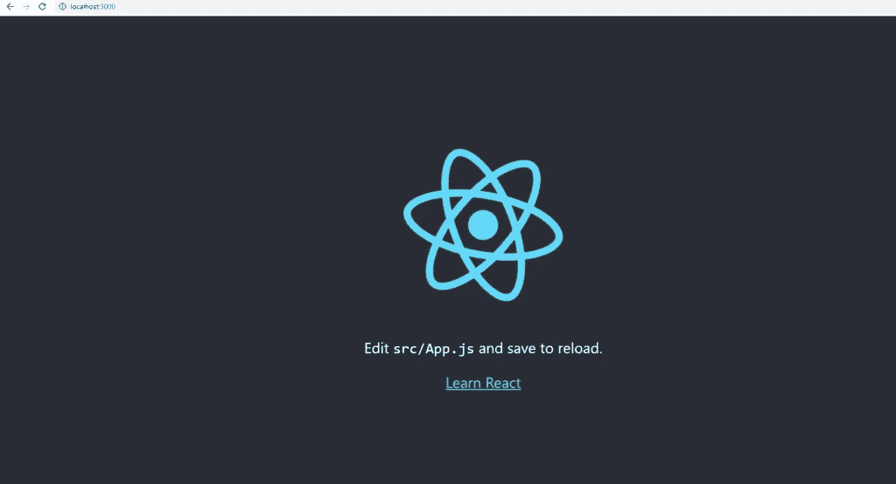

# 面向初学者的 React web 开发

> 原文：<https://blog.devgenius.io/web-development-with-react-for-beginners-bbfbc09063fe?source=collection_archive---------2----------------------->

本文的目的是指导初学者使用 React 进行 web 开发。

自 2013 年首次发布以来，React 越来越受欢迎。与 Angular 和 Vue 一起，这 3 个库/框架已经被单独用于 web 应用程序的前端开发。

我有机会指导几个正在 React 中挣扎的初级开发人员。于是有了写这篇文章的想法，希望这篇浅显的文章能够帮助那些面临同样情况的人..

事不宜迟，我们开始吧。


第一部分

# 什么是反应？

React 是一个开源的 Javascript 库，主要用于构建用户界面或网站的前端。

# 我需要了解 Javascript 才能学会 React 吗？

因为 React 是一个 Javascript 库，如果你对 Javascript 一无所知，你的学习曲线会很陡。

不过，请放心，在本教程中，我将指导您了解开始使用 React 开发网站所需的所有知识。

# 我完全被锁定了，我现在需要做什么来开始？

如果你准备好了，那我们就开始吧。

请注意，我在教程中使用的是 Windows。

首先，确保你的电脑或机器上安装了 [Node.js](https://nodejs.org/en/) 。

安装之后，打开命令提示符并运行这个命令`node` -v 来检查是否安装了 Node.js。


结节

根据您安装的 Node.js 的版本，它应该会在您运行命令时显示出来。

太好了！现在，让我们继续创建我们的第一个 React 应用程序。

# 创建您的第一个 React 应用程序

在您打开同一个命令提示符下，运行以下命令。

```
npx create-react-app *your-app-name*
```

创建 react 应用程序

脚本运行完成后，您现在可以通过运行以下命令来启动 React 应用程序。

```
cd *your-app-name*
npm start
```


如果您在命令提示符下阅读日志，您会看到 React 告诉您使用`yarn`。但是不要担心，我们也可以使用`npm`。

如果你对`yarn`感兴趣，可以在这里随意阅读[。基本上，yarn 只是另一个包管理器，如果您不想使用 npm，可以使用它。](https://yarnpkg.com/getting-started/install)

运行完`npm start`后，打开`localhost:3000`进入浏览器。通常脚本会自动打开它，但是万一没有打开，你可以在浏览器中手动打开它。



恭喜你！您已经成功创建并运行了您的第一个 React 应用程序。现在事情只会变得更有趣。

# 面向初学者的 React web 开发—在 React 应用程序中创建您的第一个页面

在我们进入细节之前，让我们先来看一下 React 应用程序的默认文件结构。


`App.js`是应用程序为我们创建的默认 React 组件。如果你仔细看，这个文件包含一个名为`App()`的功能组件，它所做的只是返回 HTML 元素。

在文件的底部是`export default App`，这是一个导出你想要的模块/函数/类的基本 Javascript 方式，如果你愿意，你可以把它导入到另一个文件中。

现在，请记住，这只是您定义组件的部分。您仍然需要一种方法来实际初始化组件。

那么，我们在哪里初始化组件呢？

# React 应用程序的入口点:index.js

让我们仔细看看`index.js`文件。


现在，`index.js`文件开始导入一些库/模块。我们只是简单地导入了`React`、`ReactDOM`、`App`和一些在这一点上不重要的东西。

没错，`App`导入其实就是我们之前说的`App()`功能组件。

在**第 7 行**上，我们正在使用`ReactDOM`模块并调用`render()`方法来渲染或初始化我们的`App()`功能组件。

非常简单。但是等等，什么是`document.getElementById('root')`？这段代码是做什么的？

当我们使用`ReactDOM`模块来呈现我们的 React 组件时，我们实际上并没有告诉它在模块呈现它之后应该把它放在哪里。如果您删除这段代码，将会中断应用程序，因为`ReactDOM`模块不知道在哪里呈现组件。

这段代码`document.getElementById('root')`实际上是告诉 React 获取 id 为`root`的 HTML 元素，并使用它来呈现 React 组件。

接下来的部分是，正如你们都知道的，id 为`root`的 HTML 元素驻留在哪里？

在同一个项目文件夹中，打开`public/index.html`让我们仔细看看文件的内容。


在`index.html`文件中，如果你查看第 31 行，你可以看到一个 id 为`root`的 HTML 元素`div`。这是将用于呈现 React 组件的 HTML 元素。

好了，就这样吧！在我们详细讨论 React 组件之前，这是您首先需要知道的。

# 面向初学者的 React web 开发——功能和类 React 组件

我觉得我需要澄清的另一件事是，React 组件是任何 React 应用程序的构建模块。

想象一下，一个网页上有所有这些独立的功能。像图像轮播，购物车，登录，excel 文件阅读器，PDF 浏览器等可以在一个单一的页面上。

如果我们要在**的一个组件**中实现所有这些特性，这将会变得很混乱，开发者要维护或扩展它将会非常困难。

相反，我们所做的是将它们分解成各个独立的部分。这样，我们可以有更好的时间来维护它们，或者如果我们以后需要扩展它们的话。

因此，请记住，在 React 中，一个页面可能包含也可能不包含多个组件。一个 React 组件可以组成一个页面，但是看到几个组件组成一个页面时不要惊讶。

说完这些，我们来谈谈 React 组件的类型。

# 反应组件—功能和类组件

先说**功能反应组件**先。继续创建一个名为`Profile.js`的新文件，并确保它与`App.js`在同一层


```
function Profile() {
    return (
      <div >
        <h1>My Profile</h1>
      </div>
    );
  }

  export default Profile;/*// you can also define a function like this using the arrow function
const Profile = () => {
    return (
      <div >
        <h1>My Profile Arrow</h1>
      </div>
    );
}
*/
```

上面这段代码就是我们所说的功能性反应组件。原因是因为我们将这个组件声明为一个`function`

打开你的`index.js`把这个加起来。


```
import React from 'react';
import ReactDOM from 'react-dom';
import './index.css';
import App from './App';
import Profile from './Profile';
import reportWebVitals from './reportWebVitals';ReactDOM.render(
  <React.StrictMode>
    <App />
    <Profile />
  </React.StrictMode>,
  document.getElementById('root')
);// If you want to start measuring performance in your app, pass a function
// to log results (for example: reportWebVitals(console.log))
// or send to an analytics endpoint. Learn more: https://bit.ly/CRA-vitals
reportWebVitals();
```

转到你的反应页面，你应该会看到这一点。

至此，您已经成功地创建了自己的功能组件。很好，不是吗？在这一点上，这可能是一个基本的组成部分，但我们将在以后详细讨论。

接下来，让我们谈谈如何将这个功能性的`Profile`组件变成一个类组件。

回到`Profile.js`，用这段代码替换。

```
import React from "react";class Profile extends React.Component { render(){
        return (
            <div >
                <h1>My Profile Class Component</h1>
            </div>
        )
    }
} export default Profile;
```

转到 react 站点，您应该会看到新的类组件。


很简单，对吧？什么事？酷！

现在你可能会问自己，函数组件和类组件之间有什么区别吗？何时何地应该使用函数组件或类组件？

# 功能组件和类组件的比较

**功能组件**

1.  functional 中没有 render()方法，所以你不必总是返回 HTML。
2.  当您想快速构建一个简单的组件而不必处理复杂的逻辑或状态时。
3.  通常作为一个组件使用，道具通过它传递给组件，并用于呈现 UI 的一部分。
4.  可以接触到钩子。

**类组件**

1.  如果你想返回一个 HTML，总是需要一个 render()方法来返回 HTML。
2.  当您需要创建处理状态和逻辑的复杂组件时。
3.  通常用于在将数据作为道具传递给子组件之前获取和操作数据。
4.  有权使用生命周期方法。

# 面向初学者的 React web 开发— React 类组件

首先，让我们创建一个新文件，命名为`About.js`

在文件中，粘贴以下内容。

```
import React from "react";class About extends React.Component {
 render(){
        return (
            <div >
                <h1>About Class Component</h1>
            </div>
        )
    }
} export default About;
```

相当简单的一段代码。现在让我们把它变得更有趣。

在 React 中，你几乎总是会看到或听到术语**生命周期方法**、**状态**和**道具**。这些东西是什么？请允许我解释。

# 反应生命周期方法

生命周期方法是独特的内置 React 方法，允许我们确定组件的行为。

*为什么叫生命周期？*因为每个 React 组件都经历一个生命周期，或者更简单地说，经历一系列事件。这一系列事件或生命周期始于组件的初始化、组件的更新、组件的呈现以及最终组件的去激活或去初始化。

正确的术语如下。

1.  **挂载** —组件初始化。
2.  **更新** —组件的更新。
3.  **渲染** —组件的渲染。
4.  **卸载** —组件的取消初始化。

使用生命周期方法，我们可以在上述一系列事件中做很多事情。下面是我们可以使用的生命周期方法。

1.  `**constructor()**` -该方法在组件的**挂载**事件期间立即运行
2.  `**componentDidMount()**` -在你的组件被**挂载**之后，在**渲染**事件之前，你可以使用这个方法运行任何逻辑。
3.  `**render()**` -是的，你可能之前见过这个，但这也是你用来**渲染**一个组件的生命周期方法。
4.  `**componentDidUpdate()**` -在组件发生更新后调用的方法。
5.  `**componentWillUnmount()**` -在组件的**卸载**事件之前调用的方法。这种方法通常用于清理，比如销毁 subscribe 方法。

还有其他的生命周期方法，我没有在上面列出，但是上面的 5 个方法是你需要知道的基本的和最常用的。

# 反应状态

既然你已经知道了**生命周期方法**，那么让我们来谈谈 React 组件中的**状态**。

更简单地说，一个反应状态实际上只是一个 JavaScript 对象，用来表示组件的状态信息。在组件的生命周期中，状态可能会更改，也可能不会更改。

当组件状态更改时，会发生更新，并且组件会重新呈现。

```
this.state = {
  name: "rasyue",
  blog: "rasyue.com"
}
```

以上是 React 组件中状态的简单示例。在组件的生命周期中，上述信息可能会发生变化。但是我们如何改变它呢？

我们可以通过使用`setState`方法简单地改变状态，这也是一个内置的 React 方法。参见下面的例子。

```
this.setState({
   name: "rasy",
   blog: "rasy.com"
})
```

永远记住`setState`是**异步**，因此不要期望它会立即发生。这意味着当你在一行中调用`setState`时，你绝不能假设它会立即出现在下一行代码中。

# 面向初学者的 React web 开发——React 类组件的生命周期方法和状态

现在，让我们使我们的`About`组件更有趣。

在您的`About.js`中，替换为以下内容。

```
import React from "react";class About extends React.Component { constructor(props){
        super(props)
        this.state = {
            name: "Rasyue",
            website: "rasyue.com",
            post: "React for Beginners"
        }
    } render(){
        return (
            <div >
                <h1>About Class Component</h1>
                <p>{this.state.name}</p>
                <p>{this.state.website}</p>
                <p>{this.state.post}</p>
            </div>
        )
    }
} export default About;
```

接下来，转到`index.js`并将您的`About`组件添加到堆栈中。

```
import React from 'react';
import ReactDOM from 'react-dom';
import './index.css';
import App from './App';
import Profile from './Profile';
import About from './About';
import reportWebVitals from './reportWebVitals';ReactDOM.render(
  <React.StrictMode>
    <App />
    <Profile />
    <About />
  </React.StrictMode>,
  document.getElementById('root')
);// If you want to start measuring performance in your app, pass a function
// to log results (for example: reportWebVitals(console.log))
// or send to an analytics endpoint. Learn more: https://bit.ly/CRA-vitals
reportWebVitals();
```

刷新 React 页面后，您现在应该会看到这一点。


很漂亮吧？简单地添加`constructor()`方法允许您在`About`组件状态中保存信息。

为了帮助您更好地理解这一点，让我们从`constructor()`开始逐一查看。

```
consructor(props){
  super(props)
  this.state = {
   name: "Rasyue",
   website: "rasyue.com",
   post: "React for Beginners"
 }
}
```

首先，`super(props)`是一行代码，我们需要它作为对父节点`constructor()`的引用。在这种情况下，因为我们扩展了`React.Component`，所以我们引用了它的`constructor()`。

如果这让你困惑，只要确保你没有忘记在你的组件`constructor()`中添加`super(props)`。关于这一点，你真的不必说得太详细。

接下来是`this.state`，像其他所有变量一样，我们只是声明一个变量，然后在其中设置一些信息。没什么太复杂的。

现在，让我们通过使用`this.setState()`来尝试用不同的信息改变我们的组件。

用以下内容替换您的`About`。

```
import React from "react";class About extends React.Component { constructor(props){
        super(props)
        this.state = {
            name: "Rasyue",
            website: "rasyue.com",
            post: "React for Beginners"
        } this.handleChange = this.handleChange.bind(this);
    } handleChange(event) {
        this.setState({
            [event.target.name]: event.target.value           
        });
    } render(){
        return (
            <div >
                <h1>About Class Component</h1>
                <input type = 'text' name = 'name' value = {this.state.name}   onChange={this.handleChange}/>
                <input type = 'text' name = 'website'  value = {this.state.website} onChange={this.handleChange} />
                <input type = 'text' name = 'post' value = {this.state.post}  onChange={this.handleChange}  />
                <p>{this.state.name}</p>
                <p>{this.state.website}</p>
                <p>{this.state.post}</p>
            </div>
        )
    }
} export default About;
```

重新加载你的浏览器并测试它。

在我们开始构建我们的网站之前，让我们快速地讨论一下功能组件。

# 面向初学者的 React web 开发——React 功能组件

一个功能性的 React 组件基本上是一个呈现 JSX 元素的函数。

例如:

```
// functional React componentfunction Contact() {
    return (
      <h1>Contact Component</h1>
    );
} // also a functional component but using arrow function
export const ContactUs = () => {
    return (
      <h1>Contact Us Component</h1>
    );
} export default Contact;
```


上面显示了创建一个功能性 React 组件的两种不同方式。这两种方式都可行，这完全取决于你的选择。

但是，如果您的 React 组件很大而且很复杂，我建议您使用第一种方法。对简单构件使用第二种方法。

将它们导入`App.js`并显示。


有了这些东西。让我们进入下一步。

# 面向初学者的 React web 开发——进行 HTTP/API 调用

现在我们已经了解了 React 组件、状态和生命周期。

下一步将是学习如何在 React 中进行`http`调用。

像任何其他前端框架一样，进行 http 调用是应用程序能够与后端应用程序对话以获取数据/信息的必要条件。

这样做将允许您向用户显示动态数据、受保护的信息等等。

我们开始工作吧。

在我们打`http`电话之前，我们需要安装`axios`

你可以选择使用`fetch`，我将在本教程中展示如何使用`axios`。

```
npm i axios
```

接下来，创建一个新组件。我们将从类组件开始，然后转到功能组件。

```
import React from "react";
const axios = require('axios');class Entry extends React.Component { constructor(props){
        super(props)
        this.state = {
            data: [],
            count: 0         
        }    }
 getData = () =>{ axios.get('https://api.publicapis.org/entries')
        .then((response) => {
            console.log(response.data.entries)
            this.setState({
                count: response.data.count,
                data: [...this.state.data, response.data.entries]
            })

        })
        .catch((error) => {
            // handle error
            console.log(error);
        }) } render() { return (
            <div>
                <h1>Hello Entry</h1>
                <button onClick={this.getData}>Get Entry Data</button>
                <p>Entry Count: {this.state.count}</p> {this.state.data.length > 0 
                    ?(
                        <>  
                            <div>
                                {this.state.data.map((data, index) => {

                                    // here's a little exercise for you, find out why the data is not displaying
                                    <p key = {index}>{data.Description}</p>

                                })}
                            </div>
                        </>
                    )
                    :(
                        <> <p>No data</p>
                        </>
                    )
                }
            </div> )
    }
} export default Entry
```

在`App.js`中导入该组件并刷新。

```
import logo from './logo.svg';
import './App.css';
import Entry from './Entry' function App() {
  return (
    <div className="App">
      <header className="App-header">
        
        <p>
          Edit <code>src/App.js</code> and save to reload.
        </p>
        <a
          className="App-link"
          href="https://reactjs.org"
          target="_blank"
          rel="noopener noreferrer"
        >
          Learn React
        </a>      
        <Entry />
      </header>
    </div>
  );
}export default App;
```

你应该有这样的东西。


接下来，让我们看看如何对功能组件做同样的事情。

```
import React, {useState} from "react";
const axios = require('axios');function Entry(){ const [data, setData] = useState([]) const getData = () =>{ axios.get('https://api.publicapis.org/entries')
        .then((response) => {
            console.log(response.data.entries)           
            setData(response.data.entries)
        })
        .catch((error) => {

            console.log(error);
        }) } return (
        <div>
            <h1>Hello Entry Functional</h1>
            <button onClick={getData}>Get Entry Data</button>
            <p>Entry Count: {data.length}</p> { 

                // more exercise for you, try to display the data using .map() /* data.map(item => { })
                */
            }
        </div> )

}
```

上面显示了我们如何做同样的事情，但功能的风格。

复制粘贴以上代码并刷新。


您将看到您将拥有完全相同的功能。

# 结尾但不是真的…

无论如何，这是本教程的第一部分。

在第二部分，我们将学习如何用正确的 web 架构和开发方法来构建我们的网站。

敬请期待！