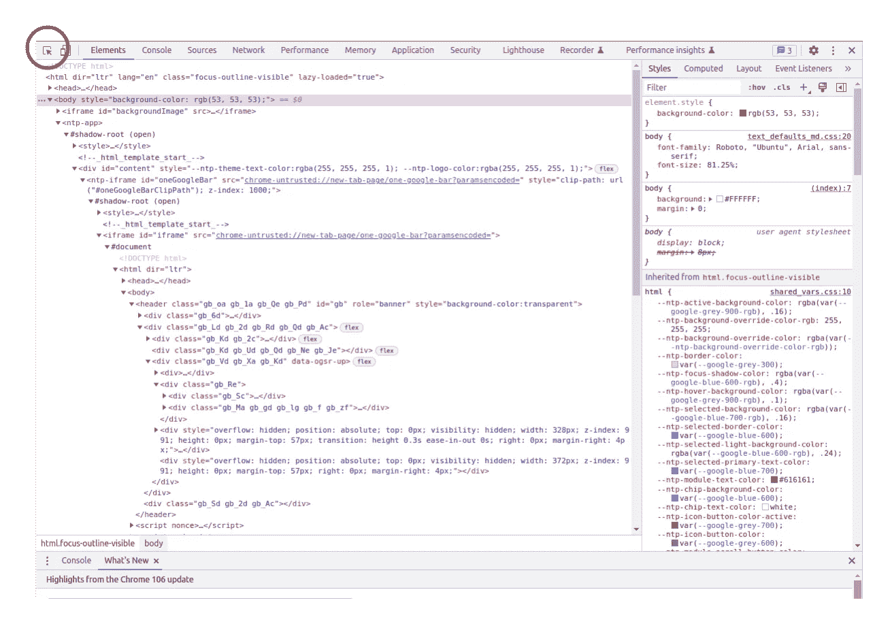

# 用 Python 掌握 Web 抓取:综合指南

> 原文：<https://blog.devgenius.io/web-scraping-overview-with-python-b781e57528b4?source=collection_archive---------3----------------------->

## 使用 Python 揭开 web 抓取的秘密，发现从 Web 中提取有价值数据的最新工具和技术

了解如何在浏览器开发工具中导航，并利用 Web APIs 的强大功能轻松抓取数据。本指南全面概述了 Web 抓取，并提供了实用的提示和参考，帮助您掌握数据提取的艺术。

土屋的照片来自 [Unsplash](https://unsplash.com/)

> ❓ **你有没有问过自己，你有没有权限去抓取一个网站？**
> 
> 💡有一个 **robots.txt 文件(**在域名的根目录下)**，**也被称为 robots exclusion protocol，这是一个基于网络的标准，网站使用自动脚本来交换信息——提供可以和不可以抓取的权限。点击了解更多信息[。](https://www.seobility.net/en/wiki/Robots.txt?utm_source=google&utm_medium=cpc&utm_campaign=wiki_en&utm_term={robots%20txt}&utm_content=lp_robots.txt&gclid=EAIaIQobChMI2tTvmcal-gIVV-h3Ch02Tw9ZEAAYASAAEgIji_D_BwE)

# 网络的构建模块

让我们从一些基本的开始。**为了有效地从网络上抓取数据，理解构建数据的数据结构是很重要的，这也允许人们对幕后发生的事情进行逆向工程。**这是一个有趣的话题，不仅是组成它的内容，还有它是如何被检索到的，以及它遵循的组织结构——看看我以前的一篇帖子[吧](https://medium.com/@tp4348/what-happens-when-you-visit-a-website-1fd12cc241dc)我在那里深入探讨了一些细节。现在，让我列举一些技术:

*   **超文本传输协议(** HTML)是一种在客户端和 web 服务器之间传输 HTML 文档等资源的应用协议。
*   **可扩展标记语言(** XML)是一种用于在互联网上分发数据的标记语言，具有一组用于对文档进行编码的规则，这些规则是可读的并且易于在机器和文档之间进行交换。
*   JavaScript 是一种编程语言，用于添加动态特性并在网页中提供基于用户的交互。
*   JavaScript 对象符号( JSON)是一种用于从服务器向网页存储和传输数据的格式。
*   **级联样式表(** CSS)描述 HTML 元素的显示属性和网页的外观。

这就是你需要知道的关于数据的全部内容。但是我认为没有人来这里仅仅是为了阅读一些关于网络的事实。在接下来的几节中，我将简单介绍一下 Python 模块，我认为这些模块目前被大多数 Python 社区所使用，并且仍在积极地更新中。

> ❓ **为什么选择 Python？**
> 
> 💡嗯，我认为这是最简单的工作，除了有一个大的社区支持，它通常还为我们提供了一个或两个解决类似问题的库，我们可以选择哪个更适合我们的需要。

# 检索内容

从 web 上检索内容最直接的方法是使用 [**请求**](https://pypi.org/project/requests/) 库。它不仅允许您调用各种 HTTP 方法(GET、POST、DELETE 等)，还允许您处理 JSON 请求、cookie 处理、编码等。

Python 中的一个简单示例如下所示:

该示例输出了您从网页中检索到的所有可能的功能，并且有许多功能。

通常，如果您想从 URL 中检索完整的内容，然后在代码中对其进行过滤，就应该这样做。**但有时你已经想收集一些特定的信息**，因为检索所有信息不仅会造成一点混乱，还会考虑这样一种情况，即网站被创建者修改，但你在脚本中硬编码了对响应的过滤，现在它不再工作了。让我们在接下来的部分看看如何解决这个问题。

# Web 浏览器开发工具(DevTools)

在我们深入到具体的模块之前，有必要介绍一下网络浏览器工具，这些工具可以帮助我们识别我们正在查看的内容中的特定元素，就像我们在上一节中所做的那样，仅仅通过查看我们在程序中得到的响应会更加困难。我使用的是**谷歌 Chrome** ，它有一个内置的开发者工具，有很多功能，比如:

*   **元件识别**
*   **选择**
*   **文档对象模型(DOM)导航**

您可以通过按下 **Ctrl + Shift + I** 来打开 DevTools，浏览器中的一个侧标签将会为您打开。你可以在**网络**标签下寻找网络相关信息，或者在**元素**标签下寻找 HTML 代码——以及许多其他东西。但是，由于大多数人可能会寻找一段实现特定的 HTML/XML/…代码，下面是如何找到它的方法。

单击图标(红色圆圈中)将使您能够将光标指向网页上的任何对象，同时它会在代码中为您勾勒出它的轮廓(如上所示，带有灰色线条)。

> 💡DevTools 不仅在抓取网页时有用，在开发应用程序时也很有用——它是调试的基本工具之一。

# 抓取内容

到目前为止，我们已经学习了 web 开发技术、它们的结构、数据查找技术，以及使用 Python 编程语言访问 web 内容。现在有趣的部分来了。

如您所料，基于 Web 的内容存在于使用一些预定义的文档表达式的部件或元素中。分析这些零件的模式是处理方便刮擦的主要任务。让我们来看看几个 Python 库，人们可能会用它们来从站点中抓取特定的元素。

## lxml

lxml 优于 Python 中其他基于 xml 的库，因为它的**高速和有效的内存管理**。它还包含各种其他功能来处理大小 XML 文件。Python 程序员使用 lxml 处理 xml 和 HTML 文档。关于 lxml 及其库支持的更多详细信息，请访问 [**https://lxml.de**](https://lxml.de/) 。

## pyquery

pyquery 是一个类似 jQuery 的 Python 库，它在后台使用 lxml 库。pyquery 缩短了元素处理，并提供了一种更有洞察力的脚本方法，适用于抓取和基于 DOM 的遍历和操作任务。

> 💡**你可能想知道——jQuery 是最受推崇的 JavaScript 库之一，它小巧、快速，具有许多支持 DOM/HTML/CSS 等的特性。**

## Scrapy

Scrapy 是一个用 Python 编写的网络爬行框架，用于以有效和最少的编码爬行网站。Scrapy 最初是为网页抓取而设计的；随着它的流行和发展，它也被用来从 API 中提取数据。

> ❓ **你知道吗，在域名的根目录下，通常有一个 XML 文件，保存着与当前页面引用的 URL 相关的信息。**
> 
> 💡**sitemap . XML 文件—** 维护网站地图是一种简单的方式，可以通知搜索引擎网站包含的 URL，也可以在您需要抓取它所指的网站时使用。

## 美味的汤

Beautiful Soup 提供了完整的解析相关特性，使用 lxml 也可以获得这些特性。简单易用的方法集合，加上处理导航、搜索和解析相关活动的属性，使得 Beautiful Soup 在其他 Python 库中备受青睐。与其他库和解析器相比，Beautiful Soup 的一个显著特点是，它还可以用来解析不完整的 HTML 或缺少标签的文件。

> ❓ **你厌倦了在云端运行你的网页抓取脚本，你渴望学习自己托管它吗？**
> 
> 😶‍🌫️看一下我之前的一篇网络抓取文章，我简要描述了一个完整的自托管网络抓取农场架构，包括 GitHub Actions、Docker、ArgoCD、Kubernetes 等功能。

这是一个非常粗略的 Web 抓取库概述，但是如果你刚刚开始，我建议你尝试一下。

# 高级概念

通常，一切都围绕我刚才简要描述的这 5 个库展开，但它们也是一些我没有提到的中级到高级的主题，如安全 Web、身份验证、Cookies、Selenium 和 Regex——所以下次我还有一些东西要谈:)

> 感谢阅读！😎如果你喜欢这篇文章，点击下面的按钮👏
> 
> 对我来说意义重大，也有助于其他人了解这个故事。在 [Linkedin](https://www.linkedin.com/in/teodor-janez-podobnik/) | [Twitter](https://twitter.com/TeodorJanez) 上问好
> 
> 要不要开始读 Medium 上的独家故事？使用此[推荐链接](https://medium.com/@tp4348/membership)🔗
> 
> 如果你喜欢我的帖子，你可以[给我买个热狗](https://www.buymeacoffee.com/tp4348)🌭
> 
> 你是一个热情的工程师，但缺乏能力来编写引人注目和鼓舞人心的技术内容吗？雇用我做升级工作[🛠️](https://www.upwork.com/freelancers/~0179a118d727f15420?viewMode=1)
> 
> 在 Teodor J. Podobnik，@dorkamotorka 上查看我的其他内容，并关注我的更多内容，干杯！