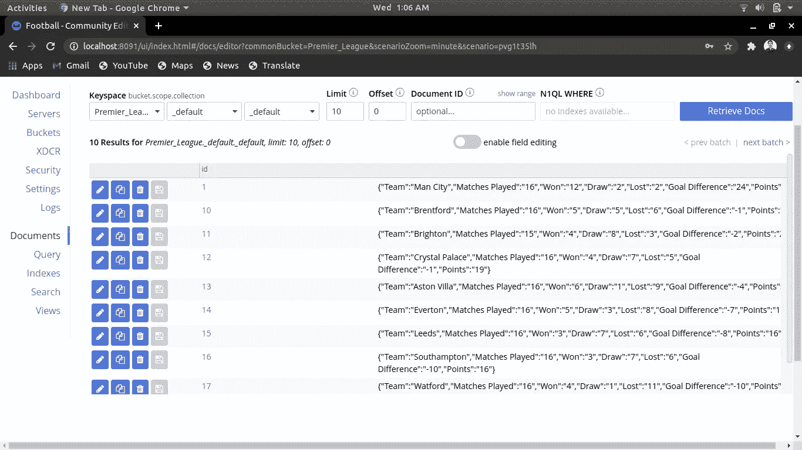

# 使用 Couchbase 服务器进行网页抓取

> 原文：<https://blog.devgenius.io/web-scraping-with-couchbase-server-629da1e92c43?source=collection_archive---------13----------------------->


本文旨在概述如何通过三个简单的步骤将抓取的数据从 web 存储到 couchbase 服务器中。

# 什么是网页抓取？

它是从网络上收集和解析数据的过程。我们利用一个非常流行的 Python 库 BeautifulSoup 从 web 上抓取数据。它与您喜欢的解析器一起工作，提供导航、搜索和修改解析树的惯用方式。它通常为程序员节省数小时或数天的工作。网上大量的结构化和非结构化数据可以在各种决策过程中使用。

# 什么是 Couchbase 服务器？

它是一个开放源码的分布式多模型 NoSQL 面向文档的数据库软件包，为交互式应用程序进行了优化。所以所有抓取的数据都将被插入/存储到 couchbase 服务器中。Couchbase 管理 JSON 文档，消除了数据库中硬编码模式的需要。JSON 中可用的应用程序对象定义是由开发人员控制的模式。

# 入门指南

## 1 .装置

*   [下载](https://www.couchbase.com/downloads)couch base 服务器，并通过输入集群名称、用户名和密码来设置集群。
*   从存储桶部分创建一个存储桶
*   安装图书馆[美索](https://pypi.org/project/beautifulsoup4/)和[沙发座](https://pypi.org/project/couchbase/)

## 2.密码

*   导入所需的库

```
**import** requests
**from** bs4 **import** BeautifulSoup
**from** couchbase.cluster **import** Cluster, ClusterOptions
**from** couchbase.auth **import** PasswordAuthenticator
```

*   通过指定 URL、用户名和密码连接到 couchbase 服务器集群。选择需要存储抓取数据的存储桶

```
**def couchbase_connection():**

    cluster = Cluster('couchbase://localhost', ClusterOptions(
    PasswordAuthenticator('Administrator', 'password')))
    bucket = cluster.bucket('Premier_League')
    collection = bucket.default_collection()
    **return** collection
```

*   通过选择适当的类名或选择 HTML 元素，检查需要删除数据的网页。一旦提取了所需的元素，通过指定键和值将抓取的数据插入 couchbase 集合

```
**def scrape():** url = '[https://www.sportskeeda.com/go/epl/standings'](https://www.sportskeeda.com/go/epl/standings')
    collection = couchbase_connection()
    req = requests.get(url)
    soup = BeautifulSoup(req.text,"html.parser")
    contents = soup.find('table',class_='keeda_points_table')

    trs = contents.find_all('tr')
    for tr in trs[1:]:
        tds = tr.find_all('td')
        row = [td.text.replace('\n', '') for td in tds]

        document ={"Team":row[1],"Matches Played":row[2],
                   "Won":row[3],"Draw":row[4],"Lost":row[5],
                   "Goal Difference":row[6],"Points":row[7]}
        collection.insert(row[0],document)
```

## 3.验证插入的文档

导航到 couchbase 服务器并点击 documents 部分，验证抓取的数据是否被插入到正确的集合中。



# **完整代码**

```
**import** requests
**from** bs4 **import** BeautifulSoup
**from** couchbase.cluster **import** Cluster, ClusterOptions
**from** couchbase.auth **import** PasswordAuthenticator**def couchbase_connection():**

    cluster = Cluster('couchbase://localhost', ClusterOptions(
    PasswordAuthenticator('Administrator', 'password')))
    bucket = cluster.bucket('Premier_League')
    collection = bucket.default_collection()
    **return** collection **def scrape():** url = '[https://www.sportskeeda.com/go/epl/standings'](https://www.sportskeeda.com/go/epl/standings')
    collection = couchbase_connection()
    req = requests.get(url)
    soup = BeautifulSoup(req.text,"html.parser")
    contents = soup.find('table',class_='keeda_points_table')

    trs = contents.find_all('tr')
    for tr in trs[1:]:
        tds = tr.find_all('td')
        row = [td.text.replace('\n', '') for td in tds]

        document ={"Team":row[1],"Matches Played":row[2],
                   "Won":row[3],"Draw":row[4],"Lost":row[5],
                   "Goal Difference":row[6],"Points":row[7]}
        collection.insert(row[0],document) **if** __name__=="**__main__**":
    scrape()
```

# 结论

连接到 couchbase 的便利性及其不需要严格模式的好处使得将抓取的数据存储到 couchbase 变得毫不费力。

希望你已经理解了网络抓取的概念，现在可以根据你的需要从不同的网站抓取数据，并将它们存储或插入 couchbase 服务器。

感谢阅读！

[Github](https://github.com/ashish-mj/Scraping_Couchbase) [网站](https://ashishmj.vercel.app/) [Linkedin](https://www.linkedin.com/in/ashish-mj/)