# 使用 Microsoft Excel 进行网页抓取

> 原文：<https://blog.devgenius.io/web-scraping-with-microsoft-excel-82bebf426a15?source=collection_archive---------7----------------------->

## **提取变换和主【E T L】**

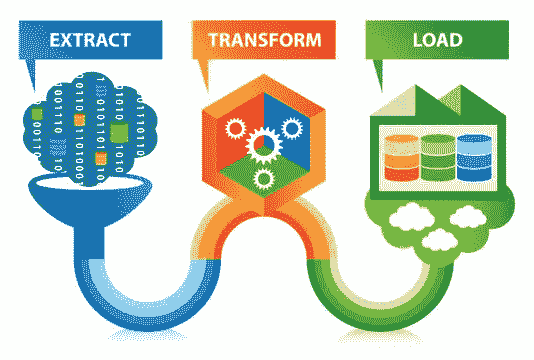

[土坯股票图片](https://stock.adobe.com/search?k=etl)

让我们面对现实吧，科技领域的许多技术词汇听起来远比实际复杂。也许它有一个“高峰混乱”的缩写。然而，如果你仔细分析这个想法，它非常有意义。

其中一个词是 ETL，即提取、转换和加载。你会听到数据工程师和数据库管理员滔滔不绝地吹嘘他们的“ETL 管道”和“ETL 工具”。这听起来像是一个训练有素的数据极客的工作，你不这样认为吗？

**Power Query** 由于集成到 Excel 中，它真正有助于 ETL 过程的民主化。

## **什么是 ETL？**

ETL 是 **E** xtract、**T**transform、 **L** oad 的缩写。我们将以更实际、更有条理的方式对此进行更多的讨论。不过，在此之前，我们先来看看“Power Quary”到底是怎么回事。

## **动力广场**

Power Query 是一个数据准备和转换 ETL 引擎，允许您连接到各种数据源。使用 Power Query **(在 Excel 中称为 Get &转换)**，您可以导入或连接到外部数据，然后以符合您需求的方式调整数据。例如，您可以删除列、更改数据类型或合并表。然后，您可以将查询加载到 Excel 中以创建图表和报告。

值得注意的是，Power Query 在 Microsoft Excel、Power BI、Power BI dataflow、Azure data factory wrangling data flow、SQL Server Analysis Services 等中可用。

在我们讨论过程“ETL”之前，让我给你看一下我们将要抓取的网站。

[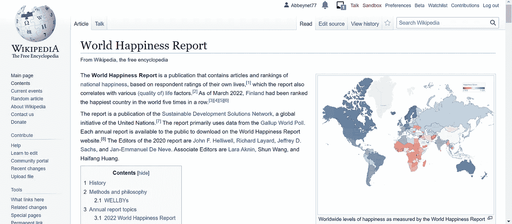](https://en.wikipedia.org/wiki/World_Happiness_Report)

维基百科上一篇题为“世界幸福报告”的文章您可以点击 [**这里**](https://en.wikipedia.org/wiki/World_Happiness_Report) 查看网站。让我们看看如何为我们的 **web 抓取**、 **web 采集、**或 **web 数据提取探索 power query 的强大功能。**

# **提取转换并加载**

## 第一步:提取

从各种数据源提取数据并导入到 Power Query 中。目前，Power Query 有相当多的连接器，包括简单的平面文件、网页、CSV 或文本文档、数据库等。

要使用 power query 来收集维基百科世界幸福报告数据，我们将转到我们的**数据选项卡**，然后转到**获取数据。**

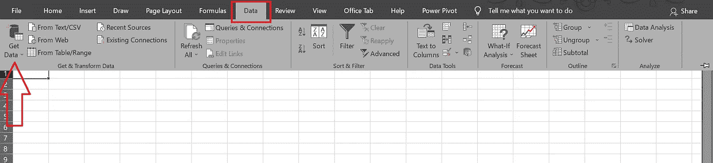

获取数据图像

单击“获取数据”下拉箭头，让我们将鼠标指针移动到“**来自其他来源”**，因为我们有兴趣从 Web“**”**获取我们的数据

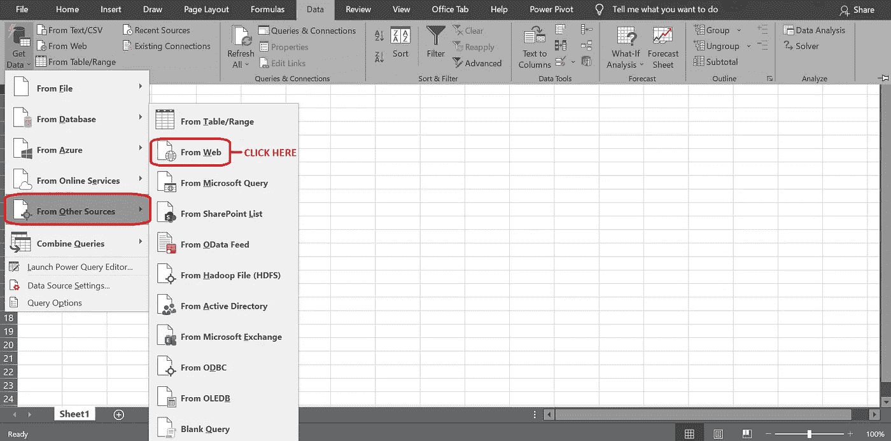

连接到数据源图像

当我们点击“来自网络”时，会出现一个对话框，让我们从维基百科世界幸福报告文章中复制并粘贴我们的 [**URL 链接**](https://en.wikipedia.org/wiki/World_Happiness_Report) 。如下图所示。

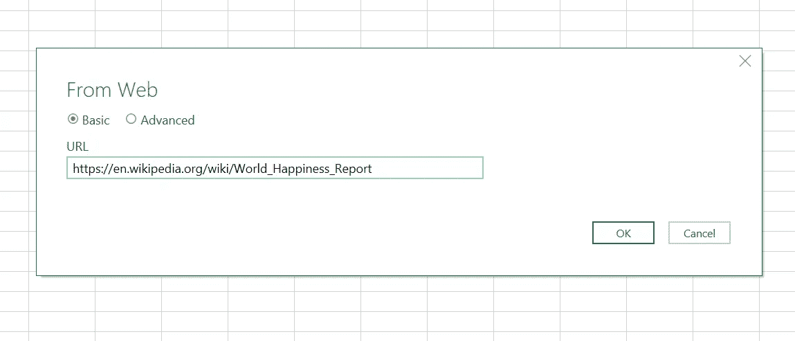

正在连接 URL 网页图像

嘣，我们准备好获取数据了。有趣的是，Power query Navigator 对话框出现加载链接中的内容，我们可以看到为“**表格视图”**和“**网络视图”**

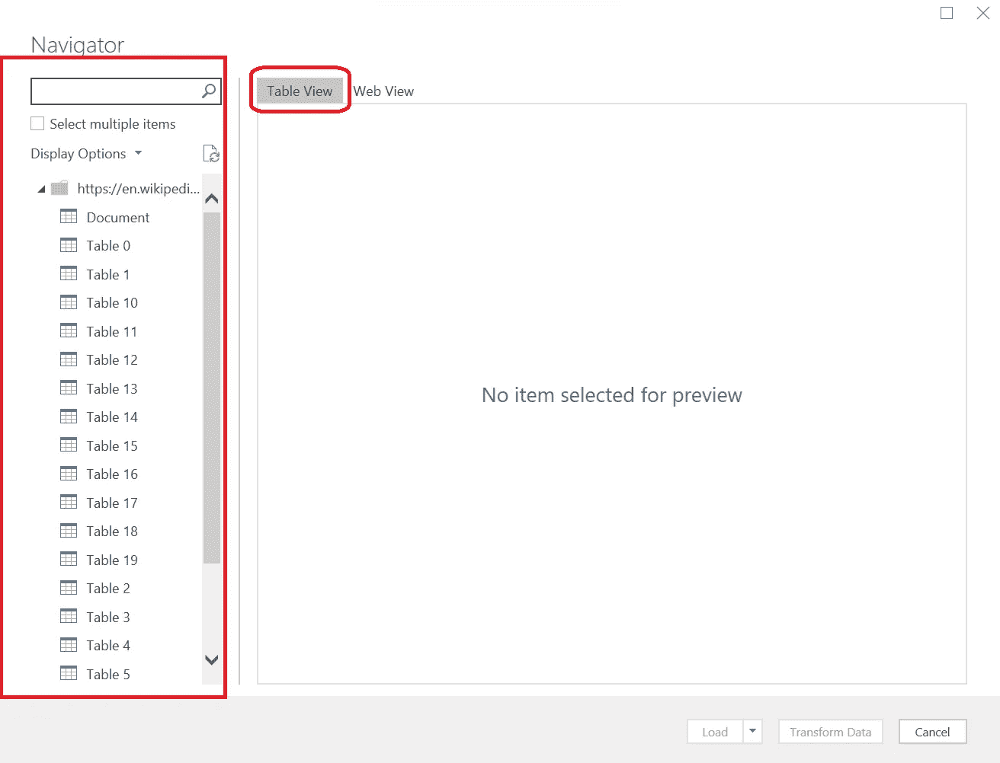

表格视图图像

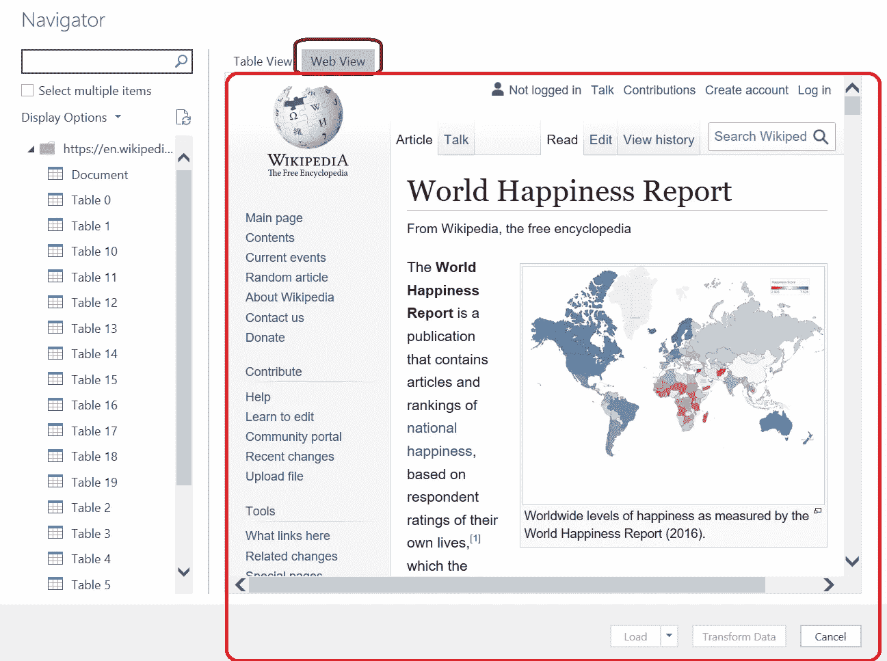

网络视图图像

此外，检查这些表，发现表 10、12、14、16 和 18 分别包含 2020、2019、2018、2017 和 2016 年的数据。

下面是 2020 年世界幸福报告表 10 的预览图。

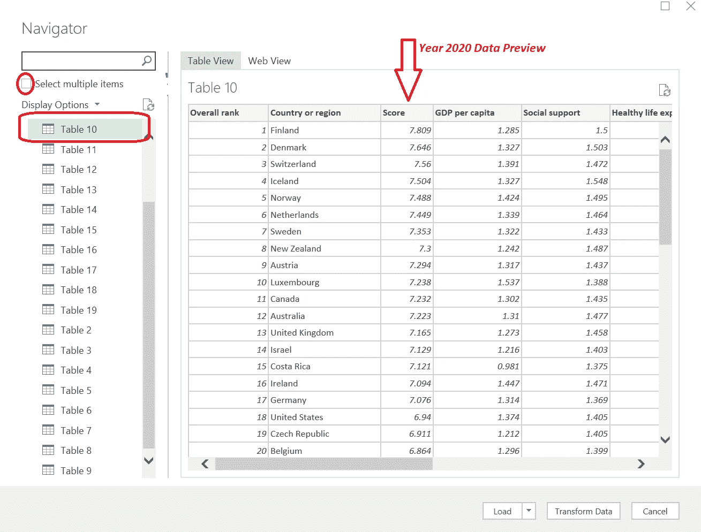

2020 年数据预览图

现在，我们将点击**多选**来选择其他年份的数据。

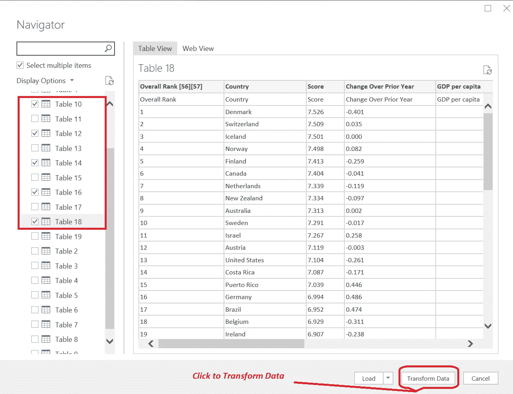

选择多个表格图像

**点击转换数据开始转换我们的数据。**

**转换数据**按钮引导我们进入 **Power Quary 编辑器**。**查询编辑器**扮演一个中间数据容器的角色，您可以通过选择行和列、拆分行和列、旋转和取消旋转列等来修改数据。

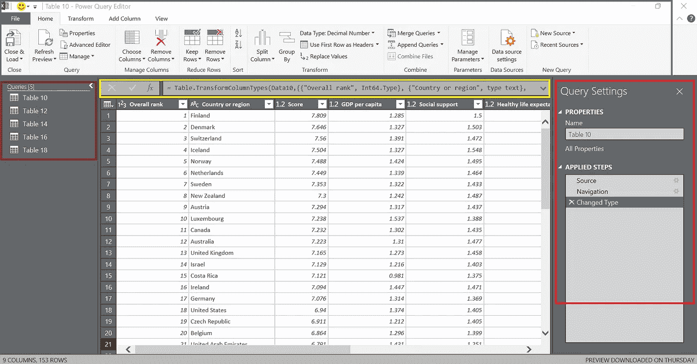

超级查询编辑器图像

注意**电源查询编辑器**用户界面。我们的**查询**、**查询设置**带有“属性”和“应用步骤”，然后我们的数据显示行和列。最重要的是，我们有 File、Home、Transform、Add Column 和 View 选项卡，它们帮助我们转换数据。更重要的是，我们有公式栏。

## **第二步:变换**

数据被清理并经过一些转换成为更有用的数据。删除重复项，形成或拆分新列，并进行更多的转换。您可以通过编写 R 或 Python 脚本、M 语言或 Power Query 的 350 多个预建数据转换按钮之一来进行转换。

**其中一些转换操作如下。**

*   检查是否丢失或重复。
*   删除和保留行和列。
*   拆分列。
*   分组。
*   更改数据类型。
*   合并和追加查询。
*   文本分析。
*   透视和取消透视。
*   查找并替换。
*   提取字符。
*   格式化。
*   运行 R 和 Python 脚本。
*   验证以确保数据质量。
*   创建条件列。

让我们现在开始转换我们的数据。首先，让我们将**“查询”**下的表 10、12、14、16 和 18 分别更改或重命名为 2020、2019、2018、2017 和 2016 年。为此，双击表 10 并输入 2020 年。对每个表也进行同样的操作，如下所示。

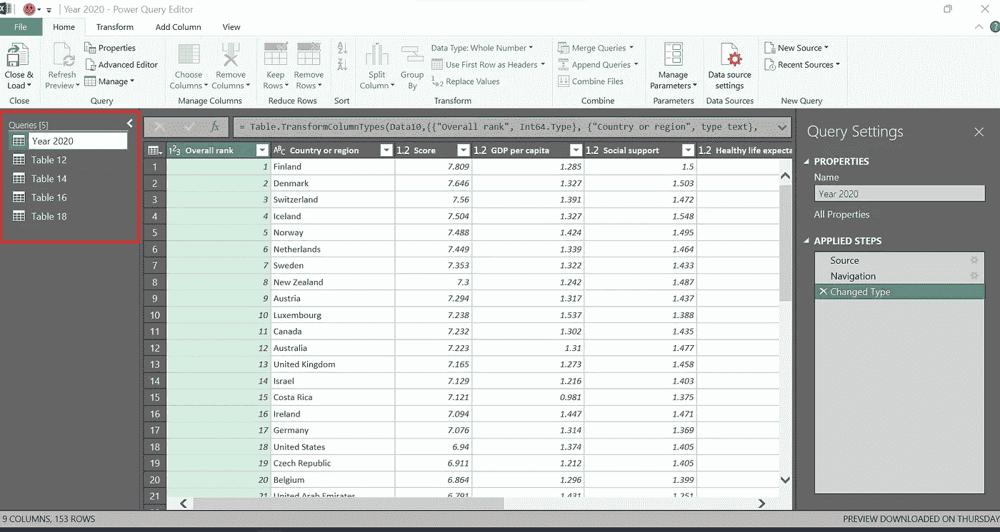

将表格重命名为年份图像

现在，我们已经重命名了所有的表，如下所示。

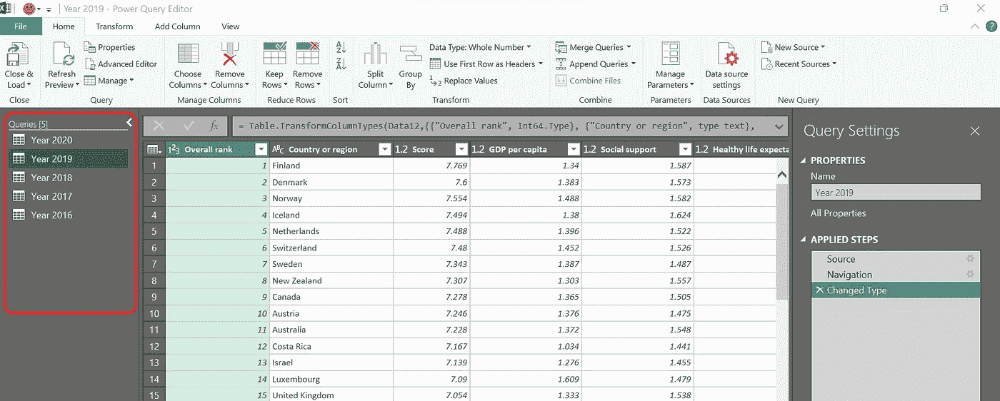

2016 年至 2020 年数据图像

## **探索每年的世界幸福记录**

## 【2020 年

2020 年世界幸福记录如下图。让我们通过大写和正确书写变量名的拼写来对变量名进行一些转换。为此，只需双击您想要重命名或更改的变量。

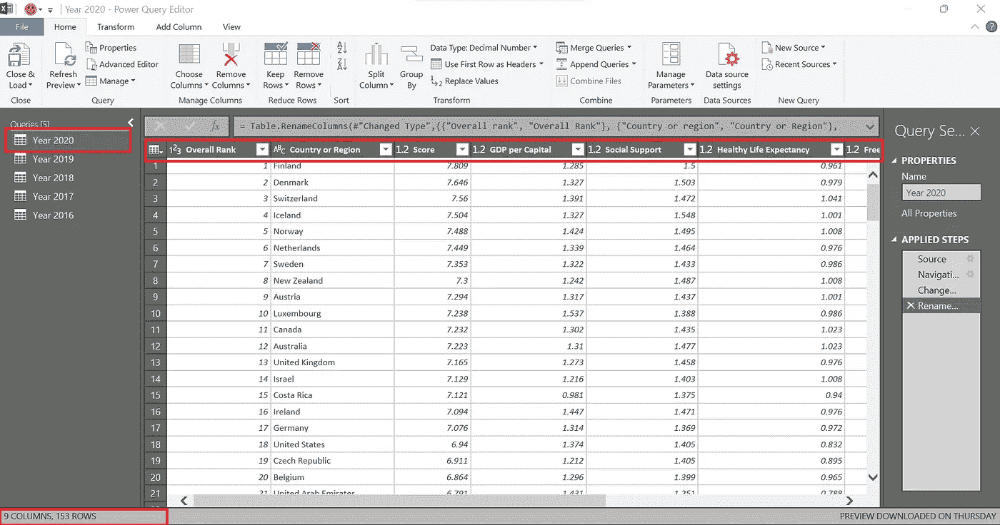

转换 2020 年图像的列名

【2020 年有以下变量:

“总体排名”、“国家或地区”、“得分”、“人均 GDP”、“社会支持”、“健康预期寿命”、“做出人生选择的自由”、“慷慨程度”、“对腐败的看法”。

【2020 年总共有 9 列 153 行数据。

> 根据维基百科，2020 年的报告显示了 2017 年至 2019 年的平均幸福分数。**芬兰**是世界上“最幸福”的国家，其次是**丹麦、** **瑞士、** **冰岛、**和**挪威。数据来自盖洛普世界民意测验，完全基于调查分数和对民意测验中主要生活评价问题的回答。**

## 2019 年

2019 年如下图所示。让我们重复应用于 2020 数据集的转换步骤。数据集包含以下变量名

“总体排名”、“国家或地区”、“得分”、“人均 GDP”、“社会支持”、“健康预期寿命”、“做出人生选择的自由”、“慷慨程度”、“对腐败的看法”。

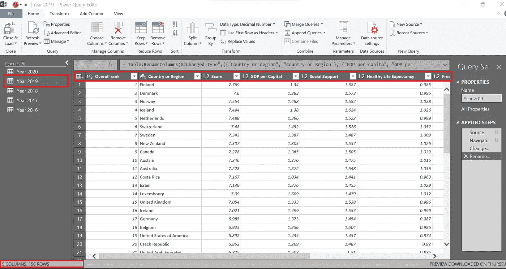

转换 2019 年图像的列名

**2019 年世界幸福记录包含 9 列 156 行数据。**

> 然而，根据维基百科，2019 年的报告显示了 2016-2018 年的平均幸福分数。根据 2019 年幸福指数，**芬兰**是世界上“最幸福”的国家。丹麦、挪威、冰岛和荷兰位居其后。该报告由联合国于 2019 年 3 月 20 日发布。《世界幸福报告》是一项具有里程碑意义的全球幸福状况调查。

## **2018 年**

2018 年也有 9 列 156 行数据。**" Perceptions of Corruption "**变量的数据类型从文本更改为十进制，列名也相应更改。因此，这些列现在在数据类型和列布局方面与 2019 年和 2020 年的列相匹配。然而，重要的是要记住 2018 年的因素还包括:

“总体排名”、“国家或地区”、“得分”、“人均 GDP”、“社会支持”、“健康预期寿命”、“做出人生选择的自由”、“慷慨程度”、“对腐败的看法”。

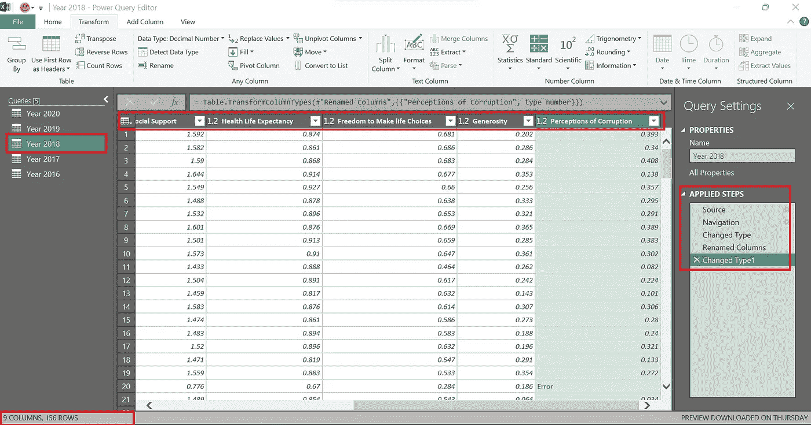

转换 2018 年度图像的列名

> 根据维基百科，2018 年的报告显示了 2015 年至 2017 年的平均幸福分数。根据 2018 年幸福指数，**芬兰**是世界上“最幸福”的国家。**挪威**、**丹麦**、**冰岛**和**瑞士**位居其后。该报告由联合国于 2018 年 3 月 14 日发布。**2018 年世界幸福报告**于 3 月 14 日在梵蒂冈教廷科学院的发布会上发布，该报告根据幸福水平对 156 个国家进行了排名，并根据移民幸福程度对 117 个国家进行了排名。

## **2017 年**

令人惊讶的是，2017 年在变量命名和排列方面采取了不同的维度。在转换数据集之前，有 12 列和 156 行数据，如下所示。

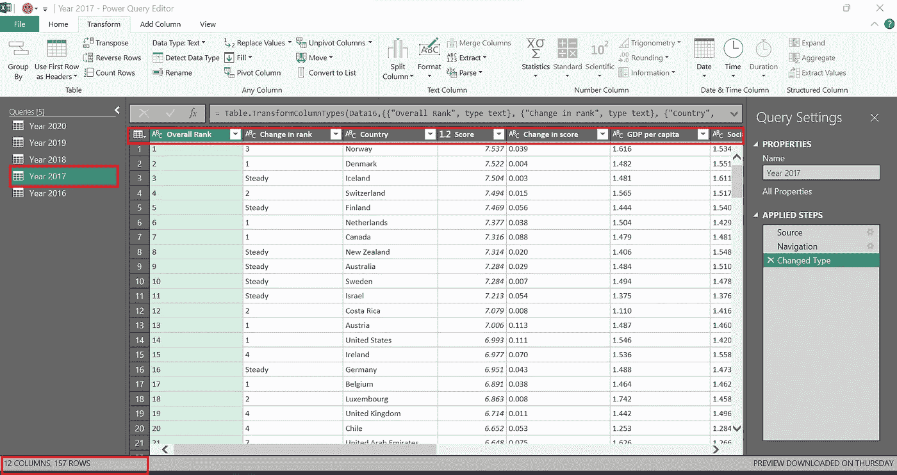

转型前 2017 年数据预览

让我们通过改变一些变量的拼写和相应的数据类型来转换数据。2017 年的数据包含以下变量名称

"总体排名"、"排名变化"、"国家"、"得分"、"得分变化"、"人均国内生产总值"、"社会支持"、"健康预期寿命"、"做出生活选择的自由"、"慷慨"、"信任"、"剩余"

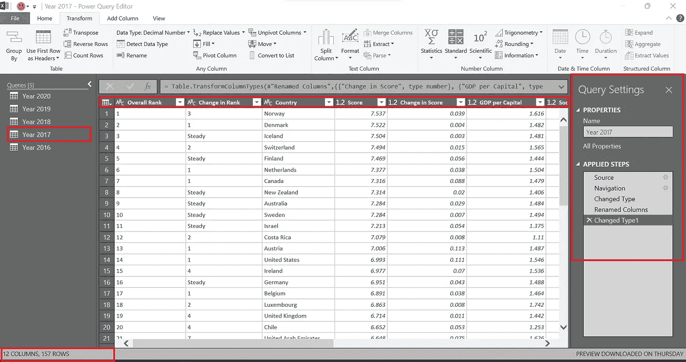

转型后的 2017 年数据预览

> 更重要的是，根据维基百科，2017 年的报告显示了 2014 年至 2016 年的平均幸福分数。在这段时间里，挪威是世界上总体上“最幸福”的国家，尽管油价已经下跌。**丹麦、** **冰岛、**和**瑞士**紧紧的包在一起。排名前五的国家中有四个遵循 [**北欧模式**](https://en.wikipedia.org/wiki/Nordic_model) 。所有排名前十的国家在这六个方面都得了高分。排名前十的后续国家是:芬兰、荷兰、加拿大、新西兰、澳大利亚和瑞典。

## **2016 年**

要转换 2016 年的数据，首先，我们必须使用第一行作为标题，并且格式化变量名。在此之前，我们先来看看下面截图中的数据预览。

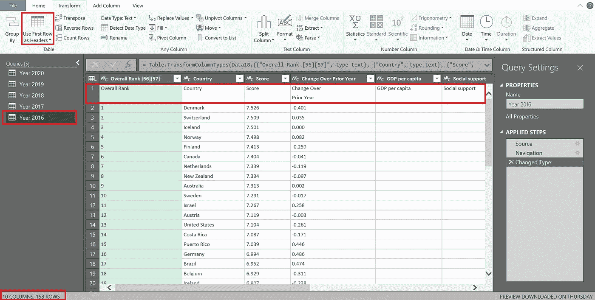

转型前 2016 年数据预览图

2016 年的数据包含 10 列 158 行数据。然而，我们发现，像“人均国内生产总值”、“社会支持”、“健康预期寿命”、“做出生活选择的自由”、“慷慨度”和“信任度”等栏目中的一些数据是空的，如下所示。

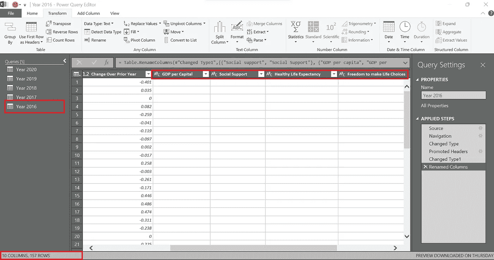

带空列图像的 2016 年数据

重要的是，我们要看看在从网上搜集数据的过程中肯定出了什么问题。

**让我们直接从 web 上查看数据，看看数据的结构。**

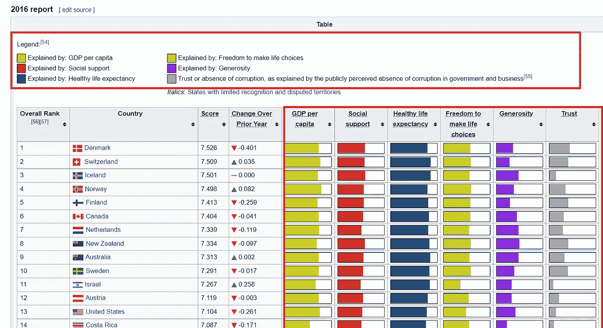

2016 年数据图片网络预览

从上图中我们可以看到，这些列利用图表对各自的变量进行了评分。因此，Power Quary 无法将它们识别为数据类型。因此，这将返回一个空列。

我想我们对此无能为力😃——lol。

然而，如果我们对数据感兴趣，我们可以找到任何其他平台或网页来收集相同类型的数据。

**我们已经走了这么远；该是我们加载数据的时候了。这将自动保存我们对数据所做的更改或转换。**

## **第三步:加载**

在这里，转换后的数据被加载到数据仓库或像 Microsoft Excel 这样的分析工具中。

为了加载数据，我们将转到查询编辑器左上角的**主页选项卡**下，单击**关闭&主页面。**

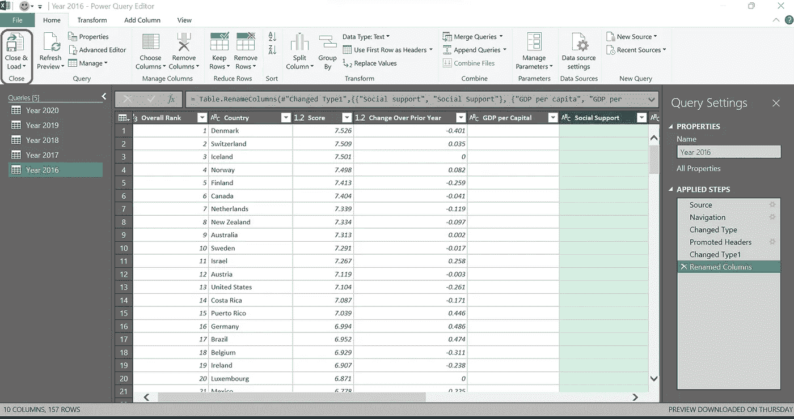

将转换后的数据加载到 MS Excel 电子表格图像中

如下图，我们的数据和我们各自所有年份的**世界幸福报告**数据**一起载入 Excel。**

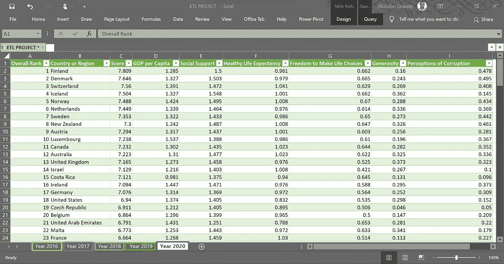

MS Excel 电子表格中的 2020 年数据预览

我们的**Microsoft Excel【ETL】**Web 抓取项目到此结束。

[**点击此处下载**](https://github.com/abbeynet77/Web-Scraping-with-Excel-ETL) 两个**中的抓取数据集。xlsx** 和 **CSV** 格式

关于这个项目，请随时问我任何问题。你的贡献也将受到高度赞赏。

随着时间的推移，我将使用 R 编程来抓取相同的网页。

# 感谢您的阅读！！！