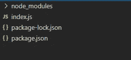

# 剧作家的网络搜集

> 原文：<https://blog.devgenius.io/web-scraping-with-playwright-1d9960909061?source=collection_archive---------2----------------------->

不管是谁在读这篇文章，你好，我们今天要做更多的网络搜集，这次我们将介绍剧作家

**我们在建造什么**

我们正在构建一个简单的 web scraper，它将获取任何子编辑的前 25 篇帖子，在本教程结束时，我们将拥有这个整齐放置的 post 对象数组

**设置我们的项目**

使用`mkdir reddit_scraper`创建一个新目录，然后使用`cd reddit_scraper`导航到该目录

1.  用`npm init --y`初始化项目，然后点击回车
2.  用`npm i --save playwright`安装剧作家，这需要一些时间，因为它需要安装 3 个浏览器的驱动程序
3.  完成后，创建 index.js，现在文件结构应该如下所示

**到底什么是剧作家**

剧作家是一个异步 web 自动化库，它使您，即开发人员，能够自动化 web 浏览器并完成需要用户交互的任务

例如，你可以点击按钮，填写表格，登录你喜欢的网站，用鼠标和键盘做任何你想做的事情

它是由谷歌之前开发木偶师的同一个团队开发的，并由他们维护

**剧作家为什么要进行网页抓取？**

web 抓取最常见的问题之一是动态内容，这些内容只有在您与网站交互时才“可见”，例如，当您需要在每天的特定时间登录网站并填写一些表格时

仅仅使用通用的抓取库，比如带 [cheerio](https://cheerio.js.org/) 的 [axios](https://github.com/axios/axios) 是无法完成这样的任务的，因为它们不支持自动化功能

**让我们开始编码**

让我们做一个简单的例子，看看剧作家如何去 google.com 搜索任何东西，然后截图——这是我最喜欢的功能之一

**剧作家中的选择者**

在上面的例子中，我们必须与两个控件交互，一个文本字段和一个按钮，那么我们如何为我们正在自动化的任何 web 应用程序获取这些呢？

我们使用`type()`函数与任何文本字段进行交互，我们得到这个选择器的方法就是简单地使用这个语法`input[ATTRIBUTE=VALUE]`，在我们的例子中，我们有一个带有值为‘q’的`name`属性的输入标签，对吗？

我们将`click()` 与按钮一起使用，按钮选择器即使不简单也一样简单，通常您可以使用您的凭证自动完成登录过程，并且登录按钮始终是一个具有设置为“提交”的`type`属性的输入元素

所以经验法则 ***输入字段后跟方括号包括任何属性***

获取选择器的另一种方法是右键单击元素>检查元素，然后右键单击检查窗口中的 html 标记，然后选择复制>复制选择器

**从谷歌上抓取当前天气**

另一个例子，我个人觉得很有用，就是用一个简单的谷歌搜索就可以得到任何一个城市的当前天气，所以让我们开始吧

添加`waitForNavigation()`是一个好主意，因为它告诉剧作家要等到页面完全加载

**抓取更复杂的页面**

现在是吃主菜的时候了，reddit.com 和抓取更多的内容，并通过更复杂的 html 结构进行解析

旧的 reddit 基本上是同一个 reddit，但布局和结构不同，尽管它看起来没有创意，但它非常适合抓取，因为它没有那么动态，所以 html 结构不会改变和破坏我们的代码

前往[https://old.reddit.com/r/askreddit](https://old.reddit.com/r/askreddit)并点击 F12 来检查页面，让我们尝试找到有意义的选择器来导航子编辑页面

正如你所看到的，所有的帖子都有一个公共的选择器，它是一个 div 标签，带有一个“thing”类，所以首先我们需要抓取所有带有`$$()`的帖子，然后简单地循环遍历它们，提取所需的数据，因为这些信息都在每个`

`中

**返回所有帖子并循环遍历它们**

我们做到了！一个抓取子编辑首页所有帖子的 reddit 抓取器

**最终注释**

*   请务必仔细检查您想要提取的元素，因为嵌套元素可能会引起混淆
*   在浏览器中充分利用 devtools，因为它们提供了提取选择器或 js 选择器的方法
*   使用控制台测试您的选择器，看看它们是否返回您想要的信息
*   要有耐心，因为网站经常改变他们的标记，甚至用验证码阻止这些抓取工具

**结论**

Web 自动化正在疯狂地兴起，随之而来的是无穷无尽的可能性，剧作家是执行 web 自动化的绝佳选择，在页面上执行 javascript 的能力也允许我们进行 web 抓取，这比常规方式更强大，因为这允许我们处理分页，还可以绕过登录屏幕

非常感谢你的时间和兴趣，如果你能走到这一步，♥