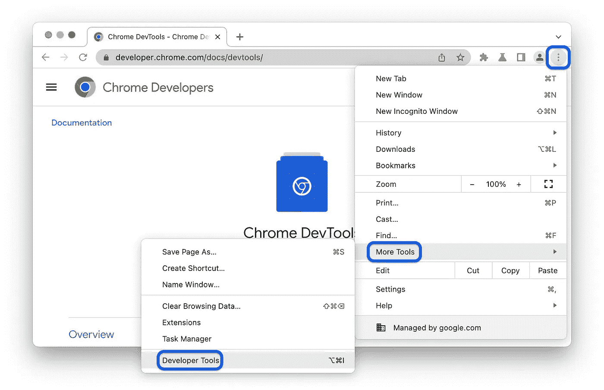
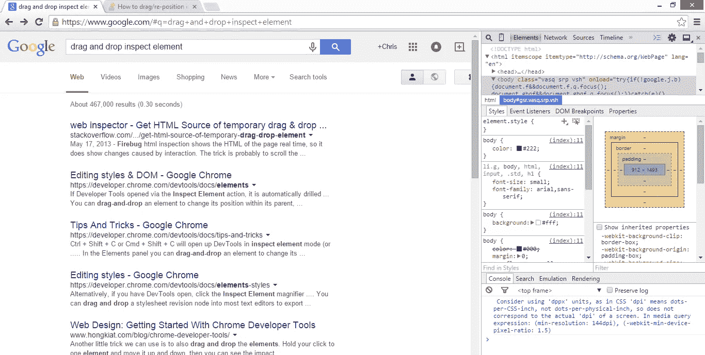

# 用 Python 和美汤 4 进行网页抓取

> 原文：<https://blog.devgenius.io/web-scraping-with-python-and-beautiful-soup-4-718c55106d13?source=collection_archive---------5----------------------->


阿诺·弗朗西斯卡在 [Unsplash](https://unsplash.com?utm_source=medium&utm_medium=referral) 上的照片

# 介绍

Web 抓取是数据科学中的一项基本技能。缺乏高质量的数据是数据分析师或科学家经常遇到的问题，这最终会影响您的研究结果。互联网是获取各种用途数据的绝佳资源。我们如何收集这些数据？

在本文中，我们将使用 Python 编程语言来浏览在互联网上搜集有价值的数据的过程。您将看到如何使用 BeautifulSoup 解析 HTML 并提取网页数据。

# **概述**

**简介**
-什么是网页抓取
-检查 HTML 页面

**使用 Python 和 BeautifulSoup 进行网页抓取的工具和技术**
-安装依赖关系
-导入已安装的依赖关系
-检查网页
-解析 HTML 为 Beautiful Soup

**抓取多个网页并存储数据**
-识别 URL 中的模式来抓取多个网页
**-** 存储数据

**结论**

# 什么是网络抓取

网络抓取是从网站上提取和收集数据，并将它们存储在数据库或本地机器中。Python 为我们提供了与网站交互和管理这些数据的库。本文将使用 Python 的 BeautifulSoup 库和 pandas 抓取一个电子商务网站的多个页面。

我们开始吧！

# 检查 HTML 页面

在我们继续之前，您需要理解 HTML，因为目前大多数网页都是用 HTML 构建的。超文本标记语言是一种标准化系统，用于标记文本文档以指示结构和格式。它是用来创建和组织万维网内容的主要语言。

它由一系列定义网页结构和内容的标签组成。在开始网页抓取之前，您必须检查您的网页；它帮助你更好地理解网页，知道你需要的数据在哪里。你不需要知道如何编写 HTML 代码。

要检查网页，您可以使用 web 浏览器中的开发工具。



这将打开开发人员控制台，并允许您查看页面的 HTML 源代码。在控制台中，您可以使用“Elements”选项卡查看页面的 HTML 源代码。HTML 代码以树状结构组织，每个元素由一个标签表示。您可以使用控制台检查页面上的不同标记和属性，包括应用于页面的 CSS 样式。



# 使用 Python 和 BeautifulSoup 进行 Web 抓取的工具和技术

# 安装依赖项

我们需要安装以下库来启动这个项目:

*   `bs4`用于解析 HTML 和从网页中提取数据。
*   `requests`用于向电子商务 URL 发送 GET 请求
*   `pandas`用于将提取的数据存储到 CSV 文件中

```
pip3 install requests
pip3 install bs4 
pip3 install pandas
```

# 导入已安装的依赖项

接下来，我们将导入刚刚安装的库。像添加其他 Python 库一样添加它们:

```
import requests
import pandas as pd
import bs4 as BeautifulSoup
import re #regular expression
```

# 检查网页

接下来，我们将检查用 Python 抓取的网页。我们将利用`requests`库从网站获取数据。然后，我们将 URL 的内容存储在一个响应变量中。

```
url = "https://www.newegg.com/PS5-Systems/SubCategory/ID-3762/Page-2?Tid=1696840"
response = requests.get(url)
# read content of the website
response = response.content
```

# 使用 BeautifulSoup 解析 HTML

接下来，我们将把`response`变量的内容连同 HTML 解析器一起传递给 BeautifulSoup 构造函数，如下所示:

```
soup = BeautifulSoup(response, 'html.parser’)
```

# 抓取多个网页

对于这个项目，我们将在 Newegg.com 网站上删除 15 页的 PS5 子类别。

# 识别 URL 中的模式以抓取多个页面

在本节中，我们将了解如何从各种运营商获取数据。因此，我们在检查时会在商务网站上寻找商品卡片的 HTML 标签。

这是[Newegg.com](http://newegg.com/)网站，显示了三个物品卡片。

突出显示的 HTML 标签包含了这个页面上的整个卡片网格。我们使用 Python 的`find`方法来搜索`div`和指定的`class`。该方法返回它找到的所有元素。

```
items = soup.find('div', class_='item-cells-wrap border-cells items-grid-view four-cells expulsion-one-cell'
```

我们希望获得存储数据的卡片网格中每件商品的名称、价格、运输类型和价格折扣(如果适用)。我们如何做到这一点？

首先，回到网站，搜索嵌套数据的标签。例如，产品名称可在此处找到:

接下来，我们使用 find 方法获取产品的名称

```
for item in items:
	title= item.find('a', class_="item-title").get_text()
```

注意下划线在课堂上的使用；我们添加这个是因为我们想让程序知道它是一个 HTML 类，而不是 Python 类。我们通过查找数据中的嵌套标签，对想要获取的其他数据进行同样的操作。

```
for item in items:
	title= item.find('a', class_="item-title").get_text()
	ship_type = item.find('li', class_= 'price-ship').get_text()
	product_discount = item.find('span', class_= 'price-save-percent')
```

product_discount 返回一些 None 值，使用 get_text 方法返回一个属性错误；我们使用三元运算符来解决这个问题

```
for item in items:
	title= item.find('a', class_="item-title").get_text()
	ship_type = item.find('li', class_= 'price-ship').get_text()
	product_discount = item.find('span', class_= 'price-save-percent')
	discount = 'NaN' if product_discount == None else product_discount.get_text() #tenary operator
```

接下来，我们想得到我们的产品价格

```
for item in items:
	title= item.find('a', class_="item-title").get_text()
	ship_type = item.find('li', class_= 'price-ship').get_text()
	product_discount = item.find('span', class_= 'price-save-percent')
	discount = 'NaN' if product_discount == None else product_discount.get_text()
	price = item.find('li', class_= 'price-current').get_text()
	print(price)
```

```
Output:"$729.89 (6 Offers)–"
"$719.99 –"
"$758.95 (3 Offers)–"
"$735.00 (8 Offers)–]"
```

价格返回额外的字符，这是我们不需要的。我们将使用正则表达式来搜索并返回我们想要的东西。

```
for item in items:
	title= item.find('a', class_="item-title").get_text()
	ship_type = item.find('li', class_= 'price-ship').get_text()
	product_discount = item.find('span', class_= 'price-save-percent')
	discount = 'NaN' if product_discount == None else product_discount.get_text()
	price = item.find('li', class_= 'price-current').get_text()
	print(price)
	Match = re.search(r"^\\$[\\d,]+(\\.\\d+)?", price).group()
```

`group()`方法从搜索结果中提取匹配的子组。如果我们检查变量匹配中的值，我们将有一个属性错误

```
AttributeError: 'NoneType' object has no attribute 'group'
```

我们将使用 try 和 except 关键字来预测属性错误

```
for item in items:
	title= item.find('a', class_="item-title").get_text()
	ship_type = item.find('li', class_= 'price-ship').get_text()
	product_discount = item.find('span', class_= 'price-save-percent')
	discount = 'NaN' if product_discount == None else product_discount.get_text()
	price = item.find('li', class_= 'price-current').get_text()
	try:
			price_x = re.search(r"^\\$[\\d,]+(\\.\\d+)?", price).group()
	except AttributeError:
			price_x = re.search(r"^\\$[\\d,]+(\\.\\d+)?", price)

 print(title, price_x, ship_type, discount)
```

这将返回第一页的产品名称、价格、运输类型和折扣。让我们把它们列成一个列表。

创建一个空列表，然后将你收集的数据添加到信息列表中。

```
info = []

for item in items:
 title= item.find('a', class_="item-title").get_text()
 ship_type = item.find('li', class_= 'price-ship').get_text()
 product_discount = item.find('span', class_= 'price-save-percent')
 discount = 'NaN' if product_discount == None else product_discount.get_text()
 price = item.find('li', class_= 'price-current').get_text()
 try:
   price_x = re.search(r"^\$[\d,]+(\.\d+)?", price).group()
 except AttributeError:
   price_x = re.search(r"^\$[\d,]+(\.\d+)?", price)

 info.append([title, price_x, ship_type, discount])
```

请记住:我们希望从多个网站页面获得相同的信息。为了实现这一点，我们将遍历所有页面；对于每一个，我们的程序得到我们想要的数据。

```
info= []
#We are extracting from 15 pages of the website
for i in range(1, 16):
	#in the  website URL, replace the page number with i
	#use the format method
	url = f"https://www.newegg.com/PS5-Systems/SubCategory/ID-3762/Page-{i}"
```

现在，我们将缩进循环中的项目，因为我们希望获得 url 中每个页面的项目。

```
info= []
#We are extracting from 15 pages of the website
for i in range(1, 16):
 #in the  website URL replace the page number with i
 #use the format method
 url = f"https://www.newegg.com/PS5-Systems/SubCategory/ID-3762/Page-{i}"
 response = requests.get(url)
 response = response.content
 soup = BeautifulSoup(response, 'html_parser')
 items = soup.find('div', class_='item-cells-wrap border-cells items-grid-view four-cells expulsion-one-cell')

   for item in items:
     title= item.find('a', class_="item-title").get_text()
     ship_type = item.find('li', class_= 'price-ship').get_text()
     product_discount = item.find('span', class_= 'price-save-percent')
     discount = 'NaN' if product_discount == None else product_discount.get_text()
     price = item.find('li', class_= 'price-current').get_text()
     try:
      price_x = re.search(r"^\$[\d,]+(\.\d+)?", price).group()
     except AttributeError:
      price_x = re.search(r"^\$[\d,]+(\.\d+)?", price)

      info.append([title, price_x, ship_type, discount])
```

我们希望以逗号分隔值(CSV)格式存储数据。我们可以通过熊猫的图书馆来实现

```
#create a Dataframe with info as values and
	# columns to specify the name of each column
df = pd.DataFrame(info, columns=['Product_Name', 'Price', 'Shipment Type', 'Discount']) 
```

```
#store as a CSV file with the file's name as an argument.
df = pd.to_csv('product_csv')
```

这将返回一个 CSV 文件，其中包含您从 Newegg 网站上收集的数据。

# 结论

在本文中，我们使用 BeautifulSoup、Python requests、pandas 和正则表达式收集了 Newegg 网站 PS5 子类别中销售的 500 多件商品。我们可以使用这些数据来分析或开发推荐引擎。