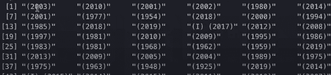
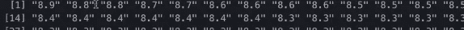
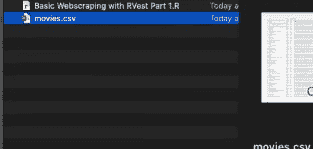

# 用 R 进行网页抓取

> 原文：<https://blog.devgenius.io/web-scraping-with-r-33d6b7a7d2cb?source=collection_archive---------9----------------------->

在这篇文章中，我们将学习使用 r 进行网络抓取。在这篇博客的第一部分，我们将抓取一个页面。我们将抓取 IMDb 排名前 25 或前 50 的冒险电影。


# 基于 R 的 Web 抓取(上)

使用 R 进行 Web 抓取非常简单和有用，在本教程中，我使用 rvest 库将 IMDb 的电影抓取到 R 中的数据帧中，然后将数据帧导出为 CSV 格式，所有这些都只需要几行代码。这种方法适用于许多网站，特别是那些显示静态内容的网站，比如 Yelp、Amazon、Wikipedia、Google 等等。

我们可以开始写一些代码。因此，我们将首先安装并导入我们将要使用的两个库。一个是 **rvest** 另一个是 **dplyr** 。

1.  [rvest](https://rvest.tidyverse.org/) —用于刮网部分。灵感来自 bs4。
2.  这允许我们做管道。

```
install.packages(“rvest”)install.packages(“dplyr”)
```

然后我们将在脚本中导入这些库。

```
library(rvest)
library(dplyr)
```

我们将为我们的**链接**创建一个新变量。与此同时，我们将声明另一个变量**页面**。这个变量将从我们的目标 URL 获取 HTML 代码。我们稍后会详细了解这一点。

```
library(rvest)
library(dplyr)link = "[https://www.imdb.com/list/ls058457633/](https://www.imdb.com/list/ls058457633/)"
page = read_html(link)
```

我们将刮掉名字、年份、等级和概要。我们将首先从创建 name 列开始。因此，我们将声明一个名为 name 的变量。我们将从刚刚获取的 HTML 代码中提取名称。


```
library(rvest)
library(dplyr)link = "[https://www.imdb.com/list/ls058457633/](https://www.imdb.com/list/ls058457633/)"
page = read_html(link)name = page %>% html_nodes(".lister-item-header a") %>% html_text()
```

为了提取特定的 HTML 标记，我们使用了 HTML 节点函数。检查标题后，我们发现所有标题都存储在类名 **lister-item-header** 下，带有**标签。在此之后，我们已经将结果输入到 HTML 文本中。**

让我们了解到目前为止我们做了什么。每个命令做什么，这个管道操作符是什么，如果你以前没见过的话。

1.  **read_html** —我们用它来读取 html，本质上它做的是，它提供一个 URL，并返回一个 HTML 文档或目标 URL 的源代码。
2.  **html_nodes** —给定 html 源代码，它提取我们想要获取的实际元素。
3.  html_text —它将从这些标签中解析出文本。
4.  **管道操作符(% > %)** —它是 deep wire 库的一部分，本质上它使编码变得非常容易。我强烈推荐这个图书馆。相当于取平均值即 **a % > % mean = mean(a)。**管道左边的所有东西都被它计算出来，并把结果作为第一个参数传递给管道后面的函数。所以，非常简单而且非常有用。

现在，我们已经为 name 列编写了代码，我们可以继续运行代码了。这是我们得到的输出。


它看起来很好，而且它有我们所有的电影名称。现在，我们将尝试获取年份文本。如果我们检查 yer，我们会发现所有的年份都存储在 **text-muted unbold 类下。**


```
library(rvest)
library(dplyr)link = "[https://www.imdb.com/list/ls058457633/](https://www.imdb.com/list/ls058457633/)"
page = read_html(link)name = page %>% html_nodes(".lister-item-header a") %>% html_text()
year = page %>% html_nodes(".text-muted unbold") %>% html_text()
```

如果我们运行该行，我们将得到下面的输出。



现在，我们将争夺收视率。经过检查，我们可以发现所有的**评级**都存储在类 **ipl-rating-star__rating 下。**


```
library(rvest)
library(dplyr)link = "[https://www.imdb.com/list/ls058457633/](https://www.imdb.com/list/ls058457633/)"
page = read_html(link)name = page %>% html_nodes(".lister-item-header a") %>% html_text()
year = page %>% html_nodes(".text-muted unbold") %>% html_text()
rating = page %>% html_nodes(".ipl-rating-star__rating") %>% html_text()
```

而最后一件事就是拿到电影的**剧情简介**。

```
library(rvest)
library(dplyr)link = "[https://www.imdb.com/list/ls058457633/](https://www.imdb.com/list/ls058457633/)"
page = read_html(link)name = page %>% html_nodes(".lister-item-header a") %>% html_text()year = page %>% html_nodes(".text-muted unbold") %>% html_text()rating = page %>% html_nodes(".ipl-rating-star__rating") %>% html_text()synopsis = page %>% html_nodes(".ratings-metascore+ p") %>% html_text()
```

为了确认我们得到了正确的数据，我们将打印出来。



所以，评级看起来不错。让我们检查一下大纲。


剧情梗概看起来也不错。现在，我们有了四个变量，我们将把它们视为数据框的列，为了创建这个数据框，我们将调用 **data.frame** 命令。

```
library(rvest)
library(dplyr)link = "[https://www.imdb.com/list/ls058457633/](https://www.imdb.com/list/ls058457633/)"
page = read_html(link)name = page %>% html_nodes(".lister-item-header a") %>% html_text()year = page %>% html_nodes(".text-muted unbold") %>% html_text()rating = page %>% html_nodes(".ipl-rating-star__rating") %>% html_text()synopsis = page %>% html_nodes(".ratings-metascore+ p") %>% html_text()movies = data.frame(name, year, rating, synopsis, stringAsFactors=FALSE)
```

我们传递了另一个参数 **stringAsFactors** 作为 **false** 。本质上，它所做的是，当它为真时，它把所有的列变成因子，而不是字符或数字，或者其他它们应该是的东西。所以，小心点。

我们可以运行此代码并查看我们的电影数据框，您可以看到，只需几行代码，我们就可以将 IMDB 页面中的全部文本放入数据框中。

```
View(movies)
```


最后，我想向您展示的是如何将数据存储在 CSV 文件中。

```
library(rvest)
library(dplyr)link = "[https://www.imdb.com/list/ls058457633/](https://www.imdb.com/list/ls058457633/)"
page = read_html(link)name = page %>% html_nodes(".lister-item-header a") %>% html_text()year = page %>% html_nodes(".text-muted unbold") %>% html_text()rating = page %>% html_nodes(".ipl-rating-star__rating") %>% html_text()synopsis = page %>% html_nodes(".ratings-metascore+ p") %>% html_text()movies = data.frame(name, year, rating, synopsis, stringAsFactors=FALSE)write.csv(movies, "movies.csv")
```

运行后，您将在文件夹中获得 movies.csv 文件。



# 基于 R 的网络抓取(下)

在这一部分，我们将从同一个 IMDb 页面打开每部电影的链接，以便收集每部电影的更多数据。实际上，我想在上述电影数据框中再添加一个数据列，包含每部电影的所有主要演员。我想搜集电影的所有主要演员，这只有通过进入每一个单独的页面才有可能。

所以，第一件事就是获取这些电影的所有网址。我们已经为它写了代码，或者至少是大部分代码。所以，这并不困难，我们只需要添加一个新的变量叫做电影链接。

如果你运行下面的代码

```
name = page %>% html_nodes(".lister-item-header a")
```

你会得到这个。


所以，我们只需要从这段代码中提取出 **href** 属性来完成 **URL** 。

```
movie_links = page %>% html_nodes(“.lister-item-header a”) %>% html_attr(“href”) %>% paste("[https://www.imdb.com](https://www.imdb.com/)", ., sep="")
```

**粘贴**将 imdb.com 与 href 标签值连接起来。管道会把所有东西带到管道的左边。它进行计算，然后把结果传递给管道后面的函数，就像第一个参数一样。无论传入什么，都是作为第二个参数传递的，方法是把句号放在那里。**粘贴**将在中间添加一个空格，以避免我们使用**九月**作为空引号。所以，我们可以继续运行这段代码。


这正是我们想要的。看起来不错。现在，我们已经有了所有的电影链接，我们需要找出一种方法，实际进入每一页并收集演职人员。如果你有编程背景或者做过任何编码工作，你可能会尝试在这里使用 for 循环，但是我认为通过应用函数来使用 **r** 实际上比 for 循环更有效。


我将创建一个函数，它实际上接受这些电影链接中的一个，并抓取这些演职人员，然后返回该字符串。您可以通过检查 HTML 元素来找到它。


```
get_cast = function(movie_link){
  movie_page = read_html(movie_link)
  movie_cast = movie_page %>% html_nodes(".cast_list a") %>%            html_text()}
```

现在，如果我打印演员阵容，它会以这种方式出现。


但是我需要它们都在一行中，因此我们将使用粘贴功能。

```
get_cast = function(movie_link){
  movie_page = read_html(movie_link)
  movie_cast = movie_page %>% html_nodes(".cast_list a") %>%                                                               html_text() %>% paste(collapse = ",")
  return(movie_cast)} 
```

现在我有了所有的电影链接，我有了这个函数 get_cast，它抓取所有演员的名字并返回一个字符串。因此，为了将它们放在一起，我将使用[**sappy**](https://r-coder.com/sapply-function-r/)函数创建一个 cast 列。

```
cast = sapply(movie_links, FUN = get_cast)
```

基本上**sappy**的工作方式是，给定第一个变量，这是一个电影链接的向量，它将进入每个链接，获取它并通过函数运行它。 **movie_links** 作为参数传递，然后不管结果是什么，它都会把结果放回一个向量中。

您可以做的最后一件事是将 cast 添加到电影数据帧中作为我们的第五列。

```
movies = data.frame(name, year, rating, cast, synopsis, stringAsFactors=FALSE)
```

现在，如果你运行这个，我们将得到我们电影数据帧中的所有演员。


如果你想清理文字，欢迎你这样做，但我喜欢这样。

## 完全码

```
library(rvest)
library(dplyr)link = "[https://www.imdb.com/list/ls058457633/](https://www.imdb.com/list/ls058457633/)"
page = read_html(link)name = page %>% html_nodes(".lister-item-header a") %>% html_text()movie_links = page %>% html_nodes(“.lister-item-header a”) %>% html_attr(“href”) %>% paste("[https://www.imdb.com](https://www.imdb.com/)", ., sep="")year = page %>% html_nodes(".text-muted unbold") %>% html_text()rating = page %>% html_nodes(".ipl-rating-star__rating") %>% html_text()synopsis = page %>% html_nodes(".ratings-metascore+ p") %>% html_text()get_cast = function(movie_link){
  movie_page = read_html(movie_link)
  movie_cast = movie_page %>% html_nodes(".cast_list a") %>%                                                               html_text() %>% paste(collapse = ",")
  return(movie_cast)}cast = sapply(movie_links, FUN = get_cast)movies = data.frame(name, year, rating, cast, synopsis, stringAsFactors=FALSE)write.csv(movies, "movies.csv")
```

# 基于 R 的网络抓取——(下)

在本节中，我们将抓取多个页面。第一步是弄清楚网站的 URL 是如何变化的。因此，为了抓取多页，您可以看到，如果我们走到最底部，您将找到“下一页”按钮。当你点击它时，你会在你的网址中找到 **& start=51** ，再次点击它，你会在你的网址中找到 **& start=101** 。每增加一页，页码就增加 50。同样，如果你在 URL 中添加 **& start=1** ，你将被重定向到第一页，因此我们已经知道了 URL 是如何变化的。我们将创建一个 for 循环，遍历我们想要抓取的每一页，然后像以前一样做所有的事情。所以，不是很难，但有几个组成部分。

我们将在所有内容之外创建一个大的 for 循环，我知道在上一节中我说过**sappy 函数**比 for 循环更好，但在这种情况下，我使用 **for 循环**有点道理，但你完全可以用你觉得最舒服的方式来做。

```
library(rvest)
library(dplyr)get_cast = function(movie_link){
  movie_page = read_html(movie_link)
  movie_cast = movie_page %>% html_nodes(".cast_list a") %>%                                                               html_text() %>% paste(collapse = ",")
  return(movie_cast)}
movies=data.frame()for (page_result in seq(from = 1, to = 51, by = 50)){
   link=paste("[https://www.imdb.com/search/title/?genres=action&start=",page_result, "&explore=title_type,genres&ref_=adv_nxt](https://www.imdb.com/search/title/?genres=action&start=51&explore=title_type,genres&ref_=adv_nxt)", sep="") page = read_html(link) name = page %>% html_nodes(".lister-item-header a") %>% html_text() movie_links = page %>% html_nodes(“.lister-item-header a”) %>%       html_attr(“href”) %>% paste("[https://www.imdb.com](https://www.imdb.com/)", ., sep="") year = page %>% html_nodes(".text-muted unbold") %>% html_text() rating = page %>% html_nodes(".ipl-rating-star__rating") %>% html_text() synopsis = page %>% html_nodes(".ratings-metascore+ p") %>% html_text() cast = sapply(movie_links, FUN = get_cast)}movies = rbind(movies,data.frame(name, year, rating, cast, synopsis, stringAsFactors=FALSE))print(paste("Page:",page_result))
```

我再次使用了粘贴功能来使我们的 URL 动态化，并且我已经使用了 **sep** 来删除你想要连接的字符串之间的所有空格。我将 **get_cast** 排除在 for 循环之外，因为它不会每次都改变。因为我们将在循环的**内部调用它。如果我们将电影数据帧放入 for 循环中，它将在每次运行时不断改变值。所以，最后，它会有最后 50 个结果的值。在我们的情况下，这将是第二页，这不是我们想要的。为此，我们将使用 [**rbind** **函数**](https://www.journaldev.com/43918/rbind-function-r) ，这意味着行绑定，它将第一个参数作为电影，第二个参数将停留在该数据帧中。所以，现在每次 for 循环运行时，它都会获取旧的 movies 变量，然后放入新的电影行，这些电影是从它运行的页面上获取的。**

最后，我们将使用打印语句来跟踪我们的进度。

这就是我们电影的数据框的样子。


我们已经设法完成了 IMDb 的前 100 页。现在，如果你想抓取所有的页面，那么你可以根据你的需求在你的 for 循环中进行修改。

# 结论

在本教程中，我们讨论了可以用来抓取网站的各种 R 开源库。如果您按照教程进行操作，您就能够创建一个基本的 scraper 来抓取任何页面。虽然这是一篇介绍性的文章，但是我们已经介绍了可以在库中使用的大多数方法。你可以选择在这些知识的基础上创建复杂的网页抓取器，它可以抓取成千上万的网页。

如果你不想编写自己的抓取器，你可以使用我们的 [**网页抓取 API**](https://www.scrapingdog.com/) 。

欢迎[给我们](https://drift.me/scrapingdog)发消息，询问您需要澄清的任何事情。

# 额外资源

这里有几个额外的资源，你可能会发现对你的网络抓取之旅有帮助:

*   [用 PHP 进行网页抓取](https://www.scrapingdog.com/blog/web-scraping-with-php)
*   [用 Go 进行网页抓取](https://www.scrapingdog.com/blog/web-scraping-go)
*   [用 Python 进行网页抓取](https://www.scrapingdog.com/blog/web-scraping-with-python.html)
*   [带节点的网页抓取](https://www.scrapingdog.com/blog/web-scraping-101-with-nodejs.html)
*   [使用 Selenium 和 Python 进行网页抓取](https://www.scrapingdog.com/blog/starting-with-selenium-python.html)