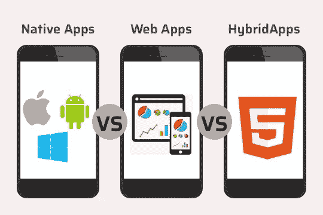

# Web 应用与本地应用和混合应用

> 原文：<https://blog.devgenius.io/web-vs-native-vs-hybrid-apps-a63e4bc819e5?source=collection_archive---------43----------------------->

作为一名技术新手，你经常会被吸引去思考什么样的应用程序可能是最酷的，可以用来开发或建立你的职业生涯。这些想法最终往往倾向于这样的问题，即人们访问网络的现有平台的未来会如何。根据为更好地理解其中一些概念所做的发现，我发现这些问题没有一个确定的答案，因此，主要归结为在理解每个平台的优缺点的基础上找到一个中间点。

**网络应用:**

Web 应用程序几乎完全由 JavaScript、CSS 和 HTML5 构建，开发人员使用并依赖框架来实现这一点。一些最重要的 web 应用框架有:React、Angular 和 Vue。Web 应用程序是通过浏览器访问的，构建起来相对便宜得多，并且有一个主要优势，那就是浏览器很可能仍然是全世界人民的一种无处不在的资源。这是一个通用的应用程序，只要设备(笔记本电脑或手机)有浏览器，它就能很好地运行。然而，就可访问性而言，一个只有网络存在的企业注定会错过手机用户可以获得的巨大流量。 ***随机问题:*** *相比手机 app，你 24 小时使用浏览器的频率如何？*

在移动时代，即使是蹒跚学步的孩子也有某种移动设备来访问互联网，可以说，单单决定网络应用程序就相当于给企业带来了巨大的损失。此外，如果你决定创建一家初创公司，想想潜在用户有多愿意通过浏览器访问你的应用。如今，人们很少存储网站，也很少在浏览器上搜索网站，所以网站应用总有可能在首次访问后失去客户。看起来这种情况不会很快改变。

**原生应用:**

原生应用是为特定移动平台设计的应用，其代码不能被其他移动平台共享。顾名思义，它们是构建它们的平台所固有的。它们被设计成通过应用商店安装，例如 android 手机的 play 商店和 iPhones 的 iOS 应用商店。原生应用相对于网络应用的主要优势是有更大比例的回头客。

原生应用由开发人员使用编程语言设计，如用于 iOS 和 Java 的 Swift 或 Objective-C 或用于 android 的 C++，通常带有平台提供的 SDK(软件开发工具包)。SDK 就像是框架对于 web 应用开发者的意义。XCode 是用于 iOS 应用开发的 SDK，而 Android Studio 是谷歌为 Android 开发者提供的。原生应用程序比网络应用程序更快，反应更灵敏，可以使用更多的设备硬件，如摄像头、麦克风、指南针。在手机用户授权应用程序后，它们可以向用户发送推送通知(facebook、whatsapp 等)，保证持续使用……这使它比网络应用程序更具优势。然而，由于最大的移动技术品牌 android 和 iOS 在操作系统平台上的差异，这意味着构建原生应用比 web 应用成本更高，因为你必须雇佣两个不同的开发人员来开发同一个项目，因此初创公司将很难为这些应用筹集资金。

不过，有一些 SDK 可用于构建跨两个平台的应用程序，如 Xamarin、React Native、Titanium 和谷歌的 Flutter，而脸书、沃尔玛和特斯拉等大品牌都是使用 React Native 构建的，React Native 结合了 JavaScript 和 React。

**混合应用:**

这些应用程序被设计为既可以作为 web 应用程序，也可以作为本地应用程序。它们作为应用程序商店的原生应用程序安装，但通过应用程序中的简化浏览器“webview”运行。，这意味着它们是内部的 web 应用程序。混合应用程序的主要优势在于，它们可以用来研究应用程序项目的受欢迎程度，也就是说，准备一个最小可行产品(MVP)。在对原生应用进行巨额投资之前，你可以建立一个混合应用，其优势是可以通过应用商店访问，并可以向用户发送推送通知，以了解他们在后续访问中如何与应用互动。这可能会给你一个想法，是否继续进行该项目或作出一些调整，使其更好。从我的研究来看，混合应用相对于其他类并没有明显的优势。有一些框架可以让开发人员在构建混合体时有一个良好的开端:PhoneGap、Ionic 和 Cordova 就是其中一些流行的框架。

总的来说，没有一个构建应用程序的理想平台。人们将会看到，每个平台的优势并不明显。移动应用程序开发似乎是一个有趣的领域，但也因为竞争，没有人真正知道当前行业中的大玩家的结局会是什么。10 年前，RIM 为黑莓手机开发了应用程序，但如今已不复存在。塞班操作系统平台也为诺基亚、摩托罗拉、索尼爱立信等公司开发了应用程序。大约在 2010 年折叠起来。也就是说，不管发生什么，web/移动软件开发的未来肯定会很有趣。