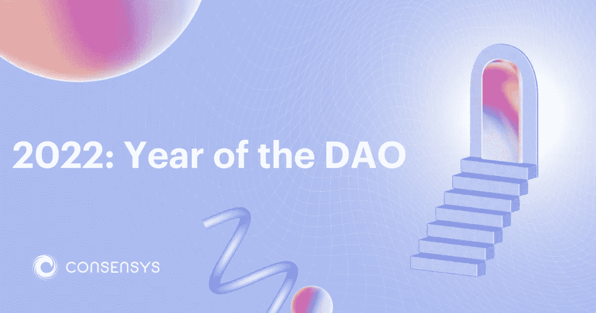

# 区块链理工大学 101

> 原文：<https://blog.devgenius.io/web3-blockchain-tech-101-4b86cff1ce64?source=collection_archive---------17----------------------->

## 作者:Anshul 先生

图片来自[https://consensys.net/](https://consensys.net/blog/blockchain-explained/what-is-web3-here-are-some-ways-to-explain-it-to-a-friend/)

在我们现在生活的世界里， 技术由中央系统主导，大型科技巨头拥有可用于托管服务和网站的大部分计算资源

让我们以 AWS 为例

我在上面部署了一个网站，然后它就工作了每一个在域中键入内容的客户端- >在 DNS 中搜索- >获取特定机器的外部 IP 并返回浏览器呈现的前端内容

现在让我们带来数字货币 进入图片

当然你可以使用云服务提供商来托管你的整个货币应用管理系统

但是猜猜谁能巧妙处理你
没错贝佐斯先生

他有超级管理员权限，可以做任何他想做的事情。 这就是集中式互联网的问题，每个人都依赖于一个实体来提供和托管内容。比特币的创造者，原始 web3 互联网的第一个去中心化形式。他看到了所有这些技术巨头接管后发生的事情，并意识到一个民主化的去中心化的互联网是实现真正的权力分配的关键，权力分配是民有、民治、民享的，所以请上帝帮助我

这是银行面临许多欺诈和虚假交易问题的一个原因，尽管他们使用了大量的加密技术

如果有一个中央机构与你互动 中央权威机构表示，他们的 API 很容易模仿这些请求，并用虚假的交易数据引起系统的许多问题

还有一个不言自明的双重提交问题

他意识到的是，任何个人都可以用自己的设备加入一个更大的生态系统，安全地上传应用程序和交易数字货币的新架构将改变世界。 区块链范式中最基本的实体是节点

你可以把一个节点想象成一台单独的计算机/设备，这个节点也可以与系统中的其他节点通信。每个节点都包含部署在区块链上的所有交易信息和智能合约的副本，称为分类帐。每一个节点都包含了与区块链交互的每一个人完成的每一笔交易

是的，我知道，这看起来像是每一毫秒都需要不断更新的大量数据。但是客观地看，以太坊区块链在区块链

的每个节点上存储的分类账数据不到 1tb，实际上没有你想象的那么多

这些分类账数据是验证每个请求是否真实合法的关键。让我们带一个简单的令牌进入图片

anshulcon

我作为 Anshul Kashyap 需要有一个加密钱包来存储一些 anshulcon。我们可以使用不同的加密钱包，metamask 就是一个很好的例子。也有不同类型的钱包(热钱包和冷钱包)，每种钱包都有不同的安全功能来防止身份和钱包被盗。冷钱包需要一个物理设备来打开，有点像一把钥匙和一个 u 盘(编辑)

但是不管怎样，回到最初的话题

如果我现在有 10 个安舒币，我想给玛雅

5 个安舒币，我该怎么做呢？记住我说过的关于钱包的话。以太坊钱包地址来了。该信息是公开的，看起来像 0x8263729…..

你可以把它想成一个公共身份每个人都知道其他人的钱包地址。如果我知道玛雅的以太坊钱包地址而且我也有我的。那么现在可以在区块链上进行交易。比如网站的 IP 地址。该事务包含几条不同的信息。目标钱包地址、交易内容、特定用户的交易号(防止重复请求相同的数据)。当我以 Anshul Kashyap 的身份通过 MetaMask 发送该交易请求时，它会验证该交易是否合法，并将其存储在最近的节点

的分类帐中。现在，非常酷的事情发生了——连锁反应效应触发整个区块链的每个节点相互通信，并将该交易信息复制到每个节点的每个分类帐中。Vitalik 先生创建了以太坊区块链和以太坊虚拟机 btw。允许标准化的计算和存储存在于任何计算机上

这篇文章是我从一个不和谐的聊天中转录的，但它是由 [Anshul Kashyap](https://medium.com/u/c3cc54fd5167?source=post_page-----4b86cff1ce64--------------------------------) 写的，而且这篇文章中的 Maya 是指 [Maya Poghosyan](https://medium.com/u/42a1d95c27de?source=post_page-----4b86cff1ce64--------------------------------) 。给他们俩一个关注:)