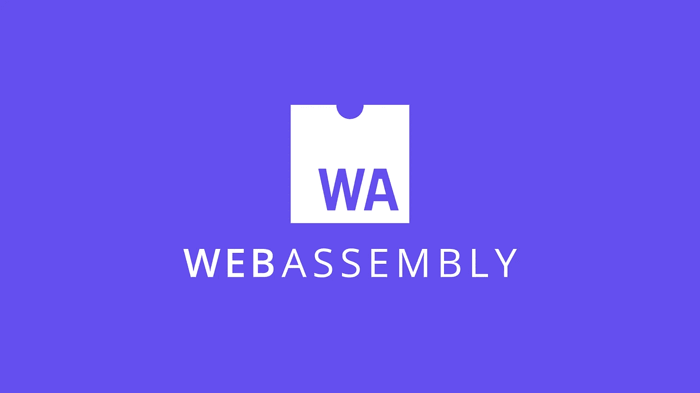

# 区块链中的 WebAssembly (WASM)

> 原文：<https://blog.devgenius.io/webassembly-wasm-in-blockchain-f651a8ac767b?source=collection_archive---------2----------------------->

以太坊虚拟机(EVM)的替代产品，通过区块链获得声望。

自从 EVM 出现问题后，许多开发人员、工程师和学者实施了各种解决方案来解决这些问题。结果，WebAssembly (WASM)在区块链网络中变得很突出。今天，我们将讨论你需要知道的关于 WebAssembly 的任何事情。

## 什么是 WebAssembly？

WebAssembly 是一个开源的 Web 开发框架，具有用于基于堆栈的虚拟机(VM)的二进制指令格式。它可以用于服务器和客户端应用程序的 web 开发。他们目前支持所有四个主要的浏览器引擎。这个项目是由微软、谷歌、Mozilla 和苹果开发的。

## WebAssembly 的属性是什么？

**高效快捷**

它的栈机器被设计成工作在二进制代码格式，使它装载时间和大小有效。因为它允许快速有效的部署，它成为了区块链开发中的一个主要部分，许多 web 开发人员使用 WASM 来实现健壮的生态系统。现在，他们正致力于为普通硬件执行本机速度。

**保险柜**

WebAssembly 利用 JavaScript 虚拟机开发了内存安全的沙盒执行。嵌入时，WASM 使用浏览器的安全策略。据安全研究人员称，除了其安全功能，只有一小部分文件和网站被报告为恶意的。

**开放可调试**

WASM 允许文本格式用于调试、测试、优化、学习、教学和手工编写程序。通过文本格式，可以查看 WASM 源代码，帮助开发人员创建高效的应用程序。

**开源**

因为主要的浏览器公司在 W3C 联盟下致力于这个项目，并允许社区做出贡献，所以可以创建向后兼容的、无功能的应用程序和经过功能测试的应用程序。此外，可以从 JavaScript 访问 Web APIs，并且支持非 Web 嵌入。

## WebAssembly 是如何工作的？

WebAssembly 的目标是编译。开发者不直接写；相反，他们用自己喜欢的语言编写这些代码，并用 WASM 字节码编译它们。字节码在客户机上运行并高速执行。它们的加载、解析和执行速度比传统的 web 应用程序更快。

正如我们在特性中提到的，他们有沙盒执行，他们不能直接访问 JavaScript 模块，除非他们使用 WebAssembly 系统接口(WASI)。

## WebAssembly networks 如何解决区块链中提到的一些问题？

**宇宙**

Cosmos 是第一批将 WASM 作为其主要建筑堆栈的区块链之一。他们实现了 CosmWASM、Tendermint BFT 和 IBC 协议，用于他们自己的区块链开发。虽然 CosmWASM 是智能合约开发的主要引擎，但也可以创建其他应用程序和区块链。只要安装了 Cosmos SDK，CosmWASM 就是为开发者利用的。

波尔卡多特

Polkadot 对 WASM 的使用依赖于作为一个元协议，允许在 WebAssembly 上解释或编译其他编程语言。它的使用允许无叉基础设施和衬底允许其他应用程序在没有协调的情况下修改它们的连接链。

## 哪些区块链网络使用 WebAssembly？

Cosmos、Solana、Fantom、NEAR Protocol、埃尔隆德和 Polkadot 使用 Rust 作为编程语言。但是只有 Solana、Cosmos 和 Polkadot 主要使用 Rust 作为编程语言。

*你觉得区块链上的 WASM 怎么样？你听说过 WASM 在区块链上的用途吗？你用过 WASM 网络吗？在下面的评论区分享你的想法和经历。*