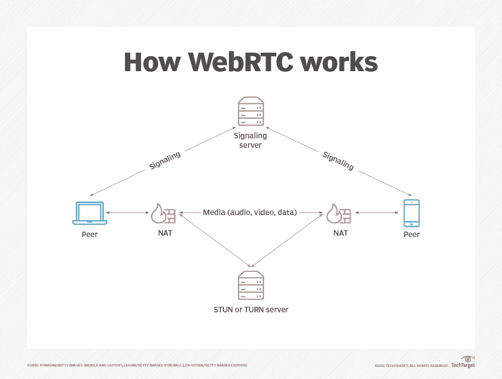
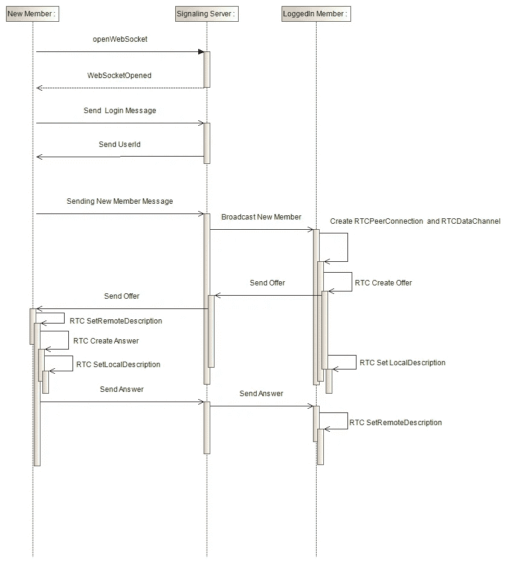
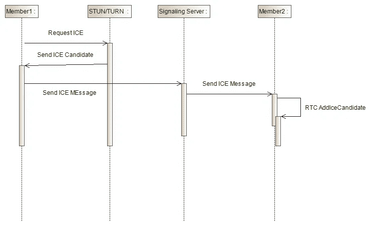

# WebRTC 聊天应用程序

> 原文：<https://blog.devgenius.io/webrtc-chat-application-772539ae97b7?source=collection_archive---------3----------------------->

最近，我被吸引去探索更多的点对点解决方案。其中之一是使用 WebRTC 作为其协议。WebRTC 是一个 web 应用程序的协议，在许多主流浏览器的最新版本中都可用，如 Chrome、Firefox 等。在这篇文章中，我将解释如何使用 React(浏览器/客户端)和信令服务器的 Spring Boot 创建一个聊天应用程序。

**问题陈述**

1.  点对点聊天应用程序
2.  必须是端到端加密的

**解决方案**

解决方案是 WebRTC。通过使用 WebRTC 协议，我们可以很容易地制作 p2p 聊天应用，并且协议本身在其实现中已经强制要求 e2ee。

WebRTC 聊天应用程序将使用这些项目:

1.  信令服务器，这是帮助每个客户端找到另一个客户端的代理
2.  STUN/TURN server，这是一个服务器应用程序，帮助客户端找到其公共 IP 地址，或者在客户端位于严格的防火墙之后时中继 p2p 消息
3.  RTCDataChannel 和 RTCPeerConnection 是我们用来在客户端构建解决方案的 WebRTC API

图一。WebRTC 基础设施图解(来源:[)https://www . techtarget . com/search unified communication s/definition/WebRTC-we B- Real-Time-communication s](https://www.techtarget.com/searchunifiedcommunications/definition/WebRTC-Web-Real-Time-Communications)

让我们从信令服务器开始。我们将使用 Web Socket 协议构建信令服务器。我们将使用的框架是 Spring Boot。图 2 和图 3 中描述的信令流程。

图二。信令流程

图 3。ICE 消息信令

如图 2 和图 3 所示，我们有这些类型的信令消息:

1.  登录是从信令服务器获取唯一用户标识的消息，
2.  新成员，是通知客户端作为新成员加入信令服务器的消息，
3.  Offer，是新成员发送的包含 SDP Offer 的消息
4.  应答，是包含基于客户端接收的 SDP 提议的 SDP 应答的消息
5.  ICE 是由每个客户端发送的包含 ICE 候选的消息。

信令服务器的完整代码可以在这个 [github](https://github.com/rsatrio/WebRTC-Signaling-Server) 中找到(别忘了给个星号)。请查看[这篇文章](https://mrizkysatrio.medium.com/webrtc-signaling-server-example-using-spring-boot-efd5f067900a)了解信令服务器解决方案的进一步解释。

对于客户端，我使用了 React 和 Bootstrap。完整的代码可以在这个 [github](https://github.com/rsatrio/React-WebRTC-Chat) 上看到(别忘了给个星)。需要解决的几个问题:

1.  不要忘记在 RTCPeerConnection 上设置 STUN 并打开服务器。STUN 服务器被客户端用来找出他们的公共 IP 地址。如果客户端位于严密的防火墙或 NAT 之后，
2.  创建 RTCDataChannel 在创建报价之前，
3.  不要忘记为 RTCDataConnection 设置 onDataChange 的事件类型。对于这个接收通道，不要忘记处理 onMessage 事件。

你可以在[这里](https://glowing-creponne-b62856.netlify.app/)找到这个解决方案的工作网站。

**限制**

在撰写本文时，WebRTC 在手机浏览器中打开时有限制。如果你失去了对手机浏览器的关注(例如切换到其他应用程序)，那么对等数据通道连接将自动关闭。这在[这里](https://stackoverflow.com/questions/40363606/how-to-keep-webrtc-datachannel-open-in-phone-browser-inactive-tab)有解释。

**参考文献**

1.  [https://developer . Mozilla . org/en-US/docs/Web/API/WebRTC _ API/Simple _ rtcdata channel _ sample](https://developer.mozilla.org/en-US/docs/Web/API/WebRTC_API/Simple_RTCDataChannel_sample)
2.  [https://www.baeldung.com/websockets-spring](https://www.baeldung.com/websockets-spring)
3.  [https://www . webrtc-experience . com/docs/RTC-data channel-for-初学者. html](https://www.webrtc-experiment.com/docs/rtc-datachannel-for-beginners.html)
4.  [https://developer . Mozilla . org/en-US/docs/Web/API/WebRTC _ API/Signaling _ and _ video _ calling](https://developer.mozilla.org/en-US/docs/Web/API/WebRTC_API/Signaling_and_video_calling)
5.  [https://mrizkysatrio . medium . com/webrtc-signaling-server-example-using-spring-boot-efd5f 067900 a](https://mrizkysatrio.medium.com/webrtc-signaling-server-example-using-spring-boot-efd5f067900a)
6.  [https://glowing-creponne-b62856.netlify.app/](https://glowing-creponne-b62856.netlify.app/)
7.  [https://mrizkysatrio . medium . com/webrtc-client-chat-app-using-react-99 bf8e 803 FD 8](https://mrizkysatrio.medium.com/webrtc-client-chat-app-using-react-99bf8e803fd8)