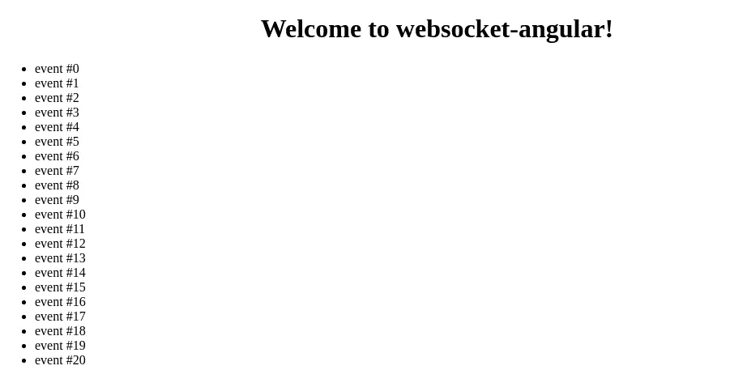

# 带 Spring WebFlux 的 WebSockets

> 原文：<https://blog.devgenius.io/websockets-with-spring-webflux-ba9d0b47b348?source=collection_archive---------2----------------------->


# 介绍

在本教程中，我们将看看如何用 Spring WebFlux 创建一个基本的 websocket 连接。

WebSocket 是 web 浏览器和服务器之间通过单一 TCP 连接进行双向通信的协议。因此，它在聊天应用程序或任何基于事件的通信中都很有用。换句话说，您可以在一个请求(连接)中流数据。

本页涵盖以下主题:

1.  如何配置 websockets？
2.  如何阅读信息？
3.  怎么发消息？
4.  编写演示项目。
5.  如何保护 websockets？

在开始之前，我们需要设置项目，以加快进程使用 [start.spring.io](http://start.spring.io) 与依赖反应网络。

# 如何配置 websockets

我们从配置开始，说明为什么我们需要一些组件。

首先要做的是为反应式 websockets 编写配置。

它需要 HandlerMapping 和 HandlerAdapter beans。

易于创建的手柄:

为什么这门课需要？此适配器在内部初始化 websocket 服务，并使用 WebSocketHandler 实现。换句话说，通过这个 bean 声明，我们在 Spring WebFlux 中启用了 websockets。

下一个 bean 是 HandlerMapping。有了这个类，我们就能够建立一个 uri(字符串)到 WebSocketHandler 和订单信息的映射。Spring 将知道设置哪个 url 来连接这个地图，在我们的例子中是[。](http://localhost:8080/push.)

当然，您可以创建任意多的路径和处理程序条目。

目前，我们需要实现 WebSocketHandler。有了这个类，我们就可以处理 WebSocketSession，换句话说，就是读取和发送消息。

我们在这里留下了 Mono.empty，但是后面将展示完整的实现。

配置类的完整代码。

# 如何阅读信息？

读取逻辑应该作为 WebSocketHandler 实现的一部分提供。

我们需要对 WebSocketSession 对象进行操作，只需调用 receive()方法即可获得反应流并订阅/修改它。

# 怎么发消息？

在我们继续修改 WebSocketHandler 的实现之前，我们需要创建一个模型，并将它发送给客户端。

此外，我们需要创建一个将事件作为反应流提供的服务，因为 WebSocketSession 需要它。

该服务的主要要求是能够向现有流添加新事件。

因此，我们的事件类接口将如下所示:

为了实现这项服务，将使用一个符合我们所有要求处理器。这个处理器可以处理无限量的事件，并与多个订阅者共享。

这里:

*   publish()创建共享通量流的 ConnectableFlux。
*   autoConnect()将这个 ConnectableFlux 连接到一个名为 subscribe 方法的地方。

它还可以用于方法 replay(int ),该方法缓存最新的元素并将其返回给新的订阅者。

发送消息看起来像这样。

正如您所看到的，在向客户端发送对象之前，我们需要将其转换为 JSON。Spring WebFlux 没有提供默认的机制来将对象转换为 websockets 的 JSON。

在这段代码中使用了 Jackson 的 object mapper # writeValueAsString。

现在，我们可以将我们的 DefaultWebSocketHandler 联合读取和发送到一个流。

# 演示

出于演示目的，将添加简单的事件发生器，它每秒钟增加一个计数器，并发送一个事件及其值。

不要忘记在应用程序中启用调度程序。

# 客户

对于客户端将使用角。

如何安装它你可以在官方文档中找到。

要做的步骤:

创建项目。

```
ng new projectname
```

修改 app.component.ts

这里我们使用 rxjs websockets。

要在网络界面中查看我们的消息，只需更新 app.component.html 即可。

运行应用程序，在浏览器中键入 [localhost:4200](http://localhost:4200/) 并查看结果。



# 如何保护 websockets？

1.  使用 SSL/TLS 上的 web sockets(was://protocol)。
2.  验证客户端和服务器数据。
3.  仅在授权后使用 websocket 连接。
4.  在 websocket 连接之前，生成可以通过 HTTP 检索的用户唯一推送 id，并使用它与服务器通信。
5.  使用原始标题。

# 结论

本文展示了使用反应式 websockets 配置、读取和发送消息的基础知识。涵盖了服务器端配置和客户端演示。

代码示例可以在 [GitHub](https://github.com/MaxNeutrino/snippets/tree/master/webflux-websocket) 上找到