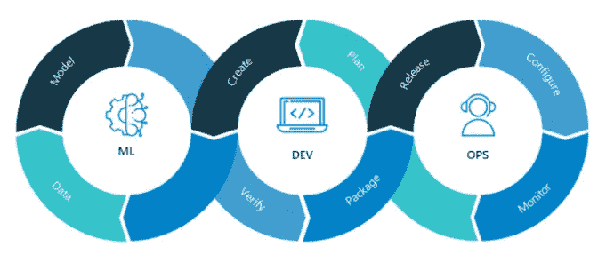

# Neptune.ai 的诡异之处

> 原文：<https://blog.devgenius.io/weird-things-to-do-with-neptune-ai-fb3e2f5d4817?source=collection_archive---------5----------------------->

在使用了一段时间后，我了解到人们可以用这个工具做一些奇怪的事情。也许他们喜欢 ML 中使用的新单词。

## AutoML

如果这个地区发展得太快，很可能会有一些人失业，因为训练机器太容易了。但是，在那之前，我们可以稍微体验一下让你的工作自动化是什么感觉。

Neptune 提供了与 Optuna 的集成:“一个自动化超参数搜索的开源超参数优化框架”。autoML 还有其他可用的框架，但是有了这个，你就有了一个[漂亮的教程](https://docs.neptune.ai/integrations-and-supported-tools/hyperparameter-optimization/optuna)和甜蜜的原生集成。

来自教程项目

他们还集成了 Scikit-learn，但是这个工具并不被认为是最复杂的。此外，他们正致力于 scikit 优化集成。

## MLOps

它是 ML 和 DevOps 的混合。像大多数生活在 ML 中的人一样，他们已经从学术界毕业，并将在生产环境中工作。这就是您想要自动化并加速迭代过程的环境的本质，特别是对于处理数据和模型生命周期，确保它工作并持续改进，防止像数据漂移这样的问题。

[有一种方法](https://docs.neptune.ai/how-to-guides/automation-pipelines/ci-cd)让 GitHub actions 将您的模型(挑战者)与另一个模型(冠军)进行比较，这样最好的模型将始终被标记为最佳模型，并且在 CI/CD 环境中，它将自动投入生产。

来源:英伟达

自动化可以极大地发展，但这只是展示一个可能的例子。当然，没有什么能阻止你使用其他工具，比如 Azure DevOps。

## 使用 docker 运行

在一切都在 docker 容器中运行的世界中，Neptune 也不例外。因此，您希望放在 requirements.txt 中的行是“neptune-client”。

照常运行 *pip install* ，但是在此之前，您可能想要为您的 API_TOKEN 声明一个 docker 容器变量。这是在 docker 中使用它的唯一主要区别。

在这个工具中有一个关于每一个可以想到的动作的教程。

## 海王星+竞争

有趣的是，他们在会上决定，只要与大多数人认为的竞争对手进行整合就好了。人们现在可以使用实验跟踪工具来跟踪你的跟踪工具。

网站上列出了 MLflow，TensorBoard 和 Sacred。MLflow 集成仍在开发中，应该会在几周内发布。这同样适用于 TensorBoard。

对于所有神圣的东西，[你必须通过海王星运行](https://docs.neptune.ai/integrations-and-supported-tools/experiment-tracking/sacred)到所谓的神圣实验，并正常运行这个后来的工具。

## 海王星+ HTML

我不知道为什么，但你可以创建一个 HTML 对象，并上传到海王星运行。公平地说，几乎任何东西都可以记录到运行中，但是这个 HTML 在您的项目菜单中有一个可视化。所以你可以放置那个对象，但是我不认为有一种方法可以拥有 CSS，那么纯粹的 HTML。

## 先知+海王星

Prophet 是一个基于 python 和 r 的预测时间序列数据的过程。除了有一个创造性的名字，Prophet 也是 Meta 的一部分。

这是一个特定的用例工具，但它似乎是一个方便了解和使用的工具，主要是因为它可以处理丢失的数据、异常值和丢失的数据，这是您不想浪费时间处理的东西。此外，它有一个简单的[集成过程](https://docs.neptune.ai/integrations-and-supported-tools/model-training/prophet)，我认为它是一个很好的工具，在适当的时候出现。

我希望这本书读起来有趣，这样你会更喜欢使用 Neptune。事实上，你可能不会用到所有这些，但它可能会激发一些想法。