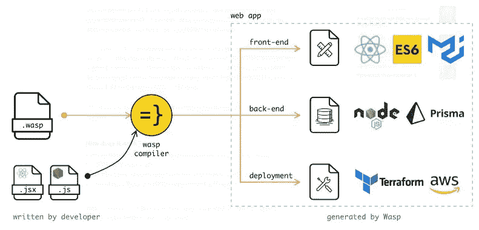

# 我们已经为更快地开发 Node + React web 应用程序开发了一种语言。在 Hacktoberfest 期间加入我们！

> 原文：<https://blog.devgenius.io/weve-built-a-language-for-developing-node-react-web-apps-faster-join-us-during-hacktoberfest-bc6c430938e9?source=collection_archive---------6----------------------->

**TL；DR:** 我们开发了一种开源语言，用更少的代码和最佳实践来构建全栈 web 应用，与 React 和 Node 一起工作。在 HacktoberFest 期间加入我们！

大家好！我们是一个由开源爱好者组成的小团队，对 web 开发充满热情，对编写样板代码感到极度厌倦。

这就是为什么我们创建了 Wasp——一种开源的 web 应用程序配置语言，它接管了创建项目主干的所有日常工作。您描述应用程序的功能(API 端点、授权、部署等)。)放在一个文件中。

编译器自己完成剩下的工作。结果是一个用 Node + React 构建的成熟的 web 应用程序在几分钟内就创建好了。我们得到了 Y Combinator 和来自 Airbnb、脸书和 Lyft 的工程师的支持。

Wasp 的编译器是用 Haskell 构建的，在引擎盖下，它在 React 和 NodeJS 中生成一个 web 应用。鉴于此，**你可以通过几种方式做出贡献**:

*   Wasp 编译器/CLI/LSP 内部(Haskell)
*   Wasp 作为一个 web 框架(React、Node、HTML/CSS、数据库等等)
*   教程或示例应用
*   证明文件

鉴于此，我们将为任何人找到一个好的第一期，无论你是一个有经验的开发人员还是初学者！

[这里是任何想在 Hacktoberfest 期间为 Wasp 做贡献的人的切入点。](https://github.com/wasp-lang/wasp/issues/735)

**技术栈:JS，Haskell**