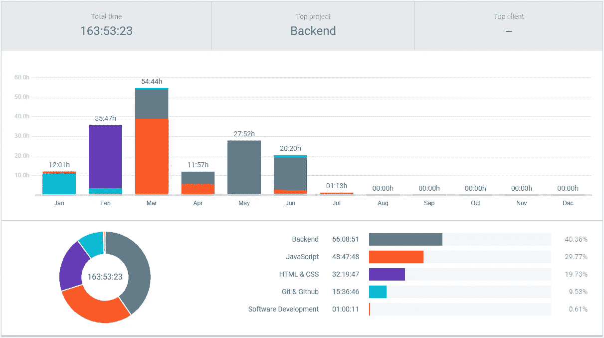
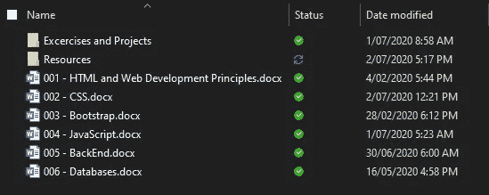
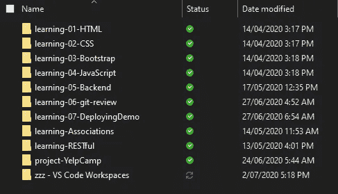
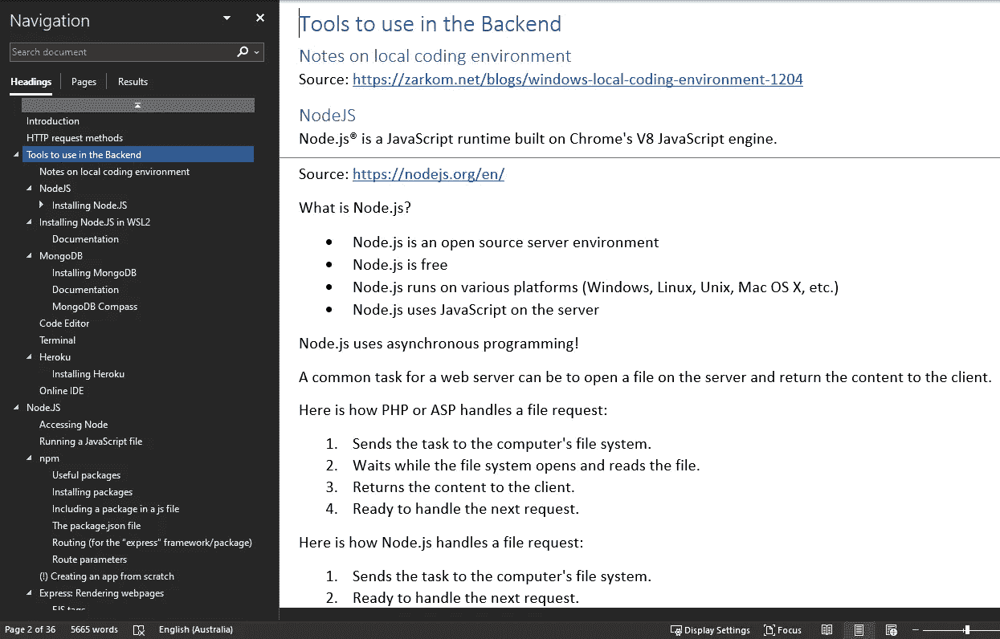
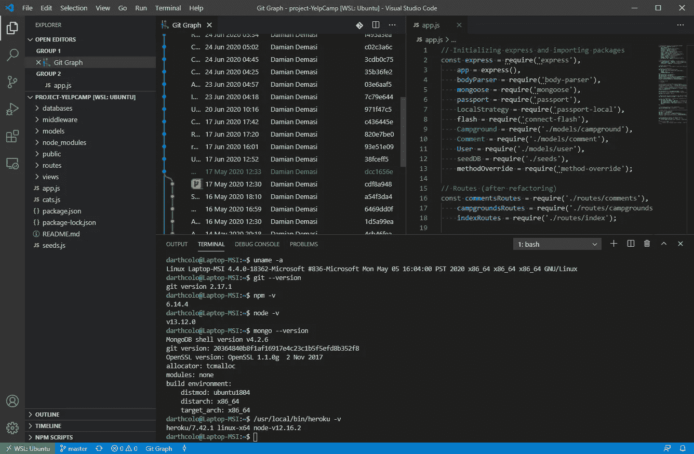

# 在线网络开发课程让我了解了人性

> 原文：<https://blog.devgenius.io/what-an-online-web-development-course-taught-me-about-human-nature-17c4076c9dd5?source=collection_archive---------38----------------------->

*自我鼓励的宣泄*

凯勒·琼斯在 unsplash.com 拍摄的照片

*作者:达米安·德马斯*

1998 年，我开始把设计非常简单的网站作为业余爱好，这帮助我在大学期间养活了自己。但是这个活动从来不是从爱好阶段演变而来的，很快我就开始投入越来越少的精力。一旦我完成了我的大学学业(在一个非常相关的领域),我放弃了 web 开发好几年。

快进到 2020 年，我决定在 Udemy 上开办一个 Web 开发人员训练营课程，最终目标是更新我的知识，回到我的设计和开发兴趣上来。

在做了一些研究后，我决定开始学习 Git。这样，我就可以记录我在课程中和未来项目中要做的每一件事。我还选择了 Windows 作为我的开发平台，这被证明是一个挑战，但现在非常值得。

我还打算分析学习的过程，以及我将在这项活动中实际投入多少时间。这就是使用名为[时钟](https://clockify.me/)的时间跟踪工具的原因。

我的目标是每天学习 4 个小时，这样我就可以平衡这门课程与我正在学习的硕士课程(在一个不相关的领域)、兼职工作以及其他与我是澳大利亚移民相关的活动。起初，我认为这个目标是可以实现的，但“证据”表明，预定的学习节奏很难保持。

使用 Clockify，我注意到以下学习时间分布:

Web 开发训练营有 405 个讲座，分布在 47 个小时内。这相当于将近 148 个小时的实际学习。如果我考虑在研究学习什么课程和我将走哪条道路，一个简短的 Git 和 GitHub 课程，以及 web 开发课程的总长度上投入的时间，我实际上在 6 个月中投入了将近 164 个小时。最初我估计，最多有一半的时间。

所以，在经历了这段经历后，这些就是我在这门课中学到的关于自己的教训。

# 动机神话

我选择学习这门课程是因为它是一门让我感兴趣的学科。我喜欢用工具和原材料(代码、图像、数据库等)创建东西(网站)。).这是我选择参加在线课程、支付费用并愿意投入大量时间学习的主要驱动力。但有时这还不够。

我有很多“我不喜欢”的日子。我找到了一个简单的方法来克服这种感觉。问题是“选择”:我可以选择不学习。所以，我从去除那个选择开始。我发现不给自己“不学习”这个选项帮助很大。我通常在早上学习，很早，所以我做的是做一系列自动化的习惯:醒来，做一些运动，洗澡，准备早餐，坐在电脑前，打开 Udemy，我的代码编辑器和我的 Word 文档，做笔记。所有这些，没有考虑不做的选择。我不得不这么做，因为我的早晨就是这样安排的。没有选择，没有选择。

当然，有一些日子是不可能学习的:工作任务，其他学习任务，总的来说生活。但是，即使在脱离了几天(甚至几周，当硕士评估临近的时候)，回到在线学习 web 开发的既定程序也是相当容易的。

后来我了解了动机神话。

我们所知的“动机”是一个神话。在任何重大改变的开始，动机并不是我们所需要的特殊调料。事实上，动机是过程的结果，而不是原因。理解这一点将改变你接近任何障碍或大目标的方式。”——摘自《动机神话:成功人士如何真正为自己赢得胜利》一书。

我经历了在我开始学习的任何一天之后，而不是在学习之前的 T2，动机是如何开始增长的。这是每天继续激励我的另一个支持因素。

# 心态和学习技巧

课程的一些部分并不容易(实际上，非常具有挑战性)，我“不够好”而不能选修这门课程的想法，或者“我永远也不会达到老师的知识水平”的感觉出现了好几次。但我不得不提醒自己，我不能把现在的我和某个学科的专家相提并论。我应该做的是将今天的我与一年前，甚至是六个月前的我进行比较。作为证明，我现在(完成课程后)比 6 个月前(开始课程前)知道得更多。而且，如果我继续这条道路，最终将达到更高的知识水平。问题是，我经常倾向于把太多的注意力放在我不知道的事情上，而不是强调过程。我必须保持一种[的成长心态](https://www.ted.com/talks/carol_dweck_the_power_of_believing_that_you_can_improve?language=en)，并记住我还不知道它……*还是*。

另一个在课程中对我帮助很大的习惯是做大量的笔记。我决定为每个主要主题制作一个文档，并用定义、提示、常见错误、有用链接等填充这些文档。

由于课程本身的内容以及我开始在网上寻找的所有支持信息，每份文档都有所增长。

当我因为发现了另一个有趣的课题而无法学习几周后回到课堂时，这个技巧被证明是最大的帮助。我可以快速回顾概念，并回顾重要的命令。

倾向于探索不同的兴趣对我不利。我花了几周时间研究另一个好奇的领域:在亚马逊上销售。这分散了我的注意力和精力。但是我学到了重要的一课:把事情做好的最好方法是专注于一个长期目标和一两个短期目标。我的长期目标是成为一名 web 开发人员，所以我专注于此，同时，我也致力于短期目标，如交付评估、工作项目等。但是如果我专注于两个相互竞争的长期目标，比如成为一名网络开发人员和一名成功的亚马逊销售人员，我根本就不会完成这个课程，我可能仍然在两个或更多的目标之间徘徊。

# 不做这项工作的借口

课程建议使用在线代码编辑器，因为开发环境已经为您设置好了。我决定用 Windows 10(是啊…我知道)。我投入了大量的时间来配置 Linux (WSL) 的 [Windows 子系统，以拥有一个合适的终端，并将其与 VS Code、npm、Git、NodeJS、MongoDB 和 Heroku 集成。](https://docs.microsoft.com/en-us/windows/wsl/install-win10)

这并不容易，但也不是不可能，最后，我设法让一切都运转起来。

这让我明白做一件事有很多种方法。我只需要选择和设置最适合我的工具。需要强调的是，很多时候我们倾向于用“缺少合适的工具”作为不工作的借口。我最近听了阿里·阿布达尔和德里克·西弗斯的[播客中的一集](https://www.youtube.com/watch?v=vHIiC6SPxoQ)，德里克解释了这个概念。如果你真的想做这项工作，你会找到办法的。工具只是达到目的的一种手段。

# 关键要点

现在我已经完成了这个课程，我不仅知道了很多关于 web 开发的新知识，还知道了更多关于我自己的事情，我的行为方式，以及我可以采取的行动来推动自己朝着正确的方向前进。为了实现一个长期目标，我需要 100%的投入，并意识到这需要时间，所以我不必绝望。我需要记住，我不应该拿自己和别人比较，而应该和以前的自己比较。我选择相信我走在一条人迹罕至的道路上，即使这条路更崎岖，我相信它会让一切都不一样。

# web development # study online # growth mindeg # goals # self development # JavaScript # nodejs # MongoDB # git # vs code # windows 10 # wsl