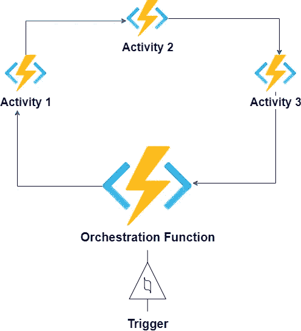
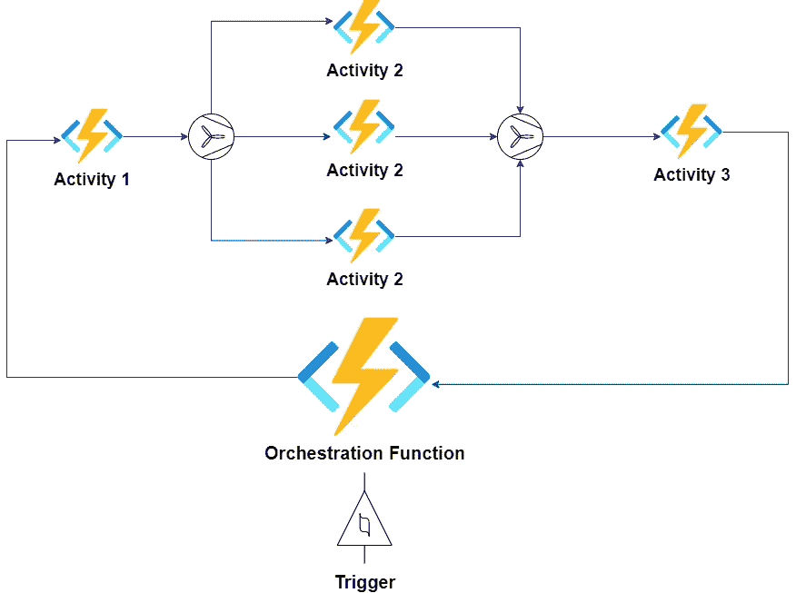
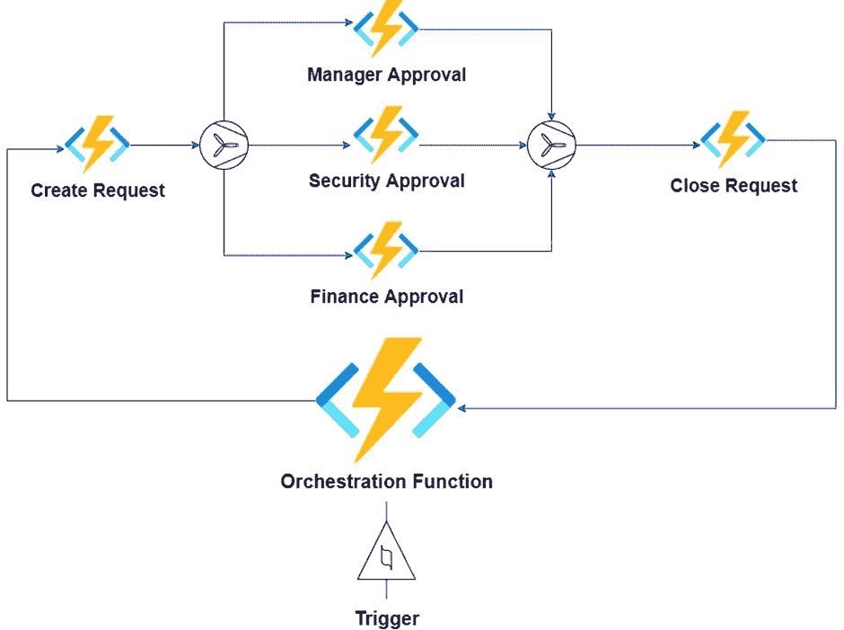
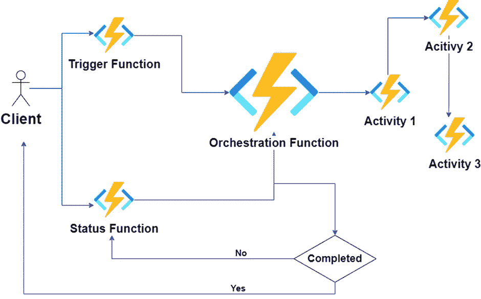
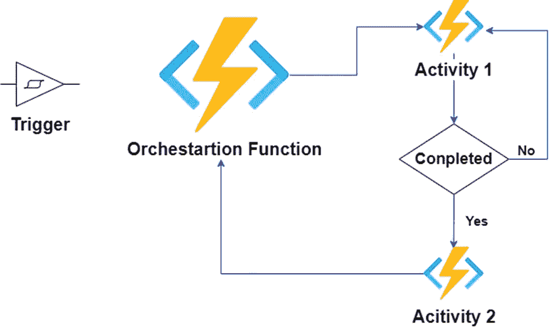
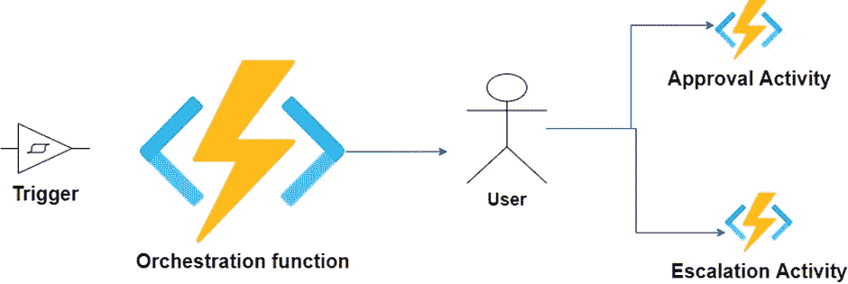

# Azure 持久功能是什么，为什么？

> 原文：<https://blog.devgenius.io/what-and-why-of-azure-durable-function-27dd8f4ab7d6?source=collection_archive---------14----------------------->

在过去几天写了传统的 Azure 函数之后，我想花一些时间在 Azure 持久函数上。在本文中，我将只讨论持久函数的理论部分。本文的议程如下:

1.  Azure 持久功能是什么，为什么
2.  设计模式

# 什么是 Azure 持久功能？

Azure 持久函数是 Azure 函数的扩展。它有助于在编排功能和活动的帮助下实现工作流，同时始终保持状态。即使持久函数是有状态的，它们也不是一直处于活动模式。因此，持久功能遵循与传统 azure 功能相同的定价模型，企业所有者按使用付费。

## 编排功能

编排有助于管理和配置复杂的独立自动化任务来实现工作流。编排不同于自动化。自动化消除了在软件程序的帮助下完成任务的人工干预，但是编排是关于管理多个自动化来实现工作流。

编排功能是持久功能的入口点，它调用几个活动。

## 活动

活动是 azure 的功能，它将独立的任务作为复杂工作流的一部分进行管理。orchestrator 函数调用活动来实现工作流。

# 为什么选择 Azure 耐久函数？

与典型的 azure 函数相比，使用 Durable 函数的一些好处如下:

1.  管理复杂的工作流程
2.  重试、超时和取消功能
3.  并行处理
4.  状态管理
5.  消费定价模型

# 设计模式

## 函数链接

这是最简单的模式。orchestrator 函数按顺序调用活动。一个活动功能的输出是链中下一个活动功能的输入。

## 扇出/扇入

在这种模式下，您可以并行运行函数。一旦所有并行运行的功能完成执行，orchestrator 就可以聚合数据并将输出提供给下一个功能。

这种设计模式可能有两种变体。

1.  **同一活动的不同实例**

这种模式在编排成批处理大量积压工作的情况下会很有帮助。

**2。并行运行的独立活动**

如果我们需要为批准触发不同的自动化，这种设计模式会很有帮助。这些批准可以并行进行，每种批准的逻辑都是独特的。

## 异步 HTTP Apis

在异步 HTTP APIs 的帮助下，我们可以监控长期运行的编排功能的状态，并在所有处理结束后返回响应。

## 班长

顾名思义，这种设计模式可以帮助监控活动，并在活动结束后采取行动。

## 人际互动

顾名思义，编排功能的进度取决于人工干预。

页（page 的缩写）s-Medium 是一个阅读、写作和向其他作者学习的绝佳平台。如果你想加入我的旅程，今天就加入 [medium](https://tarunbhatt9784.medium.com/membership) 。