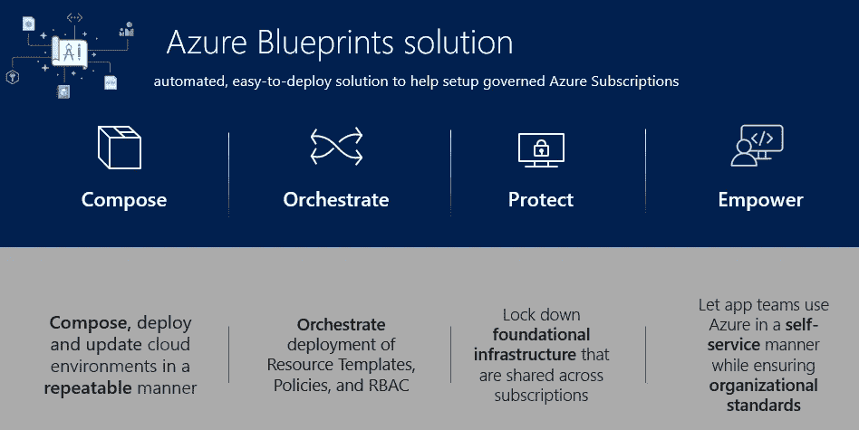
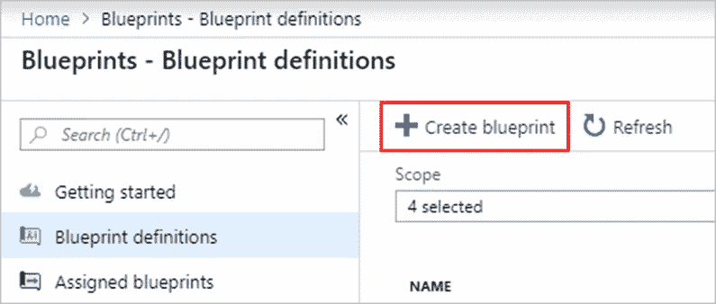
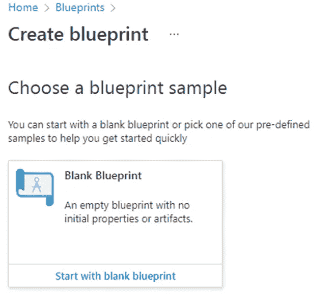
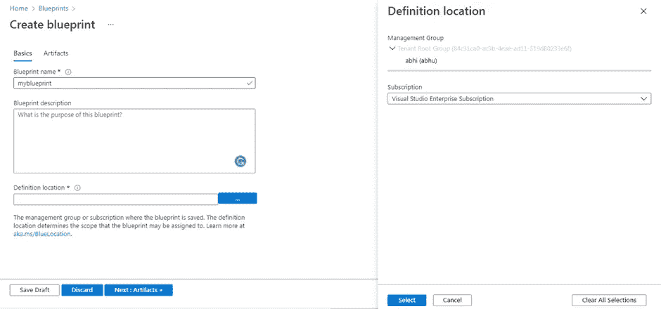
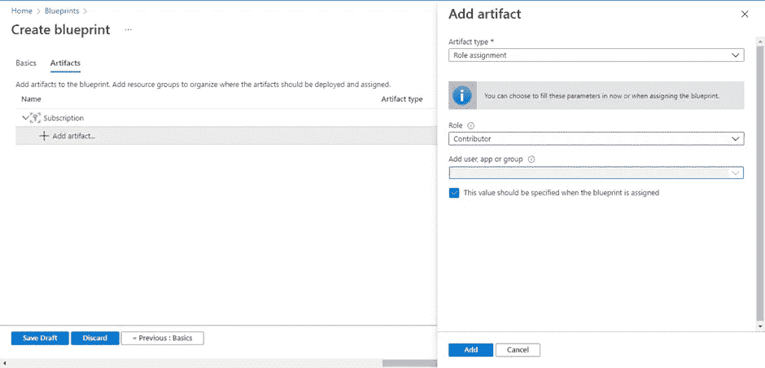
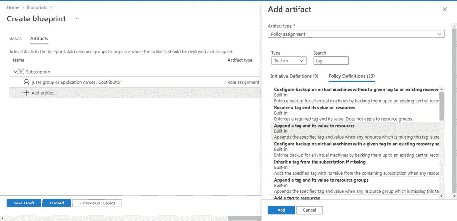
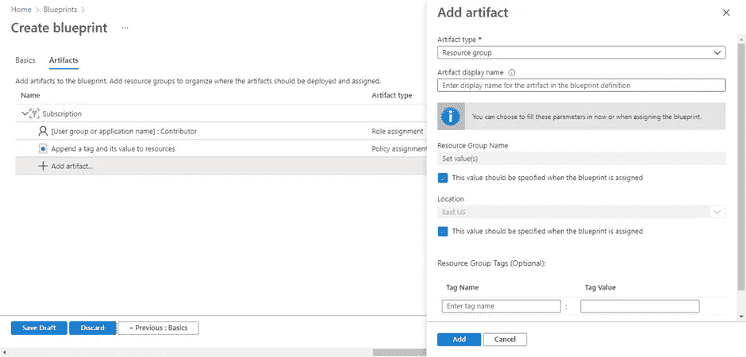
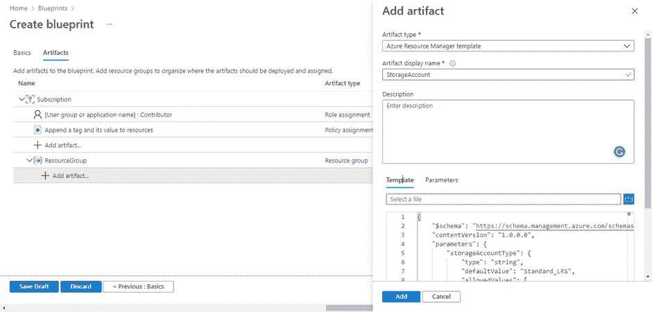
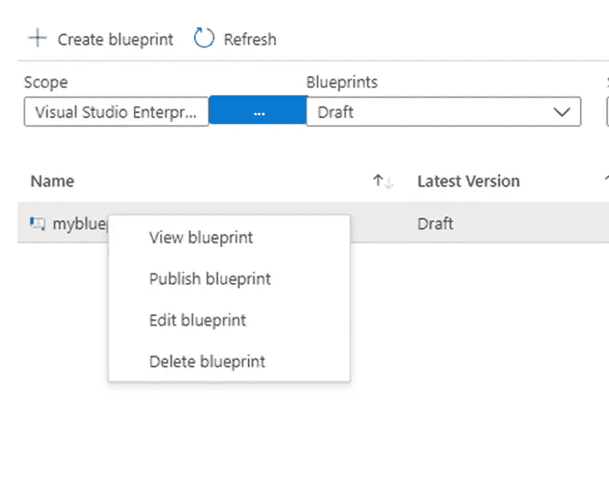

# 什么是 Azure 蓝图，如何构建你的第一个 Azure 蓝图？

> 原文：<https://blog.devgenius.io/what-are-azure-blueprints-and-how-to-build-your-first-azure-blueprint-34e4b5e1d0d8?source=collection_archive---------3----------------------->



[https://www . tallan . com/blog/2020/03/17/azure-governance-part-3-azure-blue-blues/](https://www.tallan.com/blog/2020/03/17/azure-governance-part-3-azure-blueprints/)

想象一下，你即将开始建造你梦想中的房子，但你不知道它最终会是什么样子，不知道你需要什么材料来开始建造，也不知道你应该遵循什么样的安全标准。在不了解这些的情况下，你还会考虑建吗？答案就在某个地方，“没有”。那么为什么在没有合适蓝图的情况下构建你的 Azure 服务呢？为了让您的部署每次都保持在正确的轨道上，您可以使用一个清单，但它不够快且没有错误。所以图中出现了蔚蓝的蓝图。

Azure Blueprints 是微软 Azure 的一项服务，通过确保相同的标准、安全性和要求来构建和部署可重复的 Azure 资源集合。在本文中，我们将了解更多关于 Azure Blueprints 以及如何创建您的第一个 Azure Blueprint？让我们开始吧。

**什么是 Azure 蓝图？**

Azure Blueprints 帮助工程师和云架构师快速部署具有一组需求和标准的服务，通常是重复进行的。

以任何事物的传统蓝图为例，例如房子或软件。蓝图用于确保您试图构建的最终产品将遵循某些需求和标准。而且，你可以用它来一次又一次地建造一些东西。就安全性和性能而言，每次最终产品的参数都是相同的。同样的事情也适用于作为 Azure 资源的技术图纸/计划的 Azure Blueprint。它有助于使用预定义的标准和要求快速构建和部署 Azure 服务。

【Azure Blueprints 与 Azure Policy 和 ARM 模板有什么不同？

Azure Blueprints 听起来可能类似于 Azure Policy 和 ARM 模板，但这些服务之间有一些显著的差异。

蓝图保留了部署的应用程序和蓝图组件之间的关系。而在 ARM 模板的情况下，您部署的应用程序和模板之间没有活动的关系。这种连接有助于跟踪和审计资源。此外，ARM 在 Azure 中不是原生存在的，其中 blue prints(Azure 中的原生存在)通过 Azure Cosmos DB 在全球范围内分发，并且可以跨区域复制。但是可以肯定的是，你不需要在 Azure 蓝图和 ARM 模板之间进行选择，因为你可以在一个蓝图中选择多个 ARM 模板。

接下来，Azure policy 可以与 Azure Blueprints 一起使用，以确保只对资源进行批准的更改，从而保护蓝图的合规性和标准。

**Azure 蓝图的生命周期**

●创建和编辑蓝图

●发布蓝图

●创建、编辑和发布新版蓝图

●删除蓝图

**创建您的第一个 Azure 蓝图**

1.  打开你的 Azure 门户，搜索**蓝图。**
2.  在入门页面中，您可以点击创建或点击**蓝图定义**，然后选择 **+创建蓝图。**



3.在下一页，您将看到微软为蓝图提供的一些示例。眼下，选择**从空白蓝图开始。**



4.给出你的蓝图的名称和描述。并选择一个管理组或订阅来保存蓝图。



5.查看给定的信息，因为您以后无法更改。点击**下一个:工件。**

6.添加角色。

●点击**+添加工件**，选择工件类型下的**角色分配**。

●选择**贡献者**作为角色，其他都保持默认。

●点击**添加。**



7.添加策略。

●点击**+添加工件**，选择工件类型下的**策略分配**。

●将**内置**设置为类型，并搜索“标签”。从搜索结果中，选择 **Append 标签及其值到资源组。**

●点击**添加**。



8.添加资源组。

●点击**+添加工件**，选择工件类型下的**资源组**。

●将所有内容保留为默认值，并确保勾选复选框。

●点击**添加。**



9 .在资源组下添加模板。

●点击资源组下的**+添加工件**。

●选择 **ARM 模板**作为工件类型，并将显示名称设置为 StorageAccount。

●对于模板选项卡，输入以下 JSON 代码并单击 Add。

```
*{**"$schema": "https://schema.management.azure.com/schemas/2015-01-01/deploymentTemplate.json#",**"contentVersion": "1.0.0.0",**"parameters": {**"storageAccountType": {**"type": "string",**"defaultValue": "Standard_LRS",**"allowedValues": [**"Standard_LRS",**"Standard_GRS",**"Standard_ZRS",**"Premium_LRS"**],**"metadata": {**"description": "Storage Account type"**}**},**"location": {**"type": "string",**"defaultValue": "[resourceGroup().location]",**"metadata": {**"description": "Location for all resources."**}**}**},**"variables": {**"storageAccountName": "[concat('store', uniquestring(resourceGroup().id))]"**},**"resources": [{**"type": "Microsoft.Storage/storageAccounts",**"name": "[variables('storageAccountName')]",**"location": "[parameters('location')]",**"apiVersion": "2018-07-01",**"sku": {**"name": "[parameters('storageAccountType')]"**},**"kind": "StorageV2",**"properties": {}**}],**"outputs": {**"storageAccountName": {**"type": "string",**"value": "[variables('storageAccountName')]"**}**}**}*
```



现在，您已经添加了所有的工件。所以点击保存草稿。

**编辑蓝图**

在我们的上一个蓝图中，我们没有添加具有角色分配的资源组，并将描述留空。因此，要编辑蓝图-

1.  转到蓝图控制台，在定义选项卡中找到您的蓝图。
2.  从给定列表中，选择您的蓝图，然后选择编辑蓝图。



3.在基础中，您将看到名称和位置不能更改，但您可以编辑描述。所以给你的蓝图一个美好的描述。

4.接下来，点击工件选项卡。并为您的资源组添加角色分配。

●点击资源组下的**+添加工件**，选择**角色分配**作为工件类型。

●选择**所有者**作为角色，取消选中“添加用户、应用或群组”复选框。并选择要添加的用户、群组或应用程序。

●点击**添加**，然后点击**保存草稿。**

**发布蓝图**

要发布蓝图，请转到蓝图定义。选择你的蓝图，点击右键，选择**发布蓝图。您将被要求提供一些细节，在填写这些细节后，您的蓝图将会发布。**

**分配蓝图**

发布蓝图后，您可以将其分配给管理组下的订阅。如果是在订阅中创建的，则只能将其分配给相同的。

转到蓝图定义，右键单击您的蓝图，选择**分配蓝图。**选择要分配给此蓝图的订阅。

**结论**

在本文中，我们了解了 Azure Blueprint，并且还创建了一个蓝图来配置订阅的策略和角色。