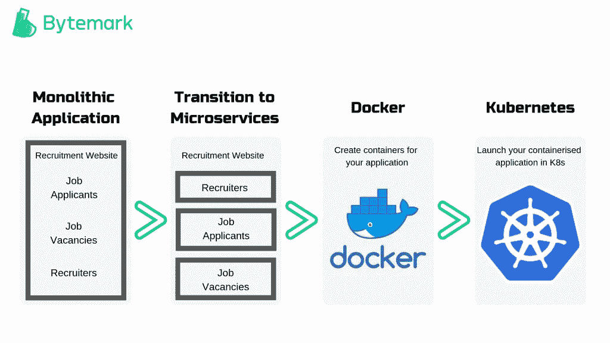

# 为什么公司要转向 DevOps 文化？

> 原文：<https://blog.devgenius.io/what-are-companies-shifting-to-a-devops-culture-e6656274eff5?source=collection_archive---------3----------------------->

[https://dev.to/ashokisaac/devops-in-3-sentences-17c4](https://dev.to/ashokisaac/devops-in-3-sentences-17c4)

Tripwire Inc .的联合创始人吉恩·金(Gene Kim)表示:“目前，DevOps 更像是一场哲学运动，还不是实践的精确集合，无论是描述性的还是规定性的。”

IT 领域似乎有很多这样的事情！从努力定义计算机科学到试图确定什么是硬错误和软错误——在计算机科学中有许多事情你无法精确定义。

谢天谢地，这并没有阻止人们去尝试。以下是 Azure 对 DevOps 的理解:

> *devo PS 是开发(Dev)和运营(Ops)的综合体，是人员、流程和技术的结合，不断为客户提供价值。*
> 
> *devo PS 对团队意味着什么？DevOps 支持以前孤立的角色(开发、IT 运营、质量工程和安全)进行协调和合作，以生产更好、更可靠的产品。通过采用 DevOps 文化以及 DevOps 实践和工具，团队能够更好地响应客户需求，增强对他们构建的应用程序的信心，并更快地实现业务目标。*

[—Azure.microsoft.com](https://azure.microsoft.com/en-us/overview/what-is-devops/)

作为一种理念，DevOps 专注于创建一个协作环境，在这个环境中软件可以变得更加以用户为中心。这不仅仅是为了加快开发生命周期，也是为了提高软件的整体质量。这可能就是为什么最好将 DevOps 描述为一种思维方式，而不仅仅是一种快速开发的工具。

# DevOps 是如何工作的？

你还记得在电影*中丹泽尔·华盛顿是如何让他的进攻和防守队员一起工作的吗？把 DevOps 想象成 IT 工程界的丹泽尔。*

DevOps 致力于结合运营和开发工程师的专业知识，从设计流程一直到产品发布和支持。

在一些 DevOps 模型下，开发和运营团队的合并还包括质量保证和安全团队的更紧密集成。这种高度集成的结果是，许多由孤立活动(比如测试和部署)产生的错误都被消除了。

DevOps 团队使用实践来自动化流程和工具，这有助于更快地运行和发展应用程序，并具有更高的可靠性。由于 DevOps，团队的整体生产力和速度被推到了极限。这将带来更大的收益，超越公司的利润。

# DevOps 的优势

像所有事情一样，DevOps 一路走来受到了一些批评。例如，批评家经常称 DevOps 是一个“锋利”的工具，它可以像简化一样容易地将事情复杂化。

我将通过列出 DevOps 提供的一些额外好处，让您来判断 devo PS 作为一种方法论到底有多有价值。

# 速度

速度绝对是 DevOps 必须觊觎的好处之一。它允许企业在功能性方面全力以赴。

更快的软件发布意味着企业可以利用产品特性的价值。众所周知，产品测试虽然必要，但也非常耗时。借助 DevOps，公司可以通过自动化集成和测试加快交付和修改过程。

不仅如此，还有一个完整的开发团队可以在产品的整个生命周期中密切关注产品。这种持续的监视减少了团队定位和修复错误和缺陷的时间。

# 可靠性

竞争市场的好处是质量最终总是胜过数量。这就是为什么软件质量是值得的。

质量和可靠性是 DevOps 能够带来的两样东西。DevOps 有助于简化企业执行软件测试的方式——测试不是 SDLC 的一部分，DevOps 将其提升为整个 SDLC 中至关重要的整体组件。

另一方面，可靠性允许系统在其环境限制内连续运行，这反过来促进了业务无缝运行所需的服务的整体连接性。

# 改善协作

事实是，在 DevOps 文化起飞之前，人们并不是没有意识到整合开发、运营和 QA 团队会给企业带来进一步的价值。

然而，即使在那时，以前的软件方法也遗漏了一个主要元素——协作。DevOps 所做的是将部门之间的协作带到最前沿，并改变了这些部门之间的互动方式。

我们都知道 DevOps 是对敏捷和精益软件方法的一个改进，所以 DevOps 自然地强调操作也就不足为奇了。在 DevOps 环境中，团队并不存在于他们自己的独立领域中，部门特定的目标已经过时。

DevOps 模式下协作的伟大之处在于，焦点从团队效率转移到综合整体绩效——因为最终产品的责任由所有人分担。此外，开发、运营和质量保证团队之间互动的增加还有另一个不可估量的技术升级优势。

想想看，当不同部门的成员定期一起工作时，他们会分享想法和专业知识。在某种程度上，他们正在接受与专业无关的所有事务的交叉培训。这就像拥有你的蛋糕并吃掉它——正如你所知，这就是拥有蛋糕的全部意义！

# 安全性

说到安全，它是一件大事。如果您正在处理折衷的数据保护，那么您的产品线是否以极快的速度运行并不重要。

但是有一些好消息。除了 DevOps 可以为公司提供的所有其他优势之外，它还可以帮助加强安全性。它通过将安全性作为一个单独的元素添加到开发和运营组件中来实现这一点，从而将自己转变为— DevSecOps。

在 DevSecOps 下，安全的责任不是落在一个团队身上，而是每个人都对安全和防御负责。DevSecOps 不仅有助于降低成本，还能帮助您及早发现和解决安全问题。

# DevOps 为什么重要？

问 DevOps 为什么重要就像问为什么越多越重要。这就是等式的结果。但是如果我列举 DevOps 的好处的所有努力都没有说服你，我只能再试一次了。

毫无疑问，世界已经变了。软件和互联网几乎以你能想象到的每一种方式改变了我们的生活。软件不再是一个补充组件，相反，它是每个企业不可或缺的一部分。

公司使用软件通过应用程序和服务接触客户，并简化他们做生意的方式——无论是物流、运营还是通信。就软件而言，实现的可能性是无限的。

在一切都变得计算机化的时代，软件是所有创新的关键。并且，DevOps 是区分好软件和伟大软件的标准！

# DevOps 实践

既然我们已经讨论了 DevOps 代表什么以及它的一些相关好处，那么让我们讨论一些 DevOps 实践。对 DevOps 方法的透彻理解将有助于消除您可能有的任何挥之不去的疑问。更不用说它会增加你的知识，在面试中派上用场(后面会讲到)。

# 连续累计

团队孤立工作带来的最大问题之一是当工作完成时合并代码。它不仅具有挑战性，而且很耗时。这就是持续集成(CI)可以发挥巨大作用的地方。

开发人员通常利用共享存储库(使用版本控制系统，如 Git)。)与持续集成。持续集成服务同时构建和运行代码变更测试的事实使得识别和处理错误变得更加容易。从长远来看，持续集成有助于提高开发人员的生产力，更快地解决 bug 和错误，并且有助于加速更新。

# 连续交货

[https://www.redhat.com/en/topics/devops/what-is-ci-cd](https://www.redhat.com/en/topics/devops/what-is-ci-cd)

> *进化在这个星球上锻造了所有有意识的生命，只使用了一个工具:错误。*
> 
> *—西部世界*

罗伯特·福特可能在《西部世界》中犯了一些严重的错误，但这个人确实有一些很棒的台词。他对进化提出了一个伟大的观点。

说到演进，许多人认为连续交付(CD)是 CI 的下一个演进步骤，因为它进一步推动了生命周期自动化的发展。

CD 是关于编译、测试和试运行环境的。开发生命周期的这一阶段通过在构建阶段之后将代码变更扩展到测试环境(或生产环境)来扩展 CI。

如果正确使用，CD 可以帮助开发人员在生产阶段之前通过多个维度的全面测试来微调更新。持续交付允许开发人员运行诸如 UI 测试、集成测试和负载测试等测试。

# 微服务

微服务对于软件设计就像生产线对于制造业一样。或者，说得更直白一点，微服务是一种软件设计架构，它用锤子敲打单片系统。

微服务允许在一个大的代码库中构建应用程序。每个应用程序都由多个微服务组成，每个服务都经过调整，在一个特定的功能上表现出色。

例如，让我们看看亚马逊是如何决定转向微服务的。曾几何时，当亚马逊不是今天的庞然大物时，他们的 API 为他们提供了很好的服务。但是随着它们的流行，它们对更好的应用程序接口的需求也在增长。

亚马逊决定进军微服务。现在，亚马逊有多种服务，而不是有问题的两层架构——一种处理订单，一种生成推荐购买列表的服务，一种支付服务，等等。所有这些服务实际上都是具有单一业务功能的微型应用程序。

[https://docs . byte mark . co . uk/article/kubernetes-术语-词汇/](https://docs.bytemark.co.uk/article/kubernetes-terminology-glossary/)

# 基础设施作为代码

由于技术创新，服务器和关键基础设施不再像十年前那样运行。现在，你有像谷歌这样的云提供商，他们在巨大的数据仓库中为成千上万的客户管理业务基础设施。

毫不奇怪，今天工程师管理基础设施的方式与以前大不相同。此外，基础设施即代码(IaC)是 DevOps 环境可以用来处理规模变化的实践之一。

在 IaC 下，使用软件开发技术和代码(如版本控制等)来管理基础设施。由于云的 API 驱动模型，开发人员可以通过编程方式与基础设施进行交互。这使得工程师可以像处理应用程序代码一样处理基础设施。

这很重要，因为它允许您像测试代码一样测试您的基础设施。有了 IaC 掌舵，您的系统管理员就不必担心 web 服务器无法连接到数据库等问题。

更重要的是，IaC 可以帮助企业自动供应和塑造抽象层，以便开发人员可以继续构建服务，而不需要了解特定的硬件、GPU、固件等，如果他们有一个开发基础设施以推动自动化向前发展的 DevOps 团队。

想象一下:像奔驰、宝马和奥迪这样的大牌汽车制造商都想获得最新的车内体验技术，对吗？但如果这些公司想要推出新的服务和产品，他们将不得不面对这样一个事实:路上的每个人都有不同的硬件。

除非有一天，决定拥有通用硬件的权力，边缘设备将继续成为发展的障碍。然而，这正是一个可靠的 DevOps 团队可以提供帮助的地方，因为他们可以自动供应抽象层来自动化基础架构服务。通过解决云中的边缘案例挑战，DevOps 团队可以帮助汽车制造商削减成本，并帮助减轻开发人员的负担和压力。

# 结构管理

在 DevOps 模型中，配置管理(CM)对于鼓励持续集成非常重要。无论您是在云中托管还是在内部管理我们的系统，正确实施配置都可以确保准确性、可追溯性和一致性。

当系统管理员使用代码来自动化操作系统时，这会导致配置更改的标准化。这种规律性使开发人员不必浪费时间手动配置系统或系统应用程序。

# 作为代码的策略

拥有云基础架构和配置优势的组织还拥有大规模监控和实施合规性的额外优势。

这种类型的自动化允许组织有效地监督资源的变化，并且允许以分散的方式实施安全措施。

# 监控和记录

监控指标可以帮助企业了解应用程序和基础架构性能对最终用户体验的影响。对数据和日志进行分析和分类可以获得关于问题核心原因的有价值的见解。

从这个角度来看，如果服务要 24/7 可用，就更新频率而言，主动监控变得极其重要。

如果你正忙于代码发布，你知道人类不可能检查你所有的盲点。为什么？因为不是每个问题都会在用户界面上弹出来。一些 bug 像 Ethan Hunt 一样打开安全漏洞，另一些降低性能，还有浪费资源的浪费型 bug。

另一方面，容器和实例的生成会让日志管理感觉像是大海捞针，令人不快。大量的原始数据使得寻找有意义的信息变得非常困难。

但是，如果您有监控系统，您可以依靠这些指标来提醒团队任何类型的跨云服务或应用程序的异常。

此外，监控指标可以帮助企业了解应用程序和基础架构性能对最终用户体验的影响。

日志可以帮助 DevOps 团队创建用户友好的产品或服务，或者推动持续集成/交付。综合应用—监控和日志记录不仅可以帮助企业拉近与客户的距离，还可以帮助企业了解自身的容量和规模。

例如，几乎所有的企业全年都会从 AWS、Azure 甚至 Google Cloud 等云提供商那里租用一定数量的云空间。但是，如果一家公司没有意识到其容量会因旺季或节假日而波动，或者如果其团队没有准备好通过创建配置层来应对这种波动，那么事情就会变得非常糟糕，就像网站崩溃一样。

# 沟通和协作

DevOps 的一个基本文化方面是沟通和协作。DevOps 工具和自动化(软件交付过程的)关注于通过结合开发和操作的过程和效率来创建协作。

在 DevOps 环境中，所有参与的团队都致力于建立与信息共享相关的文化规范，并通过项目跟踪系统、聊天应用程序等促进交流。这允许开发人员之间更快的交流，并有助于将组织的所有部分聚集在一起，以完成设定的目标和项目。