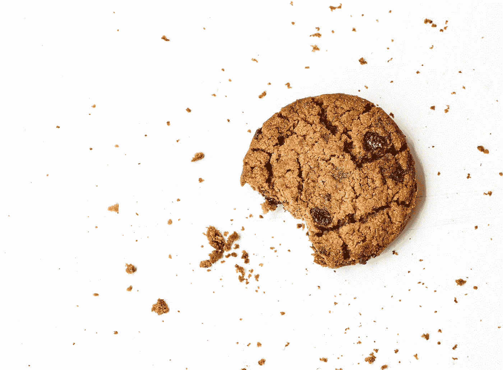
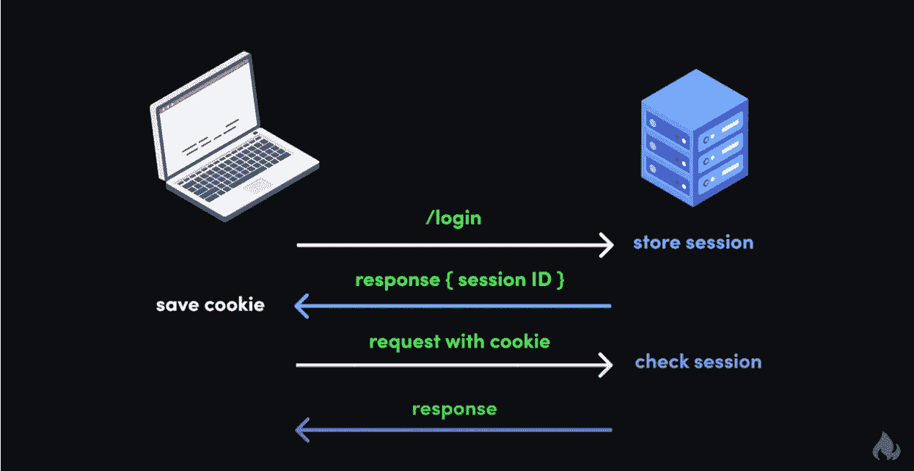

# 什么是饼干？

> 原文：<https://blog.devgenius.io/what-are-cookies-bee75e255e81?source=collection_archive---------19----------------------->



Vyshnavi Bisani 在 [Unsplash](https://unsplash.com?utm_source=medium&utm_medium=referral) 上拍摄的照片

那肯定是一块饼干，但那不是我要说的。我说的是每当你在网上购买靴子、查找卡普雷塞沙拉的食谱，或者阅读任何可以预防老年痴呆症的新事物时，你都会看到的那些弹出窗口。你知道那些弹出窗口(现在你知道我的搜索历史)。

但是什么是饼干呢？每当网络问你时，你应该接受吗？

# **什么是饼干？**

问得好。cookie 是网站放在你电脑上的一个微小的存储单元。该网站使用它来存储来自 web 浏览器会话的信息，如登录信息，因此您不必每次导航到新页面时都要登录。那些你经常去的网站，但从来不用登录，甚至在你输入登录信息几周后也不用登录？那些是饼干，我的朋友。相当方便。

# 它们是如何工作的？

当您在表单中输入用户名和密码并提交时，信息会被发送回服务器。根据数据库检查您的用户名和密码，如果找到，服务器将创建并存储一个会话。将生成一个唯一的会话 id，并将带有该 id 的 cookie 发送回您的计算机。每次您导航到网站上的新页面时，服务器都会在返回您请求的数据之前检查您的会话 id。

当您注销网站时，您的浏览器会向服务器发送注销请求，包括 cookie。服务器删除会话，并告诉您的浏览器删除 cookie。



来源:[100 秒内会话 vs 令牌认证](https://www.youtube.com/watch?v=UBUNrFtufWo) (YouTube)通过 freecodecamp.org

# **它们是如何使用的？**

嗯，首先，一个 cookie 的容量是 4KB，虽然一个域可以发送多个 cookie，但这并不多。cookie 也无法访问您的计算机上的信息，或发送 cookie 的网站以外的网站上的信息。

cookies 通常用于存储用户设置，如登录状态、首选语言或位置。但是饼干可以储存许多其他的东西。一般来说，它们可以存储你在网站上输入的任何东西:你的姓名和地址、购物车的内容、购买历史、浏览历史、搜索查询，当然还有信用卡信息。通常，这些信息被用来为网站访问者创造更流畅、更愉快的用户体验，以及提供有针对性的广告。

# **为什么使用它们？**

Cookies 用于使 web 服务器能够存储**有状态**信息，因为服务器是**无状态**。这意味着请求被发送到服务器，服务器处理这些请求，返回数据，然后忘记它们。服务器不会因为每个用户的信息而陷入困境，而是将这些信息存储在用户自己的浏览器上，然后在需要时随时访问。当 cookie 开始以这种方式使用时(90 年代初)，cookie 已经作为在两个计算机程序之间传递数据的一种方式而广为人知。将您的浏览和购物偏好放在手边有助于网站更好地为客户服务，并吸引更多的回头客。

# **我如何使用饼干？**

Rails 可用于**签署**和**加密**一个特殊的 cookie，称为使用**会话方法**的**会话**。

首先，我们可以向 Rails 中的 config/application.rb 文件添加中间件和额外的安全性:

```
config.middleware.use ActionDispatch::Cookies
config.middleware.use ActionDispatch::Session::CookieStoreconfig.action_dispatch.cookies_same_site_protection = :strict
```

然后，为了访问控制器中的 cookies 散列，我们将 ActionController 添加到 ApplicationController:

```
class ApplicationController < ActionController::API
  include ActionController::Cookies
end
```

现在我们所有的控制器都可以使用 cookies 了。

让我们创建一个 cookie，在遇到付费墙之前限制页面浏览量。我们可以在控制器中添加一个方法:

```
class PagesController < ApplicationController def show
    session[:page_views] ||= 0
    session[:page_views] +=1 if session[:page_views] <=5
      page = Page.find(params[:id])
      render json: page
    else
      render json: { error: "No more free page views" }, status: :unauthorized
    end
  end
end
```

一旦页面浏览量达到 5 次，就会出现一条错误消息，告诉你页面浏览量不足。正如您所看到的，尽管向服务器发出了五次请求来查看不同的页面，但会话散列存储了视图的数量，以便服务器可以保持无状态。只要用户停留在同一个域中，会话就会继续跟踪。

# **结论**

对一般人来说，饼干可能有点可疑。信息和身份盗窃是当今世界的一个大问题。但实际上，cookies 是改善用户在线体验的有用工具。不得不经常登录你的账户，在每个网络商店选择你国家的货币，或者在你的报纸网站上找到你没有看完的文章，这些都是在你的网站开发库中保存 cookies 的好理由。