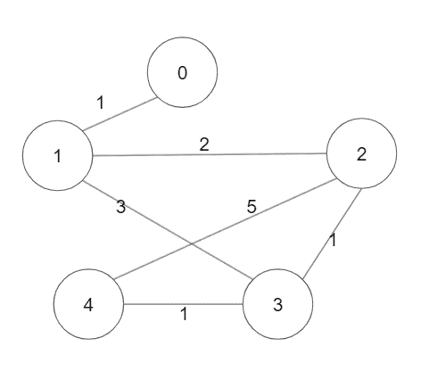
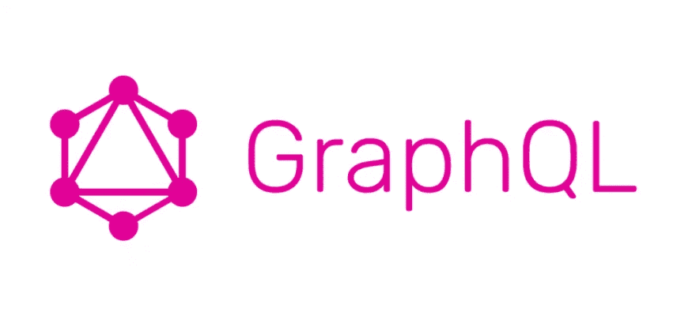

# 图算法有什么用？

> 原文：<https://blog.devgenius.io/what-are-graph-algorithms-used-for-8eb4a3f2fc96?source=collection_archive---------7----------------------->

## 图形算法及其用途的介绍

[图片](https://lh3.googleusercontent.com/grqXm6jJ2R7WRbyC1bpe6dkmWVabE5lg24O4oOR2Ib0mlEnkDyVyGqKw3gi19xSfUY4OuRQeFgGFnVUyrFQkzIg0Iwfe2MZ_xz_Dwp_1SmEKJCRyPqkt8Wg1O9BBSBPdow01bJEb)来自皮托纳戈斯

图算法是计算机科学的重要组成部分。每个计算机科学专业的学生都必须在某个时候学习这些算法。什么是图算法？这只是一个算法，我们用来遍历，分析，或处理一个图表。图是由边连接的一组节点或顶点。

美国的高速公路系统就是一个可以用图形表示的真实例子。每条公路可以是图上的一条边，每个城市可以是一个顶点或节点。假设您想从华盛顿州的西雅图旅行到纽约州的纽约市。您可以使用最短路径算法来计算通过美国高速公路系统从西雅图到纽约市的最短路径。

你会在现实生活中实现它们吗？也许吧。以下是图算法在软件和其他领域的一些应用。

# 软件

[图片](https://dev.to/shrutikapoor08/what-is-graphql-the-misconceptions-57b9)来自 DevTo

想到的第一个用例是 [GraphQL](https://en.wikipedia.org/wiki/GraphQL) 。GraphQL 是一种用于 API 的数据查询和操作语言。它于 2012 年在脸书开发，并于 2015 年开源。对于开发 web APIs 的初创公司来说，这非常受欢迎。一般来说，图用于确定计算流程、通信网络和数据组织。

例如，当创建高级和低级设计时，您实际上创建了一个图表。这些设计显示了数据应该流向哪里，应该发生什么。最初的设计可能不使用图形算法，但优化的实现会使用。您可能需要使用一些最短路径算法来找到连接两个数据的最佳方式。

图算法也经常用于网络安全、[自然语言处理](https://pythonalgos.com/2021/11/23/what-is-natural-language-processing-nlp/)和移动网络。

# 其他领域

图形算法不仅用于计算机科学。正如我在上面的例子中指出的，也许你想找到在美国旅行的最佳方式。许多其他领域使用图算法，我们将在这里简要介绍几个。

## 自然科学

在每一门物理科学中都经常用到图算法。统计物理学使用图形来表示系统的相互作用部分和系统的动态过程。图形算法在化学中最常见的应用是在分子研究中。图表应用于复杂材料的拓扑结构，以了解原子之间的关系。它们还帮助我们了解不同材料的结构，并研究这些结构如何影响不同的属性。

## 社会科学

来自 Flickr 的图片

是的，甚至社会科学也使用图形算法。图形被用来表示社交网络。我们使用图形算法来衡量信息传播、行为影响和群体声望等。这些可以应用于同伴团体、朋友团体或同事。

# 进一步阅读

要了解更多信息，您可以阅读不同的图遍历算法，如迭代[深度优先搜索和广度优先搜索遍历](https://pythonalgos.com/resources/algorithms-and-data-structures-graph-traversals/)、[递归深度优先搜索](https://pythonalgos.com/resources/data-structures-and-algorithms-recursive-tree-traversals/)和 [Dijkstra 的最短路径算法](https://pythonalgos.com/2021/12/08/dijkstras-algorithm-in-5-steps-with-python/)。

如果您觉得这很有帮助，请在 Twitter 或 LinkedIn 上与您的朋友分享！要想无限制地访问媒体上的信息宝库，今天就注册成为[媒体会员](https://medium.com/@ytang07/membership)！更多 Python 技巧、自然语言处理教程以及其他技术相关的帖子，记得关注我，[唐](https://www.medium.com/@ytang07)！

*更多内容尽在*[*blog . dev genius . io*](http://blog.devgenius.io)*。*