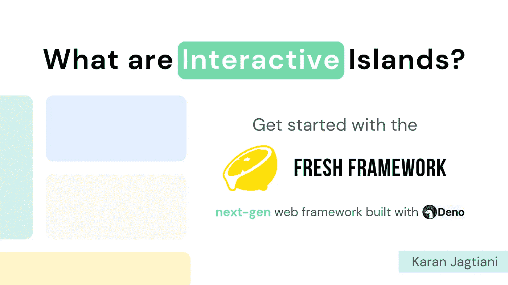
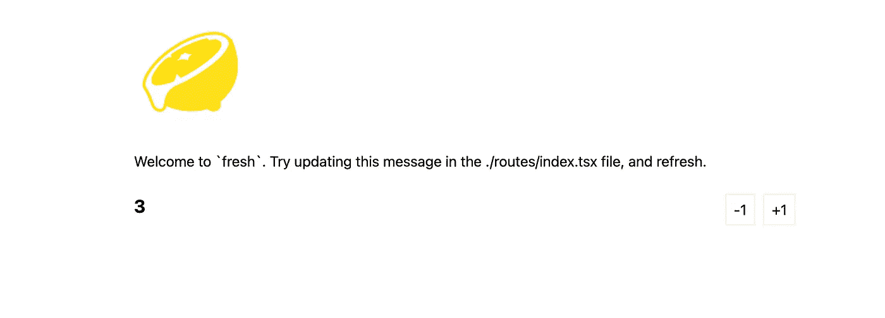
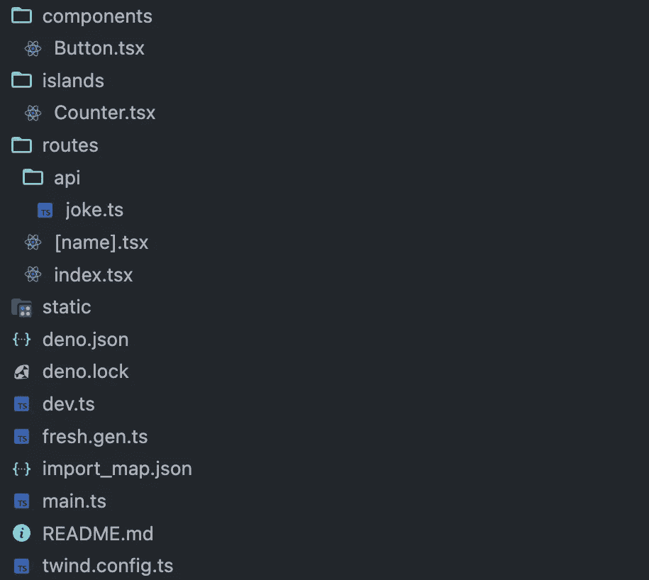
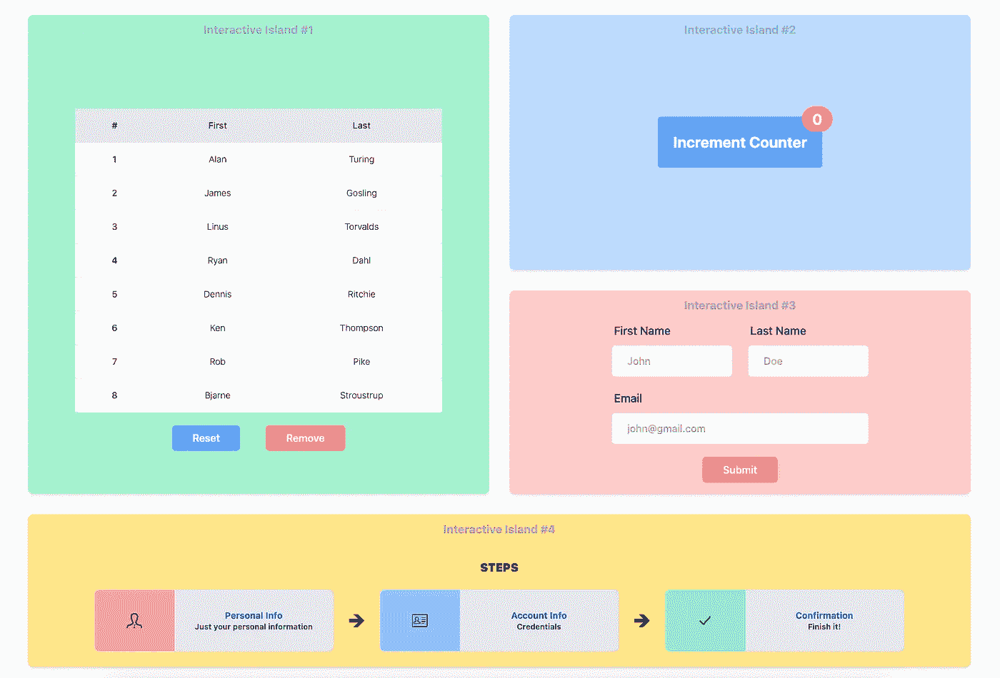
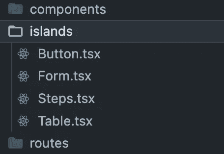
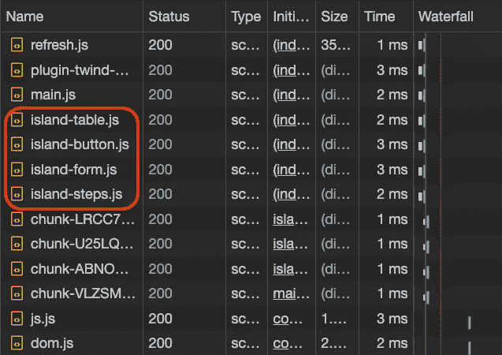
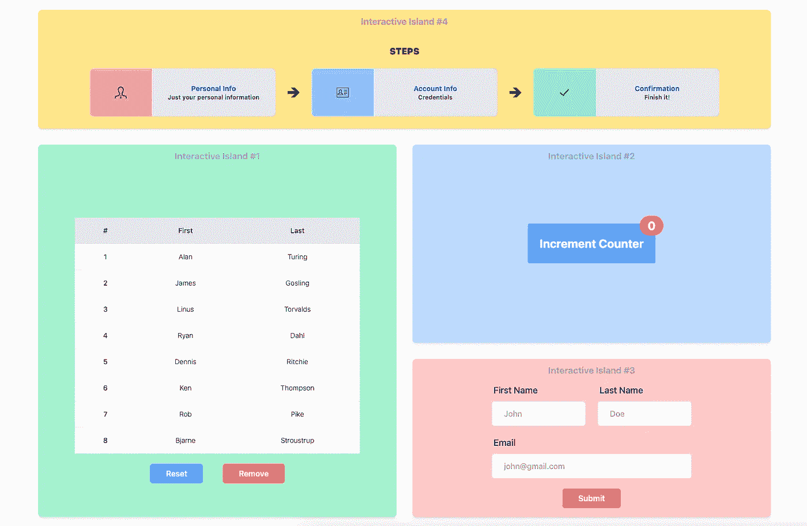
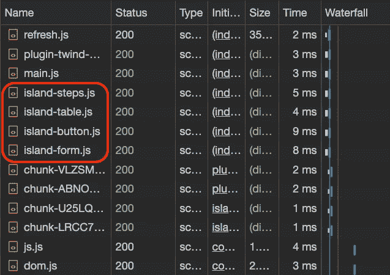

# 什么是互动岛？开始使用全新的框架！

> 原文：<https://blog.devgenius.io/what-are-interactive-islands-get-started-with-the-fresh-framework-d5824948a356?source=collection_archive---------2----------------------->



交互岛或“岛架构”是前端中的一个概念，更具体地说，是用户体验(UX)领域中的一个概念，其中 HTML 是在服务器端生成的，本质上是动态的组件在客户端独立地被**水合**。因此，用户不必等待整个页面被加载，并可以立即开始与加载的组件进行交互。

在本文中，我们将通过使用 [Fresh Framework](https://fresh.deno.dev/) 的实际演示来了解什么是交互岛，这是用 [Deno](https://deno.land/) 构建的下一代全栈 web 框架。

# 内容

1.  [什么是互动岛？](#0299)
2.  [新鲜框架介绍](#d17d)
3.  [创建一个新的新鲜项目](#6d5e)
4.  [项目结构](#b188)
5.  [互动岛屿演示](#9068)
6.  [结论](#3b47)

# 什么是互动岛？

基本上，应该是可交互的组件最初作为占位符发送，然后在客户端用 JavaScript 处理这些占位符，以使其可交互。

这种体系结构的优点是用户不必为了与加载的组件交互而等待整个页面加载。这就是组件被称为“孤岛”的原因，这些组件本质上是孤立呈现的，而不是相互依赖的。

我们将在这个博客中使用 Fresh 来回顾这实际上是如何工作的。但首先，我们先了解一下什么是新鲜的框架！

# Fresh 框架简介

Fresh 是一个相对较新的框架，旨在解决传统框架的问题，同时牢记“孤岛架构”。

## 后端的 Deno

Fresh 是一个开源的全栈框架，它使用 [Deno](https://deno.land/) 作为后台框架，并带有现成的 TypeScript！

[Deno](https://deno.land/) ，众所周知是一个安全的 JavaScript 运行时，支持开箱即用的类型脚本。本质上是 NodeJS 的继承者，因为它是由 Node 的创始人 Ryan Dahl 创建的。

## 预先行动而不是反应

[Fresh](https://fresh.deno.dev/) 是构建在 [Preact](https://preactjs.com/) 之上的下一代 web 框架之一，可以帮助您构建健壮且可伸缩的 web 应用程序，同时确保最终用户体验符合标准。

因为 Fresh 使用 Preact，react 的最小版本具有 React 的大多数重要 API，这使它变得轻量级和高性能！

## 顺风 CSS

Fresh 还提供了在创建新项目时使用预配置的[顺风 CSS](https://tailwindcss.com/) 的选项。

## 具有客户端水合作用的服务器端

默认情况下，Fresh 中的所有页面都是在服务器端呈现的，但是在客户端中，这些岛是在服务器端呈现的。我们将在本博客的演示部分深入探讨这个问题。

Fresh 在服务器端本身使用 JIT (Just in Time)编译过程，这不仅减少了客户端的处理，而且还根据请求发送 HTML 内容，这对于搜索引擎爬虫来说是惊人的！

## 文件系统路由

Fresh 提供了一种叫做**文件系统路由**的机制，这也是 [NextJS](https://nextjs.org/) 提供的一个特性。

本质上，您的文件系统或文件夹结构定义了您的应用程序的路径。要了解更多信息，请阅读这里的文档。这种机制只是在项目中构造路线的一种直观而简单的方式。下面是 fresh 在他们的[文档](https://fresh.deno.dev/docs/concepts/routing)中是如何描述的！

# 创建一个新的项目

理论说够了，让我们直接进入[创造一个新的新鲜项目](https://fresh.deno.dev/docs/getting-started/create-a-project)！

运行以下命令创建一个新项目:

```
deno run -A -r https://fresh.deno.dev <project-name>
```

上面的命令会询问我们是否要在项目中使用 TailwindCSS 我将选择“是”选项，但这并不要求您遵循这篇文章。

一旦上面的命令完成，您应该会看到一个样例项目，它包含了开箱即用的所有最佳实践和约定！这只是帮助我们作为新来者理解 Fresh 的开发者是如何看待它被使用的。

在对代码进行任何更改之前，让我们通过运行以下命令来查看它创建的默认应用程序:

```
deno task start
```

应用程序应该在`[http://localhost:8000/](http://localhost:8000/!)` [开始！](http://localhost:8000/!)



默认新项目

# 项目结构

这是您创建新项目时将看到的文件夹结构:



全新的默认项目文件夹结构

## Deno 配置文件

`deno.json` & `deno.lock`这两个文件是 Deno 服务器需要的配置文件。对于 Rails 开发人员来说,`deno.lock`文件应该很熟悉，它包含了关于项目中安装的包的元数据，我们通常不会乱用它。`deno.json`和 NodeJS 的`package.json`很像

> 使用基本项目时，不需要对上述文件进行任何更改。

## 新鲜的基本文件

`dev.ts`是本地开发的入口点文件，而`main.ts`是生产环境的入口点文件。

`fresh.gen.ts`是一个自动生成的文件，包含与应用程序的`routes`和`islands`相关的元数据信息。

`import_map.json`顾名思义，是您的新项目的依赖项部分的导入映射。

## 组件文件夹

这是一个我们可以放**可重用组件**的文件夹。这就是我喜欢 Fresh 的地方，开发人员试图明确约定，这样我们就不必绞尽脑汁试图找出如何正确设置项目。

## 岛屿文件夹

这是我们应该拥有**小部件**(岛屿)的文件夹；这些基本上是在服务器端呈现的组件，但是在客户端独立地进行了处理。

这是 NextJS 等其他框架也支持的特性，但不是核心特性。新的框架是以 Islands 架构为核心构建的。

## 路线文件夹

最后但同样重要的是，`routes`文件夹。如前所述，这个文件夹负责所有的应用程序页面。路由是由文件文件夹名称&处理的。

# 互动岛屿演示

现在我们已经理解了 Fresh 的核心概念，让我们来看看我用 Fresh 创建的一个示例项目，并理解交互的**岛**概念是如何工作的。



互动岛屿演示

上面的图片是我创建的示例应用程序的屏幕截图。如您所见，这是一个简单的单页应用程序，由四个由不同背景颜色描述的孤岛组件组成。



岛屿文件夹列表

这就是 islands 文件夹的样子，如上所述，它包含 4 个组件。`Table`岛是第一个部件，`Button`是第二个部件(从左上到右，然后是底部)。然后`Form`岛是第三个小部件，`Steps`是最后一个。我在博客后面提到这个顺序是为了参考理解一个概念，所以要注意这个！

> 注意到我是如何称它们为部件而不是组件的吗？因为正如我们之前讨论的，它们不是正常的组件，它们是孤岛！接下来，我将互换使用小部件和岛，只要记住我指的是同一个东西。

现在，让我们进入开发控制台！在网络选项卡中，确保切换`JS`过滤器。



网络选项卡—水合作用在起作用

正如您在上面的图片中看到的，所有的小部件都有自己的 JavaScript 文件，这些文件是由客户端获取的。加载后，Fresh 会在后台处理独立的再水合过程。

> 请注意，文件的顺序与组件在视图中的放置顺序相同。

我们来证实一下这个理论吧！我将把第四个小部件移到前两个小部件上面。基本上，重新排序。



互动岛屿演示—重新排序后

现在，让我们再看一下“网络”选项卡。



网络选项卡-水合作用-重新排序后

如您所见，首先获取的是`steps`小部件。由此，我们可以得出结论，当涉及到新鲜的框架时，被水合的部件的顺序很重要！

## 水合优先

组件在代码中的排列顺序就是组件在前端进行水合(即，使其可交互)的顺序。这完全有道理，也很直观！

很神奇吧？！这就是为什么我提到交互岛的概念更确切地说是用户体验(UX)领域的一个概念。

# 结论

Fresh 号称是下一代 web 框架，绝对是你在构建下一个项目时应该考虑的框架。它使用了现成的 Deno & TypeScript，这意味着它也有集成 tRPC 的潜力！这是我们稍后可以进入的另一个主题:)它还使用 Preact，react 的一个更轻量级的版本。

总而言之，它确实是下一代全栈 web 框架之一，可以帮助您构建一个健壮的应用程序。

现在，谢谢你能走到这一步！如果你喜欢这样的内容，请关注我。如果你想更多地了解我，你可以访问我的网站:[https://karanjagtiani.com](https://karanjagtiani.com)。下次见！