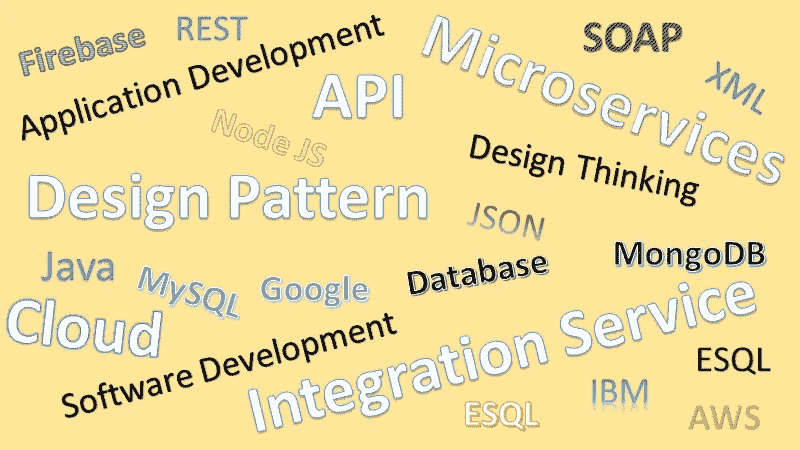
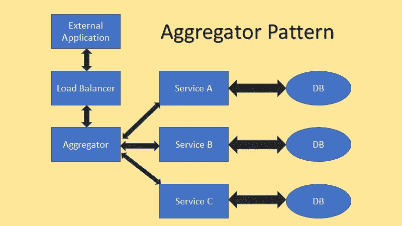
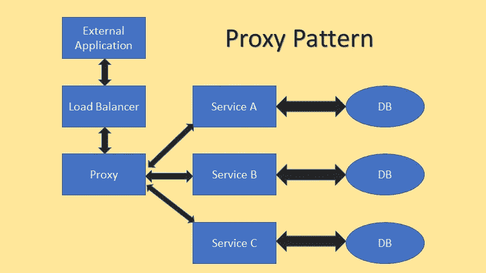
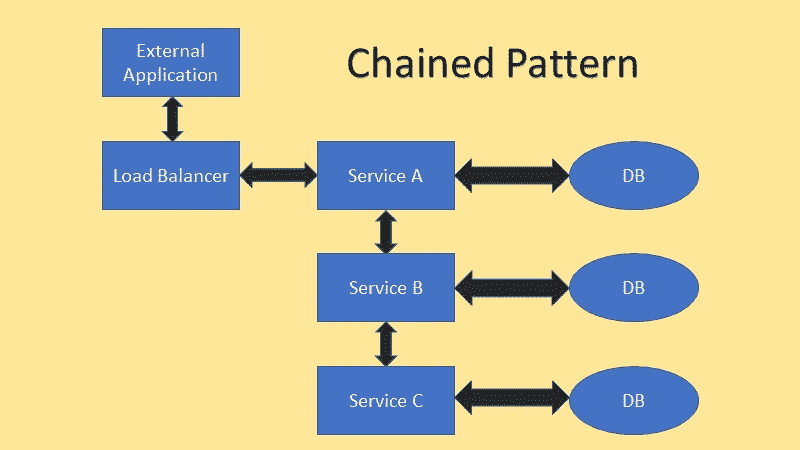
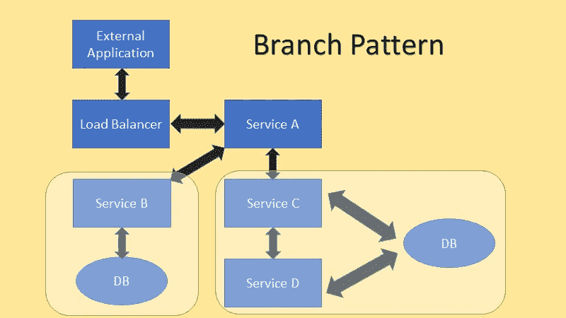

# 微服务中使用的设计模式。

> 原文：<https://blog.devgenius.io/what-are-microservices-and-its-design-patterns-18771b031d86?source=collection_archive---------7----------------------->

微服务是软件行业中最热门的词汇之一，但是到底什么是微服务，它的设计方式是什么，这将在本文中用图表和解释来讨论。

# 什么是微服务？

> 微服务架构是面向服务架构(SOA)结构风格的变体，它将应用程序安排为松散耦合的服务的集合。在微服务架构中，服务是细粒度的，协议是轻量级的。—维基百科。

微服务架构用于构建软件应用程序，这是一种与整体架构相比的替代架构，在整体架构中，应用程序紧密耦合在一起，方法和用户界面位于单个位置。并且它们大部分是用单一的编程语言编写的。

> **也可以阅读:** [为什么所有的开发者都应该学习和理解 REST/SOAP 服务](https://medium.com/@ahmedahsankhan/why-all-the-developers-should-learn-and-understand-rest-soap-services-377c13388b5b)

## API 与微服务

大多数时候，当我们谈论微服务时，我们有时会误解它是 API，所以在我们跳到设计模式之前，我们应该了解 API 和微服务之间的区别。

微服务是 web 应用程序的架构风格，其中功能被划分到小型 web 服务中，而 API 是 web 开发人员与 web 应用程序交互的框架。(在上面给出的链接中阅读更多关于 API 的内容。)

# 设计模式:

> 在软件工程中，**设计模式**是软件设计中常见问题的通用可重复解决方案。设计模式不是可以直接转换成代码的成品设计。它是如何解决一个问题的描述或模板，可以在许多不同的情况下使用。—[Soucremaking.com](https://sourcemaking.com/design_patterns)

同样，在微服务中，我们也有设计模式，用于使用微服务设计完整的 web 应用程序，并使用 API 进行交互。这就是集成服务发挥作用的地方。在这一部分，我将解释一些用于与微服务交互的设计模式。

## 聚合器模式:

列表中的第一个模式是聚合器模式。下图显示了这是如何工作的。在这种类型的设计中，有一个集合从外部来源收集所有请求，并将其传递给适当的微服务，然后返回结果。这里的聚合器节点可以对数据进行任何所需的操作，比如在请求的头部添加时间戳，或者添加请求者的名字，以便进行日志记录，或者类似的操作。

## 代理模式:

代理模式的设计类似于聚合器模式，但是唯一的区别是，在这种模式中，代理节点除了将请求传递给微服务并将响应发送回请求者之外，什么也不做，它还做一点协调工作。

看上面的两幅图，我们可以看到代理、聚合器或负载平衡器的工作是集成软件的工作，正如我们在上一篇文章中讨论的那样。(下面的链接)

> **也可阅读** : [现代集成软件应用的角色](https://medium.com/dev-genius/role-of-integration-software-applications-in-the-modern-days-8319b637c8d5)

## 链式模式:

第三种设计模式称为链式模式，它只有一个入口点，其他服务依赖于该入口点服务。一个服务调用另一个服务来完成任务。

链式模式不是实现微服务的理想设计模式，因为它使微服务依赖于其他服务。

**缺点:**这种模式的缺点是处理速度慢，因为它要经过多个服务。

**优势:**另一方面，这种模式的积极方面是，因为只有一个入口点，所以它是安全的。需要高安全性的微服务可以放在链的末端，这样会降低可访问性。

## 分支模式:

最后要讨论的设计模式是分支模式。分支模式是连锁模式和聚合模式的混合。在下面的图表示例中，我们可以看到服务就像一个聚合器，它分为两个分支。一个分支包含单个自治服务(服务 B)，另一个分支包含一系列服务(服务 D 可从服务 C 访问)。当需要将大型单片应用程序转换为具有微服务类型架构的应用程序时，这种类型的设计非常有用。大型单片应用程序需要标准化以转换到微服务架构，这可能很耗时。

# 结论:

这些只是可以用于设计微服务应用程序的几种设计模式。还有许多其他的可以根据你的需要使用。为了让您的微服务架构平稳有效地工作，我们可以利用消息队列。话虽如此，并没有硬性规定哪种设计模式最适合你。这完全取决于您的实现。每个设计模式都解决一个特定的问题。人们应该首先识别手头的问题，以确保他们使用适当的设计模式来解决他们的问题。

快乐学习！！！！