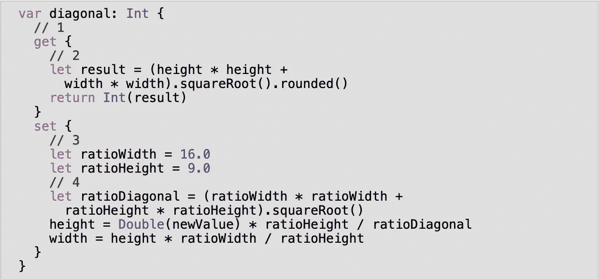

# Swift 中的属性是什么？

> 原文：<https://blog.devgenius.io/what-are-properties-in-swift-2ec8aba9a378?source=collection_archive---------15----------------------->

在本文中，您将深入了解属性，以及如何使用 getter、setter、computed 和 stored 属性。

> 当你通过创建一个结构来创建你自己的数据类型时，在这个结构中你定义了一些变量和常量，这些被称为属性。

来源:-[http://www.thomashanning.com/properties-in-swift/](http://www.thomashanning.com/properties-in-swift/)

需要注意的一件重要事情是:**一个结构的属性只有当它声明为变量时才能被改变。你可以在结构中给任何属性一个默认值**

*Swift 中可能有两种类型的属性*

1.  **存储属性**
2.  **计算属性**

当谈到存储属性时，这些属性可以是存储某个值的变量或常量。在计算属性中，他们是计算值而不是存储它。存储的属性可以是常量或变量，但计算的属性只能是变量。

与计算属性一样，这只会返回一个计算结果，而不会存储它。这在计算属性中被称为 **getter** 。

让我们看看如何在计算属性中使用 **getter** 和 **setter** :

**来源:——Raywenderlich**

**下面是这段代码中发生的事情:**

1.  因为要包含 setter，所以现在必须明确哪些计算包含 getter，哪些包含 setter，所以要用花括号将每个代码块括起来，并在它前面加上 get 或 set。只读计算属性不需要这种特殊性，因为它们的单个代码块隐式地是一个 getter。
2.  您使用与前面相同的代码来获得计算值。
3.  对于 setter 来说，你通常需要做一些假设。在这种情况下，您需要为屏幕比例提供一个合理的默认值。
4.  给定对角线和比率，计算高度和宽度的公式有点深奥。你可以花一点时间来解决它们，但是我已经为你做了脏活，并在这里提供了它们。需要重点关注的重要部分包括:
5.  a.newValue 常量允许您使用在赋值过程中传递的任何值。b .记住，newValue 是一个 Int，因此要在 Double 的计算中使用它，您必须首先将其转换为 Double。c .一旦您完成了计算，您就可以指定 TV 结构的 height 和 width 属性。

# 要点

*   **属性**是作为命名类型一部分的变量和常量。
*   **存储属性**分配内存存储一个值。
*   **计算属性**是在每次代码请求它们时计算的，并不是作为一个值存储在内存中。
*   **静态**修饰符标记了一个**类型属性**，该属性通用于一个特定类型的所有实例。

这是关于 swift 的所有属性，如果您有任何疑问，请在评论区提问。

我的 linkedIn:-【linkedin.com/in/my-pro-file】