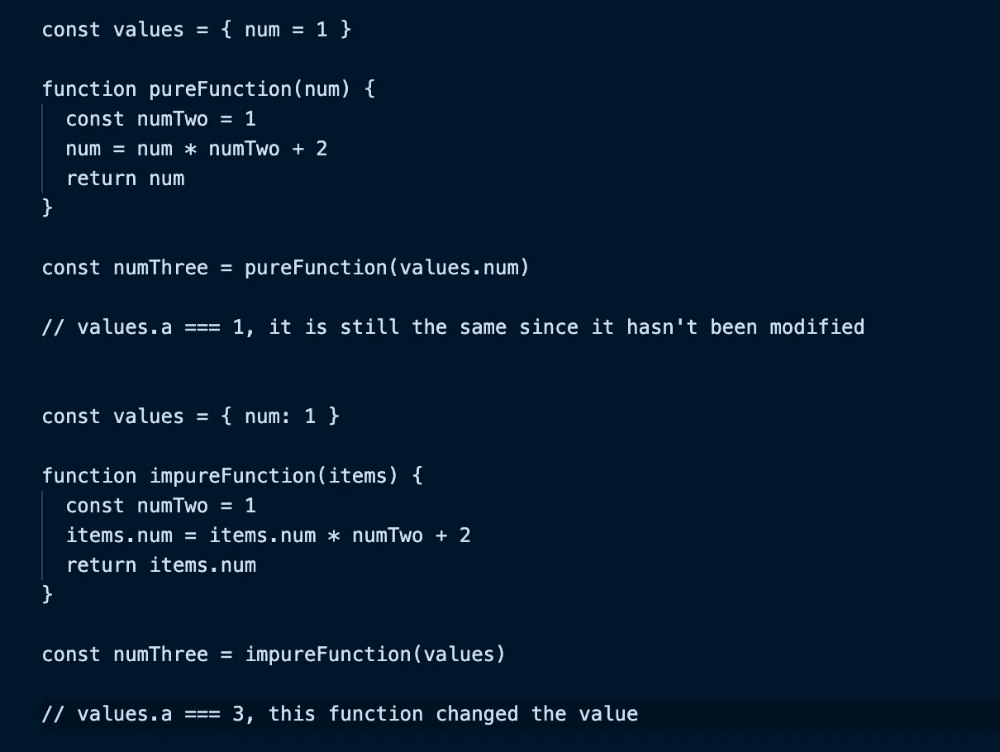

# 什么是纯函数？

> 原文：<https://blog.devgenius.io/what-are-pure-functions-fbcda292cb32?source=collection_archive---------28----------------------->

照片由 chuttersnap 在 Unsplash 上拍摄

纯函数是具有特定属性的函数，这些属性有助于在每次调用该函数时产生相同的结果。其中一个属性是，给定相同类型的输入，它将返回相同的输出而不会失败。第二个特性是，调用这些类型的函数不会产生任何副作用，因此得名“纯”在编程中，副作用可以描述为修改超出其自身范围的状态变量值。有副作用的函数不仅仅是返回值，还会改变程序中的另一个值。

以下是纯函数与不纯函数的对比示例:

纯函数很重要，因为它们构成了函数式编程的基础，并在多种不同的语言中使用。使用这些函数的一些好处是，它们更容易测试和调试，由于没有副作用，它们通常更容易阅读，更容易将纯函数组合在一起，它们是可记忆的，并且它们可以是懒惰的。由于纯函数的这些优点以及它们独立于外部状态的要点，所以应该尽可能地使用纯函数。

让我知道我是如何在评论中解释和举例的，如果你对未来的博客有任何建议的话！